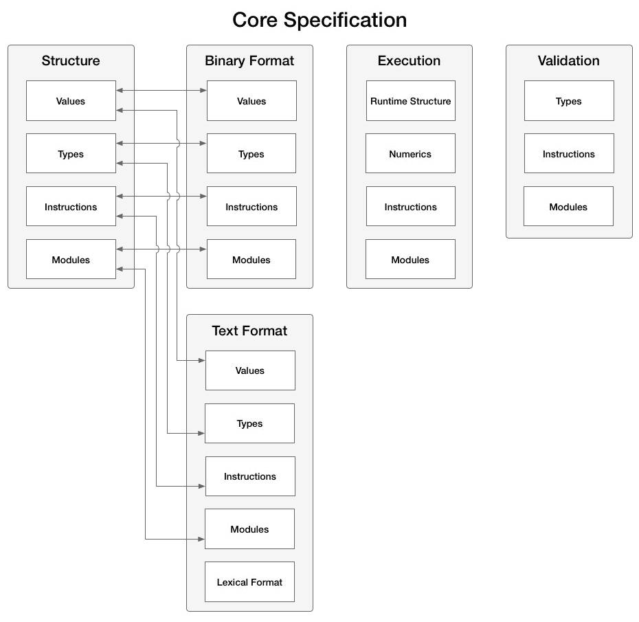
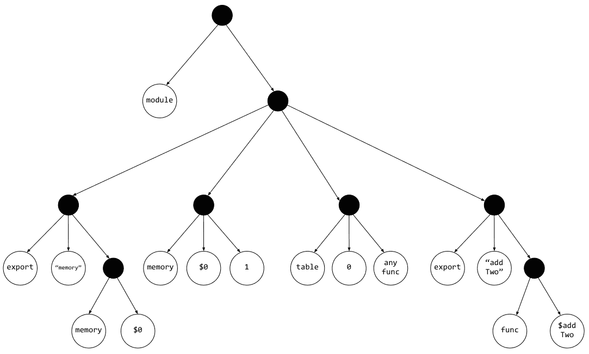
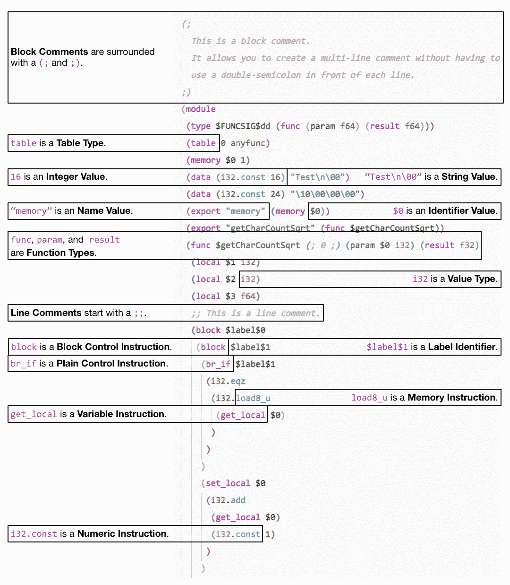
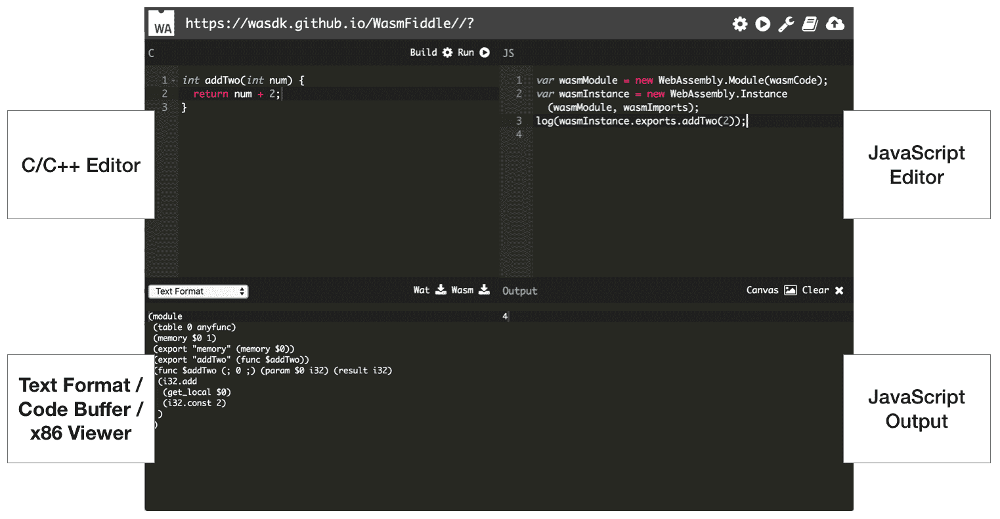
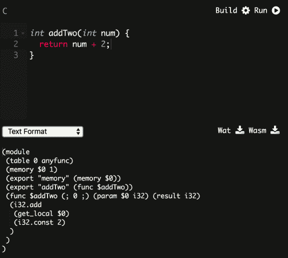

# 网络组装的元素——Wat、Wasm 和 JavaScript 应用编程接口

[第一章](01.html)*什么是网络组装？*，描述了 WebAssembly 的历史，并提供了该技术的高级概述以及潜在的用例和限制。WebAssembly 被描述为由多个元素组成，而不仅仅是官方定义中指定的二进制指令格式。

在本章中，我们将深入研究与网络组装工作组创建的官方规范相对应的元素。我们将更详细地研究 Wat 和二进制格式，以便更好地理解它们与模块的关系。我们将回顾 *JavaScript API* 和 *Web API* 以确保您能够在浏览器中有效利用 WebAssembly。

本章的目标是理解以下内容:

*   文本和二进制格式是如何关联的
*   什么是水，它在开发过程中处于什么位置
*   二进制格式和模块(Wasm)文件
*   JavaScript 和网络应用编程接口的组件，以及它们与 Wasm 模块的关系
*   如何利用 WasmFiddle 评估 WebAssembly 的各个阶段(C/C++ > Wat > Wasm)

# 通用结构和抽象语法

在[第一章](01.html)*什么是网络组装？*，我们讨论了 WebAssembly 的二进制和文本格式如何以抽象语法的形式映射到一个公共结构。在深入这些格式的具体细节之前，值得一提的是这些在*核心规范*中是如何关联的。下图是目录的直观表示(为清楚起见，某些部分被排除在外):



*Core Specification* table of contents

如您所见，**文本格式**和**二进制格式**部分包含与**结构**部分相关的**值**、**类型**、**说明**和**模块**的子部分。因此，我们在下一节中讨论的文本格式与二进制格式有着直接的必然联系。考虑到这一点，让我们进入文本格式。

# 泰国或高棉的佛教寺或僧院

*核心规范*的*文本格式*部分提供了通用语言概念的技术描述，如值、类型和说明。如果您计划为网络组装构建工具，这些是需要了解和理解的重要概念，但是如果您只是计划在应用中使用它，这些概念就没有必要了。也就是说，文本格式是网络组装的一个重要部分，所以有些概念你应该知道。在本节中，我们将从*核心规范*中挖掘文本格式的一些细节，并强调一些要点。

# 定义和特殊表达式

为了理解 Wat，让我们从直接取自 WebAssembly *核心规范*的描述的第一句话开始:

"The textual format for WebAssembly modules is a rendering of their abstract syntax into S-expressions."

那么什么是**符号表达式**(**S-表达式**)？s 表达式是嵌套列表(树形结构)数据的符号。本质上，它们提供了一种简单而优雅的方式来以文本形式表示基于列表的数据。为了理解嵌套列表的文本表示如何映射到树结构，让我们从一个 HTML 页面推断树结构。以下示例包含一个简单的 HTML 页面和相应的树结构图。

一个简单的网页:

```cpp
<html>
<head>
  <link rel="icon" href="favicon.ico">
  <title>Page Title</title>
</head>
<body>
  <div>
    <h1>Header</h1>
    <p>This is a paragraph.</p>
  </div>
  <div>Some content</div>
  <nav>
    <ul>
      <li>Item 1</li>
      <li>Item 2</li>
      <li>Item 3</li>
    </ul>
  </nav>
</body>
</html>
```

对应的树形结构是:


A tree structure diagram for an HTML page

即使您以前从未见过树结构，从结构和层次上看 HTML 如何映射到树仍然是很清楚的。映射 HTML 元素相对简单，因为它是一种标记语言，具有定义良好的标签，没有实际的逻辑。

Wat 代表可以具有多种不同参数功能的模块。为了演示源代码、Wat 和相应的树结构之间的关系，让我们从一个简单的 C 函数开始，该函数将作为参数传入的数字加 2:

这里有一个 C 函数，它将`2`添加到传入的`num`参数中，并返回结果:

```cpp
int addTwo(int num) {
    return num + 2;
}
```

将`addTwo`函数转换为有效的水会产生以下结果:

```cpp
(module
  (table 0 anyfunc)
  (memory $0 1)
  (export "memory" (memory $0))
  (export "addTwo" (func $addTwo))
  (func $addTwo (; 0 ;) (param $0 i32) (result i32)
    (i32.add
      (get_local $0)
      (i32.const 2)
    )
  )
)
```

在[第一章](01.html)*什么是网络组装？*中，我们谈到了与*核心规范* ( *函数*、*线性内存*、*表*等)相关的语言概念。在该规范中，*结构*部分在抽象语法的上下文中定义了每个概念。规范的*文本格式*部分也与这些概念相对应，您可以在前面的片段中看到它们是由关键字定义的(`func`、`memory`、`table`)。

树形结构:



A tree structure diagram for Wat

整个树太大，无法放在一个页面上，所以这个图只限于 Wat 源文本的前五行。每个填充的点代表一个列表节点(或一组括号的内容)。如您所见，用 s 表达式编写的代码可以清晰简洁地以树形结构表示，这就是为什么选择 s 表达式作为 WebAssembly 的文本格式。

# 值、类型和说明

虽然*核心规范*的*文本格式*部分的详细内容不在本文的讨论范围内，但是值得演示一些语言概念是如何映射到相应的 Wat 的。下图在一个样例 Wat 片段中演示了这些映射。编译该代码的 C 代码表示一个函数，该函数将一个单词作为参数，并返回字符数的平方根:



Wat example with language concept details

如果您打算编写或编辑 Wat，请注意它支持块和行注释。指令被分成块，包括设置和获取与有效类型的变量相关联的内存。您可以使用`if`语句控制逻辑流，并且使用`loop`关键字支持循环。

# 在发展过程中的作用

文本格式允许以文本形式表示二进制 Wasm 模块。这对于开发和调试的容易性有一些深刻的影响。拥有一个 WebAssembly 模块的文本表示允许开发人员在浏览器中查看加载模块的来源，这消除了阻碍采用氯化钠的黑盒问题。它还允许围绕故障排除模块构建工具。官方网站描述了推动文本格式设计的用例:

• View Source on a WebAssembly module, thus fitting into the Web (where every source can be viewed) in a natural way. 

• Presentation in browser development tools when source maps aren't present (which is necessarily the case with the Minimum Viable Product (MVP)).

• Writing WebAssembly code directly for reasons including pedagogical, experimental, debugging, optimization, and testing of the spec itself.

列表中的最后一项反映了文本格式并不打算在正常的开发过程中手工编写，而是由 Emscripten 这样的工具生成的。生成模块时，您可能不会看到或操作任何`.wat`文件，但您可能会在调试上下文中查看它们。

文本格式不仅在调试方面很有价值，而且拥有这种中间格式减少了对单一编译工具的依赖。目前存在几种不同的工具来使用和发出这种 s 表达式语法，其中一些工具被 Emscripten 用来将您的代码编译成一个`.wasm`文件。

# 二进制格式和模块文件(Wasm)

*核心规范*的*二进制格式*部分提供了与*文本格式*部分相同的语言概念细节。在本节中，我们将简要介绍二进制格式的一些高级细节，并讨论组成 Wasm 模块的各个部分。

# 定义和模块概述

二进制格式被定义为抽象语法的密集线性编码。在不太专业的情况下，这意味着它是一种高效的二进制形式，允许快速解码、小文件大小和减少内存使用。二进制格式的文件表示是一个`.wasm`文件，它将是我们在示例中使用的 Emscripten 的编译输出。

二进制格式的*核心规范*的*值*、*类型*和*说明*小节与*文本格式*部分直接相关。这些概念中的每一个都包含在编码的上下文中。例如，根据规范，整数类型使用 LEB128 可变长度整数编码进行编码，采用无符号或有符号变体。如果您希望为网络组装开发工具，这些都是需要了解的重要细节，但是如果您只是打算在您的网站上使用它，这些细节就没有必要了。

*核心规范*的*结构*、*二进制格式*和*文本格式* *(wat)* 部分有一个*模块*小节。在前一节中，我们没有涉及模块的各个方面，因为在二进制的上下文中描述它们更为谨慎。官方网站为模块提供了以下描述:

"The distributable, loadable, and executable unit of code in WebAssembly is called a **module**. At runtime, a module can be **instantiated** with a set of import values to produce an **instance**, which is an immutable tuple referencing all the state accessible to the running module."

我们将在本章后面讨论如何使用 JavaScript 和 Web APIs 与模块进行交互，因此让我们建立一些上下文来理解模块元素如何映射到 API 方法。

# 模块部分

一个模块由几个部分组成，您将通过 JavaScript API 与其中一些部分进行交互:

*   导入(`import`)是可以在模块中访问的元素，可以是以下元素之一:
    *   函数，可以使用`call`运算符在模块内部调用
    *   全局，可通过`global`操作器在模块内部访问
    *   线性存储器，可通过`memory`操作器在模块内部访问
    *   表格，可使用`call_indirect`在模块内部访问
*   导出(`export`)是消费 API 可以访问的元素(即由 JavaScript 函数调用)
*   模块实例初始化后调用模块启动函数(`start`)
*   全局(`global`)包含全局变量的内部定义
*   线性内存(`memory`)包含线性内存的内部定义，具有初始内存大小和可选的最大大小
*   数据(`data`)包含指定给定存储器的固定范围的初始内容的数据段的阵列
*   表(`table`)是线性存储器，其元素是特定表元素类型的不透明值:
    *   在 MVC 中，它的主要目的是在 C/C++中实现间接函数调用
*   Elements ( `elements`)是允许模块使用模块中的任何其他定义来初始化任何导入或内部定义表的元素的部分
*   功能和代码:
    *   函数部分声明模块中定义的每个内部函数的签名
    *   代码段包含由函数段声明的每个函数的函数体

有些关键词(`import`、`export`等等)应该看起来比较眼熟；它们出现在上一节中 Wat 文件的内容中。WebAssembly 的组件遵循直接对应于 API 的逻辑映射(例如，您将一个`memory`和`table`实例传递到 JavaScript 的`WebAssembly.instantiate()`函数中)。您与二进制格式模块的主要交互将通过这些 API 进行。

# JavaScript 和网络应用接口

除了 *WebAssembly 核心规范*之外，还有两个用于与 WebAssembly 模块交互的 API 规范: *WebAssembly JavaScript 接口* (JavaScript API)和 *WebAssembly Web API* 。在前几节中，我们介绍了*核心规范*的相关方面，以熟悉底层技术。如果您从未阅读过*核心规范*(或者如果您跳过了本章的前几节)，它不会禁止在您的应用中使用网络组装。对于 API 来说，情况并非如此，因为它们描述了实例化和与编译后的 Wasm 模块交互所需的方法和接口。在本节中，我们将回顾网络和 JavaScript APIs，并描述如何使用 JavaScript 加载 Wasm 模块并与之通信。

# WebAssembly 存储和对象缓存

在深入研究交互之前，让我们讨论一下 JavaScript 和 WebAssembly 在执行环境中的关系。*核心规范*在*执行*部分包含以下描述:

"WebAssembly code is executed when instantiating a module or invoking an exported function on the resulting module instance.

Execution behavior is defined in terms of an abstract machine that models the program state. It includes a stack, which records operand values and control constructs, and an abstract store containing global state."

在幕后，JavaScript 使用一种叫做**代理**的东西来管理执行。定义中提到的*商店*包含在代理商中。下图显示了一个 JavaScript 代理:


JavaScript agent elements

存储表示抽象机器的状态。WebAssembly 操作获取一个存储并返回一个更新的存储。每个代理都与将 JavaScript 对象映射到 WebAssembly 地址的缓存相关联。那么为什么这很重要呢？它代表了 WebAssembly 模块和 JavaScript 之间交互的底层方法。JavaScript 对象对应于 *JavaScript 应用编程接口*中的网络组件命名空间。考虑到这一点，让我们深入了解一下界面。

# 加载模块和网络程序集命名空间方法

*JavaScript API* 涵盖了浏览器中全局`WebAssembly`对象上可用的各种对象。在我们讨论这些之前，我们将从`WebAssembly`对象上可用的方法开始，简要概述它们的预期目的:

*   `instantiate()`是编译和实例化 WebAssembly 代码的主要 API
*   `instantiateStreaming()`执行与`instantiate()`相同的功能，但是它使用流来编译和实例化模块，这消除了中间步骤
*   `compile()`只编译一个 WebAssembly 模块，不实例化
*   `compileStreaming()`也只编译一个 WebAssembly 模块，但是它使用类似`instantiateStreaming()`的流
*   `validate()`检查 WebAssembly 二进制代码以确保字节有效，如果有效则返回 true，如果无效则返回 false

`instantiateStreaming()`和`compileStreaming()`方法目前只存在于*网络应用编程接口*中。事实上，这两种方法构成了整个规范。`WebAssembly`对象上可用的方法主要集中在编译和实例化模块上。考虑到这一点，让我们讨论如何获取和实例化一个 Wasm 模块。

当您执行提取调用来获取模块时，它会返回一个 Promise，该 Promise 用该模块的原始字节进行解析，这些字节需要加载到`ArrayBuffer`中并进行实例化。接下来，我们将把这个过程称为加载模块。

下图演示了这一过程:


Fetching and loading a WebAssembly module

使用 Promises，这个过程实际上非常简单。下面的代码演示了如何加载模块。`importObj`参数将任何数据或函数传递给 Wasm 模块。您现在可以忽略它，因为我们将在[第 5 章](05.html)、*创建和加载网络组装模块*中更详细地讨论它:

```cpp
fetch('example.wasm')
  .then(response => response.arrayBuffer())
  .then(buffer => WebAssembly.instantiate(buffer, importObj))
  .then(({ module, instance }) => {
    // Do something with module or instance
  });
```

前面的例子说明了使用`instantiate()`方法加载模块的方法。`instantiateStreaming()`方法有一点不同，它通过一步获取、编译和实例化一个模块来简化过程。以下代码使用此方法实现了相同的目标(加载模块):

```cpp
WebAssembly.instantiateStreaming(fetch('example.wasm'), importObj)
  .then(({ module, instance }) => {
    // Do something with module or instance
  });
```

实例化方法返回一个 Promise，该 Promise 用一个包含编译后的`WebAssembly.Module` ( `module`)和`WebAssembly.Instance` ( `instance`)的对象进行解析，这两个都将在本节后面介绍。在大多数情况下，您将使用这些方法之一在您的站点上加载一个 Wasm 模块。该实例包含所有导出的 WebAssembly 函数，您可以从 JavaScript 代码中调用这些函数。

`compile()`和`compileStreaming()`方法返回一个只有编译后的`WebAssembly.Module`才能解析的承诺。如果您想要编译一个模块并在以后实例化它，这是很有用的。 **Mozilla 开发者网络** ( **MDN** )由 Mozilla 管理的 web docs 站点提供了一个例子，其中编译后的模块被传递给 Web Worker。

就`validate()`方法而言，它的唯一目的是测试作为参数传入的类型化数组或`ArrayBuffer`是否有效。这将在响应的原始字节被加载到`ArrayBuffer`之后被调用。这个方法没有包含在代码示例中，因为试图实例化或编译一个无效的 Wasm 模块将会抛出一个`TypeError`或一个存在于`WebAssembly`对象上的`Error`对象。我们将在本节稍后介绍这些`Error`对象。

# WebAssembly 对象

除了在*加载模块和网络组件命名空间方法*一节中介绍的方法外，全局`WebAssembly`对象还有用于与网络组件进行交互和故障排除的子对象。这些对象与我们在 WebAssembly 二进制和文本格式部分讨论的概念直接相关。下面的列表包含这些对象以及它们从 MDN 中得到的定义:

*   `WebAssembly.Module`对象包含无状态的 WebAssembly 代码，该代码已经由浏览器编译，可以有效地与工作人员共享，缓存在`IndexedDB`中，并多次实例化
*   `WebAssembly.Instance`对象是一个`WebAssembly.Module`的有状态的可执行实例，它包含所有导出的网络组件函数，允许从 JavaScript 调用网络组件代码
*   当用构造函数调用`WebAssembly.Memory`时，创建一个新的`Memory`对象，该对象是一个可调整大小的`ArrayBuffer`，保存由网络组件`Instance`访问的原始内存字节
*   当用构造函数调用`WebAssembly.Table`时，创建一个给定大小和元素类型的新`Table`对象，该对象代表一个网络组件`Table`(存储函数引用)
*   当使用构造函数调用`WebAssembly.CompileError`时，会创建一个错误，指示在网络程序集解码或验证过程中出现了问题
*   当使用构造函数调用`WebAssembly.LinkError`时，会产生一个错误，表明模块实例化过程中出现了问题
*   当使用构造函数调用`WebAssembly.RuntimeError`时，会创建一个错误，指示网络程序集指定了一个陷阱(例如，发生了堆栈溢出)

让我们从`WebAssembly.Module`对象开始，逐一挖掘。

# WebAssembly。组件

`WebAssembly.Module`对象是`ArrayBuffer`和实例化模块之间的中间步骤。`compile()`和`instantiate()`方法(以及它们的流对应方法)返回一个用模块解析的 Promise(小写的模块代表编译后的`Module`)。也可以通过将类型化数组或`ArrayBuffer`直接传递给构造函数来同步创建模块，但对于大型模块来说，这是不鼓励的。

`Module`对象也有三种静态方法:`exports()`、`imports()`和`customSections()`。这三个都以一个模块作为参数，但是`customSections()`以一个代表部分名称的字符串作为其第二个参数。自定义部分在*核心规范*的*二进制格式*部分进行了描述，旨在用于调试信息或第三方扩展。在大多数情况下，您不需要定义这些。如果您使用的是您没有创建的 Wasm 模块，则`exports()`功能非常有用，尽管您只能看到每个导出的名称和种类(例如，`function`)。

对于简单的用例，您不会直接处理`Module`对象或编译模块。大部分的互动将通过`Instance`进行。

# WebAssembly。情况

`WebAssembly.Instance`对象是实例化的 WebAssembly 模块，这意味着您可以从中调用导出的 WebAssembly 函数。调用`instantiate()`或`instantiateStreaming()`返回一个承诺，该承诺通过包含实例的对象来解析。您可以通过引用实例的`export`属性上的函数名来调用网络组装函数。例如，如果一个模块包含一个名为`sayHello()`的导出函数，您可以使用`instance.exports.sayHello()`调用该函数。

# WebAssembly。记忆

`WebAssembly.Memory`对象保存网络组件`Instance`访问的内存。这个内存可以从 JavaScript 和 WebAssembly 中访问和更改。要创建`Memory`的新实例，需要将一个带有`initial`和(可选)`maximum`值的对象传递给`WebAssembly.Memory()`构造函数。这些值以网页组件页面为单位，其中一个页面为 64 KB。通过调用带有单个参数的`grow()`函数来增加内存实例的大小，该参数表示要增长的 WebAssembly 页面的数量。您也可以通过其`buffer`属性访问内存实例中包含的当前缓冲区。

MDN 描述了两种获取`WebAssembly.Memory`对象的方法。第一种方法是从 JavaScript ( `var memory = new WebAssembly.Memory(...)`)中构造它，而第二种方法是通过网络组装模块导出它。重要的一点是，内存可以很容易地在 JavaScript 和 WebAssembly 之间传递。

# WebAssembly。桌子

`WebAssembly.Table`对象是一个类似数组的结构，用于存储函数引用。就像`WebAssembly.Memory`一样，`Table`可以从 JavaScript 和 WebAssembly 中访问和更改。在撰写本文时，表只能存储函数引用，但是随着技术的发展，其他实体也可能存储在表中。

要创建一个新的`Table`实例，需要传递一个具有`element`、`initial`和(可选)`maximum`值的对象。`element`成员是表示存储在表中的值的类型的字符串；目前唯一的有效值是`"anyfunc"`(针对功能)。`initial`和`maximum`值代表网络组件`Table`中的元素数量。

您可以使用`length`属性访问`Table`实例中的元素数量。该实例还包括操作和查询表中元素的方法。`get()`方法允许您访问给定索引处的元素，该元素作为参数传入。`set()`方法允许您将指定为第一个参数的索引处的元素设置为指定为第二个参数的值(根据前面的注释，仅支持函数)。最后，`grow()`允许您通过作为参数传入的数量来增加`Table`实例的大小(元素数量)。

# WebAssembly 错误（CompileError、LinkError、RuntimeError）

JavaScript API 提供了构造函数来创建特定于 WebAssembly 的`Error`对象的实例，但是我们不会花太多时间来覆盖这些对象。本节开头的对象定义列表描述了每个错误的性质，如果满足指定的条件，可能会引发该错误。所有三个错误都可以用一个消息、文件名和行号参数(所有这些参数都是可选的)来构造，并且具有与标准 JavaScript `Error`对象相同的属性和方法。

# 用 WasmFiddle 连接这些点

本章我们回顾了 WebAssembly 的各种元素以及相应的 JavaScript 和 Web APIs，但是理解这些部分是如何结合在一起的仍然是令人困惑的。随着本书中示例的深入，您可以看到 C/C++、WebAssembly 和 JavaScript 是如何交互的，这些概念将变得更加清晰。

也就是说，这种互动的演示可能有助于消除一些困惑。在本节中，我们将使用一个名为 WasmFiddle 的在线工具来演示这些元素之间的关系，这样您就可以看到正在运行的 WebAssembly，并获得开发工作流的高级概述。

# 什么是 WasmFiddle？

位于[https://wasdk.github.io/WasmFiddle/](https://wasdk.github.io/WasmFiddle/)的 WasmFiddle 是一款在线代码编辑工具，可以编写一些 C 或 C++代码并将其转换为 Wat，编译为 Wasm，或者直接使用 JavaScript 与之交互。C/C++和 JavaScript 编辑器非常少，不打算用作您的主要开发环境，但它在 Wasm 编译器中提供了一项有价值的服务。在[第三章](03.html)、*设置开发环境*中，你会发现从第一步到生成 Wasm 文件需要一点工作——能够将你的 C 代码粘贴到浏览器中并点击几个按钮让事情变得更加方便。下图简要介绍了该界面:



Components of the WasmFiddle user interface

可以看到，界面相对简单。让我们尝试一些代码！

# 水的代码

下面截图中的左上角窗格包含一个简单的 C 函数，它将指定为参数的数字加 2。左下窗格包含相应的 Wat:



C function and the corresponding Wat

如果这看起来很熟悉，那是因为本章开头解释沃特的表达式时使用了相同的代码。再深入一点，你可以看到 C 代码是如何对应 Wat 输出的。`addTwo()`功能在`5`线上以字符串形式从模块中导出。线路`5`还包含`(func $addTwo)`，参考线路`6`上的`$addTwo`功能。第`6`行指定可以传入类型为`i32`(整数)的单个参数，返回的结果也是`i32`。按右上角(或 C/C++编辑器上方)的 Build 按钮将把 C 代码编译成 Wasm 文件。一旦构建完成，Wasm 将可以下载或与 JavaScript 交互。

# Wasm 到 JavaScript

下面截图中的右上角窗格包含一些 JavaScript 代码，用于编译上一步生成的 Wasm。`wasmCode`是在构建完成时生成的，所以它应该是自动可用的。WasmFiddle 不是使用`instantiate()`方法，而是创建一个编译后的`WebAssembly.Module`实例，并将其传递给新的`WebAssembly.Instance`的构造函数。`wasmImports`对象当前是空的，尽管如果需要，我们可以传入一个`WebAssembly.Memory`和`WebAssembly.Table`实例:


JavaScript code calling the C function from the compiled Wasm module

当传递数字`2`时，JavaScript 的最后一行将`addTwo()`的结果打印到右下窗格的输出中。`log()`方法是一个自定义功能，确保输出被打印到右下窗格(数字`4`)。注意 JavaScript 代码是如何与`wasmInstance`交互的。从实例的`exports`对象调用`addTwo()`函数。虽然这是一个人为的例子，但它演示了 C 或 C++代码在被 JavaScript 用作 Wasm 模块之前所经历的步骤。

# 摘要

在本章中，我们讨论了 WebAssembly 的元素及其关系。*核心规范*的结构用于描述文本和二进制格式到通用抽象语法的映射。我们强调了文本格式(Wat)在调试和开发环境中有用的方面，以及为什么 s 表达式非常适合抽象语法的文本表示。我们还回顾了与二进制格式和组成模块的各种元素相关的细节。JavaScript 和 Web APIs 中的方法和对象是通过描述它们在 WebAssembly 交互中的角色来定义的。最后，使用 WasmFiddle 工具给出了源代码、Wat 和 JavaScript 之间关系的一个简单示例。

在[第 3 章](03.html)、*设置开发环境*中，我们将安装开发工具，我们将使用它来有效地与 WebAssembly 一起工作。

# 问题

1.  s 表达式擅长表示什么样的数据？
2.  二进制和文本格式共有的四个语言概念是什么？
3.  文本格式的用例之一是什么？
4.  一个 WebAssembly `Table`中唯一可以存储的元素类型是什么？
5.  JavaScript 引擎使用什么来管理执行？
6.  哪个方法实例化一个模块需要更少的代码，`instantiate()`或`instantiateStreaming()`？
7.  `WebAssembly` JavaScript 对象上有哪些错误对象，每一个都是什么事件导致的？

# 进一步阅读

*   MDN 上的网络组装:[https://developer.mozilla.org/en-US/docs/WebAssembly](https://developer.mozilla.org/en-US/docs/WebAssembly)
*   wamfidle:https://wadk . github . io/wamfidle
*   维基百科上的 s-表达式:[https://en.wikipedia.org/wiki/S-expression](https://en.wikipedia.org/wiki/S-expression)
*   树的例子:[http://interactivepython . org/符文石/static/python ons/Trees/examplesoftrees . html](http://interactivepython.org/runestone/static/pythonds/Trees/ExamplesofTrees.html)