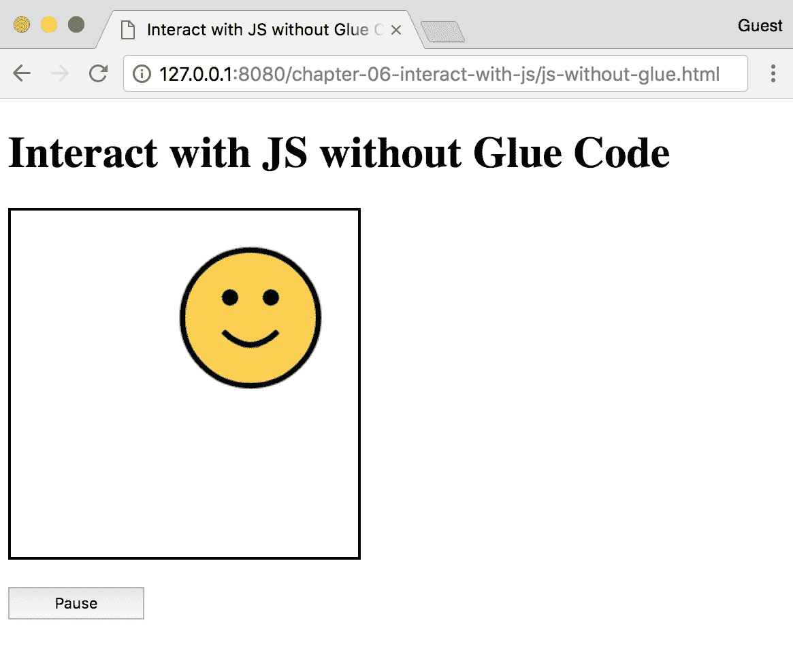
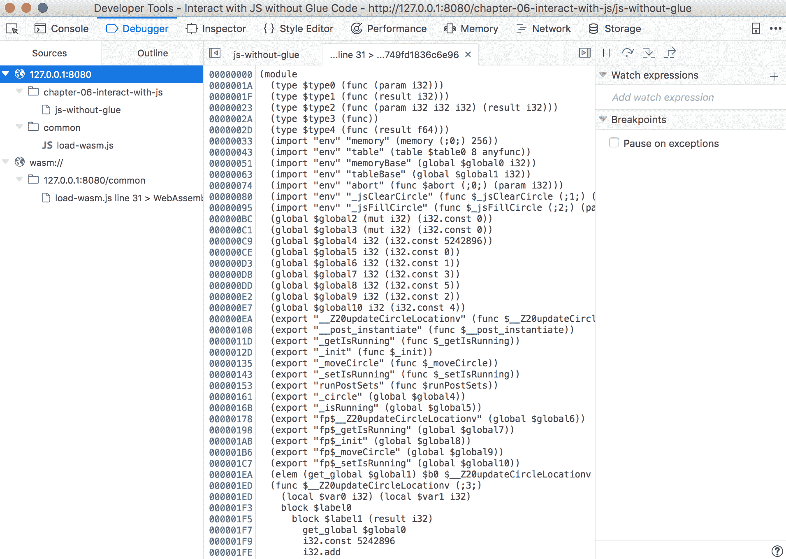

# 六、与 JavaScript 交互和调试

在 WebAssembly 的工作中有很多令人兴奋的特性和建议。然而，在撰写本书时，功能集相当有限。从目前的情况来看，您可以从使用 Emscripten 提供的一些功能中受益匪浅。从 JavaScript 与 C/C++ 进行交互的过程(反之亦然)会有所不同，这取决于您是否决定使用 Emscripten。

在本章中，我们将介绍如何在 C/C++ 代码中使用 JavaScript 函数，以及如何与来自 JavaScript 的 C/C++ 代码的编译输出进行交互。我们还将描述 Emscripten 的*粘合*代码如何影响 Wasm 实例的使用方式，以及如何在浏览器中调试编译后的代码。

本章的目标是理解以下内容:

*   Emscripten 的`Module`和浏览器的`WebAssembly`对象之间的区别
*   如何从 JavaScript 代码中调用编译好的 C/C++ 函数
*   如何从 C/C++ 代码中调用 JavaScript 函数
*   使用 C++ 时需要注意的特殊注意事项
*   在浏览器中调试编译输出的技术

# 电子脚本模块与网络组件对象

在前一章中，我们简要介绍了 Emscripten 的`Module`对象以及如何在浏览器中加载它。`Module`对象提供了几种方便的方法，与浏览器的`WebAssembly`对象有很大不同。在本节中，我们将更详细地回顾 Emscripten 的`Module`对象。我们还将讨论 Emscripten 的`Module`和 WebAssembly 的 *JavaScript API* 中描述的对象之间的区别。

# 什么是 Emscripten 模块？

Emscripten 的官方网站为`Module`对象提供了以下定义:

"Module is a global JavaScript object with attributes that Emscripten-generated code calls at various points in its execution."

加载过程不仅不同于网络组件的`compile`和`instantiate`功能，而且`Module`提供了一些开箱即用的有用功能，否则这些功能需要在网络组件中自定义实现。在获取并加载了 Emscripten 的 JavaScript *粘附*代码后，`Module`在全局范围内(`window.Module`)可用。

# 粘合代码中的默认方法

Emscripten 的`Module`对象提供了一些默认的方法和属性来帮助调试和确保编译代码的成功执行。您可以利用`preRun`和`postRun`属性在调用模块的`run()`函数之前或之后执行 JavaScript 代码，或者将`print()`和`printErr()`函数的输出传送到页面上的一个 HTML 元素。我们将在本书后面利用其中的一些方法。您可以在[https://kri pken . github . io/em script en-site/docs/API _ reference/module . html](https://kripken.github.io/emscripten-site/docs/api_reference/module.html)上了解更多。

# 与网络组件对象的区别

我们在[第 5 章](05.html)、*创建和加载网络组件模块*中介绍了浏览器的网络组件对象和相应的加载过程。WebAssembly 的 JavaScript 和 Web APIs 定义了浏览器的`window.WebAssembly`对象中可用的对象和方法。Emscripten 的`Module`可以看作是 WebAssembly 的`Module`和`Instance`对象的组合，它们存在于 WebAssembly 的实例化函数返回的`result`对象中。通过将`-s MODULARIZE=1`标志传递给`emcc`命令，我们能够(在一定程度上)复制 WebAssembly 的实例化方法。在接下来的部分中，我们将评估集成 JavaScript 和 C/C++ 的方法，我们将更详细地研究 Emscripten 的`Module`和浏览器的`WebAssembly`对象之间的差异。

# 从 JavaScript 调用编译后的 C/C++ 函数

不管有没有 Emscripten 的粘合代码，从 Wasm 实例调用函数都是一个相对简单的过程。利用 Emscripten 的 API 提供了更广泛的功能和集成，代价是在`.wasm`文件旁边包含了粘合代码。在本节中，我们将回顾通过 JavaScript 和 Emscripten 提供的附加工具与编译后的 Wasm 实例进行交互的方法。

# 从模块调用函数

Emscripten 提供了两个从 JavaScript 调用编译好的 C/C++ 函数的函数:`ccall()`和`cwrap()`。这两种功能都存在于`Module`对象中。决定使用哪一个取决于该函数是否会被多次调用。以下章节内容摘自`preamble.js`Emscripten 的 API 参考文档，可在[http://kripken . github . io/Emscripten-site/docs/API _ reference/preamble . js . html](http://kripken.github.io/emscripten-site/docs/api_reference/preamble.js.html)查看。

You don't need to prefix function calls with `_` when using `ccall()` or `cwrap()` – just use the name specified in the C/C++ file.

# Module.ccall()

`Module.ccall()`从 JavaScript 调用一个编译好的 C 函数，并返回该函数的结果。`Module.ccall()`的功能签名如下:

```cpp
ccall(ident, returnType, argTypes, args, opts)
```

您必须为`returnType`和`argTypes`参数指定类型名称。可能的类型有`"number"`、`"string"`、`"array"`和`"boolean"`，它们对应于适当的 JavaScript 类型。您不能为`returnType`参数指定`"array"`，因为无法知道数组的长度。如果函数没有返回任何内容，可以为`returnType`指定`null`(注意没有引号)。

`opts`参数是一个可选的选项对象，可以包含一个名为`async`的布尔属性。为此属性指定值`true`意味着调用将执行异步操作。我们不会在任何示例中使用该参数，但是如果您希望了解更多信息，请访问[http://kripken . github . io/emscripten-site/docs/API _ reference/preamble . js . html # calling-compiled-c-functions-from-JavaScript](http://kripken.github.io/emscripten-site/docs/api_reference/preamble.js.html#calling-compiled-c-functions-from-javascript)。

我们来看一个`ccall()`的例子。以下代码取自 Emscripten 网站，演示了如何从 C 文件的编译输出中调用名为`c_add()`的函数:

```cpp
// Call C from JavaScript
var result = Module.ccall(
  'c_add', // name of C function
  'number', // return type
  ['number', 'number'], // argument types
  [10, 20] // arguments
);

// result is 30
```

# Module.cwrap()

`Module.cwrap()`与`ccall()`类似，它调用一个编译好的 C 函数。但是，它不是返回值，而是返回一个可以根据需要多次重用的 JavaScript 函数。`Module.cwrap()`的功能签名如下:

```cpp
cwrap(ident, returnType, argTypes)
```

就像`ccall()`一样，您可以指定代表`returnType`和`argTypes`参数类型的字符串值。您不能在`argTypes`中使用`"array"`类型，因为调用函数时无法知道数组的长度。对于不返回值的函数，使用`null`(不带引号)作为`returnType`参数。

以下代码取自 Emscripten 网站，演示了如何使用`cwrap()`创建一个可重用的函数:

```cpp
// Call C from JavaScript
var c_javascript_add = Module.cwrap(
  'c_add', // name of C function
  'number', // return type
  ['number', 'number'] // argument types
);

// Call c_javascript_add normally
console.log(c_javascript_add(10, 20)); // 30
console.log(c_javascript_add(20, 30)); // 50
```

# C++ 和名称 mangling

你可能已经注意到了`ccall()`和`cwrap()`的描述指定了两者都是用来调用编译好的 C 函数的。C++ 的省略是有意的，因为从 C++ 文件调用函数需要一个额外的步骤。C++ 支持函数重载，这意味着您可以多次使用同一个函数名，但是向每个函数传递不同的参数以获得不同的结果。下面是一些使用函数重载的代码示例:

```cpp
int addNumbers(int num1, int num2) {
    return num1 + num2;
}

int addNumbers(int num1, int num2, int num3) {
    return num1 + num2 + num3;
}

int addNumbers(int num1, int num2, int num3, int num4) {
    return num1 + num2 + num3 + num4;
}

// The function will return a value based on how many
// arguments you pass it:
int getSumOfTwoNumbers = addNumbers(1, 2);
// returns 3

int getSumOfThreeNumbers = addNumbers(1, 2, 3);
// returns 6

int getSumOfFourNumbers = addNumbers(1, 2, 3, 4);
// returns 10
```

编译器需要区分这些函数。如果它使用名称`addNumbers`，并且您试图在一个地方用两个参数调用函数，在另一个地方用三个参数调用函数，它将失败。要在编译后的 Wasm 中按名称调用该函数，您需要将该函数包装在一个`extern`块中。包装函数的一个含义是，您必须为每个条件显式定义函数。下面的代码片段演示了如何实现前面的函数，而不用名称混淆:

```cpp
extern "C" {
int addTwoNumbers(int num1, int num2) {
    return num1 + num2;
}

int addThreeNumbers(int num1, int num2, int num3) {
    return num1 + num2 + num3;
}

int addFourNumbers(int num1, int num2, int num3, int num4) {
    return num1 + num2 + num3 + num4;
}
}
```

# 从网络程序集实例调用函数

在前一章中，我们演示了如何从 JavaScript 调用 Wasm 实例中的函数，但这是假设您在浏览器中实例化了一个模块，并且没有粘合代码。Emscripten 还提供了从 Wasm 实例调用函数的能力。模块实例化后，通过从`instance.exports`对象调用函数来调用函数，该对象可从解析的`Promise`结果中访问。MDN 的文档为`WebAssembly.instantiateStreaming`提供了以下功能签名:

```cpp
Promise<ResultObject> WebAssembly.instantiateStreaming(source, importObject);
```

You may need to use the `WebAssembly.instantiate()` method, depending on your browser. Chrome currently supports `WebAssembly.instantiateStreaming()`, but if you encounter an error when attempting to load your module, use the `WebAssembly.instantiate()` method instead.

`ResultObject`包含`instance`对象，我们需要引用该对象来调用从模块导出的函数。下面是一些从编译后的 Wasm 实例中调用名为`_addTwoNumbers`的函数的代码:

```cpp
// Assume the importObj is already defined.
WebAssembly.instantiateStreaming(
  fetch('simple.wasm'),
  importObj
)
  .then(result => {
    const addedNumbers = result.instance.exports._addTwoNumbers(1, 2);
    // result is 3
  });
```

Emscripten 提供了一种以几乎相同的方式执行函数调用的方法，尽管实现方式略有不同。如果您使用类似承诺的应用编程接口，您可以从`Module()`的承诺解析的`asm`对象访问该函数。下面的示例演示了如何利用此功能:

```cpp
// Using Emscripten's Module
Module()
  .then(result => {
    // "asm" is essentially "instance"
    const exports = result.asm;
    const addedNumbers = exports._addTwoNumbers(1, 2);
    // result is 3
  });
```

用 Emscripten 复制 WebAssembly 的 Web API 语法简化了未来的任何重构。如果你决定使用 WebAssembly 的网络应用编程接口，将来你可以很容易地用 WebAssembly 的`instantiateStreaming()`方法替换`Module()`，用`result.instance`替换`result.asm`。

# 从 C/C++ 调用 JavaScript 函数

从 C/C++ 代码中访问 JavaScript 的功能允许在使用 WebAssembly 时增加灵活性。利用 JavaScript 的方法和手段在 Emscripten 的粘合代码和仅 Wasm 的实现之间有很大的不同。在这一节中，我们将介绍在使用和不使用 Emscripten 的情况下，将 JavaScript 集成到 C/C++ 代码中的各种方法。

# 使用粘合代码与 JavaScript 交互

Emscripten 提供了几种将 JavaScript 与 C/C++ 代码集成的技术。可用的技术在实现和复杂性上有所不同，有些仅适用于特定的执行环境(例如，浏览器)。决定使用哪一个取决于您的具体用例。我们将关注`emscripten_run_script()`函数和用`EM_*`包装器内联 JavaScript。以下部分内容摘自*与代码交互*部分，可在[https://kripken . github . io/Emscripten-site/docs/porting/connecting _ CPP _ and _ JavaScript/interaction-Code . html # interaction-Code](https://kripken.github.io/emscripten-site/docs/porting/connecting_cpp_and_javascript/Interacting-with-code.html#interacting-with-code)查看。

# 使用 emscripten_run_script()执行字符串

Emscripten 网站将`emscripten_run_script()`函数描述为调用 C/C++ 的 JavaScript 最直接但稍慢的方法。这是一种非常适合单行 JavaScript 代码的技术，对于调试非常有用。该文档指出，它使用`eval()`有效地运行代码，这是一个将字符串作为代码执行的 JavaScript 函数。以下取自 Emscripten 网站的代码演示了如何使用`emscripten_run_script()`调用浏览器的`alert()`功能，文本为`'hi'`:

```cpp
emscripten_run_script("alert('hi')");
```

对于性能是一个因素的更复杂的用例，使用*内联 JavaScript* 提供了更好的解决方案。

# 使用 EM_ASM()执行内联 JavaScript

您可以用`EM_ASM()`将 JavaScript 代码包装在您的 C/C++ 文件中，当编译后的代码在浏览器中运行时，它就会执行。下面的代码演示了基本用法:

```cpp
#include <emscripten.h>

int main() {
    EM_ASM(
        console.log('This is some JS code.');
    );
    return 0;
}
```

JavaScript 代码会立即执行，并且不能在包含它的 C/C++ 文件中重用。参数可以作为变量`$0`、`$1`等传递到 JavaScript 代码块中。这些争论可以是`int32_t`或`double`类型。以下代码片段取自 Emscripten 网站，演示了如何在`EM_ASM()`块中使用参数:

```cpp
EM_ASM({
    console.log('I received: ' + [ $0, $1 ]);
}, 100, 35.5);
```

# 用 EM_JS 重用内联 JavaScript()

如果你的 C/C++ 文件中需要一个可重用的函数，你可以把 JavaScript 代码包装在一个`EM_JS()`块中，像普通的 C/C++ 函数一样执行。下面的代码片段描述了`EM_JS()`的定义:

```cpp
EM_JS(return_type, function_name, arguments, code)
```

`return_type`参数表示与 JavaScript 代码的输出相对应的 C 类型(例如，`int`或`float`)。如果 JavaScript 代码没有返回任何内容，请为`return_type`指定`void`。下一个参数`function_name`表示从 C/C++ 文件中的其他位置调用 JavaScript 代码时要使用的名称。`arguments`参数用于定义可以从 C 调用函数传递到 JavaScript 代码中的参数。`code`参数是用大括号包装的 JavaScript 代码。以下代码片段取自 Emscripten 网站，演示了在 C 文件中使用`EM_JS()`:

```cpp
#include <emscripten.h>

EM_JS(void, take_args, (int x, float y), {
    console.log(`I received ${x} and ${y}`);
});

int main() {
    take_args(100, 35.5);
    return 0;
}
```

# 使用粘合代码的示例

让我们编写一些利用所有这些特性的代码。在本节中，我们将修改我们在*编译 C 语言中使用的代码，而不使用胶水代码*和*来获取和实例化[第 5 章](05.html)、*的*节中的一个 Wasm 文件*来创建和加载一个 WebAssembly 模块。这是在红色画布上显示一个移动的蓝色矩形的代码，只需点击一个按钮就可以暂停和重启。该部分的代码位于`learn-webassembly`存储库中的`/chapter-06-interact-with-js`文件夹中。让我们从更新 C 代码开始。

# C 代码

在名为`/chapter-06-interact-with-js`的`/book-examples`文件夹中创建新文件夹。在名为`js-with-glue.c`的`/chapter-06-interact-with-js`文件夹中创建新文件，并用以下内容填充:

```cpp
/*
 * This file interacts with the canvas through imported functions.
 * It moves a blue rectangle diagonally across the canvas
 * (mimics the SDL example).
 */
#include <emscripten.h>
#include <stdbool.h>

#define BOUNDS 255
#define RECT_SIDE 50
#define BOUNCE_POINT (BOUNDS - RECT_SIDE)

bool isRunning = true;

typedef struct Rect {
  int x;
  int y;
  char direction;
} Rect;

struct Rect rect;

/*
 * Updates the rectangle location by 1px in the x and y in a
 * direction based on its current position.
 */
void updateRectLocation() {
    // Since we want the rectangle to "bump" into the edge of the
    // canvas, we need to determine when the right edge of the
    // rectangle encounters the bounds of the canvas, which is why
    // we're using the canvas width - rectangle width:
    if (rect.x == BOUNCE_POINT) rect.direction = 'L';

    // As soon as the rectangle "bumps" into the left side of the
    // canvas, it should change direction again.
    if (rect.x == 0) rect.direction = 'R';

    // If the direction has changed based on the x and y
    // coordinates, ensure the x and y points update
    // accordingly:
    int incrementer = 1;
    if (rect.direction == 'L') incrementer = -1;
    rect.x = rect.x + incrementer;
    rect.y = rect.y + incrementer;
}

EM_JS(void, js_clear_rect, (), {
    // Clear the rectangle to ensure there's no color where it
    // was before:
    var canvas = document.querySelector('#myCanvas');
    var ctx = canvas.getContext('2d');
    ctx.fillStyle = '#ff0000';
    ctx.fillRect(0, 0, 255, 255);
});

EM_JS(void, js_fill_rect, (int x, int y, int width, int height), {
    // Fill the rectangle with blue in the specified coordinates:
    var canvas = document.querySelector('#myCanvas');
    var ctx = canvas.getContext('2d');
    ctx.fillStyle = '#0000ff';
    ctx.fillRect(x, y, width, height);
});

/*
 * Clear the existing rectangle element from the canvas and draw a
 * new one in the updated location.
 */
EMSCRIPTEN_KEEPALIVE
void moveRect() {
    // Event though the js_clear_rect doesn't have any
    // parameters, we pass 0 in to prevent a compiler warning:
    js_clear_rect(0);
    updateRectLocation();
    js_fill_rect(rect.x, rect.y, RECT_SIDE, RECT_SIDE);
}

EMSCRIPTEN_KEEPALIVE
bool getIsRunning() {
    return isRunning;
}

EMSCRIPTEN_KEEPALIVE
void setIsRunning(bool newIsRunning) {
    isRunning = newIsRunning;
    EM_ASM({
        // isRunning is either 0 or 1, but in JavaScript, 0
        // is "falsy", so we can set the status text based
        // without explicitly checking if the value is 0 or 1:
        var newStatus = $0 ? 'Running' : 'Paused';
        document.querySelector('#runStatus').innerHTML = newStatus;
    }, isRunning);
}

EMSCRIPTEN_KEEPALIVE
void init() {
    emscripten_run_script("console.log('Initializing rectangle...')");
    rect.x = 0;
    rect.y = 0;
    rect.direction = 'R';
    setIsRunning(true);
    emscripten_run_script("console.log('Rectangle should be moving!')");
}
```

您可以看到，我们使用了 Emscripten 提供的所有三个 JavaScript 集成。有两个函数`js_clear_rect()`和`js_fill_rect()`，它们是在`EM_JS()`块中定义的，取代了原始示例中导入的函数。`setIsRunning()`函数中的`EM_ASM()`块更新了我们将添加到 HTML 代码中的新状态元素的文本。`emscripten_run_script()`功能只是注销一些状态信息。我们需要在模块外指定我们计划使用的功能之上的`EMSCRIPTEN_KEEPALIVE`。如果不指定这一点，编译器会将函数视为死代码并移除它们。

# 超文本标记语言代码

让我们在`/chapter-06-interact-with-js`文件夹中创建一个名为`js-with-glue.html`的文件，并用以下内容填充它:

```cpp
<!doctype html>
<html lang="en-us">
<head>
  <title>Interact with JS using Glue Code</title>
</head>
<body>
  <h1>Interact with JS using Glue Code</h1>
  <canvas id="myCanvas" width="255" height="255"></canvas>
  <div style="margin-top: 16px;">
    <button id="actionButton" style="width: 100px; height: 24px;">Pause</button>
    <span style="width: 100px; margin-left: 8px;">Status:</span>
    <span id="runStatus" style="width: 100px;"></span>
  </div>
  <script type="application/javascript" src="js-with-glue.js"></script>
  <script type="application/javascript">
    Module()
      .then(result => {
        const m = result.asm;
        m._init();

        // Move the rectangle by 1px in the x and y every 20 milliseconds:
        const loopRectMotion = () => {
          setTimeout(() => {
            m._moveRect();
            if (m._getIsRunning()) loopRectMotion();
          }, 20)
        };

        // Enable you to pause and resume the rectangle movement:
        document.querySelector('#actionButton')
          .addEventListener('click', event => {
            const newIsRunning = !m._getIsRunning();
            m._setIsRunning(newIsRunning);
            event.target.innerHTML = newIsRunning ? 'Pause' : 'Start';
            if (newIsRunning) loopRectMotion();
          });

        loopRectMotion();
      });
  </script>
</body>
</html>
```

我们添加了两个`<span>`元素来显示矩形的移动状态，以及相应的标签。我们使用 Emscripten 的类似 Promise 的 API 来加载模块，并从编译的代码中引用函数。我们不再向模块传递`_jsFillRect`和`_jsClearRect`函数，因为我们在`js-with-glue.c`文件中处理这些函数。

# 编译并提供结果

要编译代码，请确保您在`/chapter-06-interact-with-js`文件夹中，并运行以下命令:

```cpp
emcc js-with-glue.c -O3 -s WASM=1 -s MODULARIZE=1 -o js-with-glue.js
```

完成后，运行以下命令启动本地服务器:

```cpp
serve -l 8080
```

打开浏览器，导航至`http://127.0.0.1:8080/js-with-glue.html`。你应该看到这样的东西:


Glue code running in the browser

如果您按下“暂停”按钮，按钮上的标题应更改为“开始”，状态旁边的文本应更改为“暂停”，并且矩形应停止移动。

# 无需粘合代码即可与 JavaScript 交互

在 C/C++ 文件中使用 JavaScript 代码遵循一种不同于用于 Emscripten 的技术的范式。您不是在 C/C++ 文件中编写 JavaScript，而是将函数传递到您的 WebAssembly 实例化代码中。在本节中，我们将更详细地描述这个过程。

# 使用导入对象将 JavaScript 传递给 C/C++

为了在您的 C/C++ 代码中利用 JavaScript 的功能，您需要向传递到 WebAssembly 的实例化函数中的`importObj.env`参数添加函数定义。您可以在`importObj.env`之外定义功能，也可以内联定义功能。下面的代码片段演示了每个选项:

```cpp
// You can define the function inside of the env object:
const env = {
  // Make sure you prefix the function name with "_"!
  _logValueToConsole: value => {
    console.log(`'The value is ${value}'`);
  }
};

// Or define it outside of env and reference it within env:
const logValueToConsole = value => {
  console.log(`'The value is ${value}'`);
};

const env = {
  _logValueToConsole: logValueToConsole
};
```

考虑到手动内存管理以及 C、C++ 和 Rust 的严格打字要求，在 Wasm 模块中可以传入和使用的内容是有限的。JavaScript 允许您在代码执行过程中轻松添加、移除和更改对象的属性值。您甚至可以通过向内置语言功能的`prototype`添加函数来扩展语言。C、C++ 和 Rust 的限制要多得多，如果不熟悉这些语言，就很难充分利用 WebAssembly。

# 在 C/C++ 中调用导入的函数

您需要在使用它的 C/C++ 代码中定义您传递到`importObj.env`中的 JavaScript 函数。函数签名必须与您传入的匹配。以下示例更详细地演示了这一点。下面是与编译后的 C 文件(`index.html`)交互的 JavaScript 代码:

```cpp
// index.html <script> contents
const env = {
  _logAndMultiplyTwoNums: (num1, num2) => {
    const result = num1 * num2;
    console.log(result);
    return result;
  },
};

loadWasm('main.wasm', { env })
  .then(({ instance }) => {
    const result = instance.exports._callMultiply(5.5, 10);
    console.log(result);
    // 55 is logged to the console twice
  });
```

这是`main.c`的内容，编译成`main.wasm`，在`index.html`内使用:

```cpp
// main.c (compiled to main.wasm)
extern float logAndMultiplyTwoNums(float num1, float num2);

float callMultiply(float num1, float num2) {
    return logAndMultiplyTwoNums(num1, num2);
}
```

在 C/C++ 中调用 JavaScript 函数的方式与调用普通 C/C++ 函数的方式相同。虽然当您将函数传递到`importObj.env`时，您会在函数前面加上一个`_`，但是在 C/C++ 文件中定义它时，您不需要包括这个前缀。

# 一个没有胶水代码的例子

来自*在没有粘合代码的情况下编译 C 的示例代码*和*在 [第 5 章](05.html)*中获取并实例化一个 Wasm 文件*创建并加载一个 WebAssembly 模块*，演示了如何在不使用 Emscripten 的粘合代码的情况下将 JavaScript 集成到我们的 C 文件中。在本节中，我们将稍微修改示例代码，并将文件类型更改为 C++。

# C++ 代码

在您的`/chapter-06-interact-with-js`文件夹中创建一个名为`js-without-glue.cpp`的文件，并用以下内容填充它:

```cpp
/*
 * This file interacts with the canvas through imported functions.
 * It moves a circle diagonally across the canvas.
 */
#define BOUNDS 255
#define CIRCLE_RADIUS 50
#define BOUNCE_POINT (BOUNDS - CIRCLE_RADIUS)

bool isRunning = true;

typedef struct Circle {
  int x;
  int y;
  char direction;
} Circle;

struct Circle circle;

/*
 * Updates the circle location by 1px in the x and y in a
 * direction based on its current position.
 */
void updateCircleLocation() {
    // Since we want the circle to "bump" into the edge of the canvas,
    // we need to determine when the right edge of the circle
    // encounters the bounds of the canvas, which is why we're using
    // the canvas width - circle width:
    if (circle.x == BOUNCE_POINT) circle.direction = 'L';

    // As soon as the circle "bumps" into the left side of the
    // canvas, it should change direction again.
    if (circle.x == CIRCLE_RADIUS) circle.direction = 'R';

    // If the direction has changed based on the x and y
    // coordinates, ensure the x and y points update accordingly:
    int incrementer = 1;
    if (circle.direction == 'L') incrementer = -1;
    circle.x = circle.x + incrementer;
    circle.y = circle.y - incrementer;
}

// We need to wrap any imported or exported functions in an
// extern block, otherwise the function names will be mangled.
extern "C" {
// These functions are passed in through the importObj.env object
// and update the circle on the <canvas>:
extern int jsClearCircle();
extern int jsFillCircle(int x, int y, int radius);

/*
 * Clear the existing circle element from the canvas and draw a
 * new one in the updated location.
 */
void moveCircle() {
    jsClearCircle();
    updateCircleLocation();
    jsFillCircle(circle.x, circle.y, CIRCLE_RADIUS);
}

bool getIsRunning() {
    return isRunning;
}

void setIsRunning(bool newIsRunning) {
    isRunning = newIsRunning;
}

void init() {
    circle.x = 0;
    circle.y = 255;
    circle.direction = 'R';
    setIsRunning(true);
}
}
```

这段代码类似于前面的示例，但是画布上元素的形状和方向已经改变。现在，元素是一个圆，从画布的左下角开始，向右上角对角移动。

# 超文本标记语言代码

接下来，在您的`/chapter-06-interact-with-js`文件夹中创建一个名为`js-without-glue.html`的文件，并用以下内容填充它:

```cpp
<!doctype html>
<html lang="en-us">
<head>
  <title>Interact with JS without Glue Code</title>
  <script
    type="application/javascript"
    src="../common/load-wasm.js">
  </script>
  <style>
    #myCanvas {
      border: 2px solid black;
    }
    #actionButtonWrapper {
      margin-top: 16px;
    }
    #actionButton {
      width: 100px;
      height: 24px;
    }
  </style>
</head>
<body>
  <h1>Interact with JS without Glue Code</h1>
  <canvas id="myCanvas" width="255" height="255"></canvas>
  <div id="actionButtonWrapper">
    <button id="actionButton">Pause</button>
  </div>
  <script type="application/javascript">
    const canvas = document.querySelector('#myCanvas');
    const ctx = canvas.getContext('2d');

    const fillCircle = (x, y, radius) => {
      ctx.fillStyle = '#fed530';
      // Face outline:
      ctx.beginPath();
      ctx.arc(x, y, radius, 0, 2 * Math.PI);
      ctx.fill();
      ctx.stroke();
      ctx.closePath();

      // Eyes:
      ctx.fillStyle = '#000000';
      ctx.beginPath();
      ctx.arc(x - 15, y - 15, 6, 0, 2 * Math.PI);
      ctx.arc(x + 15, y - 15, 6, 0, 2 * Math.PI);
      ctx.fill();
      ctx.closePath();

      // Mouth:
      ctx.beginPath();
      ctx.moveTo(x - 20, y + 10);
      ctx.quadraticCurveTo(x, y + 30, x + 20, y + 10);
      ctx.lineWidth = 4;
      ctx.stroke();
      ctx.closePath();
    };

    const env = {
      table: new WebAssembly.Table({ initial: 8, element: 'anyfunc' }),
      _jsFillCircle: fillCircle,
      _jsClearCircle: function() {
        ctx.fillStyle = '#fff';
        ctx.fillRect(0, 0, 255, 255);
      },
    };

    loadWasm('js-without-glue.wasm', { env }).then(({ instance }) => {
      const m = instance.exports;
      m._init();

      // Move the circle by 1px in the x and y every 20 milliseconds:
      const loopCircleMotion = () => {
        setTimeout(() => {
          m._moveCircle();
          if (m._getIsRunning()) loopCircleMotion();
        }, 20)
      };

      // Enable you to pause and resume the circle movement:
      document.querySelector('#actionButton')
        .addEventListener('click', event => {
          const newIsRunning = !m._getIsRunning();
          m._setIsRunning(newIsRunning);
          event.target.innerHTML = newIsRunning ? 'Pause' : 'Start';
          if (newIsRunning) loopCircleMotion();
        });

      loopCircleMotion();
    });
  </script>
</body>
</html>
```

我们可以使用画布元素的 2D 上下文中可用的函数来手动绘制路径，而不是使用`rect()`元素。

# 编译并提供结果

我们只生成了一个 Wasm 模块，所以我们可以使用上一章中设置的构建任务来编译我们的代码。选择任务|运行构建任务…或使用键盘快捷键*Ctrl*/*Cmd*+*Shift*+*B*编译代码。如果您没有使用 VS 代码，请在`/chapter-06-interact-with-js`文件夹中打开一个 CLI 实例，并运行以下命令:

```cpp
emcc js-without-glue.cpp -Os -s WASM=1 -s SIDE_MODULE=1 -s BINARYEN_ASYNC_COMPILATION=0 -o js-without-glue.wasm
```

完成后，在`/book-examples`文件夹中打开一个终端，运行以下命令启动本地服务器:

```cpp
serve -l 8080
```

打开浏览器，导航至`http://127.0.0.1:8080/chapter-06-interact-with-js/js-without-glue.html`。你应该看到这样的东西:



The Wasm module running in the browser without glue code

就像前面的例子一样，如果您按下暂停按钮，按钮上的标题应该更改为开始，圆圈应该停止移动。

# 高级电子脚本功能

在前几节中，我们介绍了在 JavaScript 和 C/C++ 之间进行通信时最常用的 Emscripten 特性，但这些并不是 Emscripten 提供的唯一功能。您需要了解一些高级特性和附加的 API，尤其是当您计划向应用添加更复杂的功能时。在本节中，我们将简要回顾其中一些高级功能，并详细介绍您可以从哪里了解更多信息。

# ezmind

Embind 是 Emscripten 为连接 JavaScript 和 C++ 提供的附加功能。Emscripten 的网站提供了以下描述:

"Embind is used to bind C++ functions and classes to JavaScript, so that the compiled code can be used in a natural way by 'normal' JavaScript. Embind also supports calling JavaScript classes from C++."

Embind 是一个强大的特性，它允许 JavaScript 和 C++ 之间的紧密集成。您可以将一些 C++ 代码包装在一个`EMSCRIPTEN_BINDINGS()`块中，并通过浏览器中的`Module`对象引用它。让我们看一个来自 Emscripten 网站的例子。以下文件`example.cpp`用`emcc`的`--bind`旗编制:

```cpp
// example.cpp
#include <emscripten/bind.h>

using namespace emscripten;

float lerp(float a, float b, float t) {
    return (1 - t) * a + t * b;
}

EMSCRIPTEN_BINDINGS(my_module) {
    function("lerp", &lerp);
}
```

生成的模块加载到`example.html`中，调用`lerp()`函数:

```cpp
<!-- example.html -->
<!doctype html>
<html>
<script src="example.js"></script>
<script>
  // example.js was generated by running this command:
  // emcc --bind -o example.js example.cpp
  console.log('lerp result: ' + Module.lerp(1, 2, 0.5));
</script>
</html>
```

前面的例子代表了恩宾德的一小部分能力。您可以在[https://kripken . github . io/em scripten-site/docs/porting/connecting _ CPP _ and _ JavaScript/Embind . html](https://kripken.github.io/emscripten-site/docs/porting/connecting_cpp_and_javascript/embind.html)了解更多关于 Embind 的信息。

# 文件系统应用编程接口

Emscripten 通过使用文件系统库为文件操作提供支持，并公开了一个使用文件系统的应用编程接口。但是，当您编译项目时，默认情况下不包括它，因为它可能会显著增加文件的大小。如果您的 C/C++ 代码使用文件，库将被自动添加。文件系统类型因执行环境而异。例如，如果您在一个工作程序中运行代码，可以使用`WORKERFS`文件系统。默认情况下，使用`MEMFS`，将数据存储在内存中，当页面重新加载时，任何写入内存的数据都会丢失。您可以在[上阅读更多关于文件系统应用编程接口的信息。](https://kripken.github.io/emscripten-site/docs/api_reference/Filesystem-API.html#filesystem-api)

# 获取应用编程接口

Emscripten 还提供了一个提取应用编程接口。以下内容摘自文档:

"The Emscripten Fetch API allows native code to transfer files via XHR (HTTP GET, PUT, POST) from remote servers, and to persist the downloaded files locally in browser's IndexedDB storage, so that they can be re-accessed locally on subsequent page visits. The Fetch API is callable from multiple threads, and the network requests can be run either synchronously or asynchronously as desired."

Fetch API 可以用来与 Emscripten 的其他功能集成。如果需要获取 Emscripten 没有使用的数据，应该使用浏览器的 Fetch API([https://developer.mozilla.org/en-US/docs/Web/API/Fetch_API](https://developer.mozilla.org/en-US/docs/Web/API/Fetch_API))。你可以在[上阅读更多关于提取应用编程接口的信息。](https://kripken.github.io/emscripten-site/docs/api_reference/fetch.html)

# 在浏览器中调试

在浏览器中有效调试 JavaScript 代码并不总是那么容易。然而，开发工具在浏览器和具有内置调试功能的编辑器/IDEs 中有了显著的改进。不幸的是，向 web 应用添加 WebAssembly 增加了调试过程的复杂性。在本节中，我们将回顾一些利用 Wasm 调试 JavaScript 的技术，以及 Emscripten 提供的一些附加功能。

# 高级概述

调试 Emscripten 的`Module`相对简单。Emscripten 的错误消息格式良好且描述性强，因此您通常会立即发现导致问题的原因。您可以在浏览器的开发工具控制台中查看这些消息。

如果在运行`emcc`命令时指定了`.html`输出，那么一些调试代码将已经内置(`Module.print`和`Module.printErr`)。在 HTML 文件中，加载代码将`window.onerror`事件设置为调用`Module.printErr`事件，因此您可以看到加载时发生的错误的详细信息。

您可能会遇到的一个常见错误是调用了错误的函数名。如果您使用的是 Emscripten 的类似 Promise 的 API，您可以通过在浏览器的控制台中运行以下代码来打印出可用的函数:

```cpp
console.log(Module().asm);
```

下面的截图显示了我们在本章的“从 C/C++ 调用 JavaScript 函数”部分中使用的`js-with-glue.js`示例的输出:


Logging the contents of `Module().asm` in the browser console

您的函数以及 Emscripten 生成的一些函数将以`_`作为前缀。编写被编译的代码的好处是编译器会提前捕捉到大多数错误。给定 C 和 C++ 等语言可用的大量工具，您应该能够快速理解和解决这些错误。

如果您没有使用任何粘合代码，而是使用 WebAssembly 的 JavaScript 和 Web APIs 实例化了一个 Wasm 文件，那么调试可能会变得稍微复杂一些。如前所述，在 C 或 C++ 代码中，您有在编译时捕获大多数错误的优势。就像 Emscripten 一样，在浏览器的开发工具控制台中打印出来的错误消息提供了堆栈跟踪和对问题的相对清晰的描述。但是，如果您正在排除一个特别困难的错误，登录到控制台可能会变得麻烦和难以管理。幸运的是，您可以使用源映射来提高调试能力。

# 使用源地图

Emscripten 能够通过向编译器传递一些额外的标志来生成源映射。源映射允许您的浏览器将文件的源映射到应用中正在使用的文件。例如，您可以使用像 Webpack 这样的 JavaScript 构建工具来缩小代码，作为构建过程的一部分。然而，如果你试图找到一个 bug，导航和排除精简代码的故障是非常困难的。通过生成源代码图，您可以在浏览器的开发工具中查看原始形式的代码，并为调试设置断点。让我们为我们的`/chapter-06-interact-with-js/js-without-glue.cpp`文件生成一个源地图。在`/book-examples`文件夹中，在终端中运行以下命令:

```cpp
emcc chapter-06-interact-with-js/js-without-glue.cpp -O1 -g4 -s WASM=1 -s SIDE_MODULE=1 -s BINARYEN_ASYNC_COMPILATION=0 -o chapter-06-interact-with-js/js-without-glue.wasm --source-map-base http://localhost:8080/chapter-06-interact-with-js/
```

`-g4`参数启用源地图，而`--source-map-base`参数告诉浏览器在哪里可以找到源地图文件。编译完成后，运行以下命令，从`/book-examples`文件夹启动本地服务器:

```cpp
serve -l 8080
```

导航至`http://127.0.0.1:8080/chapter-06-interact-with-js/js-without-glue.html`，打开开发者工具，选择源码选项卡(在 Chrome 中)或调试器选项卡(在 Firefox 中)。如果您正在使用 Chrome，您应该会看到以下内容:


Wasm source maps in Chrome Developer Tools

正如你所看到的，文件名不是很有用。每个文件都应该在顶部包含函数名，尽管有些名称可能已经被破坏了。如果遇到错误，可以设置断点，Chrome 的调试功能允许您导航调用堆栈。Firefox 以不同的方式处理它们的源地图。下面的截图显示了火狐开发者工具中的调试器视图:



Wasm source map in Firefox Developer Tools

源文件是一个包含 Wasm 文件的 Wat 表示的文件。您也可以在这里设置断点和调试代码。随着 WebAssembly 的发展，更多(更好)的工具将变得可用。同时，登录到控制台和利用源映射是您可以使用的当前调试方法。

# 摘要

在这一章中，我们重点介绍了 JavaScript 和 C/C++ 的相互通信，Emscripten 提供的一些特性，以及如何有效地调试在浏览器中利用 Wasm 的 web 应用。我们回顾了从 JavaScript 调用编译的 C/C++ 函数的各种方法，以及如何将 JavaScript 与 C/C++ 代码集成。Emscripten 的 API 是为了理解如何通过在编译的 Wasm 文件中包含粘合代码来克服 WebAssembly 当前的一些限制。即使 Emscripten 提供的功能没有出现在官方的 WebAssembly *核心规范*中(可能永远不会出现)，这也不应该阻止你利用它们。最后，我们简要介绍了如何在 Emscripten 模块或 WebAssembly 实例的上下文中调试浏览器中的 Wasm 文件。

在下一章中，我们将从头开始构建一个真实的 WebAssembly 应用。

# 问题

1.  在`Module`对象上可用的两个函数的名称是什么，它们是你用来与浏览器中编译的代码进行交互的？
2.  你需要什么来包装你的 C++ 代码，以确保函数名不会被破坏？
3.  `EM_ASM()`和`EM_JS()`有什么区别？
4.  `emscripten_run_script()`和`EM_ASM()` / `EM_JS()`哪个更有表演性？
5.  如果你想在你的 C/C++ 代码之外使用它，你需要在你的函数上面的行中包含什么(提示:它以`EMSCRIPTEN`开始)？
6.  在哪里可以定义一个在实例化模块时需要传入`importObj.env`对象的函数？
7.  Emscripten 还提供了哪些额外的 API？
8.  源图的目的是什么？

# 进一步阅读

*   emscripten API Reference:[http://kripken . github . io/emscripten-site/docs/API _ Reference/index . html](http://kripken.github.io/emscripten-site/docs/api_reference/index.html)
*   源地图介绍:[http://blog.teamtreehouse.com/introduction-source-maps](http://blog.teamtreehouse.com/introduction-source-maps)
*   使用浏览器调试网络组件:[http://webassemblycode.com/using-browsers-debug-webassembly](http://webassemblycode.com/using-browsers-debug-webassembly)