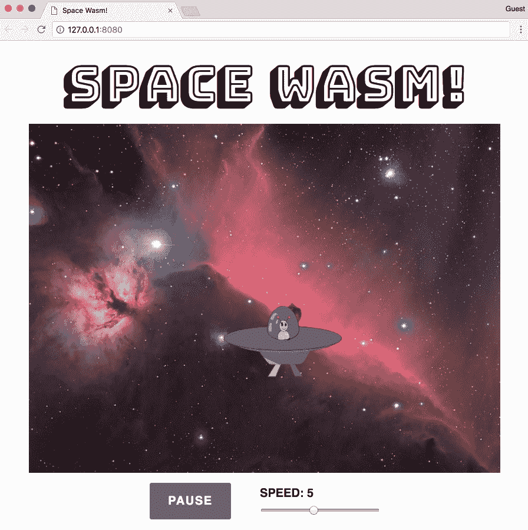

# 与 Node.js 集成

现代网络在开发和服务器端管理上都严重依赖 Node.js。随着越来越复杂的浏览器应用的出现，这些应用执行计算成本很高的操作，性能的提高会带来难以置信的好处。在本章中，我们将通过使用各种示例来描述将 WebAssembly 与 Node.js 集成的各种方法。

本章的目标是理解以下内容:

*   将 WebAssembly 与 Node.js 集成的优势
*   如何与节点组件接口进行交互
*   如何在使用网络包的项目中使用 Wasm 模块
*   如何使用`npm`库为 WebAssembly 模块编写单元测试

# 为什么是 Node.js？

在[第 3 章](03.html)、*建立开发环境*中，Node.js 被描述为异步事件驱动的 JavaScript 运行时，这是取自官网的定义。然而，Node.js 所代表的是我们构建和管理 web 应用方式的深刻转变。在这一节中，我们将讨论 WebAssembly 和 Node.js 之间的关系，以及为什么这两种技术能够很好地互补。

# 无缝集成

Node.js 运行在谷歌的 V8 JavaScript 引擎上，该引擎为谷歌 Chrome 提供动力。由于 V8 的网络组装实现遵循*核心规范*，您可以使用与浏览器相同的应用编程接口与网络组装模块进行交互。您可以使用 Node.js 的`fs`模块将内容读入缓冲区，然后对结果调用`instantiate()`，而不是对`.wasm`文件执行提取调用。

# 补充技术

JavaScript 在服务器端也有局限性。昂贵的计算或处理大量数据可以通过 WebAssembly 的卓越性能进行优化。作为一种脚本语言，JavaScript 擅长自动化简单的任务。您可以编写一个脚本，将 C/C++ 编译成 Wasm 文件，将其复制到`build`文件夹，如果您使用的是像`Browsersync`这样的工具，则可以在浏览器中看到反映的更改。

# 国家预防机制的发展

Node.js 以`npm`的形式拥有广泛的工具和库生态系统。Sven Sauleau 和开源社区的其他成员已经创建了`webassemblyjs`，这是一个用 Node.js 构建的用于网络组装的广泛工具套件。位于[https://webassembly.js.org](https://webassembly.js.org)的`webassemblyjs`站点包含了用于网络组装的标语*工具链。目前有超过 20 个`npm`包来执行各种任务和帮助开发，比如一个 ESLint 插件、一个 AST 验证器和一个格式化器。AssemblyScript 是 WebAssembly 编译器的一个 TypeScript，它允许您编写高性能的代码，编译到 Wasm 模块，而无需学习 C 或 C++。Node.js 社区显然被赋予了 WebAssembly 的成功。*

# 服务器端快速网络组装

Node.js 可以通过几种方式为 WebAssembly 项目增加价值。在本节中，我们将介绍一个集成了网络组装的示例 Node.js 应用。应用使用带有一些简单路由的 Express 从编译的 Wasm 模块调用函数。

# 项目概述

该项目重用了我们在[第 7 章](07.html)、*中构建的应用的一些代码，从零开始创建应用* ( *编写书籍*)来演示 Node.js 如何与 WebAssembly 一起使用。该部分的代码位于`learn-webassembly`存储库中的`/chapter-09-node/server-example`文件夹中。我们将回顾应用中直接适用于 Node.js 的部分。

```cpp
├── /lib
│    └── main.c
├── /src
|    ├── Transaction.js
|    ├── /assets
|    │   ├── db.json
|    │   ├── main.wasm
|    │   └── memory.wasm
|    ├── assign-routes.js
|    ├── index.js
|    └── load-assets.js
├── package.json
├── package-lock.json
└── requests.js
```

关于依赖关系，应用使用`express`和`body-parser`库来建立路由，并从请求体中解析 JSON。对于数据管理，它使用`lowdb`，一个提供读取和更新 JSON 文件方法的库。JSON 文件位于`/src/img/db.json`中，包含从“烹饪书籍”数据集稍微修改的数据。我们使用`nodemon`来观察`/src`文件夹中的变化，并自动重新加载应用。我们使用`rimraf`来管理文件删除。如果您没有在[第 3 章](03.html)、*设置开发环境*中全局安装该库，则该库作为依赖项包含在内。最后，`node-fetch`库允许我们在测试应用时使用提取 API 发出 HTTP 请求。

To simplify functionality in both the JavaScript and C files, the `rawAmount` and `cookedAmount` fields were replaced with a single `amount` field, and the `category` field is now `categoryId`, which maps to a `categories` array in `db.json`.

# 快速配置

应用加载在`/src/index.js`中。该文件的内容如下所示:

```cpp
const express = require('express');
const bodyParser = require('body-parser');
const loadAssets = require('./load-assets');
const assignRoutes = require('./assign-routes');

// If you preface the npm start command with PORT=[Your Port] on
// macOS/Ubuntu or set PORT=[Your Port] on Windows, it will change the port
// that the server is running on, so PORT=3001 will run the app on
// port 3001:
const PORT = process.env.PORT || 3000;

const startApp = async () => {
  const app = express();

  // Use body-parser for parsing JSON in the body of a request:
  app.use(bodyParser.urlencoded({ extended: true }));
  app.use(bodyParser.json());

  // Instantiate the Wasm module and local database:
  const assets = await loadAssets();

  // Setup routes that can interact with Wasm and the database:
  assignRoutes(app, assets);

  // Start the server with the specified port:
  app.listen(PORT, (err) => {
    if (err) return Promise.reject(err);
    return Promise.resolve();
  });
};

startApp()
  .then(() => console.log(`Server is running on port ${PORT}`))
  .catch(err => console.error(`An error occurred: ${err}`));
```

这个文件建立了一个新的 Express 应用，添加了`body-parser`中间件，加载了模拟数据库和 Wasm 实例，并分配了路由。让我们继续讨论在浏览器和 Node.js 中实例化一个 Wasm 模块的区别

# 用 Node.js 实例化一个 Wasm 模块

Wasm 文件在`/src/load-assets.js`中实例化。我们使用的是《烹饪书》中的`memory.wasm`文件，但是`/img/main.wasm`文件是从位于`/lib`文件夹中的稍微不同版本的`main.c`编译而来的。`loadWasm()`功能执行的操作与烹饪书籍中的 Wasm 初始化代码相同，但是`bufferSource`到`WebAssembly.instantiate()`的传递方法不同。让我们通过查看`load-assets.js file`的`loadWasm()`功能中的部分代码来进一步研究这一点:

```cpp
const fs = require('fs');
const path = require('path');

const assetsPath = path.resolve(__dirname, 'assets');

const getBufferSource = fileName => {
  const filePath = path.resolve(assetsPath, fileName);
  return fs.readFileSync(filePath); // <- Replaces the fetch() and .arrayBuffer()
};

// We're using async/await because it simplifies the Promise syntax
const loadWasm = async () => {
  const wasmMemory = new WebAssembly.Memory({ initial: 1024 });
  const memoryBuffer = getBufferSource('memory.wasm');
  const memoryInstance = await WebAssembly.instantiate(memoryBuffer, {
    env: {
      memory: wasmMemory
    }
  });
  ...
```

为了详细说明不同之处，下面是一些使用`fetch`实例化模块的代码:

```cpp
fetch('main.wasm')
  .then(response => {
    if (response.ok) return response.arrayBuffer();
    throw new Error('Unable to fetch WebAssembly file');
  })
  .then(bytes => WebAssembly.instantiate(bytes, importObj));
```

当使用 Node.js 时，提取调用被`fs.readFileSync()`函数代替，不再需要`arrayBuffer()`函数，因为`fs.readFileSync()`返回一个可以直接传递到`instantiate()`函数的缓冲区。一旦 Wasm 模块被实例化，我们就可以开始与实例进行交互。

# 创建模拟数据库

`load-assets.js`文件还包含创建模拟数据库实例的方法:

```cpp
const loadDb = () => {
  const dbPath = path.resolve(assetsPath, 'db.json');
  const adapter = new FileSync(dbPath);
  return low(adapter);
};
```

`loadDb()`功能将`/img/db.json`的内容加载到`lowdb`的实例中。从`load-assets.js`导出的默认函数调用`loadWasm()`和`loadDb()`函数，并返回一个包含模拟数据库和 Wasm 实例的对象:

```cpp
module.exports = async function loadAssets() {
  const db = loadDb();
  const wasmInstance = await loadWasm();
  return {
    db,
    wasmInstance
  };
};
```

接下来，我将使用术语数据库来引用访问`db.json`文件的`lowdb`实例。现在已经加载了资产，让我们回顾一下应用是如何与它们交互的。

# 与网络组件模块交互

与数据库和 Wasm 实例的交互跨`/src`文件夹中的两个文件进行:`Transaction.js`和`assign-routes.js`。在我们的示例应用中，与应用编程接口的所有通信都是通过 HTTP 请求来执行的。向特定端点发送请求将触发与服务器上的数据库/Wasm 实例的一些交互。让我们从回顾`Transaction.js`开始，它直接与数据库和 Wasm 实例交互。

# 在事务中包装交互

就像库克之书一样，有一个类包装了 Wasm 交互代码，并提供了一个干净的界面。`Transaction.js`的内容和《煮书》中`/src/store/WasmTransactions.js`的内容非常相似。大部分的变化适应了交易记录中的`categoryId`和单个`amount`字段(不再有生熟数量)。增加了与数据库交互的附加功能。例如，这里有一个编辑现有事务的函数，既编辑数据库中的事务，也编辑来自 Wasm 实例的链接列表:

```cpp
getValidAmount(transaction) {
  const { amount, type } = transaction;
  return type === 'Withdrawal' ? -Math.abs(amount) : amount;
}

edit(transactionId, contents) {
  const updatedTransaction = this.db.get('transactions')
    .find({ id: transactionId })
    .assign(contents)
    .write();

  const { categoryId, ...transaction } = updatedTransaction;
  const amount = this.getValidAmount(transaction);
  this.wasmInstance._editTransaction(transactionId, categoryId, amount);

  return updatedTransaction;
}
```

`edit()`函数用`contents`参数中的值更新与`transactionId`参数对应的数据库记录。`this.db`是在`load-assets.js`文件中创建的数据库实例。由于`categoryId`字段在`updatedTransaction`记录上可用，我们可以直接将其传递给`this.wasmInstance._editTransaction()`。当`Transaction`的新实例被创建时，它被传递到构造函数中。

# assign-routes.js 中的事务操作

`assign-routes.js`文件定义路线并将它们添加到在`index.js`中创建的`express`实例(`app`)中。在快递中，路线可以直接在`app`上定义(例如`app.get()`，或者通过使用`Router`。在这种情况下，使用`Router`向同一路径添加多个方法。以下代码取自`assign-routes.js`文件，创建了一个`Router`实例并添加了两条路由:返回所有事务的`GET`路由和创建新事务的`POST`路由:

```cpp
module.exports = function assignRoutes(app, assets) {
  const { db, wasmInstance } = assets;
  const transaction = new Transaction(db, wasmInstance);
  const transactionsRouter = express.Router();

  transactionsRouter
    .route('/')
    .get((req, res) => {
      const transactions = transaction.findAll();
      res.status(200).send(transactions);
    })
    .post((req, res) => {
      const { body } = req;
      if (!body) {
        return res.status(400).send('Body of request is empty');
      }
      const newRecord = transaction.add(body);
      res.status(200).send(newRecord);
    });

  ...

  // Set the base path for all routes on transactionsRouter:
  app.use('/api/transactions', transactionsRouter);
}
```

片段末尾的`app.use()`函数指定在`transactionsRouter`实例上定义的所有路线都以`/api/transactions`为前缀。如果您在端口`3000`本地运行应用，您可以在浏览器中导航到`http://localhost:3000/api/transactions`，并看到 JSON 格式的所有事务的数组。

从`get()`和`post()`函数的主体中可以看到，与任何交易记录的交互都被委托给第`3`行中创建的`Transaction`实例。这就完成了我们对代码库相关部分的审查。每个文件都包含描述文件功能和用途的注释，因此您可能需要在进入下一部分之前查看这些注释。在下一节中，我们将构建、运行并与应用交互。

# 构建和运行应用

在我们构建和测试项目之前，您需要安装`npm`依赖项。打开`/server-example`文件夹中的终端，运行以下命令:

```cpp
npm install
```

一旦完成，您就可以进入构建步骤了。

# 构建应用

在此应用中，构建是指使用`emcc`命令将`lib/main.c`编译为`.wasm`文件。由于这是一个 Node.js 项目，我们可以使用`package.json`文件中的`scripts`键来定义任务。您仍然可以使用 VS 代码的任务功能，因为它会自动从您的`package.json`文件中检测脚本，并在您选择任务|运行任务时将它们显示在任务列表中...从菜单上。以下代码包含本项目`package.json`文件中`scripts`部分的内容:

```cpp
"scripts": {
  "prebuild": "rimraf src/img/main.wasm",
  "build": "emcc lib/main.c -Os -s WASM=1 -s SIDE_MODULE=1
           -s BINARYEN_ASYNC_COMPILATION=0 -s ALLOW_MEMORY_GROWTH=1
           -o src/img/main.wasm",
  "start": "node src/index.js",
  "watch": "nodemon src/* --exec 'npm start'"
},
```

`build`脚本被分割成多行用于显示目的，因此您必须组合这些行以获得有效的 JSON。`prebuild`脚本删除现有的 Wasm 文件，`build`脚本运行带有所需标志的`emcc`命令来编译`lib/main.c`并将结果输出到`src/img/main.wasm`。要运行脚本，请在`/server-example`文件夹中打开一个终端，并运行以下命令:

```cpp
npm run build
```

如果`/src/assets`文件夹包含名为`main.wasm`的文件，则构建成功完成。如果发生了错误，终端应该提供错误的描述，以及堆栈跟踪。

You can create `npm` scripts that run before or after a specific script by creating an entry with the same name and prefixing it with `pre` or `post`. For example, if you wanted to run a script after the `build` script has completed, you can create a script named `"postbuild"` and specify the command you want to run.

# 启动并测试应用

如果您正在对应用进行更改或试图修复一个错误，您可以使用`watch`脚本来监视`/src`文件夹内容的任何更改，并在发生更改时自动重新启动应用。由于我们只是运行和测试应用，我们可以使用`start`命令来代替。在终端中，确保您在`/server-example`文件夹中，并运行以下命令:

```cpp
npm start
```

你应该会看到一条信息，上面写着`Server is running on port 3000`。您现在可以向服务器发送 HTTP 请求了。要测试应用，请在`server-example`目录中打开一个新的终端实例，并运行以下命令:

```cpp
node ./requests.js 1
```

这将注销对`/api/transactions`端点的`GET`调用的响应主体。`requests.js`文件包含允许您请求所有可用路线的功能。`getFetchActionForId()`函数返回一个带有端点和选项值的对象，该对象对应于`assign-routes.js`文件中的一条路线。`actionId`是一个任意数字，用于简化测试和减少运行命令的输入量。例如，您可以运行以下命令:

```cpp
node ./requests.js 5
```

它将注销*计算机&互联网*类别的所有交易的总和。如果需要不同类别的总数，可以向`node`命令传递一个额外的参数。要获取*保险*类别中所有交易的总和，请运行以下命令:

```cpp
node ./requests.js 5 3
```

尝试检查每个请求(总共有八个)。如果您提出添加、删除或编辑事务的请求，您应该会在`/src/img/db.json`文件中看到更改。Node.js 示例项目到此结束。在下一节中，我们将利用 Webpack 加载一个 Wasm 模块并与之交互。

# 带有网络包的客户端网络组件

Web 应用的复杂性和规模持续增长。简单地提供一些手写的 HTML、CSS 和 JavaScript 文件对于大型应用来说是不可行的。为了管理这种复杂性，web 开发人员使用 bundlers 来实现模块化，确保浏览器兼容性，并减小 JavaScript 文件的大小。在这一节中，我们将使用一个流行的打包器，网络包，在不使用`emcc`的情况下使用 Wasm。

# 项目概述

示例 Webpack 应用扩展了我们在 [第 5 章](05.html)*创建和加载 WebAssembly 模块*的*编译 C 而不使用粘合代码*部分中编写的 C 代码的功能。我们将展示一个在马头星云周围跳跃的宇宙飞船中的外星人，而不是展示一个围绕红色背景跳跃的蓝色矩形。碰撞检测功能已被修改，以适应矩形内的弹跳，因此飞船的运动将是随机的。该部分的代码位于`learn-webassembly`存储库中的`/chapter-09-node/webpack-example`文件夹中。项目的文件结构如以下代码所示:

```cpp
├── /src
│    ├── /assets
│    │    ├── background.jpg
│    │    └── spaceship.svg
│    ├── App.js
│    ├── index.html
│    ├── index.js
│    ├── main.c
│    └── styles.css
├── package.json
├── package-lock.json
└── webpack.config.js
```

我们将在后面的章节中查看 Webpack 配置文件。现在，让我们花点时间更详细地讨论一下 Webpack。

# 什么是 Webpack？

在过去的几年里，JavaScript 生态系统一直在快速发展，导致新的框架和库不断涌现。Bundlers 的出现是为了让开发人员能够将一个 JavaScript 应用拆分成几个文件，而不必担心管理全局名称空间、脚本加载顺序或 HTML 文件中令人难以置信的一长串`<script>`标签。bundler 将所有文件合并成一个文件，并解决任何命名冲突。

在撰写本文时，Webpack 是最受欢迎的前端开发工具之一。然而，它不仅仅是组合 JavaScript 文件。它还执行复杂的任务，如代码拆分和树摇动(死代码消除)。Webpack 是用插件架构设计的，这导致了大量社区开发的插件。在`npm`上搜索 Webpack，目前返回超过 12000 个包裹！这个插件的详尽列表，以及它强大的内置特性集，使 Webpack 成为一个成熟的构建工具。

# 安装和配置网络包

在我们开始应用演练之前，在`/webpack-example`文件夹中打开一个终端并运行以下命令:

```cpp
npm install 
```

# 依赖性概述

该应用使用 Webpack 的版本 4(编写本文时的最新版本)来构建我们的应用。我们需要使用网络包插件来加载应用中使用的各种文件类型，并使用巴贝尔来利用更新的 JavaScript 特性。以下片段列出了我们在项目中使用的`devDependencies`(摘自`package.json`):

```cpp
...
"devDependencies": {
  "@babel/core": "^7.0.0-rc.1",
  "@babel/preset-env": "^7.0.0-rc.1",
  "babel-loader": "^8.0.0-beta.4",
  "cpp-wasm-loader": "0.7.7",
  "css-loader": "1.0.0",
  "file-loader": "1.1.11",
  "html-loader": "0.5.5",
  "html-webpack-plugin": "3.2.0",
  "mini-css-extract-plugin": "0.4.1",
  "rimraf": "2.6.2",
  "webpack": "4.16.5",
  "webpack-cli": "3.1.0",
  "webpack-dev-server": "3.1.5"
},
...
```

我为一些库指定了确切的版本，以确保应用成功构建和运行。任何以`-loader`或`-plugin`结尾的库都与 Webpack 一起使用。`cpp-wasm-loader`库允许我们直接导入一个 C 或 C++ 文件，而不必先将其编译成 Wasm。Webpack 4 内置了对导入`.wasm`文件的支持，但是您不能指定`importObj`参数，这是用 Emscripten 生成的模块所必需的。

# 在 webpack.config.js 中配置加载器和插件

除了 JavaScript 之外，我们还为应用使用了几种不同的文件类型:CSS、SVG、HTML 等等。安装`-loader`依赖项只是等式的一部分——你还需要告诉网络包如何加载它们。您还需要为您安装的任何插件指定配置详细信息。您可以在项目根文件夹的`webpack.config.js`文件中指定加载和配置细节。以下片段包含`/webpack-example/webpack.config.js`的内容:

```cpp
const HtmlWebpackPlugin = require('html-webpack-plugin');
const MiniCssExtractPlugin = require('mini-css-extract-plugin');

module.exports = {
  module: {
    rules: [
      {
        test: /\.js$/,
        exclude: /node_modules/,
        use: {
          loader: 'babel-loader',
          options: {
            // We need this to use async/await:
            presets: [
              [
                '@babel/preset-env', {
                  targets: { node: '10' }
                }
              ]
            ]
          }
        }
      },
      {
        test: /\.html$/,
        use: {
          loader: 'html-loader',
          options: { minimize: true }
        }
      },
      {
        test: /\.css$/,
        use: [MiniCssExtractPlugin.loader, 'css-loader']
      },
      {
        test: /\.(c|cpp)$/,
        use: {
          loader: 'cpp-wasm-loader',
          options: {
            emitWasm: true
          }
        }
      },
      {
        test: /\.(png|jpg|gif|svg)$/,
        use: {
          loader: 'file-loader',
          options: {
            name: 'img/[name].[ext]'
          }
        }
      }
    ]
  },
  plugins: [
    new HtmlWebpackPlugin({
      template: './src/index.html',
      filename: './index.html'
    }),
    // This is used for bundling (building for production):
    new MiniCssExtractPlugin({
      filename: '[name].css',
      chunkFilename: '[id].css'
    })
  ]
};
```

`rules`部分告诉 Webpack 使用哪个加载程序作为文件扩展名。数组中的第四项处理 C/C++ 文件(注意包含`c|cpp`的`test`字段值)。`HtmlWebpackPlugin`获取`/src/index.html`的内容，添加任何需要的`<script>`标签，将其缩小，并在`build`文件夹中创建一个`index.html`，默认为`/dist`。`MiniCssExtractPlugin`将任何导入的 CSS 复制到`/dist`文件夹中的单个 CSS 文件中。我们将在后面的小节中回顾如何构建项目，因此让我们继续讨论应用代码，从 C 文件开始。

# C 代码

因为我们可以直接导入 C 和 C++ 文件，所以 C 文件位于`/src`文件夹中。该文件`main.c`包含管理碰撞检测和在`<canvas>`周围移动飞船的逻辑。代码基于我们在[第 5 章](05.html)、*创建和加载网络组装模块*中创建的`without-glue.c`文件。我们不打算审查整个文件，只审查已经更改并值得解释的部分。让我们从定义和声明部分开始，其中包括一个新的`struct` : `Bounds`。

# 定义和声明

包含定义和声明部分的代码如下所示:

```cpp
typedef struct Bounds {
  int width;
  int height;
} Bounds;

// We're using the term "Rect" to represent the rectangle the
// image occupies:
typedef struct Rect {
  int x;
  int y;
  int width;
  int height;
  // Horizontal direction of travel (L/R):
  char horizDir;
  // Vertical direction of travel (U/D):
  char vertDir;
} Rect;

struct Bounds bounds;
struct Rect rect;
```

新属性被添加到现有的`Rect`定义中，以适应在 *x* 和 *y* 方向上的灵活尺寸和跟踪移动。我们定义了一个新的`struct`、`Bounds`，并删除了现有的`#define`语句，因为`<canvas>`元素不再是静态维度的正方形。当模块加载时，会声明这两个元素的新实例。这些实例的尺寸属性在`start()`函数中指定，我们接下来将介绍该函数。

# start()函数

更新后的`start()`功能作为模块的入口点，如下所示:

```cpp
EMSCRIPTEN_KEEPALIVE
void start(int boundsWidth, int boundsHeight, int rectWidth,
           int rectHeight) {
    rect.x = 0;
    rect.y = 0;
    rect.horizDir = 'R';
    rect.vertDir = 'D';
    rect.width = rectWidth;
    rect.height = rectHeight;
    bounds.width = boundsWidth;
    bounds.height = boundsHeight;
    setIsRunning(true);
}
```

从 JavaScript 调用的任何函数都带有`EMSCRIPTEN_KEEPALIVE`语句。我们现在将`Bounds`和`Rect`元素的宽度和高度作为参数传递给`start()`函数，并将其分配给局部`bounds`和`rect`变量。这使我们可以轻松地改变其中任何一个的尺寸，而不必对碰撞检测逻辑进行任何更改。在本申请的上下文中，`rect`代表宇宙飞船图像所在的矩形。我们为`rect`设置了默认的水平和垂直方向，因此图像最初会向右下方移动。让我们进入`rect`运动/碰撞检测代码。

# 函数的作用是

与碰撞检测和`Rect`移动相关的代码在`updateRectLocation()`功能中处理，如下所示:

```cpp
/**
 * Updates the rectangle location by +/- 1px in the x or y based on
 * the current location.
 */
void updateRectLocation() {
    // Determine if the bounding rectangle has "bumped" into either
    // the left/right side or top/bottom side. Depending on which side,
    // flip the direction:
    int xBouncePoint = bounds.width - rect.width;
    if (rect.x == xBouncePoint) rect.horizDir = 'L';
    if (rect.x == 0) rect.horizDir = 'R';

    int yBouncePoint = bounds.height - rect.height;
    if (rect.y == yBouncePoint) rect.vertDir = 'U';
    if (rect.y == 0) rect.vertDir = 'D';

    // If the direction has changed based on the x and y
    // coordinates, ensure the x and y points update
    // accordingly:
    int horizIncrement = 1;
    if (rect.horizDir == 'L') horizIncrement = -1;
    rect.x = rect.x + horizIncrement;

    int vertIncrement = 1;
    if (rect.vertDir == 'U') vertIncrement = -1;
    rect.y = rect.y + vertIncrement;
}
```

该代码与我们在 [第 5 章](05.html)*中编写的创建和加载网络组装模块*的代码之间的主要区别在于冲突检测逻辑。该函数不再简单地水平跟踪`rect`实例的位置，并在它到达右侧边界时改变方向，而是跟踪水平和垂直方向，并独立管理每个方向。虽然这不是性能最好的算法，但它确实达到了确保飞船在遇到`<canvas>`边缘时改变方向的目的。

# JavaScript 代码

我们对应用使用的唯一生产依赖是 Vue。虽然应用由单个组件组成，但 Vue 使管理数据、功能和组件生命周期比手动操作简单得多。`index.js`文件包含 Vue 初始化代码，渲染和应用逻辑在`/src/App.js`中。这个文件有很多可移动的部分，所以我们将按照前一节所做的那样，分块查看代码。让我们从`import`的陈述开始。

# 导入语句

下面的代码演示了运行中的 Webpack 加载程序:

```cpp
// This is loaded using the css-loader dependency:
import './styles.css';

// This is loaded using the cpp-wasm-loader dependency:
import wasm from './main.c';

// These are loaded using the file-loader dependency:
import backgroundImage from './img/background.jpg';
import spaceshipImage from './img/spaceship.svg';
```

我们在`webpack.config.js`文件中配置的加载器了解如何处理 CSS、C 和图像文件。现在我们已经有了所需的可用资源，我们可以开始定义我们的组件状态了。

# 组件状态

下面的代码为我们的组件初始化`data()`函数中的本地状态:

```cpp
export default {
  data() {
    return {
      instance: null,
      bounds: { width: 800, height: 592 },
      rect: { width: 200, height: 120 },
      speed: 5
    };
  },
  ...
```

虽然`bounds`和`rect`属性从未改变，但我们在本地状态下定义了它们，以将组件使用的所有数据保存在一个位置。`speed`号的属性决定了宇宙飞船穿越`<canvas>`的速度，范围从`1`到`10`。`instance`属性被初始化为空，但将用于访问编译后的 Wasm 模块的导出函数。让我们继续看 Wasm 初始化代码，它编译 Wasm 文件并填充`<canvas>`。

# Wasm 初始化

编译 Wasm 文件并填充`<canvas>`元素的代码如下所示:

```cpp
methods: {
  // Create a new Image instance to pass into the drawImage function
  // for the <canvas> element's context:
  loadImage(imageSrc) {
    const loadedImage = new Image();
    loadedImage.src = imageSrc;
    return new Promise((resolve, reject) => {
      loadedImage.onload = () => resolve(loadedImage);
      loadedImage.onerror = () => reject();
    });
  },

  // Compile/load the contents of main.c and assign the resulting
  // Wasm module instance to the components this.instance property:
  async initializeWasm() {
    const ctx = this.$refs.canvas.getContext('2d');

    // Create Image instances of the background and spaceship.
    // These are required to pass into the ctx.drawImage() function:
    const [bouncer, background] = await Promise.all([
      this.loadImage(spaceshipImage),
      this.loadImage(backgroundImage)
    ]);

    // Compile the C code to Wasm and assign the resulting
    // module.exports to this.instance:
    const { width, height } = this.bounds;
    return wasm
      .init(imports => ({
        ...imports,
        _jsFillRect(x, y, w, h) {
          ctx.drawImage(bouncer, x, y, w, h);
        },
        _jsClearRect() {
          ctx.drawImage(background, 0, 0, width, height);
        }
      }))
        .then(module => {
          this.instance = module.exports;
          return Promise.resolve();
        });
  },
  ...
```

在组件的`methods`键中定义了额外的函数，但是现在我们将重点关注将导入的 C 文件编译成 Wasm 的代码。为宇宙飞船和背景图像创建`Image`实例后，`main.c`文件(作为`.wasm`导入)被编译到一个 Wasm 模块，生成的`exports`被分配给`this.instance`。一旦这些操作完成，就可以从导出的 Wasm 模块调用`start()`功能。由于`initializeWasm()`函数调用`<canvas>`元素的`getContext()`函数，因此需要先安装组件，然后才能调用该函数。让我们回顾一下其余的`methods`定义和`mounted()`事件处理程序。

# 元件安装

其余`methods`定义和`mounted()`事件处理函数如下所示:

```cpp
  ...
  // Looping function to move the spaceship across the canvas.
  loopRectMotion() {
    setTimeout(() => {
      this.instance.moveRect();
      if (this.instance.getIsRunning()) this.loopRectMotion();
    }, 15 - this.speed);
  },
  // Pauses/resumes the spaceship's movement when the button is
  // clicked:
  onActionClick(event) {
    const newIsRunning = !this.instance.getIsRunning();
    this.instance.setIsRunning(newIsRunning);
    event.target.innerHTML = newIsRunning ? 'Pause' : 'Resume';
    if (newIsRunning) this.loopRectMotion();
  }
},
mounted() {
  this.initializeWasm().then(() => {
    this.instance.start(
      this.bounds.width,
      this.bounds.height,
      this.rect.width,
      this.rect.height
    );
    this.loopRectMotion();
  });
},
```

一旦 Wasm 模块被编译，就可以在`this.instance`上访问`start()`功能。`bounds`和`rect`尺寸传入`start()`功能，然后调用`loopRectFunction()`开始移动飞船。`onActionClick()`事件处理器功能根据飞船当前是否在运动来暂停或恢复飞船的运动。

`loopRectMotion()`的功能与 [第 5 章](05.html)*创建和加载网络组件模块*的示例代码相同，只是速度现在可以调整。规定超时长度的`15 - this.speed`计算可能看起来有点奇怪。由于图像的移动速度是基于函数调用之间经过的时间，增加这个数字实际上会减慢飞船的速度。因此，从`15`中减去`this.speed`，选择 T3 是因为它比`10`稍大，但是如果`this.speed`增加到最大，不会使飞船变得模糊。这就是组件逻辑；让我们进入代码的渲染部分，在这里定义了`template`。

# 组件渲染

`template`属性的内容规定了要渲染的内容，如下所示:

```cpp
template: `
  <div class="flex column">
   <h1>SPACE WASM!</h1>
    <canvas
      ref="canvas"
      :height="bounds.height"
      :width="bounds.width">
    </canvas>
    <div class="flex controls">
      <div>
        <button class="defaultText" @click="onActionClick">
          Pause
        </button>
      </div>
    <div class="flex column">
      <label class="defaultText" for="speed">Speed: {{speed}}</label>
      <input
        v-model="speed"
        id="speed"
        type="range"
        min="1"
        max="10"
        step="1">
    </div>
  </div>
</div>

```

由于我们使用 Vue，我们可以将 HTML 元素的属性和事件处理程序绑定到组件中定义的属性和方法。除了暂停/恢复按钮，还有一个范围`<input>`允许你改变速度。通过向左或向右滑动，你可以减慢或加快飞船的速度，并立即看到变化。我们的审查到此结束；让我们看看如何使用 Webpack 来构建或运行应用。

# 构建和运行应用

使用`cpp-wasm-loader`库消除了生成 Wasm 模块的构建步骤，但是我们仍然需要打包我们的应用进行分发。在`package.json`的`scripts`部分，有一个`build`和`start`的脚本。运行`build`脚本执行生成包的`webpack`命令。为确保正常工作，在`/webpack-example`文件夹中打开一个终端实例并运行以下命令:

```cpp
npm run build
```

第一次运行项目时，可能需要一分钟来构建它。这可以归因于 Wasm 编译步骤。然而，后续的构建应该会快得多。如果构建成功，您应该会看到一个新创建的`/dist`文件夹，其内容如下:

```cpp
├── /assets
│    ├── background.jpg
│    └── spaceship.svg
├── index.html
├── main.css
├── main.js
└── main.wasm
```

# 测试构建

让我们尝试一下构建，以确保一切正常工作。在终端实例中运行以下命令来启动应用:

```cpp
serve -l 8080 dist
```

如果您在浏览器中导航到`http://127.0.0.1:8080/index.html`，您应该会看到:



Webpack application running in the browser

宇宙飞船图像(取自[https://commons . wikimedia . org/wiki/File:Alien _ 太空船 _-_SVG_Vector.svg](https://commons.wikimedia.org/wiki/File:Alien_Spaceship_-_SVG_Vector.svg) )在马头星云背景图像(取自[https://commons . wikimedia . org/wiki/File:马头星云 _ Christmas _ 2017 _ deography . jpg](https://commons.wikimedia.org/wiki/File:Horsehead_Nebula_Christmas_2017_Deography.jpg))的边界内来回跳动。当按下暂停按钮时，按钮的标题变为恢复，船只停止移动。再次按下按钮将标题更改回“暂停”,船只将再次开始移动。调整速度滑块可增加或减少船速。

# 运行启动脚本

该应用安装了`webpack-dev-server`库，其运行方式类似于`Browsersync.`库使用 LiveReloading，当您对`/src`中的文件进行任何更改时，它会自动更新该应用。由于我们对 C 和 C++ 文件使用了网络包加载器，如果您也更改了 C 文件，自动更新事件将会触发。运行以下命令来启动应用并观察更改:

```cpp
npm start
```

当构建完成时，浏览器窗口应该会自动打开，然后将您导向正在运行的应用。要查看实时重装功能的运行情况，请尝试将`main.c`中`setIsRunning()`函数的`isRunning`变量的值设置为 false，而不是`newIsRunning`:

```cpp
EMSCRIPTEN_KEEPALIVE
void setIsRunning(bool newIsRunning) {
    // isRunning = newIsRunning;

    // Set the value to always false:
    isRunning = false;
}
```

宇宙飞船应该卡在左上角。如果你把它换回来，宇宙飞船又开始移动了。在下一节中，我们将用 JavaScript 编写单元测试来测试 WebAssembly 模块。

# 用 Jest 测试网络组装模块

经过良好测试的代码可以防止回归错误，简化重构，并减轻添加新特性带来的一些挫折。一旦你编译了一个 Wasm 模块，你应该编写测试来确保它如预期的那样运行，即使你已经为你编译它的 C、C++ 或 Rust 代码编写了测试。在这一节中，我们将使用 **Jest** ，一个 JavaScript 测试框架，来测试编译后的 Wasm 模块中的函数。

# 正在测试的代码

本例中使用的所有代码都位于`/chapter-09-node/testing-example`文件夹中。代码和相应的测试非常简单，不代表真实世界的应用，但是它们旨在演示如何使用 Jest 进行测试。以下代码表示`/testing-example`文件夹的文件结构:

```cpp
├── /src
|    ├── /__tests__
|    │    └── main.test.js
|    └── main.c
├── package.json
└── package-lock.json
```

我们将要测试的 C 文件的内容`/src/main.c`，如下所示:

```cpp
int addTwoNumbers(int leftValue, int rightValue) {
    return leftValue + rightValue;
}

float divideTwoNumbers(float leftValue, float rightValue) {
    return leftValue / rightValue;
}

double findFactorial(float value) {
    int i;
    double factorial = 1;

    for (i = 1; i <= value; i++) {
        factorial = factorial * i;
    }
    return factorial;
}
```

文件中的三个函数都在执行简单的数学运算。`package.json`文件包含一个脚本，将 C 文件编译成 Wasm 文件进行测试。运行以下命令编译 C 文件:

```cpp
npm run build
```

在`/src`目录中应该有一个名为`main.wasm`的文件。让我们继续描述测试配置步骤。

# 测试配置

我们将在这个例子中使用的唯一依赖项是 Jest，一个由脸书构建的 JavaScript 测试框架。Jest 是一个很好的测试选择，因为它包含了您开箱即用的大部分特性，比如覆盖、断言和嘲讽。在大多数情况下，您可以使用零配置，这取决于应用的复杂性。如果你有兴趣了解更多，请访问 Jest 的网站。在`/chapter-09-node/testing-example`文件夹中打开一个终端实例，运行以下命令安装 Jest:

```cpp
npm install
```

在`package.json`文件中，`scripts`部分有三个条目:`build`、`pretest`和`test`。`build`脚本执行带有所需标志的`emcc`命令，将`/src/main.c`编译为`/src/main.wasm`。`test`脚本使用`--verbose flag`执行`jest`命令，这为每个测试套件提供了额外的细节。`pretest`脚本只是运行`build`脚本，以确保在运行任何测试之前`/src/main.wasm`存在。

# 测试文件审查

让我们遍历位于`/src/__tests__/main.test.js`的测试文件，回顾每一段代码的用途。测试文件的第一部分实例化`main.wasm`文件，并将结果分配给本地`wasmInstance`变量:

```cpp
const fs = require('fs');
const path = require('path');

describe('main.wasm Tests', () => {
  let wasmInstance;

  beforeAll(async () => {
    const wasmPath = path.resolve(__dirname, '..', 'main.wasm');
    const buffer = fs.readFileSync(wasmPath);
    const results = await WebAssembly.instantiate(buffer, {
      env: {
        memoryBase: 0,
        tableBase: 0,
        memory: new WebAssembly.Memory({ initial: 1024 }),
        table: new WebAssembly.Table({ initial: 16, element: 'anyfunc' }),
        abort: console.log
      }
    });
    wasmInstance = results.instance.exports;
  });
 ...
```

Jest 提供了生命周期方法来在运行测试之前执行任何设置或拆卸操作。您可以指定在所有测试之前或之后运行的功能(`beforeAll()` / `afterAll()`)，或者在每个测试之前或之后运行的功能(`beforeEach()` / `afterEach()`)。我们需要一个 Wasm 模块的编译实例，从中我们可以调用导出的函数，所以我们将实例化代码放在`beforeAll()`函数中。

我们将整个测试套件包装在文件的`describe()`块中。Jest 使用一个`describe()`函数来封装相关测试的套件，并使用`test()`或`it()`来表示单个测试。这个概念有一个简单的例子:

```cpp
const add = (a, b) => a + b;

describe('the add function', () => {
  test('returns 6 when 4 and 2 are passed in', () => {
    const result = add(4, 2);
    expect(result).toEqual(6);
  });

  test('returns 20 when 12 and 8 are passed in', () => {
    const result = add(12, 8);
    expect(result).toEqual(20);
  });
});
```

下一段代码包含每个导出函数的所有测试套件和测试:

```cpp
...
  describe('the _addTwoNumbers function', () => {
    test('returns 300 when 100 and 200 are passed in', () => {
      const result = wasmInstance._addTwoNumbers(100, 200);
      expect(result).toEqual(300);
    });

    test('returns -20 when -10 and -10 are passed in', () => {
      const result = wasmInstance._addTwoNumbers(-10, -10);
      expect(result).toEqual(-20);
    });
  });

  describe('the _divideTwoNumbers function', () => {
    test.each([
      [10, 100, 10],
      [-2, -10, 5],
    ])('returns %f when %f and %f are passed in', (expected, a, b) => {
      const result = wasmInstance._divideTwoNumbers(a, b);
      expect(result).toEqual(expected);
    });

    test('returns ~3.77 when 20.75 and 5.5 are passed in', () => {
      const result = wasmInstance._divideTwoNumbers(20.75, 5.5);
      expect(result).toBeCloseTo(3.77, 2);
    });
  });

  describe('the _findFactorial function', () => {
    test.each([
      [120, 5],
      [362880, 9.2],
    ])('returns %p when %p is passed in', (expected, input) => {
      const result = wasmInstance._findFactorial(input);
      expect(result).toEqual(expected);
    });
  });
});
```

对于`_addTwoNumbers()`函数，第一个`describe()`块有两个`test()`实例，以确保函数返回作为参数传入的两个数字的和。接下来的两个`describe()`模块，用于`_divideTwoNumbers()`和`_findFactorial()`功能，使用 Jest 的`.each`功能，允许你用不同的数据运行相同的测试。`expect()`函数允许您对作为参数传入的值进行断言。最后一个`_divideTwoNumbers()`测试中的`.toBeCloseTo()`断言检查结果是否在`3.77`的两位小数以内。其余使用`.toEqual()`断言检查是否相等。

用 Jest 编写测试相对简单，运行测试更容易！让我们试着运行我们的测试，并查看 Jest 提供的一些命令行界面标志。

# 运行测试

要运行测试，请在`/chapter-09-node/testing-example`文件夹中打开一个终端实例，并运行以下命令:

```cpp
npm test
```

您应该会在终端中看到以下输出:

```cpp
main.wasm Tests
  the _addTwoNumbers function
    ✓ returns 300 when 100 and 200 are passed in (4ms)
    ✓ returns -20 when -10 and -10 are passed in
  the _divideTwoNumbers function
    ✓ returns 10 when 100 and 10 are passed in
    ✓ returns -2 when -10 and 5 are passed in (1ms)
    ✓ returns ~3.77 when 20.75 and 5.5 are passed in
  the _findFactorial function
    ✓ returns 120 when 5 is passed in (1ms)
    ✓ returns 362880 when 9.2 is passed in

Test Suites: 1 passed, 1 total
Tests: 7 passed, 7 total
Snapshots: 0 total
Time: 1.008s
Ran all test suites.
```

如果您有大量的测试，您可以从`package.json`中的`test`脚本中移除`--verbose`标志，并且仅在需要时将该标志传递给`npm test`命令。还有其他几个命令行界面标志可以传递给`jest`命令。以下列表包含一些更常用的标志:

*   `--bail`:在第一个测试套件失败时，立即退出测试套件
*   `--coverage`:收集测试覆盖率，并在测试运行后显示在终端中
*   `--watch`:监视文件的更改，并重新运行与更改文件相关的测试

您可以通过在`--`之后添加这些标志来将它们传递给`npm`测试命令。例如，如果您想使用`--bail`标志，您可以运行以下命令:

```cpp
npm test -- --bail
```

您可以在官方网站[https://jestjs.io/docs/en/cli](https://jestjs.io/docs/en/cli)查看命令行界面选项的完整列表。

# 摘要

在本章中，我们讨论了将 WebAssembly 与 Node.js 集成的优势，并演示了如何在服务器端和客户端使用 Node.js。我们评估了一个使用 Wasm 模块对会计交易进行计算的 Express 应用。然后，我们回顾了一个基于浏览器的应用，它利用 Webpack 从一个 C 文件中导入和调用函数，而无需编写任何 Wasm 实例化代码。最后，我们看到了如何利用 Jest 测试框架来测试编译后的模块，并确保其正常运行。在[第 10 章](10.html)、*高级工具和即将推出的功能*中，我们将介绍高级工具，并讨论 WebAssembly 即将推出的功能。

# 问题

1.  将 WebAssembly 与 Node.js 集成的优势之一是什么？
2.  Express 应用使用什么库来读写数据到 JSON 文件？
3.  在浏览器中加载模块和在 Node.js 中加载模块有什么区别？
4.  在现有的`npm`脚本之前或之后，你可以使用什么技巧来运行`npm`脚本？
5.  Webpack 为消除死代码而执行的任务叫什么？
6.  Webpack 中加载程序的目的是什么？
7.  `describe()`和`test()`在 Jest 中的作用有什么区别？
8.  如何将额外的命令行界面标志传递给`npm test`命令？

# 进一步阅读

*   快递:[https://expressjs.com](https://expressjs.com)
*   web pack:https://web pack . js . org
*   jest API:https://jestjs . io/docs/en/API