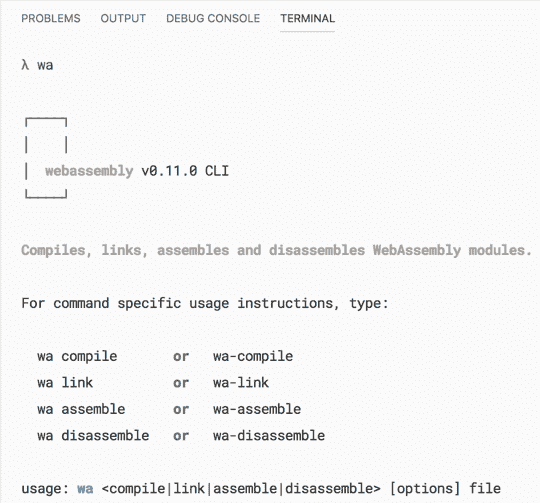
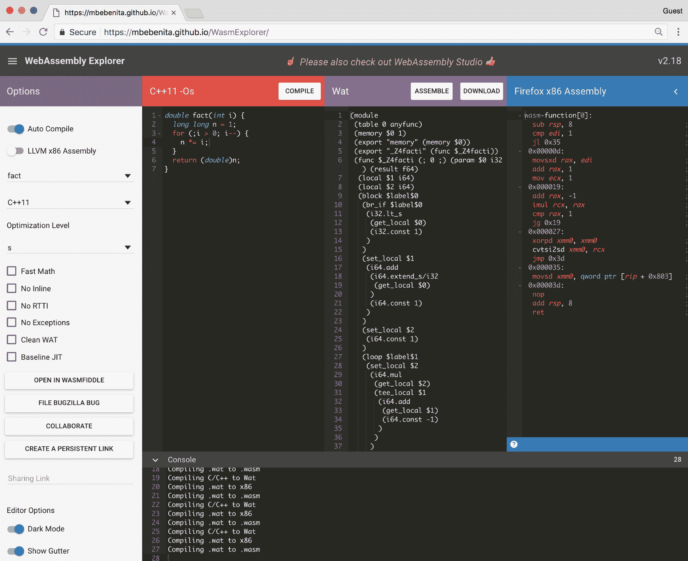
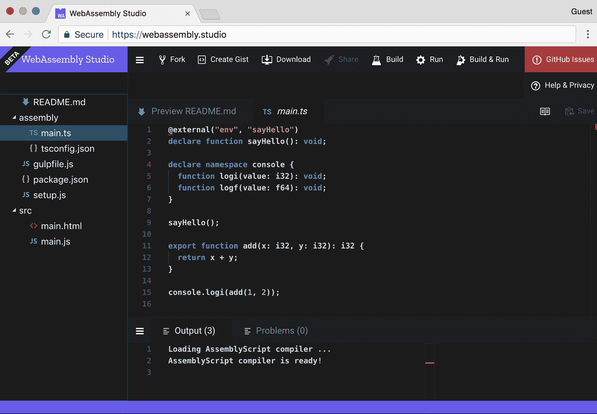
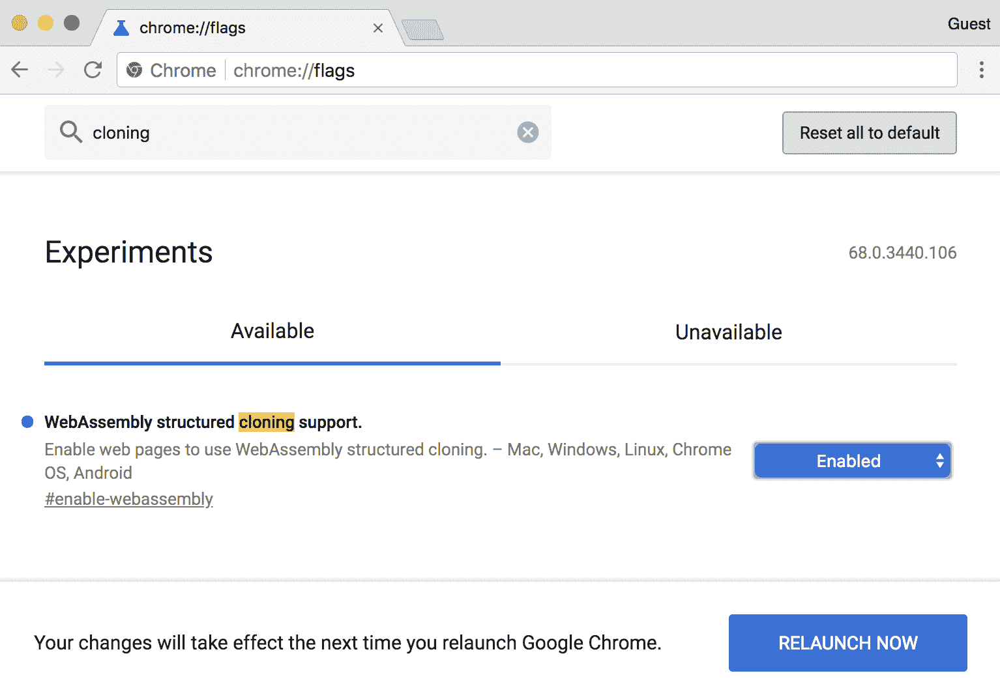
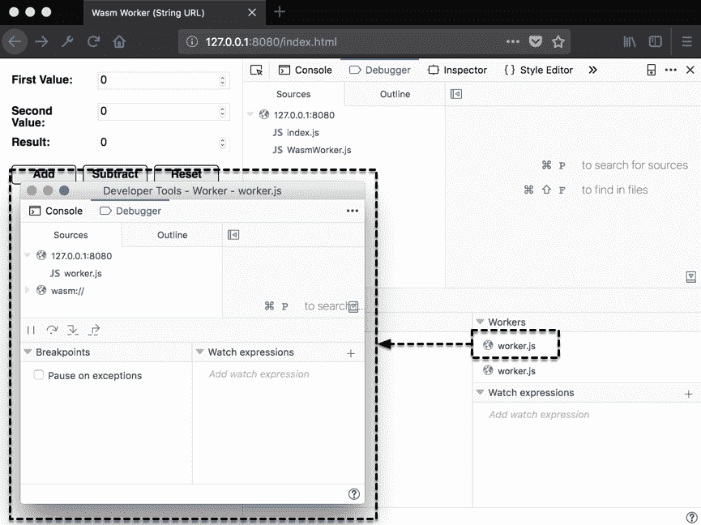

# 高级工具和即将推出的功能

WebAssembly 的生态系统在不断发展和演变。开发人员已经看到了网络组装的潜力。他们构建工具来改善开发体验或从他们选择的语言中输出 Wasm 模块(尽管有一些限制)。

在本章中，我们将评估使网络组装成功的底层技术。我们还将回顾您可以在浏览器中使用的工具，并介绍一个利用 Web Workers 的高级用例。最后，我们将快速回顾 WebAssembly 路线图中即将推出的特性和建议。

本章的目标是理解以下内容:

*   WABT 和比纳莱恩如何融入构建过程，以及他们可以用来做什么
*   如何使用 LLVM(而不是 Emscripten)编译 WebAssembly 模块
*   在线工具，如 WasmFiddle 和其他有用的在线工具
*   如何利用网络工作者并行运行网络组装
*   未来将集成到 WebAssembly 中的即将推出的功能(建议的和正在进行的)

# 想要和 binaryen

WABT 和 Binaryen 允许开发人员处理源文件，并为 WebAssembly 开发工具。如果您对在较低层次上使用网络组装感兴趣，这些工具提供了实现这一目标的方法。在本节中，我们将更详细地评估这些工具，并回顾每种工具的用途和功能。

# WABT——网络组装二进制工具包

WABT 的工作重点是操纵 WebAssembly 二进制(`.wasm`)文件和文本(`.wat`)文件，以及两种格式之间的转换。WABT 提供了将 **Wat 翻译成 Wasm**(**Watwasm**)的工具，反之亦然(**Wam2Wat**)，以及将 Wasm 文件转换成 C 源文件和头文件的工具(**Wam2c**)。您可以在位于[https://github.com/WebAssembly/wabt](https://github.com/WebAssembly/wabt)的 WABT GitHub 资源库的自述文件中查看工具的完整列表。

WABT 的一个用例例子是我们在[第 3 章](03.html)、 *中安装的*VS 代码*扩展的网络组装工具包*。扩展名依赖于 WABT 查看与`.wasm`文件关联的文本格式。该存储库提供了 wat2wasm 和 wasm2wat 演示的链接，您可以使用它们来测试 wat 程序的有效性，或者使用 JavaScript 与编译后的二进制文件进行交互。下面的截图包含 wat2wasm 演示中的 Wat 和 JavaScript 实例化代码:


Wat and JavaScript loading code from wat2wasm's "simple" example

在 JS 面板的第`3`行，您可能已经注意到来自`wasmInstance.exports`的`addTwo()`功能没有前缀`_`。Emscripten 在编译过程中自动添加`_`。您可以省略`_`，方法是将`.wasm`文件转换为`.wat`，更新函数名，并使用 WABT 将其转换回`.wasm`，尽管这不太实用。WABT 简化了将文本格式转换为二进制格式的过程，反之亦然。如果您想为 WebAssembly 构建编译工具，您可以使用 Binaryen，我们接下来将介绍它。

# 二进制

Binaryen 在[https://github.com/WebAssembly/binaryen](https://github.com/WebAssembly/binaryen)的 GitHub 页面将 Binaryen 描述为一个用 C++编写的用于 WebAssembly 的编译器和工具链基础设施库。它旨在使编译网络程序集变得简单、快速和有效。它通过提供一个简单的 C API、一个内部 IR 和一个优化器来实现这些目标。就像 WABT 一样，Binaryen 为开发网络组装工具提供了一套广泛的工具。以下列表描述了 Binaryen 提供的工具子集:

*   **wasm-shell** :能够加载和解释网络组件的工具
*   **ASM 2 ASM**:将 asm.js 代码编译成 wasm 模块
*   **wasm2js** :将一个 wasm 模块编译成 JavaScript
*   **wasm-合并**:将多个 Wasm 文件合并为一个
*   **wasm.js** : JavaScript 库，包括 Binaryen 解释器、asm2wasm、Wat 解析器和其他 Binaryen 工具
*   **binaryen.js** : JavaScript 库，为 binaryen 工具链提供 JavaScript 接口

对构建 WebAssembly 工具感兴趣的 JavaScript 开发人员对 wasm.js 和 binaryen.js 工具特别感兴趣。`binaryen.js`图书馆提供`npm`套餐([https://www.npmjs.com/package/binaryen](https://www.npmjs.com/package/binaryen))。

`binaryen.js`用法的一个很好的例子是 assembly script([https://github.com/AssemblyScript/assemblyscript](https://github.com/AssemblyScript/assemblyscript))。AssemblyScript 是生成 WebAssembly 模块的 TypeScript 的严格类型子集。该库附带了一个命令行界面来快速构建新项目和管理构建步骤。在*用 LLVM 编译*一节中，我们将介绍如何使用 LLVM 编译 Wasm 模块。

# 用 LLVM 编译

在[第一章](01.html)中*什么是网络组装？*我们讨论了 Emscripten 的 EMSDK 和 LLVM 之间的关系。Emscripten 使用 LLVM 和 Clang 将 C/C++编译成 LLVM 位代码。Emscripten 编译器(`emcc`)将该位代码编译为 asm.js，再传递给 Binaryen 生成一个 Wasm 文件。如果你对使用 LLVM 感兴趣，你可以把 C/C++编译成 Wasm，而不需要安装 EMSDK。在本节中，我们将回顾使用 LLVM 启用 Wasm 编译的过程。在将一些示例 C++代码编译成 Wasm 文件后，我们将在浏览器中试用它。

# 安装过程

如果要使用 LLVM 编译 WebAssembly 模块，需要安装和配置几个工具。让这些工具正确地协同工作可能是一个艰巨而耗时的过程。幸运的是，有人经历了让这个过程变得简单得多的麻烦。Daniel Wirtz 创建了一个名为`webassembly`([https://www.npmjs.com/package/webassembly](https://www.npmjs.com/package/webassembly))的`npm`包，可以执行以下操作(使用相应的 CLI 命令):

*   将 C/C++代码编译成 WebAssembly 模块(`wa compile`)
*   将多个 WebAssembly 模块链接到一个(`wa link`)
*   将 WebAssembly 模块反编译为文本格式(`wa disassemble`)
*   将 WebAssembly 文本格式组装成一个模块(`wa assemble`)

该库正在幕后使用 Binaryen、Clang、LLVM 和其他 LLVM 工具。我们将在全球范围内安装该软件包，以确保我们能够访问`wa`命令。要安装，请打开终端实例并运行以下命令:

```cpp
npm install -g webassembly
```

安装任何必需的依赖项可能需要几分钟时间。完成后，运行以下命令来验证安装:

```cpp
wa
```

您应该会在终端中看到以下内容:



Output of the wa command

您应该准备好开始编译 Wasm 模块了。让我们继续看示例代码。

# 示例代码

为了测试编译器，我们将使用第 5 章、 *创建并加载一个网络组装模块*的*与 JavaScript 交互无粘合代码*部分的`without-glue.c`文件的稍微修改版本。本节的代码位于`learn-webassembly`存储库的`/chapter-10-advanced-tools/compile-with-llvm`目录中。按照以下说明创建编译器测试所需的文件。让我们从 C++文件开始。

# C++文件

在名为`/compile-with-llvm`的`/book-examples`目录中创建新目录。在名为`main.cpp`的`/compile-with-llvm`目录中创建新文件，并用以下内容填充:

```cpp
#include <stdbool.h>

#define BOUNDS 255
#define RECT_SIDE 50
#define BOUNCE_POINT (BOUNDS - RECT_SIDE)

bool isRunning = true;

typedef struct Rect {
  int x;
  int y;
  char direction;
} Rect;

struct Rect rect;

void updateRectLocation() {
    if (rect.x == BOUNCE_POINT) rect.direction = 'L';
    if (rect.x == 0) rect.direction = 'R';
    int incrementer = 1;
    if (rect.direction == 'L') incrementer = -1;
    rect.x = rect.x + incrementer;
    rect.y = rect.y + incrementer;
}

extern "C" {
extern int jsClearRect();
extern int jsFillRect(int x, int y, int width, int height);

__attribute__((visibility("default")))
void moveRect() {
    jsClearRect();
    updateRectLocation();
    jsFillRect(rect.x, rect.y, RECT_SIDE, RECT_SIDE);
}

__attribute__((visibility("default")))
bool getIsRunning() {
    return isRunning;
}

__attribute__((visibility("default")))
void setIsRunning(bool newIsRunning) {
    isRunning = newIsRunning;
}

__attribute__((visibility("default")))
void init() {
    rect.x = 0;
    rect.y = 0;
    rect.direction = 'R';
    setIsRunning(true);
}
}
```

该文件中的代码与[第五章](05.html)、 *中`without-glue.c`创建和加载网络组装模块*的内容几乎相同。注释已从文件中删除，导入/导出的功能包装在`extern "C"`块中。`__attribute__((visibility("default")))`行是宏语句(类似于`EMSCRIPTEN_KEEPALIVE`)，用于确保在死代码消除步骤中不会从编译输出中删除函数。就像前面的例子一样，我们将通过一个 HTML 文件与编译后的 Wasm 模块进行交互。让我们创建下一个。

# 超文本标记语言文件

在`/compile-with-llvm`目录中创建一个名为`index.html`的文件，并用以下内容填充:

```cpp
<!doctype html>
<html lang="en-us">
<head>
  <title>LLVM Test</title>
</head>
<body>
  <h1>LLVM Test</h1>
  <canvas id="myCanvas" width="255" height="255"></canvas>
  <div style="margin-top: 16px;">
    <button id="actionButton" style="width: 100px; height: 24px;">
      Pause
    </button>
  </div>
  <script type="application/javascript">
    const canvas = document.querySelector('#myCanvas');
    const ctx = canvas.getContext('2d');

    const importObj = {
      env: {
        memoryBase: 0,
        tableBase: 0,
        memory: new WebAssembly.Memory({ initial: 256 }),
        table: new WebAssembly.Table({ initial: 8, element: 'anyfunc' }),
        abort: console.log,
        jsFillRect: function(x, y, w, h) {
          ctx.fillStyle = '#0000ff';
          ctx.fillRect(x, y, w, h);
        },
        jsClearRect: function() {
          ctx.fillStyle = '#ff0000';
          ctx.fillRect(0, 0, 255, 255);
        }
      }
    };

    WebAssembly.instantiateStreaming(fetch('main.wasm'), importObj)
      .then(({ instance }) => {
        const m = instance.exports;
        m.init();

        const loopRectMotion = () => {
          setTimeout(() => {
            m.moveRect();
            if (m.getIsRunning()) loopRectMotion();
          }, 20)
        };

    document.querySelector('#actionButton')
      .addEventListener('click', event => {
        const newIsRunning = !m.getIsRunning();
        m.setIsRunning(newIsRunning);
        event.target.innerHTML = newIsRunning ? 'Pause' : 'Start';
        if (newIsRunning) loopRectMotion();
      });

      loopRectMotion();
    });
  </script>
</body>
</html>
```

该文件的内容与[第 5 章](05.html)、*创建和加载网络组装模块*中的`without-glue.html`文件非常相似。我们使用的是`WebAssembly.instantiateStreaming()`功能，而不是使用`/common/load-wasm.js`文件中的`loadWasm()`功能。这允许我们省略一个额外的`<script>`元素，直接从`/compile-with-llvm`目录中提供文件。

`jsFillRect`中省略了`_`，将`jsClearRect`功能传递给了`importObj`。我们也可以省略`instance.exports`对象上的功能的`_`。LLVM 不会在传入或传出模块的任何数据/函数前面加上`_`。在下一节中，我们将编译`main.cpp`并在浏览器中与生成的 Wasm 文件进行交互。

# 编译和运行示例

我们安装了带有`-g`标志的`webassembly npm`包，所以终端中应该有`wa`命令。在`/compile-with-llvm`目录中打开一个终端实例，运行以下命令:

```cpp
wa compile main.cpp -o main.wasm
```

你应该会看到一个名为`main.wasm`的文件出现在 VS Code 的文件浏览器的`compile-with-llvm`文件夹中。为确保正确编译 Wasm 模块，在`/compile-with-llvm`目录下运行以下命令:

```cpp
serve -l 8080
```

如果您在浏览器中导航到`http://127.0.0.1:8080/index.html`，您应该会看到以下内容:


LLVM compiled module running in the browser

# 在线工具

诚然，在本地编译 WebAssembly 模块的安装和配置过程有点麻烦。幸运的是，有几个在线工具允许您在浏览器中开发网络组件并与之交互。在本节中，我们将回顾这些工具，并讨论它们各自提供的功能。

# WasmFiddle

在[第二章](02.html)、*web assembly*、*元素中*用 wasmiddle 连接点- Wat、Wasm 和 JavaScript API* 部分，我们使用 wasmiddle 编译了一个简单的 C 函数到 Wasm，并使用 JavaScript 与之交互。WasmFiddle 提供了 C/C++编辑器、JavaScript 编辑器、Wat/x86 查看器和 JavaScript 输出面板。如果需要，您也可以与`<canvas>`交互。WasmFiddle 使用 LLVM 生成 Wasm 模块，这就是为什么导入和导出没有前缀`_`。您可以在[https://wasdk.github.io/WasmFiddle](https://wasdk.github.io/WasmFiddle)与 WasmFiddle 互动。*

# 网络组装资源管理器

位于[https://mbebenita.github.io/WasmExplorer](https://mbebenita.github.io/WasmExplorer)的网络组装浏览器提供了与 WasmFiddle 相似的功能。它允许你编译 C 或 C++到一个 Wasm 模块，并查看相应的 Wat。但是，网络程序集资源管理器提供了 WasmFiddle 中没有的附加功能。比如可以将 C 或 C++编译成 Wasm，查看对应的 Firefox x86 和 LLVM x86 代码。您可以从代码示例列表中选择并指定优化级别(`emcc`中的`-O`标志)。它还提供了一个按钮，允许您将代码导入 WasmFiddle:



Screenshot of WebAssembly Explorer

# 网络组装工作室

WebAssembly Studio，位于[https://web assembly . Studio](https://webassembly.studio)，是一个功能丰富的编辑器和开发环境。您可以创建 C、Rust 和 AssemblyScript 项目。它提供了在浏览器中构建和运行代码的能力，并与 GitHub 很好地集成在一起。WebAssembly Studio 使您能够构建 web 应用，而不必在本地安装和配置所需的 WebAssembly 工具:



Screenshot of WebAssembly Studio

在下一节中，我们将演示如何使用 Web Workers 向您的 WebAssembly 应用添加并行性。

# 与网络工作者并行的 Wasm

构建执行繁重计算或其他资源密集型工作的复杂应用的过程可以从使用**线程**中受益匪浅。通过在独立运行的任务中划分功能，线程允许您并行执行操作。在撰写本文时，对 WebAssembly 中线程的支持处于*特性提案*阶段。在这个阶段，规范还没有写出来，特性也没有实现。幸运的是，JavaScript 以 Web Workers 的形式提供了线程功能。在本节中，我们将演示如何使用 JavaScript 的 Web Workers API 在单独的线程中与 Wasm 模块进行交互。

# 网络工作者和网络组装

网络工作人员允许您利用浏览器中的线程，这可以通过从主(用户界面)线程中卸载一些逻辑来提高应用的性能。工作线程也能够使用`XMLHttpRequest`执行输入/输出。工作线程通过向事件处理程序发送消息来与主线程通信。

Web Workers 允许我们将 Wasm 模块加载到单独的线程中，并执行不妨碍 UI 性能的操作。网络工作者确实有一些局限性。他们无法直接操作 DOM 或访问`window`对象上的一些方法和属性。线程之间传递的消息必须是序列化对象，这意味着不能传递函数。既然你知道了什么是工人，让我们来讨论如何创建一个。

# 创造一个工人

在创建工作线程之前，您需要一个 JavaScript 文件，其中包含在工作线程中运行的代码。您可以在[https://github . com/MDN/simple-web-worker/blob/GH-pages/worker . js](https://github.com/mdn/simple-web-worker/blob/gh-pages/worker.js)上看到一个简单的 worker 定义文件示例。该文件应该包含一个`message`事件侦听器，当从其他线程接收到消息时，该侦听器执行操作并做出相应的响应。

一旦创建了该文件，您就可以与工作人员一起使用它了。通过向`Worker()`构造函数传递一个 URL 参数来创建一个工作者。该网址可以是一个字符串，代表带有您的工作人员定义代码的文件的名称，或者使用`Blob`构造。如果你从服务器获取工人定义代码，T2 技术会很有用。示例应用演示了如何使用这两种方法。让我们继续讨论将网络组装与网络工作者集成的过程。

# 网络组装工作流

为了在不同的线程中使用 Wasm 模块，Wasm 文件必须在主线程中编译，并在网络工作器中实例化。让我们更详细地回顾一下这个过程:

1.  使用`Worker()`构造函数创建了一个新的网络工作者(我们称之为`wasmWorker`)。
2.  进行提取调用以检索`.wasm`文件，并在响应中调用`arrayBuffer()`函数。
3.  `arrayBuffer()`函数的解析值被传递给`WebAssembly.compile()`函数。
4.  `WebAssembly.compile()`函数解析一个`WebAssembly.Module`实例，该实例包含在使用`postMessage()`函数发送给`wasmWorker`的消息正文中。
5.  在`wasmWorker`内，来自消息体的`WebAssembly.Module`实例被传递给`WebAssembly.instantiate()`函数，该函数通过`WebAssembly.Instance`解析。
6.  `WebAssembly.Instance`导出对象被分配给`wasmWorker`中的一个局部变量，用于调用 Wasm 函数。

要从`wasmWorker` Wasm 实例调用一个函数，需要向工作线程发送一条消息，其中包含要传递给 Wasm 函数的任何参数。然后，`wasmWorker`执行该函数，并将结果传递回主线程。这就是在 Web Workers 环境中如何利用线程的关键。在我们进入示例应用之前，您可能需要解决谷歌 Chrome 强加的一个限制。遵循谷歌浏览器中*限制部分的说明，确保示例应用成功运行。*

# 谷歌 Chrome 的局限性

谷歌 Chrome 对网络工作者的`postMessage()`功能的主体内容进行了限制。如果你试图发送一个编译好的`WebAssembly.Module`给一个工人，你会得到一个错误，操作将会失败。您可以通过设置标志来覆盖它。要启用此功能，请打开谷歌浏览器并在地址栏中输入`chrome://flags`。在页面顶部的搜索框中输入`cloning`。您应该会看到一个名为 WebAssembly 结构化克隆支持的列表项。从列表项旁边的下拉列表中选择“已启用”选项，并在出现提示时按“立即重新启动”按钮:



Updating the WebAssembly flag in Google Chrome

Chrome 重启后，您可以毫无问题地运行示例应用。如果您正在使用 Mozilla Firefox，则不需要任何操作。默认情况下，它支持此功能。让我们转到演示在线程中使用网络组装的示例应用。

# 代码概述

示例应用算不上什么应用。它是一个简单的表单，接受两个输入值，并返回这两个值的和或差。每个加减操作都是从工作线程中实例化的自己的 Wasm 模块导出的。这个例子可能是人为的，但是它有效地展示了如何将网络组装集成到网络工作者中。

该部分的代码位于`learn-webassembly`存储库的`/chapter-10-advanced-tools/parallel-wasm`目录中。以下各节将介绍代码库的每一部分，并描述如何从头开始构建应用。如果你想继续，在你的`/book-examples`目录中创建一个名为`/parallel-wasm`的文件夹。

# C 代码

该示例使用两个工作线程:一个用于加法，另一个用于减法。因此，我们需要两个独立的 Wasm 模块。在你的`/parallel-wasm`目录中创建一个名为`/lib`的文件夹。在`/lib`目录中，创建一个名为`add.c`的文件，并用以下内容填充它:

```cpp
int calculate(int firstVal, int secondVal) {
    return firstVal + secondVal;
}
```

在`/lib`中创建另一个名为`subtract.c`的文件，并用以下内容填充:

```cpp
int calculate(int firstVal, int secondVal) {
    return firstVal - secondVal;
}
```

注意两个文件中的函数名都是`calculate`。这样做是为了我们不必在工作代码中编写任何条件逻辑来确定要调用的 Wasm 函数。代数运算是和一个工人联系在一起的，所以当我们需要把两个数字相加时，`_calculate()`函数将在`addWorker`中被调用。当我们查看代码的 JavaScript 部分时，这将变得更加清晰，我们将在接下来介绍它。

# JavaScript 代码

在我们深入研究 JavaScript 代码之前，在您的`/parallel-wasm`目录中创建一个名为`/src`的文件夹。让我们从包含在工作线程中运行的代码的文件开始。

# 在 worker.js 中定义线程执行

在名为`worker.js`的`/src`目录中创建新文件，并用以下内容填充:

```cpp
var wasmInstance = null;

self.addEventListener('message', event => {
  /**
   * Once the WebAssembly compilation is complete, this posts a message
   * back with whether or not the instantiation was successful. If the
   * payload is null, the compilation succeeded.
   */
  const sendCompilationMessage = (error = null) => {
    self.postMessage({
      type: 'COMPILE_WASM_RESPONSE',
      payload: error
    });
  };

  const { type, payload } = event.data;
  switch (type) {
    // Instantiates the compiled Wasm module and posts a message back to
    // the main thread indicating if the instantiation was successful:
    case 'COMPILE_WASM_REQUEST':
      const importObj = {
        env: {
          memoryBase: 0,
          tableBase: 0,
          memory: new WebAssembly.Memory({ initial: 256 }),
          table: new WebAssembly.Table({ initial: 2, element: 'anyfunc' }),
          abort: console.log
        }
      };

      WebAssembly.instantiate(payload, importObj)
        .then(instance => {
          wasmInstance = instance.exports;
          sendCompilationMessage();
        })
        .catch(error => {
          sendCompilationMessage(error);
        });
      break;

    // Calls the `calculate` method associated with the instance (add or
    // subtract, and posts the result back to the main thread:
    case 'CALC_REQUEST':
      const { firstVal, secondVal } = payload;
      const result = wasmInstance._calculate(firstVal, secondVal);

      self.postMessage({
        type: 'CALC_RESPONSE',
        payload: result
      });
      break;

    default:
      break;
  }
}, false);
```

代码封装在`message`事件(`self.addEventListener(...)`)的事件侦听器中，当在相应的工作程序上调用`postMessage()`函数时，会引发该事件。事件监听器回调函数中的`event`参数包含一个带有消息内容的`data`属性。应用中线程之间传递的所有消息都遵循**流量标准动作** ( **FSA** )约定。符合此约定的对象具有`type`和`payload`属性，其中`type`是字符串，`payload`可以是任何类型。你可以在[https://github.com/redux-utilities/flux-standard-action](https://github.com/redux-utilities/flux-standard-action)阅读更多关于金融服务管理局的信息。

You can use any format or structure for the data you pass using the `postMessage()` function, as long as the data is serializable.

`switch`语句基于消息的`type`值执行一个操作，该值是一个字符串。如果`type`是`'COMPILE_WASM_REQUEST'`，则通过消息中的`payload`和`importObj`调用`WebAssembly.instantiate()`功能。结果的`exports`对象被分配给局部`wasmInstance`变量以备后用。如果`type`为`'CALC_REQUEST'`，则从`payload`对象调用`wasmInstance._calculate()`功能，调用`firstVal`和`secondVal`值。计算代码应该能解释为什么函数被命名为`_calculate()`而不是`_add()`或`_subtract()`。通过使用通用名称，工作人员不关心它正在执行什么操作，它只是调用函数来获得结果。

在这两种情况下，工作人员使用`postMessage()`函数向主线程回发一条消息。我使用了`REQUEST` / `RESPONSE`惯例来计算`type`的财产价值。这允许您快速识别消息来自哪个线程。从主线程发送的消息以`type`中的`_REQUEST`结尾，而来自工作线程的响应以`_RESPONSE`结尾。让我们继续讨论网络组装交互代码。

# 在 WasmWorker.js 中与 Wasm 交互

在名为`WasmWorker.js`的`/src`目录中创建新文件，并用以下内容填充:

```cpp
/**
 * Web Worker associated with an instantiated Wasm module.
 * @class
 */
export default class WasmWorker {
  constructor(workerUrl) {
    this.worker = new Worker(workerUrl);
    this.listenersByType = {};
    this.addListeners();
  }

  // Add a listener associated with the `type` value from the
  // Worker message:
  addListenerForType(type, listener) {
    this.listenersByType[type] = listener;
  }

  // Add event listeners for error and message handling.
  addListeners() {
    this.worker.addEventListener('error', event => {
      console.error(`%cError: ${event.message}`, 'color: red;');
    }, false);

    // If a handler was specified using the `addListener` method,
    // fire that method if the `type` matches:
    this.worker.addEventListener('message', event => {
      if (
        event.data instanceof Object &&
        event.data.hasOwnProperty('type') &&
        event.data.hasOwnProperty('payload')
      ) {
        const { type, payload } = event.data;
        if (this.listenersByType[type]) {
          this.listenersByType[type](payload);
        }
      } else {
        console.log(event.data);
      }
    }, false);
  }

  // Fetches the Wasm file, compiles it, and passes the compiled result
  // to the corresponding worker. The compiled module is instantiated
  // in the worker.
  initialize(name) {
    return fetch(`calc-${name}.wasm`)
      .then(response => response.arrayBuffer())
      .then(bytes => WebAssembly.compile(bytes))
      .then(wasmModule => {
        this.worker.postMessage({
          type: 'COMPILE_WASM_REQUEST',
          payload: wasmModule
      });
      return Promise.resolve();
    });
  }

  // Posts a message to the worker thread to call the `calculate`
  // method from the Wasm instance:
  calculate(firstVal, secondVal) {
    this.worker.postMessage({
      type: 'CALC_REQUEST',
        payload: {
        firstVal,
        secondVal
      }
    });
  }
}
```

`WasmWorker`类管理一个与 Wasm 文件相关联的工作线程。在`WasmWorker`构造函数中，创建一个新的`Worker`，并为`error`和`message`事件添加默认事件侦听器。`initialize()`函数获取与`name`参数相关联的`.wasm`文件，对其进行编译，并将结果`WebAssembly.Module`实例发送给要实例化的工作线程。

当消息响应中的`type`字段与传递给函数的`type`参数匹配时，`addListenerForType()`函数用于指定要执行的`callback`函数(`listener`)。这是从工作线程获取`_calculate()`函数结果所必需的。

最后，`WasmWorker`中的`calculate()`函数向工作线程发布一条消息，其中包含从`<form>`上的`<input>`元素传入的`firstVal`和`secondVal`参数。让我们继续应用加载代码，看看`WasmWorker`如何与用户界面交互。

# 在 index.js 中加载应用

在名为`index.js`的`/src`目录中创建新文件，并用以下内容填充:

```cpp
import WasmWorker from './WasmWorker.js';

/**
 * If you add ?blob=true to the end of the URL (e.g.
 * http://localhost:8080/index.html?blob=true), the worker will be
 * created from a Blob rather than a URL. This returns the
 * URL to use for the Worker either as a string or created from a Blob.
 */
const getWorkerUrl = async () => {
  const url = new URL(window.location);
  const isBlob = url.searchParams.get('blob');
  var workerUrl = 'worker.js';
  document.title = 'Wasm Worker (String URL)';

  // Create a Blob instance from the text contents of `worker.js`:
  if (isBlob === 'true') {
    const response = await fetch('worker.js');
    const results = await response.text();
    const workerBlob = new Blob([results]);
    workerUrl = window.URL.createObjectURL(workerBlob);
    document.title = 'Wasm Worker (Blob URL)';
  }

  return Promise.resolve(workerUrl);
};

/**
 * Instantiates the Wasm module associated with the specified worker
 * and adds event listeners to the "Add" and "Subtract" buttons.
 */
const initializeWorker = async (wasmWorker, name) => {
  await wasmWorker.initialize(name);
  wasmWorker.addListenerForType('CALC_RESPONSE', payload => {
    document.querySelector('#result').value = payload;
  });

  document.querySelector(`#${name}`).addEventListener('click', () => {
    const inputs = document.querySelectorAll('input');
    var [firstInput, secondInput] = inputs.values();
    wasmWorker.calculate(+firstInput.value, +secondInput.value);
  });
};

/**
 * Spawns (2) workers: one associated with calc-add.wasm and another
 * with calc-subtract.wasm. Adds an event listener to the "Reset"
 * button to clear all the input values.
 */
const loadPage = async () => {
  document.querySelector('#reset').addEventListener('click', () => {
    const inputs = document.querySelectorAll('input');
    inputs.forEach(input => (input.value = 0));
  });

  const workerUrl = await getWorkerUrl();
  const addWorker = new WasmWorker(workerUrl);
  await initializeWorker(addWorker, 'add');

  const subtractWorker = new WasmWorker(workerUrl);
  await initializeWorker(subtractWorker, 'subtract');
};

loadPage()
  .then(() => console.log('%cPage loaded!', 'color: green;'))
  .catch(error => console.error(error));
```

应用入口点是`loadPage()`功能。在深入工人初始化代码之前，我们先讨论一下`getWorkerUrl()`函数。在本节的前面，我们了解到您可以将一个代表从`Blob`创建的文件名或网址的字符串传递给`Worker()`构造函数。下面的示例代码演示了第一种技术:

```cpp
var worker = new Worker('worker.js');
```

第二种技术在`getWorkerUrl()`功能的`if (isBlob === 'true')`块中演示。如果当前的`window.location`值以`?blob=true`结束，则传递给`Worker()`构造函数的网址是从`Blob`创建的。唯一值得注意的区别是`document.title`值，它会更新以反映网址类型。让我们跳回到`loadPage()`函数来讨论初始化代码。

将事件监听器添加到`loadPage()`功能中的重置按钮后，会创建两个`WasmWorker`实例:`addWorker`和`subtractWorker`。每个工人都被传递给`initializeWorker()`函数作为`wasmWorker`参数。在`initializeWorker()`中，调用`wasmWorker.initialize()`函数来实例化 Wasm 模块。调用`wasmWorker.addListenerForType()`函数，将结果`<input>`的值设置为相应工作器中`_calculate()`函数返回的值。最后，一个事件监听器被添加到`<button>`的`click`事件中，该事件监听器对`firstVal`和`secondVal` `<input>`值进行加减运算(基于`name`参数)。这就是 JavaScript 代码。让我们创建一个 HTML 和 CSS 文件，然后进入构建步骤。

# 网络资产

我们需要一个 HTML 文件作为应用的入口点。在名为`index.html`的`/src`目录中创建一个文件，并用以下内容填充:

```cpp
<!DOCTYPE html>
<html>
<head>
  <meta charset="utf-8">
  <title>Wasm Workers</title>
  <link rel="stylesheet" type="text/css" href="styles.css" />
</head>
<body>
  <form class="valueForm">
    <div class="valueForm">
      <label for="firstVal">First Value:</label>
      <input id="firstVal" type="number" value="0" />
    </div>
    <div class="valueForm">
      <label for="secondVal">Second Value:</label>
      <input id="secondVal" type="number" value="0" />
    </div>
    <div class="valueForm">
      <label for="result">Result:</label>
      <input id="result" type="number" value="0" readonly />
    </div>
  </form>
  <div>
    <button id="add">Add</button>
    <button id="subtract">Subtract</button>
    <button id="reset">Reset</button>
  </div>
  <script type="module" src="index.js"></script>
</body>
</html>
```

该应用由一个包含三个`<input>`元素的`<form>`和一个包含三个`<button>`元素的块组成。前两个`<input>`元素对应于发送到任一工作线程的`payload`中包含的`firstVal`和`secondVal`属性。最后的`<input>`是只读的，显示任一操作的结果。

位于`<form>`下方的`<button>`元素块对`<input>`值进行运算。前两个`<button>`元素将`<input>`值发送到`addWorker`或`subtractWorker`螺纹(取决于按下了哪个按钮)。最终`<button>`将所有`<input>`值设置为`0`。

应用在`</body>`结束标记前最后一行的`<script>`标记中初始化。就像烹饪书籍一样，`type="module"`属性允许我们使用较新浏览器中可用的`import` / `export`语法。最后，我们需要向应用添加一些样式。在名为`styles.css`的`/src`目录中创建一个文件，并用以下内容填充:

```cpp
* {
  font-family: sans-serif;
  font-size: 14px;
}

body {
  margin: 16px;
}

form.valueForm {
  display: table;
}

div.valueForm {
  display: table-row;
}

label, input {
  display: table-cell;
  margin-bottom: 16px;
}

label {
  font-weight: bold;
  padding-right: 16px;
}

button {
  border: 1px solid black;
  border-radius: 4px;
  cursor: pointer;
  font-weight: bold;
  height: 24px;
  margin-right: 4px;
  width: 80px;
}

button:hover {
  background: lightgray;
}
```

这是我们需要创建的最后一个文件，但不是运行应用所需的最后一个文件。我们仍然需要从`/lib`目录中的 C 文件生成 Wasm 文件。让我们继续进行构建步骤。

# 构建和运行应用

写完代码后，是时候构建和测试应用了。完成构建步骤后，我们将与正在运行的应用进行交互，并回顾如何使用浏览器的开发工具对 Web Workers 进行故障排除。

# 编译 C 文件

我们需要将每个 C 文件编译成单独的`.wasm`文件，这意味着执行编译步骤所需的命令是冗长的。要执行构建，请在`/parallel-wasm`目录中打开一个终端实例，并运行以下命令:

```cpp
# First, compile the add.c file: emcc -Os -s WASM=1 -s SIDE_MODULE=1 -s BINARYEN_ASYNC_COMPILATION=0 lib/add.c -o src/calc-add.wasm # Next, compile the subtract.c fileemcc -Os -s WASM=1 -s SIDE_MODULE=1 -s BINARYEN_ASYNC_COMPILATION=0 lib/subtract.c -o src/calc-subtract.wasm
```

您应该会在`/src`目录中看到两个新文件:`calc-add.wasm`和`calc-subtract.wasm`。有了所需的文件，是时候测试应用了。

# 与应用交互

在`/parallel-wasm`目录中打开一个终端实例，运行以下命令:

```cpp
serve -l 8080 src
```

如果您在浏览器中导航到`http://127.0.0.1:8080/index.html`，您应该会看到:


Wasm Workers application running in the browser

尝试更改第一个值和第二个值输入中的值，并按下加减按钮。结果输入应根据计算结果进行更新。如果导航到`http://127.0.0.1:8080/index.html?blob=true`，传递给`Worker()`构造函数的 URL 参数将使用`Blob`代替文件名。该选项卡应进行更改，以反映使用`Blob`技术构建网址:


Tab title updated to reflect the Blob URL technique

# 调试网络工作人员

您可以设置断点，并使用浏览器的开发工具与工作线程进行交互。在谷歌浏览器中，打开开发者工具并选择来源标签。文件列表面板应该包含两个`worker.js`实例。调试器面板包含一个带有`main`线程和两个`worker.js`线程的线程部分。下面的截图显示了 Chrome 开发人员工具面板中正在运行的应用的线程调试元素:


Thread debugging tools in the Chrome Developer Tools panel

在火狐中，工作人员调试是在单独的开发人员工具窗口中完成的。要看到这一点，请在火狐中打开开发人员工具，并选择调试器面板。点击工人面板中的一个`worker.js`列表项。将出现一个与所选工作人员对应的新开发人员工具窗口。以下屏幕截图显示了从“工人”面板中选择的一个`worker.js`实例的单独开发人员工具窗口:



Thread debugging tools in the Firefox Developer Tools panel

在下一节中，我们将讨论 WebAssembly 即将推出的一些功能。

# 即将推出的功能

在标准化过程的不同阶段，有几个即将推出的 WebAssembly 特性。其中一些比另一些更有影响力，但所有这些都是有价值的改进。在本节中，我们将描述标准化过程，并回顾代表 WebAssembly 功能重大转变的功能子集。本节的大部分内容参考了科林·埃伯哈特的博客文章，标题为*网络组装的未来——查看即将推出的功能和建议*。该帖子可以在[https://blog.scottlogic.com/2018/07/20/wasm-future.html](https://blog.scottlogic.com/2018/07/20/wasm-future.html)找到。

# 标准化过程

位于[https://github . com/web assembly/meetings/blob/master/Process/phases . MD](https://github.com/WebAssembly/meetings/blob/master/process/phases.md)的 WebAssembly W3C 流程文档描述了标准化流程的六个阶段(从 0 到 5)。以下列表提供了这些阶段的简要描述:

*   **0 期。预提案**:某网络大会**社区群** ( **CG** )成员有想法，CG 投票决定是否移至一期。
*   **第一阶段。功能提案**:预提案流程已经成功，并且在 GitHub 上的 WebAssembly 组织中创建了一个存储库来记录该功能。
*   **第 2 阶段。提议的规范文本可用**:完整的提议的规范文本可用，可能的实现被原型化，并且测试套件被添加。
*   **第三阶段。实现阶段**:嵌入者实现特性，存储库被更新以包括对形式化的修订，规范被更新以包括特性在引用解释器中的实现。
*   **第 4 阶段。标准化功能**:如果两个或多个网络虚拟机和至少一个工具链实现了该功能，则该功能将完全移交给网络组装**工作组** ( **工作组**)。
*   **第五阶段。功能已标准化**:工作组成员已就功能是否完整达成共识。

现在您已经熟悉了与标准化过程相关的阶段，让我们继续讨论线程提案。

# 线

在前一节中，我们使用 Web Workers 将 Wasm 模块移动到工作线程中，这允许我们在不阻塞主线程的情况下调用 Wasm 函数。但是，在工作线程之间传递消息有性能限制。为了解决这个问题，为网络组装提出了一个线程特性。

该提案目前处于第一阶段，在[https://github . com/WebAssembly/threads/blob/master/proposes/threads/overview . MD](https://github.com/WebAssembly/threads/blob/master/proposals/threads/Overview.md)中有详细描述。根据建议文档，threads 特性增加了一个新的共享线性内存类型和一些新的原子内存访问操作。这个建议的范围相对有限。埃伯哈特在他的博客文章中提供了以下阐述:

"Notably, this proposal does not introduce a mechanism for creating threads (which has caused a lot of debate) instead this functionality is supplied by the host. Within the context of wasm executed by the browser this will be the familiar WebWorkers."

尽管该特性不允许创建线程，但它提供了一种更简单的方法，在我们用 JavaScript 创建的工作线程之间共享数据。

# 主机绑定

主机绑定提案也在第 1 阶段，它将解决 WebAssembly 在浏览器中使用时的一个重大限制:DOM 操作。[https://github . com/WebAssembly/host-binding/blob/master/propositions/host-binding/overview . MD](https://github.com/WebAssembly/host-bindings/blob/master/proposals/host-bindings/Overview.md)上的提案文档为此功能提供了以下目标列表:

*   **人机工程学**:允许 WebAssembly 模块创建、传递、调用和操作 JavaScript + DOM 对象
*   **速度**:允许很好的优化 JS/DOM 或者其他主机调用
*   **平台一致性**:允许使用 WebIDL 注释 Wasm 导入/导出(通过工具)
*   **渐进主义**:提供一个多元的策略

提高网络组件与 JavaScript 和网络应用编程接口的互操作性将大大简化开发过程。这也将消除像 Emscripten 这样的工具所提供的“粘合”代码的需要。

# 碎片帐集

**垃圾收集** ( **GC** )方案目前处于一期。我们在*中讨论了垃圾收集的局限性是什么？[第一章](01.html)*的*部分什么是 WebAssembly？*提案文档位于[https://github . com/WebAssembly/GC/blob/master/proposts/GC/overview . MD](https://github.com/WebAssembly/gc/blob/master/proposals/gc/Overview.md)提供了该特性的广泛概述，并描述了需要添加到规范中的元素。埃伯哈特在他的博客文章中对该提议做了如下描述:

"This proposal adds GC capabilities to WebAssembly. Interestingly, it will not have its own GC, instead it will integrate with the GC provided by the host environment. This makes a lot of sense as this, and various other proposals (host bindings, reference types), are designed to improve the interop with the host, making it easier to share state and call APIs. Having a single GC to manage memory makes this much easier."

这个特性将需要大量的努力来实现，但是将它添加到 WebAssembly 将是值得的。让我们用一个目前处于实现阶段的特性来结束这一部分:引用类型。

# 参考类型

目前处于第 3 阶段的引用类型构成了主机绑定和 GC 特性的基础。[https://github . com/WebAssembly/reference-types/blob/master/proposes/reference-types/overview . MD](https://github.com/WebAssembly/reference-types/blob/master/proposals/reference-types/Overview.md)上的提案文档描述了新类型`anyref`的添加，该类型既可以用作值类型，也可以用作表元素类型。`anyref`类型允许您将一个 JavaScript 对象传递给一个 Wasm 模块。埃伯哈特在他的博客文章中描述了这个特性的含义:

"The wasm module can't really do much with the object via the anyref type. What's more important is that the module is holding a reference to a garbage collected object on the JS heap, meaning they need to be traced during wasm execution. This proposal is seen as a stepping-stone towards the more significant garbage collection proposal."

网络组装还有其他几个令人兴奋的特性。网络组装 CG 和工作组正投入他们的时间和资源来实现这些功能。您可以在位于[https://github.com/WebAssembly](https://github.com/WebAssembly)的 GitHub 上的网络组装组织页面查看所有提案。

# 摘要

在这一章中，我们回顾了高级工具和网络组装的替代编译方法。我们了解了 WABT 和比纳莱恩在网络组装开发过程中的角色以及他们提供的功能。我们通过使用 WebAssembly `npm`包用 LLVM 编译了一个 Wasm 模块，并在浏览器中与结果交互。我们回顾了一些在线可用的网络组装工具，并创建了一个简单的应用，该应用使用网络工人在单独的线程中存储 Wasm 模块。最后，我们讨论了 WebAssembly 即将推出的特性和标准化过程。既然你对网络组装有了更深的理解，那就去做点什么吧！

# 问题

*   WABT 代表什么？
*   Binaryen 提供了哪三个要素来使编译到 WebAssembly *变得容易*、*变得快速*和*变得有效*？
*   就`importObj` / `exports`而言，使用 Emscripten 编译的模块与 LLVM 的主要区别是什么？
*   哪种在线工具允许您使用 AssemblyScript？
*   您可以传递给`Worker()`构造函数的两种参数是什么？
*   在主线程和工作线程之间传递消息使用了什么约定？
*   网络组装标准化过程有几个阶段？
*   参考类型特征中定义的新类型的名称是什么？

# 进一步阅读

*   内存管理速成班:[https://hacks . Mozilla . org/2017/06/a-内存管理速成班](https://hacks.mozilla.org/2017/06/a-crash-course-in-memory-management)
*   MDN Web Workers API:[https://developer . Mozilla . org/en-US/docs/Web/API/Web _ Workers _ API](https://developer.mozilla.org/en-US/docs/Web/API/Web_Workers_API)
*   Web assembly-Web Workers:[https://medium . com/@ c . Gerard . galt/Web assembly-Web Workers-f2ba 637 C3 e4a](https://medium.com/@c.gerard.gallant/webassembly-web-workers-f2ba637c3e4a)