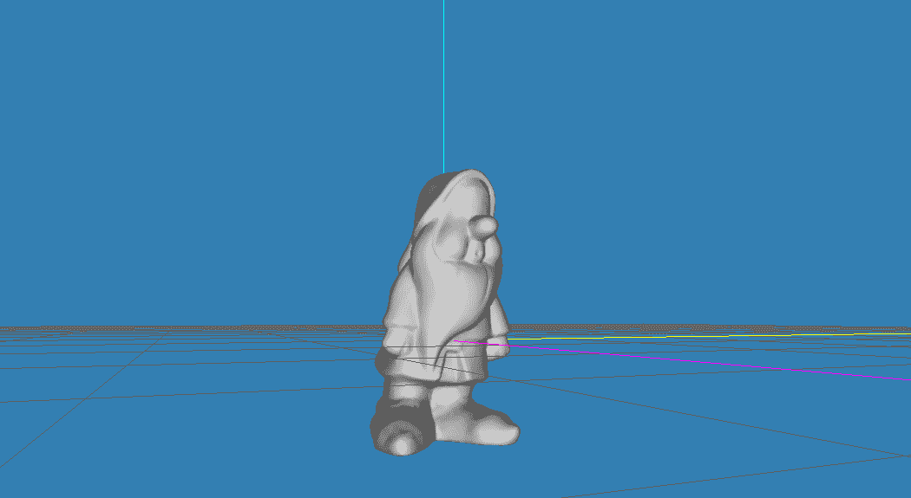
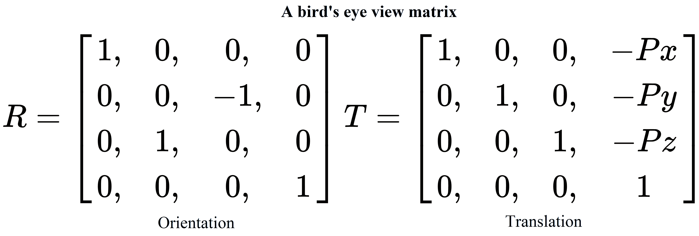
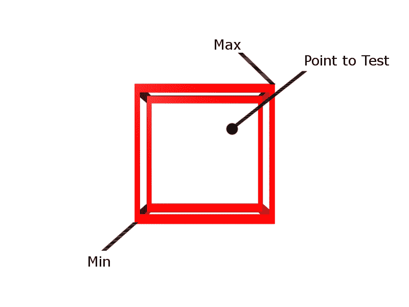

# 构建游戏系统

在我们的旅程中，我们已经到了能够开始将我们将用来驱动我们的游戏和工具的各种系统拼凑在一起的地步。这些系统是引擎的一部分，为与我们现在能够导入游戏的所有惊人资产的交互提供动力:

*   理解状态
*   设计摄像系统
*   研究物理

# 理解状态

我们以许多不同的方式使用状态。它们可以用于控制游戏流程，处理角色的不同行为和反应方式，甚至用于简单的菜单导航。不用说，状态是强大且可管理的代码库的重要要求。

有许多不同类型的状态机；我们将在本节中重点介绍的是**有限状态机(FSM)** 模式。你们中善于观察的读者会注意到，我们已经在已经实现的屏幕系统的功能中看到了一个有限状态机模式。事实上，我们将在这里创建的与为该系统创建的非常相似，只是有一些关键的区别，这将使它成为一个更通用和灵活的状态机。

有几种方法可以在游戏中实现简单的状态机。一种方法是简单地使用一个开关盒来控制状态和状态类型的`enum`结构。这方面的一个例子如下:

```cpp
enum PlayerState 
{ 
    Idle, 
      Walking 
} 
... 
PlayerState currentState = PlayerState::Idle; //A holder variable for the state currently in 
... 
// A simple function to change states 
void ChangeState(PlayState nextState) 
{ 
    currentState = nextState; 
} 
void Update(float deltaTime) 
{ 
    ... 
    switch(currentState) 
{ 
    case PlayerState::Idle: 
        ... //Do idle stuff 
        //Change to next state 
ChangeState(PlayerState::Walking); 
break; 
        case PlayerState::Walking: 
            ... //Do walking stuff 
            //Change to next state 
            ChangeState(PlayerState::Idle); 
break; 
    } 
    ... 
} 
```

像这样使用开关/外壳在很多情况下都是有效的，但是它也有一些很大的缺点。如果我们决定再增加几个州呢？如果我们决定增加分支和更多的`if`条件句呢？

我们最开始使用的简单开关/外壳突然变得非常大，无疑也很笨重。每次我们想要做一个改变或者增加一些功能，我们就增加了复杂性，并且引入了更多的 bug。我们可以通过采用稍微不同的方法并使用类来表示我们的状态，来帮助缓解其中的一些问题并提供更多的灵活性。通过使用继承和多态性，我们可以构建一个结构，允许我们将状态链接在一起，并提供在许多情况下重用它们的灵活性。

让我们从将来继承的基类`IState`开始，在演示示例中演示如何实现这一点:

```cpp
... 
namespace BookEngine 
{ 
    class IState { 
    public: 
        IState() {} 
        virtual ~IState(){} 
        // Called when a state enters and exits  
        virtual void OnEntry() = 0; 
        virtual void OnExit() = 0; 

        // Called in the main game loop 
        virtual void Update(float deltaTime) = 0; 
    }; 
} 
```

如您所见，这只是一个非常简单的类，它有一个构造函数、一个虚拟析构函数和三个完全虚拟的函数，每个继承的状态都必须重写这些函数。`OnEntry`，在首次进入状态时将被调用，每次状态改变只执行一次。`OnExit`和`OnEntry`一样，每次状态改变只执行一次，当状态即将退出时调用。最后一个功能是`Update`功能；这将在每个游戏循环中调用一次，并将包含状态的大部分逻辑。虽然这看起来很简单，但它为我们构建更复杂的状态提供了一个很好的起点。现在，让我们在示例中实现这个基本的`IState`类，看看如何使用它来满足状态机的一个常见需求:创建游戏状态。

首先，我们将创建一个名为`GameState`的新类，它将从`IState`继承。这将是我们游戏需要的所有状态的新基类。`GameState.h`文件包括以下内容:

```cpp
#pragma once 
#include <BookEngine\IState.h> 
class GameState : BookEngine::IState 
{ 
public: 
    GameState(); 
    ~GameState(); 
    //Our overrides 
    virtual void OnEntry() = 0; 
    virtual void OnExit() = 0; 
    virtual void Update(float deltaTime) = 0; 
    //Added specialty function 
    virtual void Draw() = 0; 
}; 
```

`GameState`类非常像它继承的`IState`类，除了一个关键的区别。在这个类中，我们添加了一个新的虚拟方法`Draw()`，所有类现在将从`GameState`继承的虚拟方法将被实现。每次我们使用`IState`并创建一个新的专门化基类、玩家状态、菜单状态等等，我们都可以添加这些新的功能来根据状态机的要求对其进行定制。这就是我们如何使用继承和多态来创建更复杂的状态和状态机。

继续我们的例子，现在让我们创建一个新的`GameState`。我们从创建一个名为`GameWaiting`的继承自`GameState`的新类开始。为了更容易理解，我将所有新的`GameState`继承类组合成一组文件`GameStates.h`和`GameStates.cpp`。`GamStates.h`文件如下所示:

```cpp
#pragma once 
#include "GameState.h" 

class GameWaiting: GameState 
{ 
    virtual void OnEntry() override; 
    virtual void OnExit() override; 
    virtual void Update(float deltaTime) override; 
    virtual void Draw() override; 
}; 

class GameRunning: GameState 
{ 
    virtual void OnEntry() override; 
    virtual void OnExit() override; 
    virtual void Update(float deltaTime) override; 
    virtual void Draw() override; 
}; 

class GameOver : GameState 
{ 
    virtual void OnEntry() override; 
    virtual void OnExit() override; 
    virtual void Update(float deltaTime) override; 
    virtual void Draw() override; 
}; 
```

这里没有什么新鲜事；我们只是为我们的每个`GameState`类声明函数。现在，在我们的`GameStates.cpp`文件中，我们可以实现前面代码中描述的每个单独状态的功能:

```cpp
#include "GameStates.h" 
    void GameWaiting::OnEntry() 
{ 
...  
//Called when entering the GameWaiting state's OnEntry function 
... 
} 

void GameWaiting::OnExit() 
{ 
...  
//Called when entering the GameWaiting state's OnEntry function 
... 
} 

void GameWaiting::Update(float deltaTime) 
{ 
...  
//Called when entering the GameWaiting state's OnEntry function 
... 

} 

void GameWaiting::Draw() 
{ 
...  
//Called when entering the GameWaiting state's OnEntry function 
... 

} 
...  
//Other GameState implementations  
... 
```

为了页面空间，我只展示了`GameWaiting`的实现，但是其他状态也是如此。每一个都有自己独特的实现这些功能，这允许您控制代码流，并根据需要实现更多的状态，而不会创建难以遵循的代码路径迷宫。

现在我们已经定义了我们的状态，我们可以在我们的游戏中实现它们。当然，我们可以用许多不同的方式来做这件事。我们可以遵循与我们的屏幕系统相同的模式，实现一个`GameState`列表类，其定义如下:

```cpp
    class GameState; 

    class GameStateList { 
    public: 
        GameStateList (IGame* game); 
        ~ GameStateList (); 

        GameState* GoToNext(); 
        GameState * GoToPrevious(); 

        void SetCurrentState(int nextState); 
        void AddState(GameState * newState); 

        void Destroy(); 

        GameState* GetCurrent(); 

    protected: 
        IGame* m_game = nullptr; 
        std::vector< GameState*> m_states; 
        int m_currentStateIndex = -1; 
    }; 
} 
```

或者我们可以简单地使用我们用一个简单的`enum`和一个开关盒创建的`GameState`类。状态模式的使用允许这种灵活性。在示例案例中，我选择遵循与屏幕系统相同的设计；您可以在源代码库中看到`GameStateExample`项目的完整实现。值得仔细阅读源代码，因为我们将在整本书中继续使用这些状态设计。尝试修改示例；添加一个新的状态，在屏幕上创建不同于其他状态的打印输出。您甚至可以尝试在状态中嵌套状态，以创建更强大的代码分支能力。

# 使用相机

在这一点上，我们已经讨论了大量的系统结构，现在已经能够继续设计与我们的游戏和 3D 环境交互的方式。这给我们带来了一个重要的话题:虚拟摄像机系统的设计。相机为我们提供了三维世界的视觉表现。这是我们沉浸其中的方式，它为我们选择的互动提供了反馈。在这一节中，我们将讨论计算机图形学中虚拟摄像机的概念。

在我们开始为我们的相机编写代码之前，重要的是要充分了解它是如何工作的。让我们从能够在 3D 世界中导航的想法开始。为了做到这一点，我们需要使用所谓的转换管道。变换管道可以被认为是相对于相机视点的位置和方向变换所有对象和点所采取的步骤。下面是一个简单的图表，详细说明了转换管道的流程:


从管道的第一步局部空间开始，当创建网格时，它有一个局部原点 0 x，0 y，0 z。这个局部原点通常位于对象的中心，或者在某些玩家角色的情况下，位于脚的中心。然后，组成该网格的所有点都基于该局部原点。当谈到一个没有被变换的网格时，我们称之为在局部空间中:



上图描绘了模型编辑器中的 gnome 网格。这就是我们认为的局部空间。

下一步，我们想把一个网格带入我们的环境，世界空间。为了做到这一点，我们必须将我们的网格点乘以所谓的模型矩阵。然后，这将把网格放置在世界空间中，这将所有网格点设置为相对于单个世界原点。世界空间最容易被认为是构成游戏环境的所有物体的布局描述。一旦网格被放置在世界空间中，我们就可以开始做一些事情，比如比较距离和角度。这一步的一个很好的例子是在世界/关卡编辑器中放置游戏对象的时候；这是相对于其他对象和单个世界原点(0，0，0)创建模型网格的描述。我们将在下一章更详细地讨论编辑器。

接下来，为了在这个世界空间中导航，我们必须重新排列这些点，使它们相对于相机的位置和方向。为了实现这一点，我们执行一些简单的操作。首先是将物体平移到原点。首先，我们将摄像机从其当前的世界坐标移开。

在下面的示例图中， *x* 轴上有 **20** ，在 *y* 轴上有 **2** ，在 *z* 轴上有 **-15** ，到世界原点或 **0，0，0** 。然后，我们可以通过减去摄像机的位置来映射对象，该位置是用于平移摄像机对象的值，在这种情况下将是 **-20** 、 **-2** 、 **15** 。因此，如果我们的游戏对象在 *x* 轴上的 **10.5** 处开始，在 *y* 轴上的 **1** 处开始，在 *z* 轴上的 **-20** 处开始，新平移的坐标将是 **-9.5** ， **-1** ， **-5** 。最后一个操作是旋转相机，使其面向想要的方向；在我们当前的情况下，这将指向向下- *z* 轴。对于以下示例，这意味着将对象点旋转 **-90** 度，使示例游戏对象的新位置 **5** 、 **-1** 、 **-9.5** 。这些操作组合成了所谓的视图矩阵:


在我们进一步讨论之前，我想简单介绍一下处理矩阵时的一些重要细节，特别是处理矩阵乘法和运算顺序。使用 OpenGL 时，所有矩阵都是以列为主的布局定义的。相反的是行为主的布局，在其他图形库中也可以找到，比如微软的 DirectX。以下是列主视图矩阵的布局，其中 U 是指向上方的单位向量，F 是我们指向前方的向量，R 是右侧向量，P 是摄像机的位置:


当构建具有平移和旋转组合的矩阵时，例如前面的视图矩阵，通常不能将旋转和平移值粘贴到单个矩阵中。为了创建一个合适的视图矩阵，我们需要使用矩阵乘法将两个或多个矩阵组合成一个最终矩阵。记住我们使用的是列主符号，因此操作的顺序是从右到左。这很重要，因为使用方向(R)和平移(T)矩阵，如果我们说 V = T×R，这将产生不希望的效果，因为这将首先围绕世界原点旋转点，然后移动它们以与作为原点的相机位置对齐。我们想要的是 V = R×T，其中点将首先与相机对齐作为原点，然后应用旋转。在以行为主的布局中，当然情况正好相反:



好消息是，我们不一定需要手动处理视图矩阵的创建。OpenGL 的旧版本和大多数现代数学库，包括 GLM，都有一个`lookAt()`函数的实现。大多数以摄像机位置、目标或观察位置以及向上方向作为参数，并返回完全创建的视图矩阵。我们将很快了解如何使用`lookAt()`函数的 GLM 实现，但是如果您想查看刚才描述的想法的完整代码实现，请查看项目源代码库中包含的 GLM 源代码。

继续通过变换管道，下一步是从眼睛空间转换到同质剪辑空间。这个阶段将构建一个投影矩阵。投影矩阵负责一些事情。

首先是定义近剪裁平面和远剪裁平面。这是沿定义的前向轴的可见范围(通常为 *z* )。任何落在近距离前面的东西和任何落在远距离后面的东西都被认为在射程之外。在此范围之外的任何几何对象都将在后续步骤中从管道中被*修剪掉*(移除)。

二是定义**视场** ( **FOV** )。不管名字是什么，视野不是一个领域，而是一个角度。对于 FOV，我们实际上只规定了垂直范围；大多数现代游戏都使用 66 或 67 度角。一旦我们提供了长宽比(宽高比)，水平范围将由矩阵为我们计算。为了演示，长宽比为 4:3 的显示器上的 67 度垂直角度的 FOV 为 89.33 度( *67 * 4/3 = 89.33* )。

这两个步骤结合起来形成一个顶部被切掉的金字塔形状的体积。这个创建的体积被称为视平截头体。落在这个平截头体之外的任何几何图形都被认为是不可见的。

下图说明了视图平截头体的外观:


您可能会注意到，平截头体的末端比前面有更多的可见空间。为了在 2D 屏幕上正确显示，我们需要告诉硬件如何计算视角。这是管道中的下一步。平截头体较大的远端将被推到一起，形成一个盒子形状。在这个宽端可见的物体集合也将被挤压在一起；这将为我们提供一个透视图。要理解这一点，想象一下沿着一段笔直的铁轨看的现象。随着轨道继续向远处延伸，它们看起来越来越小，靠得越来越近。

定义裁剪空间后，管道中的下一步是使用所谓的透视分割将点规范化为尺寸为(-1 到 1，-1 到 1，-1 到 1)的箱形。这被称为**标准化设备空间**。通过*将*尺寸归一化为单位尺寸，我们允许将点相乘以放大或缩小到任何视口尺寸。

变换管道中的最后一个主要步骤是创建将要显示的 3D 的 2D 表示。为此，我们将标准化的设备空间展平，将更远的对象绘制在更靠近相机的对象后面(绘制深度)。尺寸从 *X* 和 *Y* 归一化值缩放为视口的实际像素值。经过这一步，我们有了一个 2D 空间，称为**视口空间**。

这就完成了转换管道阶段。有了这个理论，我们现在可以转向实现并编写一些代码。我们将从创建一个基本的第一人称 3D 相机开始，这意味着我们是通过玩家角色的眼睛来观察的。先说相机的头文件`Camera3D.h`，可以在源代码库中的`Chapter05`项目文件夹中找到:

```cpp
... 
#include <glm/glm.hpp> 
#include <glm/gtc/matrix_transform.hpp> 
..., 
```

我们从必要的包括开始。正如我刚才提到的，GLM 包括对使用矩阵的支持，因此我们包括`glm.hpp`和`matrix_transform.hpp`来访问 GLM 的`lookAt()`功能:

```cpp
... 
   public: 
      Camera3D(); 
      ~Camera3D(); 
      void Init(glm::vec3 cameraPosition = glm::vec3(4,10,10), 
              float horizontalAngle = -2.0f,  
              float verticalAngle = 0.0f,  
              float initialFoV = 45.0f); 
      void Update(); 
```

接下来，我们为 Camera3D 类提供了公共可访问的功能。前两个只是标准的构造函数和析构函数。然后我们有`Init()`功能。我们用为参数提供的一些默认值来声明这个函数；这样，如果没有传入任何值，我们在第一次更新调用中仍然有值来计算矩阵。这就把我们带到了下一个声明的函数，`Update()`函数。这是游戏引擎将调用每个循环来保持相机更新的功能:

```cpp
glm::mat4 GetView() { return m_view; };
glm::mat4 GetProjection() { return m_projection; };
glm::vec3 GetForward() { return m_forward; };
glm::vec3 GetRight() { return m_right; };
glm::vec3 GetUp() { return m_up; };
```

在`Update()`函数之后，有一组五个 getter 函数来返回视图和投影矩阵，以及相机的前向、向上和向右向量。为了保持实现的整洁，我们可以简单地在头文件中声明并实现这些 *getter* 函数:

```cpp
void SetHorizontalAngle(float angle) { m_horizontalAngle = angle; };
void SetVerticalAngle(float angle) { m_verticalAngle = angle; };
```

在 getter 函数集之后，我们有两个 setter 函数。第一个将设置水平角度，第二个将设置垂直角度。这在屏幕尺寸或纵横比发生变化时非常有用:

```cpp
void MoveCamera(glm::vec3 movementVector) { m_position +=   movementVector; };
```

Camera3D 类中最后一个公共函数是`MoveCamera()`函数。这个简单的函数接受一个向量 3，然后将该向量累加到`m_position`变量中，该变量是当前摄像机位置:

```cpp
...
  private:
    glm::mat4 m_projection;
    glm::mat4 m_view; // Camera matrix
```

对于类的私有声明，我们从两个`glm::mat4`变量开始。`glm::mat4`是 4x4 矩阵的数据类型。我们为视图或相机矩阵创建一个，为投影矩阵创建一个:

```cpp
glm::vec3 m_position;
float m_horizontalAngle;
float m_verticalAngle;
float m_initialFoV;
```

接下来，我们有一个向量 3 变量来保存相机的位置，后面是三个浮点值——一个用于水平角度，一个用于垂直角度，还有一个变量来保存视野:

```cpp
glm::vec3 m_right;
glm::vec3 m_up;
glm::vec3 m_forward; 
```

然后，我们还有三个矢量 3 变量类型，用于保存相机对象的右、上和前向值。

现在我们已经有了三维相机类的声明，下一步是实现头文件中尚未实现的任何功能。我们只需要提供两个功能，`Init()`和`Update()`功能。让我们从`Camera3D.cpp`文件中的`Init()`功能开始:

```cpp
void Camera3D::Init(glm::vec3 cameraPosition, 
     float horizontalAngle, 
     float verticalAngle, 
     float initialFoV)
   {
     m_position = cameraPosition;
     m_horizontalAngle = horizontalAngle;
     m_verticalAngle = verticalAngle;
     m_initialFoV = initialFoV;

     Update();
    }
    ...

```

我们的`Init()`功能很简单；我们在函数中所做的就是接受提供的值，并将它们设置为我们声明的相应变量。一旦我们设置了这些值，我们只需调用`Update()`函数来处理新创建的摄像机对象的计算:

```cpp
...
   void Camera3D::Update()
   {
      m_forward = glm::vec3(
          glm::cos(m_verticalAngle) * glm::sin(m_horizontalAngle),
          glm::sin(m_verticalAngle),
          glm::cos(m_verticalAngle) * glm::cos(m_horizontalAngle)
        );
```

`Update()`功能是完成所有课程繁重工作的地方。从计算我们相机的新前进开始。这是通过利用 GLM 余弦和正弦函数的简单公式来完成的。正在发生的是，我们正在从球面坐标转换到笛卡尔坐标，这样我们就可以在创建视图矩阵时使用该值。

```cpp
  m_right = glm::vec3(
        glm::sin(m_horizontalAngle - 3.14f / 2.0f),
        0,
        glm::cos(m_horizontalAngle - 3.14f / 2.0f)
     );  
```

在我们计算新的前向之后，我们再一次使用利用 GLM 正弦和余弦函数的简单公式，为我们的相机计算新的右向量:

```cpp
 m_up = glm::cross(m_right, m_forward);
```

现在我们已经计算了向前和向上的向量，我们可以使用 GLM 的叉积函数来为我们的相机计算新的向上向量。每次相机改变位置或旋转时，以及在创建相机的视图矩阵之前，这三个步骤都要进行，这一点很重要:

```cpp
  float FoV = m_initialFoV;
```

接下来，我们指定 FOV。目前，我只是将其设置回初始化相机对象时指定的初始 FOV。如果相机放大或缩小，这将是重新计算 FOV 的地方(提示:鼠标滚动在这里可能有用):

```cpp
m_projection = glm::perspective(glm::radians(FoV), 4.0f / 3.0f, 0.1f, 100.0f);
```

一旦我们指定了视野，我们就可以计算相机的投影矩阵。对我们来说幸运的是，GLM 有一个非常方便的函数叫做`glm::perspective()`，它以弧度为单位获取视野、长宽比、近裁剪距离和远裁剪距离，然后它会为我们返回一个创建的投影矩阵。由于这是一个例子，我直接指定了 4:3 的纵横比(4.0f/3.0f)和 0.1 单位到 100 单位的裁剪空间。在生产中，您最好将这些值移动到可以在运行时更改的变量中:

```cpp
 m_view = glm::lookAt(
            m_position,           
            m_position + m_forward, 
            m_up
         );
      }
```

最后，我们在`Update()`函数中做的最后一件事是创建视图矩阵。正如我之前提到的，我们很幸运，GLM 库提供了一个`lookAt()`函数来抽象我们在本节前面讨论的所有步骤。这个`lookAt()`函数取三个参数。首先是摄像头的位置。第二个是摄像机指向的向量值，或者说*看着*，我们通过简单的添加摄像机的当前位置来提供这个向量值，并且它是向前计算的。最后一个参数是摄像机的当前向上向量，我们之前也计算过。一旦完成，这个函数将返回新更新的视图矩阵，用于我们的图形管道。

简而言之，这是一个简单的 3D 相机类。继续运行 CameraDemo 项目，查看系统的运行情况。你可以用 WASD 键移动相机，用鼠标改变视角。接下来，我们将进入另一个重要的游戏引擎系统，物理！

# 研究物理

如今，一个游戏不实现至少一些基本的物理形式是非常罕见的。游戏物理学的主题相当庞大和复杂，在你认为它已经被很好地涵盖之前，很容易就能填满几卷。正因为如此，整个团队都致力于创建*物理引擎*，构建生产级系统可能需要多年的开发。既然是这样，我们就不试图在这里涵盖所有方面，而是采取更高级别的方法。我们将讨论物理系统中一些更常用的方面，特别是基本的碰撞检测。对于更高级的需求，例如对重力、摩擦和高级碰撞检测的支持，我们将介绍第三方物理库的实现。在这一节的最后，我们的演示引擎将有先进的物理支持。

# AABB 点

首先，让我们看一下您可以在 3D 中执行的更简单的碰撞检查之一，找出一个点是在**轴对齐边界框** ( **AABB** )的内部还是外部。AABBs 非常容易创建。你基本上可以认为这些是不可旋转的立方体或盒子。下图描绘了 AABB 和点碰撞:



要创建边界框，可以指定矢量格式的最大点和最小点，或者指定一个中心点，然后指定高度、宽度和深度。对于本例，我们将使用最小和最大点数方法创建我们的 AABB:

```cpp
struct BoundingBox
{
 glm::vec3 m_vecMax;
 glm::vec3 m_vecMin;
};  
```

前面的代码是一个简单的 AABB 结构示例。

现在我们有了一个 AABB，我们可以开发一种方法来检查是否有一个点落入了 AABB。这个检查很简单；我们只需要检查它的所有值，x，y 和 z，是否都大于 AABB 的最小值，小于 AABB 的最大值。代码中的这个检查看起来像下面这样，形式最简单:

```cpp
bool PointInAABB(const BoundingBox& box, const glm::vec3 & vecPoint)
 {
   if(vecPoint.x > tBox.m_vecMin.x && vecPoint.x < tBox.m_vecMax.x &&
      vecPoint.y > tBox.m_vecMin.y && vecPoint.y < tBox.m_vecMax.y &&
      vecPoint.z > tBox.m_vecMin.z && vecPoint.z < tBox.m_vecMax.z)
     {
         return true;
     }
    return false;
  }

```

# AABB 到 AABB

现在我们已经看到了如何测试一个点是否在某个 AABB 内，下一个非常有用的碰撞检查是 AABB 到 AABB 检查，这是一个快速测试，可以找出两个 AABB 是否发生碰撞。下图描述了这种碰撞检查:


两个 AABBs 之间的冲突检查非常简单快速。对于大多数需要某种形式的碰撞检测的对象来说，这是一个非常常见的选择。

AABBs 不好的地方是不能轮换。一旦它们被旋转，它们就不再是 AABBs，因为它们不再与 *x* 、 *y* 和 *z* 轴对齐。对于旋转的物体，更好的选择是使用球体、胶囊，甚至是**方向的边界框** ( **OBBs** )。

要检查两个 AABB 是否碰撞，我们只需要检查第一个 AABB 的最大点是否大于第二个的最小点，以及第一个的最小点是否小于第二个的最大点。下面是这个检查在代码中的样子，最简单的形式:

```cpp
bool AABBtoAABB(const BoundingBox& box1, const BoundingBox& box2) 
{ 
 if (box1.m_vecMax.x > tBox2.m_vecMin.x &&  
    box1.m_vecMin.x < tBox2.m_vecMax.x && 
    box1.m_vecMax.y > tBox2.m_vecMin.y && 
    box1.m_vecMin.y < tBox2.m_vecMax.y && 
    box1.m_vecMax.z > tBox2.m_vecMin.z && 
    box1.m_vecMin.z < tBox2.m_vecMax.z)  
{  
   return true; 
} 
return false; 
} 
```

当然，盒子的顺序，哪个是第一个，哪个是第二个，并不重要。

由于本次检查包含大量`&&`比较，如果第一次检查为假，则不会继续检查其余部分；这是允许非常快速测试的原因。

# 球体对球体

我想在这里涉及的最后一个简单的碰撞检查是测试两个球体是否相互碰撞。测试球体之间的碰撞非常简单，易于执行。球体相对于 AABBs 之类的东西的一个优点是，如果物体旋转，球体将保持不变，这并不重要。下图描述了两个球体之间的碰撞检查:


为了执行检查，我们只需要计算球体中心之间的距离，并将其与它们的半径之和进行比较。如果这个距离小于它们的半径之和，那么球体是重叠的。如果是一样的，那么球体只是接触而已。下面是这个碰撞测试在代码中的样子，最简单的形式:

```cpp
... 
struct BoundingSphere 
{ 
glm::vec3    m_vecCenter; 
float          m_radius; 
}; 
... 
bool SphereToSphere(const BoundingSphere & Sphere1, const BoundingSphere & Sphere2) 
{ 

glm::vec3 distance(Sphere2.m_vecCenter - Sphere1.m_vecCenter); 
float distanceSqaured(glm::dot( & distance, & distance) ); 

```

为了得到球体中心之间的距离，我们需要在它们的中心点之间创建一个向量:

```cpp
float radiiSumSquared( Sphere1.m_radius + Sphere2.m_radius ); 
radiiSumSquared *= radiiSumSquared; 
```

然后，我们可以用半径之和来计算向量的长度:

There is a more efficient way to do this. Since the dot product of a vector with itself equals the squared length of that vector, we could just calculate the squared length of the vector against the square of the sum of the radii. If we do it this way, we don't need to calculate the length of the vector, which is an expensive operation in itself.

```cpp
if( distanceSqaured <= radiiSumSquared ) 
{ 
    return true; 
} 
return false; 
} 
... 
```

最后，我们可以执行碰撞检查。如果距离的平方小于或等于平方和，那么球体已经碰撞，否则，物体没有碰撞，我们返回 false。

有了这些简单的检查，就可以处理最基本的碰撞检测。事实上，正如我们将在下一节中看到的，大多数高级检查由许多较小的检查组成。然而，总有一天你会发现自己需要更先进或优化的方法来处理物理；这时您可以求助于第三方库来提供这种支持。在下一节中，我们将研究其中一个第三方库的实现。

# 实现子弹物理库。

Bullet 是一个物理引擎，它模拟碰撞检测以及柔体和刚体动力学。它已被用于许多已发布的视频游戏以及电影中的视觉效果。子弹物理库是受 zlib 许可证条款约束的免费开源软件。

Bullet 必须提供的一些功能包括:

*   具有离散和连续碰撞检测的刚体和软体模拟
*   碰撞形状:球体、长方体、圆柱体、圆锥体、使用 GJK 的凸包、非凸和三角形网格
*   柔软的身体支撑:布料、绳索和可变形物体

一组丰富的刚体和柔体约束，带有约束限制和马达

你可以在[http://bulletphysics.org](http://bulletphysics.org)找到源代码链接和更多信息。

让我们来看看如何将 Bullet 合并到您自己的游戏项目中。我不打算花时间讨论如何将库链接到我们的演示项目，因为我们已经讨论过几次了。如果你确实需要复习，倒过来看几章。我们要做的是将子弹引擎合并到我们的演示引擎中，然后使用子弹引擎的计算来实时定位我们的游戏对象。在这个例子中，我们将创建一个简单的地平面，然后一个球(球体)下落并与地面碰撞。我们将使用子弹的内置类型来支持这一点，包括重力给它一个现实的效果。

从地面`GameObject`开始，我们设置变量来保存一些我们需要的物理值。第一种是`btCollisionShape`型。这是一种项目符号类型，允许在为物理测试创建边界对象时使用简单形状的定义。第二种是`btDefaultMotionState`类型，它也是一种子弹数据类型，描述了物体在运动时的行为方式。我们需要的最后一个变量是`btRigidBody`类型，这是一个子弹数据类型，将保存我们的物理引擎将关注的对象的所有物理属性:

```cpp
class GroundObject : BookEngine::GameObject 
{ 
   ... 

   btCollisionShape* groundShape = nullptr; 
   btDefaultMotionState* groundMotionState = nullptr; 
   btRigidBody* groundRigidBody = nullptr; 
```

一旦我们定义了这些变量，我们就可以在其`Init()`函数中构建地面物体的物理表示:

```cpp
void GroundObject::Init(const glm::vec3& pos, const glm::vec3& scale) 
{ 
   ... 
   groundShape = new btStaticPlaneShape(btVector3(0, 1, 0), 1); 
   groundMotionState = 
      new btDefaultMotionState(btTransform(btQuaternion(0, 0, 0, 1), btVector3(m_position.x, m_position.y, m_position.z))); 
```

我们首先将`groundShape`变量设置为`btStaticPlanShape`。这是一个 Bullet 对象，它指定了一个简单的平面对象，非常适合我们的需求，也是一个简单的地面对象。接下来，我们设置`groundMotionState`。我们通过使用`btDefaultMotionState`子弹物体来实现。`btDefaultMotionState`是用于指定物体运动方式的类型。创建新的`btDefaultMotionState`时，我们需要传入一些关于对象变换的信息，也就是对象的旋转和位置。为此，我们传递一个`btTransform`对象，它有自己的四元数格式的旋转参数(`btQuaternion(0, 0, 0, 1)`)和矢量 3 格式的位置参数(`btVector3(m_position.x, m_position.y, m_position.z)`):

```cpp
btRigidBody::btRigidBodyConstructionInfo 
 groundRigidBodyCI(0, groundMotionState, groundShape, btVector3(0, 0,  0)); 
 groundRigidBody = new btRigidBody(groundRigidBodyCI); 
```

现在，通过设置`groundShape`和`groundMotionState`，我们可以继续创建和设置刚体信息。首先，我们为名为`groundRigidBodyCI`的构造信息定义一个持有人`btRigidBodyConstuctionInfo`变量。该对象接受几个参数值、指定质量的缩放值、对象的运动状态、碰撞形状以及指定局部惯性值的矢量 3。惯性是任何物理物体对其运动状态的任何变化的阻力。基本上是物体保持匀速直线运动的趋势。

由于我们的地面对象是静态的，不需要基于物理输入的任何改变，我们可以放弃`Update()`功能，转到我们将用来测试系统的球对象。

进入`BallObject.h`文件，我们定义一些我们需要的变量，就像我们为我们的地面物体所做的一样。我们创建一个运动状态，一个质量、碰撞形状的标量(整数)值，最后是一个刚体:

```cpp
btDefaultMotionState* fallMotionState;
btScalar mass = 1;
btCollisionShape* fallShape;
btRigidBody* fallRigidBody;
...  
```

现在，进入`BallObject.cpp`文件，我们给刚刚定义的变量赋值:

```cpp
void BallObject::Init(const glm::vec3& pos, const glm::vec3& scale)
 {
    ...

    fallShape = new btSphereShape(10);
    btVector3 fallInertia(0.0f, 0.0f, 0.0f);  
```

首先，我们设置碰撞形状。在这种情况下，我们将使用类型`btSphereShape`。这是球体的默认形状，并接受一个参数来设置球体的半径。接下来，我们为球体的惯性创建一个矢量 3 保持器。我们将它设置为全零，因为我们希望这个球自由下落，没有阻力，基于物体的质量和重力值，我们将很快设置:

```cpp
fallMotionState =
       new btDefaultMotionState(btTransform(btQuaternion(0, 0, 0, 1),     
       btVector3(m_position.x, m_position.y, m_position.z)));
```

接下来，我们设置球的运动状态，就像我们为地面物体所做的那样。我们将旋转设置为 0，并将位置设置为球对象的当前位置:

```cpp
 fallShape->calculateLocalInertia(mass, fallInertia);
    btRigidBody::btRigidBodyConstructionInfo fallRigidBodyCI(mass,  fallMotionState, fallShape, fallInertia);
    fallRigidBody = new btRigidBody(fallRigidBodyCI);
     }

```

然后，我们使用方便的`calculateLocalInertia()`函数计算局部惯性值，传递质量和`fallInertia`值。这将为我们的球对象设置下降向量，用于物理引擎的第一个刻度。最后，我们以设置刚体对象结束，就像我们之前对地面对象所做的那样。

对于球对象，我们确实期望物理引擎输出影响球对象。正因为如此，我们需要在球对象的`Update()`功能中做一些调整:

```cpp
void BallObject::Update(float deltaTime)
 {
    btTransform trans;
    fallRigidBody->getMotionState()->getWorldTransform(trans);
    m_position.x = trans.getOrigin().getX();
    m_position.y = trans.getOrigin().getY();
    m_position.z = trans.getOrigin().getZ();
  }
```

球对象更新循环的第一步是从刚体获得物理对象的变换。一旦我们有了这个变换对象，我们就可以设置球对象的网格(可见对象)来确定物理变换对象的位置。对象本身就是这样。球和地面物体现在容纳了所有需要的物理信息。我们现在可以在我们的游戏循环中实现物理引擎循环，让球滚动起来，没有双关语！

为了将物理引擎实现到我们现有游戏引擎的循环中，我们需要首先设置几个值。跳到我们的`Gameplayscreen.h,`中，我们定义变量来保存这些值:

```cpp
btBroadphaseInterface* broadphase = new btDbvtBroadphase();  
```

首先是`btBroadphaseInterface`类对象的定义，它提供了一个 Bullet 接口来检测 AABB 重叠对象对。在本例中，我们将其设置为`btDbvtBroadphase`，它使用两个动态 AABB 包围体层次结构/树来实现`btBroadphase`。当处理许多移动对象时，这往往是最佳的宽相位；其插入/添加和移除对象的速度通常快于`btAxisSweep3`和`bt32BitAxisSweep3`中的扫掠和修剪阶段:

```cpp
btDefaultCollisionConfiguration* collisionConfiguration = new     
       btDefaultCollisionConfiguration();
btCollisionDispatcher* dispatcher = new              
       btCollisionDispatcher(collisionConfiguration); btSequentialImpulseConstraintSolver* solver = new    
       btSequentialImpulseConstraintSolver;
```

接下来，我们定义了碰撞配置、碰撞调度器和顺序脉冲约束求解器。我们不会对其中的每一个进行太深入的讨论，但是主要的一点是冲突配置设置了一些 Bullet 内部值，例如冲突检测堆栈分配器和池内存分配器。冲突调度程序是如何处理冲突的定义。它支持处理*凸凸*和*凸凹*碰撞对、碰撞时间、最近点和穿透深度的算法。最后，顺序脉冲约束求解器将决定如何解决对象之间的冲突，它定义了可以被认为是算法的东西。对于希望了解的人来说，这是投影高斯-塞德尔(迭代 LCP)方法的**单指令多数据** ( **SIMD** )实现:

```cpp
btDiscreteDynamicsWorld* dynamicsWorld = new       
     btDiscreteDynamicsWorld(dispatcher, broadphase, solver,    
     collisionConfiguration);
```

我们需要定义的最后一个变量是我们的动力学世界对象。A `btDiscreteDynamicsWorld`提供离散刚体模拟。这可以被认为是物理模拟发生的环境或*世界*。一旦我们定义了这个，我们就有了开始物理模拟的所有部分。

让我们跳到`GameplayScreen.cpp`文件，看看我们将用来初始化物理模拟的`OnEntry()`函数:

```cpp
void GameplayScreen::OnEntry() 
{ 
   ... 

   dynamicsWorld->setGravity(btVector3(0, -1, 0)); 
   dynamicsWorld->addRigidBody(m_ground.groundRigidBody); 
   dynamicsWorld->addRigidBody(m_ball.fallRigidBody); 
... 
} 
```

我们设置的第一件事是我们的重力矢量。在我们的简单示例中，我们将其设置为位于 *y* 轴上的`-1`。接下来，我们将两个创建的刚体添加到模拟环境中，一个用于地面，一个用于球。处理我们物理引擎的初始化；现在我们需要在每个引擎上更新它:

```cpp
void GameplayScreen::Update(float deltaTime) 
{ 
   CheckInput(deltaTime); 
   dynamicsWorld->stepSimulation(1 / 60.f, 10); 
   m_ball.Update(deltaTime); 
```

在`GameplayScreen::Update()`函数内部，我们首先检查输入，然后在物理引擎上调用更新，最后在游戏对象本身上调用更新。注意这个顺序很重要。我们想首先接受用户的输入，但我们想确保我们已经在对象之前更新了物理引擎。原因是物理计算应该对物体有一些影响，我们不想造成我们的绘图循环在物理循环之前的情况，因为这肯定会造成一些不必要的影响。您还会注意到物理更新功能`stepSimulation`，它接受两个参数。第一个是模拟的时间。这通常是自您上次调用它以来的时间。在本例中，我们将其设置为 1/60 秒，即 60 FPS。第二个参数是每次调用 Bullet 时允许执行的最大步骤数。如果您传递一个非常大的值作为第一个参数，比如说，固定内部时间步长或游戏时钟大小的五倍，那么您必须增加`maxSubSteps`的数量来对此进行补偿；否则，您的模拟将失去时间，这将再次导致一些不需要的物理计算输出。

就这样！我们现在有一个物理引擎运行它的模拟，并影响我们在屏幕上绘制的世界中的物体。您可以通过在`Chapter05` GitHub 存储库中运行`PhysicsDemo`示例项目来看到这一点。输出如下所示:


# 摘要

在这一章中，我们涵盖了很多领域，并在开发专业级项目所需的核心游戏系统方面取得了长足的进步。我们现在有了自己的自定义游戏状态系统，可以被游戏引擎本身的许多其他组件采用。我们开发了自己的定制相机系统，同时建立了对相机如何在较低水平上工作的理解。最后，我们研究了如何通过在示例引擎中添加子弹物理引擎来将完整的第三方游戏系统添加到我们的项目中。