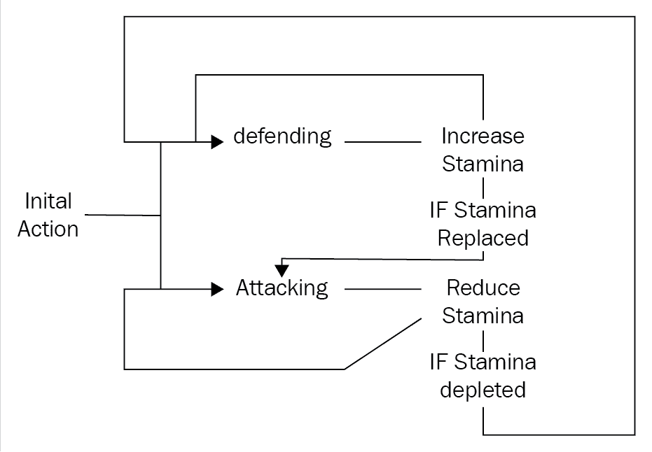
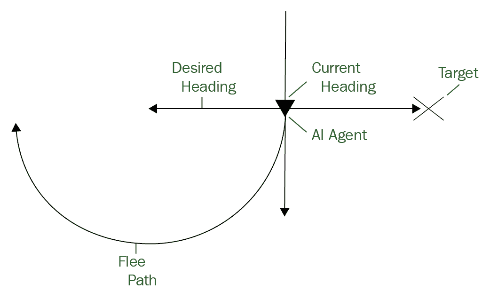
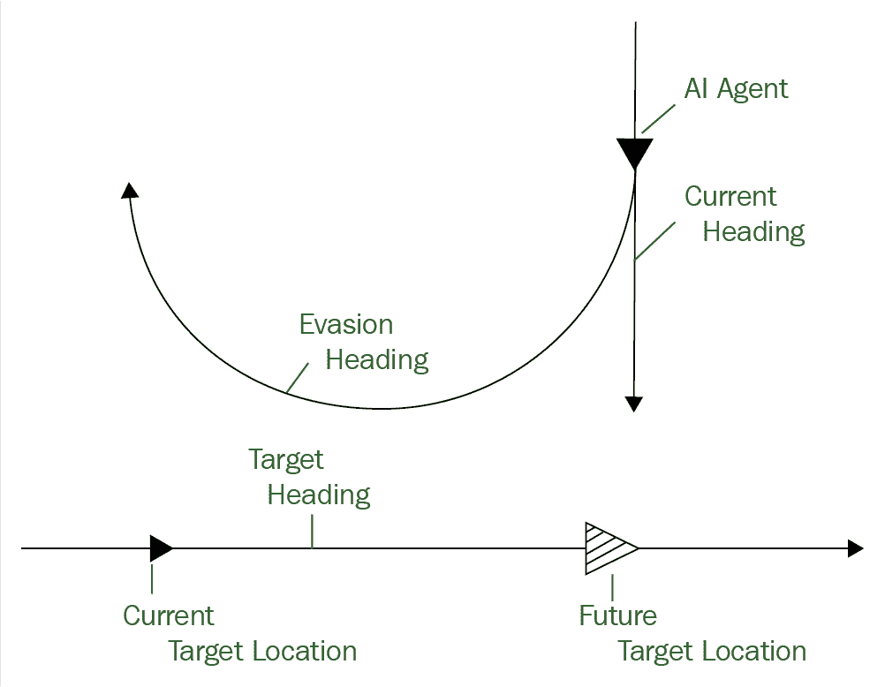
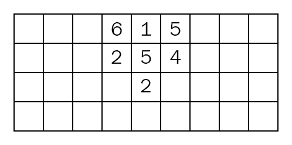
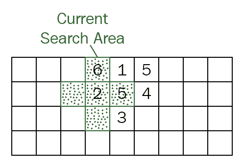

# 人工智能

大多数游戏都建立在竞争取胜的理念上。这种形式的竞争可以采取多种形式。从最早的电子游戏开始，玩家就发现自己在与机器竞争。包含思考、反应和挑战电脑对手，让游戏感觉充满活力并与玩家联系在一起。在这一章中，我们将学习如何将人工智能加入到我们的游戏中。

本章包括以下内容:

*   什么是游戏 AI？
*   做决定
*   运动和寻路技术

# 什么是游戏 AI？

经常被误解的是，定义什么是游戏人工智能，什么不是游戏人工智能是一项非常具有挑战性的工作。有了人工智能这样一个包罗万象的领域，就很容易填满许多关于这个主题的书籍。鉴于我们只有一章来讨论概念和实现，在这一节中，我们将尽最大努力为什么是游戏人工智能，什么不是游戏人工智能制定一个合理的定义。

# 定义游戏人工智能

如前所述，准确定义什么是游戏 AI 可能是一项艰巨的任务，但我将尽我所能来描述我觉得在电子视频游戏方面是一个简洁的解释。当一个设计师创造一个游戏世界时，他们通过塑造一个愿景和定义这个世界中一些共同的交互规则来做到这一点。通常，玩家会通过观察世界的元素来体验这个世界。互动，例如与世界上的 NPC、对手和环境的互动，以及通过叙事方面的互动，给玩家一种沉浸在游戏世界中的感觉。这些相互作用可以采取多种形式。在游戏中，玩家不断通过无生命的物体与世界进行一些互动，但真正引人注目的是与他人的互动。这让游戏感觉更身临其境，更有形，更有活力。

在游戏世界中感觉到有东西活着的感觉通常来自于对游戏世界和物体的观察，比如一个 NPC 在做决定。这是寻找游戏人工智能定义的一面伟大旗帜。从更广泛的意义上说，人工智能可以被认为是这种感知决策的应用。通常，这种对决策的感知以自主人工智能代理的形式出现，例如，常见的 NPC。这些决策可能包括从移动、对话框选择，甚至可能传达开发人员试图创建的体验的环境变化。这又是我定义游戏 AI 时的另一面旗帜。本质上，它是关于开发者试图创造的体验。为此，游戏 AI 更多的是一种获得预期效果的近似，不一定是完美的科学解释。

重要的是，当开发人员开始创建人工智能体验时，他们会考虑玩家的乐趣和沉浸感的关键方面。没有人想和完美的对手比赛。我们希望在交互的另一端感知智能，我们只是不希望它变得更聪明。这就是开发游戏人工智能和一般人工智能开发领域开始产生分歧的地方。我们将在下一节更深入地探讨这种转移，但现在，让我们看看人工智能在游戏开发中的一些用途。

# 会话

通过对话进行某种互动的游戏，通过角色与玩家的联系以及玩家如何投入到他们的故事中，给人一种沉浸在世界中的感觉。然而，这是一个挑战，正如我们在上一章中看到的那样，通常通过对话框树来实现。这种对话树方法虽然在某些情况下是可靠的，但很容易变得复杂。

完全脚本化对话的另一个问题是，随着对话的持续，玩家很快就会从这是一种智能交互的错觉中摆脱出来。它让互动感到被约束，反过来也让世界感到被约束。解决这个问题的一个方法是在对话中引入人工智能。你可以用决策算法来增强脚本化的交互，以在响应中给人一种更深层次的智能感。在这个概念的极端方面，您可以使用一种方法来解析玩家输入，并动态地自定义生成响应。这样的方法可能包括所谓的**自然语言处理** ( **自然语言处理**)。通过利用类似聊天机器人的东西，设计师和工程师可以创建由代理组成的世界，代理在响应用户交互时进行思考。虽然这听起来非常诱人，但自然语言处理领域仍被认为处于起步阶段。借助云计算支持的应用编程接口，如微软的认知服务应用编程接口，创建支持自然语言处理的基础设施的过程变得越来越容易。然而，语言模型的正确实现和训练可能相当耗时。

# 竞争对手

很多游戏都包含了敌人或者竞争对手的概念，供玩家互动。事实上，我会说这是大多数人认为的游戏人工智能的一个例子。这些对手如何与玩家、他们的环境和其他人工智能控制的对手互动，都是他们人工智能设计的一部分。通常，这种人工智能设计将包括决策的概念，例如行为树、反馈循环、状态和其他模式。它们还通常包括其他人工智能组件，如运动算法和寻路技术，这两者我们将在本章后面更深入地讨论。创造乐趣同时挑战对手并不是一件容易的事情。正如我之前所说的，没有人想玩一个他们觉得没有机会赢的游戏。拥有一个不断比玩家更快更聪明的 AI 不应该是设计对手 AI 的目标；相反，你应该专注于给用户一个有竞争力的人工智能，它可能会扩展以满足玩家不断增长的技能。正是在这种情况下，先进的技术，如使用机器学习来构建自适应人工智能，开始获得吸引力。尽管这些技术仍处于探索阶段，但量身定制人工智能对手的日子可能很快就会到来。

# 运动和寻路

可以说，与对手使用人工智能一样常见的是利用人工智能进行运动和寻路的概念。在运动中使用人工智能包括实现算法来处理游戏元素的自主运动。诸如转向、追击和躲避等想法都是你可以在 AI 算法中表达的概念。运动人工智能通常也用于处理简单的碰撞避免。寻路是在将游戏对象从一个位置移动到下一个位置时，使用 AI 来寻找最高效或最有效的路线的概念。像 **Dijkstra** 和 **A*** 这样的算法从 60 年代就已经出现了，并为寻路人工智能的发展提供了一个主要部分。我们将在本章后面更深入地探讨运动和寻路算法和技术。

# AI 不是什么游戏

人工智能作为一个研究领域，是非常庞大的，真的不仅仅包括游戏使用的东西。最近，开发人员领域围绕人工智能的讨论变得更加广泛，越来越多的开发人员在他们的项目中寻找利用人工智能技术的方法。出于这个原因，我认为在游戏开发领域之外，接触一些更常见的人工智能用例是很重要的。

除了游戏开发之外，人工智能最热门的领域之一是机器学习。**机器学习** ( **ML** )最恰当的描述可能是亚瑟·李·萨缪尔，他创造了机器学习这个术语:*一种计算机在没有被明确编程的情况下学习如何实现结果或预测的能力。*在数据分析领域，机器学习被用作设计复杂模型和算法的方法，以帮助预测给定问题的结果。这也被称为预测分析。这些分析模型允许研究人员和数据科学家创建可靠、可重复的计算和结果，并通过数据中的历史关系和趋势发现其他见解。如前一节所述，量身定制的人工智能从你的游戏风格中学习并适应的想法是一个非常吸引人的概念。然而，这可能是一个滑坡；如果 AI 变得太聪明，那么游戏的乐趣水平可以而且会迅速下降。游戏中如何使用 ML 的一个很好的例子是 Forza 赛车游戏系列。在这里，赛车人工智能化身在云计算支持的机器学习实现中进行处理，以根据您当前的能力水平定制您遇到的人工智能赛车的竞争水平。

人工智能在游戏开发领域之外的另一个日益增长的用途是在数据挖掘场景中的实现。虽然人工智能的这一领域仍处于早期阶段，但它在理解用户和客户数据方面的应用对许多业务部门极具吸引力。这个人工智能用例的边界及其与游戏开发概念的潜在重叠还有待定义。然而，用于理解玩家如何与游戏及其各种组件交互的数据挖掘的一些核心组件很容易被视为对游戏开发者有益。准确了解玩家如何与游戏图形用户界面等元素互动，将使开发人员能够为每个用户创造更好的体验。

我想谈的最后一个游戏开发之外的 AI 用例，可能是一般人想到 AI 时最认可的用途之一，那就是 AI 在认知加工研究中的用途。在人工智能的学术解释中，认知加工是为这些过程开发科学上可证明的模型的过程。这基本上可以概括为 AI 过程中人类智能的建模。虽然这种方法对于科学研究非常重要，但是目前游戏开发的用例仍然过于抽象，不被认为有用。话虽如此，如前所述，机器人和自然语言处理的使用正开始悄悄进入游戏开发。

通常，学术和研究 AI 的具体目标与游戏 AI 目标完全不同。这是因为固有的差异，例如每个中使用的实现和技术完全不同。更常见的是，游戏人工智能解决方案会倾向于一种简单的方法，允许简单的更改和调整，而研究方法更有可能选择最科学完整的实现。在接下来的部分中，我们将看一些更简单的游戏开发实现，并讨论它们的用例和理论。

# 做决定

更多时候，AI 的目标是给人智能的表象。智能感知的一个关键方面是人工智能代理正在做出决策的想法。对某些动作有选择，即使是照本宣科，给玩家一种思维世界的感觉，由思维实体组成。在下一节中，我们将介绍游戏 AI 中一些比较知名的决策技术。

# 人工智能状态机

如果你一直在一章一章地阅读这本书，你可能不止一次注意到状态模式的使用。这种模式是一种非常强大的模式，因此在我们的各种组件设计中普遍使用。在人工智能领域，状态模式再次成为一颗闪亮的星星。状态机的使用，特别是**有限状态机** ( **有限状态机**)允许代码执行流程的详细表示。它非常适合在游戏中实现人工智能，允许在没有复杂代码的情况下设计强大的交互。

我不打算在有限状态机实现的概念和理论上花费太多时间，因为我们已经令人作呕地讨论过了。相反，我们将看一个在人工智能脚本中实现它的例子。如果你确实需要复习一下模式，复习[第 5 章](05.html)、*构建游戏系统*，关于理解状态的部分。

以下是描绘敌人简单大脑的图表。在此示例中，每个状态代表一个操作，如搜索或攻击:


虽然这是一个简单的例子，但它确实为许多情况提供了有用的人工智能。我们可以使用 C++ 在游戏项目中实现这一点，正如我们在*屏幕*示例和其他地方看到的那样。但是，如果您已经通读了前一章，您将会看到我们如何在脚本中实现这样的逻辑。当然，这允许我们灵活地编写脚本，比如不必重新构建项目来调整代码的元素。这对人工智能非常有利，因此在本章中，我将展示使用 Lua 脚本的示例代码，这些脚本可以使用上一章中描述的步骤来实现。

这种人工智能设计在 Lua 脚本中的可能实现看起来类似于以下内容:

```cpp
Search = function () 
{ 
    //Do search actions.. 
    if playerFound == true then currentState = Attack end 
} 
Attack = function() 
{ 
    //Do attack actions 
    if playerAttacks == true then currentState = Evade  
    elseif playerOutOfSight == true then currentState = Search end 
} 
Evade = function() 
{ 
    //Do evade actions 
    If healthIsLow == true then currentState = FindHealth 
    Elseif playerRetreats == true then currentState == Attack end 
} 
FindHealth = function() 
{ 
    //Do finding health actions 
    If healthFound == true then currentState = Search end 
} 
currentState = Search 
```

这对于上一章的 NPC 对话示例来说应该很熟悉。在这里，为了完成系统，我们首先将脚本加载到一个人工智能代理或 NPC 的实例中，然后在游戏代码本身的`Update`循环中调用`currentState`变量当前分配的函数。有了这个代码实现，我们就有了构建基本人工智能交互的有效方法。这种技术从游戏开发的早期就已经存在了。事实上，这将是一个非常类似于街机经典 PAC-MAN 中的幽灵对手 AI 的实现。

我们还可以扩展这个简单的有限状态机实现，并在解决方案中添加一个基于堆栈的有限状态机。这也和我们在[第 5 章](05.html)、*构建游戏系统*中看到的实现示例非常相似，所以我不打算详细介绍基于堆栈的有限状态机的理论。基于堆栈的有限状态机的基本原理是，我们可以按照先进先出的顺序在堆栈中添加和移除对象。通常用于向堆栈中添加项目的术语称为推送，从堆栈中移除对象称为弹出。因此，对于状态示例，在不同的函数中，堆栈看起来类似于下图:


使用基于堆栈的有限状态机的一个主要优点是，您现在可以使用堆栈来控制当前状态。每个状态都可以从堆栈中弹出，允许执行下一个状态。我们还可以在入口上实现*的概念，在出口*上实现*，允许我们在州内有州。我们可以在每个状态下进行设置和清理等操作，这让我们的人工智能状态系统更加灵活。*

在 Lua 脚本中为基于堆栈的有限状态机实现我们的状态可能看起来类似于以下内容:

```cpp
StateA =  
{ 
    Update = function () 
    { 
        //Do state update actions 
} 
OnEnter = function() 
{ 
    //Do actions for first load 
} 
OnExit = function() 
{ 
    //Do action for last call for this state 
} 
} 
```

然后，在我们的 C++ 代码中，我们将添加为基于状态的有限状态机供电所需的架构的其余部分。在这里，我们将创建一个向量或数组对象，它将保存指向从 Lua 脚本加载的状态对象的指针。然后，我们将为当前占据数组中最后一个元素的状态对象调用函数`OnEnter`、`OnExit`和`Update`。如前所述，我们可以通过简单地创建一个枚举并切换案例来处理状态流来处理这个问题。我们也可以走创建一个`StateList`类的路线，该类将实现所需的功能来包装密克罗尼西亚联邦。例如，这个`StateList`类可能如下所示:

```cpp
class StateList { 
    public: 
        StateList (); 
        ~ StateList (); 

        LuaState * GoToNext(); 
        LuaState * GoToPrevious(); 

        void SetCurrentState(int nextState); 
        void AddState(State * newState); 

        void Destroy(); 

        LuaState* GetCurrent(); 

    protected: 
        std::vector< LuaState*> m_states; 
        int m_currentStateIndex = -1; 
    }; 
} 
```

无论您选择哪种方式来实现基于状态的 FSM，您都将获得堆栈控制就位的额外好处。如您所见，状态模式，当用于人工智能开发时，为我们创建人工智能交互提供了一个很好的、灵活的起点。接下来，我们将研究一些其他技术，将决策引入您的人工智能设计。

# 决策树

决策树是由树枝和树叶组成的类似流程图的结构。树的每一个分支都是有条件的，在那里做出决定。每一片叶子都是条件中选择的动作。在树的最远范围，叶子是控制人工智能代理的实际命令。使用决策树结构可以更容易地设计和理解人工智能实现的流程。在决策树中实现的简单人工智能大脑看起来类似于下图:


你可能会想，这看起来和听起来很像我们在[第 8 章](08.html)、*高级游戏系统*中实现的对话树。那是因为他们是！就像在使用对话框和选项的情况下一样，使用树形结构是编写人工智能交互流程的好方法。决策树可以非常深，分支和节点调用执行特定功能的子树。这使设计者能够使用大量不同决策的库，这些决策可以链接在一起，提供令人信服的人工智能交互深度。你甚至可以开发出基于当前任务的分支，这些分支可以根据它们的总体需求进行排序，如果期望的任务失败了，这些分支可以退回到其他决策。这种弹性和灵活性是树形结构真正突出的地方。

那些熟悉 C++ 数据结构的人可能已经在考虑如何用代码实现这种树结构。也许你会想到列表。有许多不同的方法来实现决策树。我们可以用外部格式定义树，比如 XML。我们可以用 C++ 和脚本语言(如 Lua)的混合来实现它以及结构和体系结构，但是由于我真的想深入了解树设计，我们将把整个实现放在 Lua 中。大卫·杨在《用 Lua 学习游戏人工智能编程》一书中展示了如何实现这一点的一个很好的例子，所以我们将把我们的简单例子建立在大卫更详细的例子的基础上。

首先，让我们看看树对象的结构。在`DecisionTree.lua`文件中，我们可以有类似于以下代码的内容:

```cpp
DecisionTree = {}; 

function DecisionTree.SetBranch(self, branch)     
self.branch_ = branch; 
end 

function DecisionTree.Update(self, deltaTime)     
-- Skip execution if the tree hasn't been setup yet.     
if (self.branch_ == nil) then 
        return; 
    end 
    -- Search the tree for an Action to run if not currently     
    -- executing an Action. 
    if (self.currentAction_ == nil) then 
        self.currentAction_ = self.branch_:Evaluate(); 
        self.currentAction_:Initialize(); 
    end 
        local status = self.currentAction_:Update(deltaTime); 
end 
function DecisionTree.new() 
    local decisionTree = {}; 
        -- The DecisionTree's data members. 
    decisionTree.branch_ = nil; 
    decisionTree.currentAction_ = nil; 
        -- The DecisionTree's accessor functions. 
    decisionTree.SetBranch = decisionTree.SetBranch; 
    decisionTree.Update = decisionTree.Update; 
        return decisionTree; 
end 
```

在这里，在我们的树结构中，我们实现了一个更新循环，它评估树中的根分支并处理结果操作。一旦动作被创建、处理和完成，决策树将从根分支开始重新评估自己，以确定要执行的下一个动作。

接下来是分支对象。在我们的实现中，分支将由一个条件组成，该条件将决定下一步执行哪个元素。条件求值的职责是返回一个值，该值的范围从 1 到分支中的最大子代数。这将表示下一步应该执行哪个元素。我们的决策分支 Lua 类对象将具有添加附加子对象的基本功能，以及设置在分支计算期间使用的条件函数。在`DecisionBranch.lua`文件中，我们可以有一个类似于下面的实现:

```cpp
DecisionBranch = {} 
DecisionBranch.Type = " DecisionBranch "; 
function DecisionBranch.new() 
    local branch = {}; 
    -- The DecisionBranch data members. 
    branch.children_ = {}; 
    branch.conditional_ = nil; 
    branch.type_ = DecisionBranch.Type; 
    -- The DecisionBranch accessor functions. 
    branch.AddChild = DecisionBranch.AddChild; 
    branch.Evaluate = DecisionBranch.Evaluate; 
    branch. SetConditional = DecisionBranch. SetConditional; 
    return branch; 
end 
function DecisionBranch.AddChild(self, child, index) 
    -- Add the child at the specified index, or as the last child. 
    index = index or (#self.children_ + 1); 
        table.insert(self.children_, index, child); 
end 
function DecisionBranch.SetConditional (self, conditional) 
    self. conditional _ = conditional; 
end 
```

正如大卫在他的例子中指出的那样，由于叶子只是动作，我们可以将每个叶子的动作包含在树枝本身中。这允许我们获得所需的功能，而不需要在代码中添加额外的结构。使用`type_ variable`，我们可以确定该分支的一个子分支是另一个分支还是需要执行的动作。

对于分支本身的评估，我们执行条件，然后使用返回值来确定树中的下一步。应该注意的是，树中的每个分支最终都必须以一个动作结束。如果树中有未以操作结束的叶子，则树的格式不正确，并且将无法正确评估。

停留在`DecisionBranch.lua`文件中，评估分支的代码如下所示:

```cpp
function DecisionBranch.Evaluate(self) 
    -- Execute the branch's evaluator function, this will return a 
    -- numeric value which indicates what child should execute. 
    local conditional = self. conditional _(); 
    local choice = self.children_[conditional]; 
    if (choice.type_ == DecisionBranch.Type) then 
        -- Recursively evaluate children to see if they are decision branches. 
        return choice:Evaluate(); 
    else 
        -- Return the leaf action. 
        return choice; 
    end 
end 
```

现在我们已经有了树形数据结构，我们可以继续构建一个供使用。为此，我们首先创建决策树的新实例，在树中创建所需的每个分支，连接条件分支，最后添加动作叶子。在`AILogic.lua`文件中，我们可以有类似于下面的内容:

```cpp
function AILogic_DecisionTree() 
    --Create a new instance of the tree 
    local tree = DecisionTree.new(); 
--Add branches 
local moveBranch = DecisionBranch.new(); 
    local shootBranch = DecisionBranch.new(); 
    --Connect the conditional branches and action leaves 
... 
moveBranch:AddChild(MoveAction()); 
      moveBranch:AddChild(randomBranch); 
      moveRandomBranch:SetConditional( 
        function() 
            if Conditional_HasMovePosition() then 
                return 1; 
            end 
            return 2; 
        end); 
... 
    --Set initial branch 
    tree:SetBranch(moveBranch); 
return tree; 
end 
```

有了决策树，我们现在可以调用这个脚本，并将树加载到人工智能代理对象中。我们可以随时做出改变，添加更多的决策和行动，甚至添加其他人工智能技术来增强决策。虽然决策树允许开发人员和设计人员创建易于理解和阅读的人工智能结构，但它确实有其缺点。最显著的缺点之一是它对复杂逻辑条件的建模，在这种情况下，您需要考虑条件的每个可能结果。此外，随着更多的分支可能性，一棵树也将开始需要平衡。如果这种平衡没有发生，树的一部分将需要被复制，迅速增加树结构的复杂性并导致更容易出错的代码。

# 反馈回路

在人工智能决策中，我想简要谈及的最后一个话题是反馈循环的概念。反馈回路是系统的某个输出值反馈给系统的一种情况，反过来又影响系统的状态，从而影响其后续值。理想情况下，在视频游戏中，尤其是在 AI 交互中，每个循环都应该是一个稳定的反馈循环。稳定反馈回路的简单定义是这样一种情况，即系统的输出被用来逆转最初导致反馈值的情况，使反馈系统移向稳定状态的收敛。这可以防止你的人工智能反馈造成负面或正面反馈循环的失控效应。

为了帮助你理解什么是真正的反馈回路，让我们举一个在电子游戏中最常见的例子，耐力。耐力可以在很多场景中看到，比如角色的冲刺或奔跑能力，或者角色的攀爬能力。在我们的例子中，我们将看拳击比赛的例子。下图显示了我们想要实现的反馈回路:



如前所述，我们需要确保拳击示例的耐力反馈回路是稳定的。这意味着当我们达到预定义的低耐力水平时，我们需要将循环切换到防守，让我们恢复耐力。如果我们达到一个预定的补充水平，我们反其道而行之，转而攻击来降低耐力水平。这种切换允许我们保持环路稳定，被称为振荡反馈环路。

在代码中实现这一点非常简单:

```cpp
void Update(float deltaTime) 
{ 
    if(currentState == attacking) 
    { 
        ReduceStamina(); 
    if(player.stamina <= depleted) 
{ 
        currentState = defending; 
} 
} 
else if (currentState == defending) 
{ 
    IncreaseStamina(); 
    if(stamina >= replenished) 
    { 
        currentState = attacking; 
    } 
} 
} 
```

说实话，就是这样。编写这种技术的实现代码并不复杂。我们确实跳过了一些事情，比如如何处理减少和增加耐力。考虑到这是在人工智能系统中，我们希望它看起来更真实，所以静态地增加这些值并不好。找到一个好的随机值放在这里可以给它一个更真实的感觉。最终，这是一种易于实现的技术，它提供了一种改变结果的好方法，并提供了与人工智能组件更独特的交互。

# 运动和寻路技术

人工智能代理和其他非玩家角色经常需要在游戏世界中移动。实施这一运动，使其以逼真的方式出现是一个具有挑战性的过程。在下一节中，我们将看看如何实现算法和技术，将人工智能代理移动和寻路添加到我们的游戏开发项目中。

# 运动算法和技术

使用运动算法来控制人工智能代理在整个关卡或游戏世界中的移动是视频游戏中人工智能算法的一个非常常见的用例。这些算法可以实现行为来给人一种思考和反应的人工智能代理的印象，并且它们还可以执行其他任务，例如简单的对象回避。在下一节中，我们将研究其中的一些运动技术。

# 转向行为

转向行为是运动算法的一个子集，包括基于外部和内部变量控制人工智能代理运动的各种技术。在我们的示例引擎中，我们已经合并了一个 3D 物理计算库——请再次参考[第 5 章](05.html)、*构建游戏系统*，了解更多信息——并且我们已经有了一个 NPC 类作为我们的人工智能代理的概念。这意味着我们有很大一部分所需的框架来创建一个基于牛顿物理的转向系统，也称为基于转向的运动系统。基于转向的移动系统由几个不同的分类组成，用于向人工智能代理添加力。这些分类包括寻找、逃离、逃避、流浪、追捕等等。这些算法的完全详细的实现将单独占据章节，因此我们将关注每个算法的高级概念和用例。为了帮助您实现，我在示例引擎中包含了`OpenSteer`库。`OpenSteer`将处理计算的细节，使我们的引擎和我们的 AI Lua 脚本更容易使用这些算法来控制代理的移动。

以下是运行寻道和规避算法的库程序的截图:


# 寻求

让我们从寻道算法开始。搜索算法的目标是将人工智能代理导向游戏空间中的特定位置。此行为会施加力，使当前航向和所需航向对准目标目标点。下图描述了这一过程:


**期望航向**实际上是从角色到目标方向的矢量。**所需标题**的长度可以设置为一个值，例如角色的当前速度。转向矢量或**寻道**是这个期望的航向和角色当前航向之间的差值。这个等式可以简化为如下所示:

```cpp
    desiredHeading = normalize (position - target) * characterSpeed 
    steeringPath = desiredHeading - velocity 
```

寻道算法的一个有趣的副作用是，如果 AI 代理继续寻道，它最终会穿过目标，然后翻转方向再次接近目标。这产生了一个运动路径，看起来有点像一只飞蛾在灯泡周围嗡嗡叫。要使用`OpenSteer`计算转向力，需要调用`steerForSeek`函数，传递一个 3 点矢量来描述目标的位置:

```cpp
Vec3 steerForSeek (const Vec3& target); 
```

# 消失

逃离转向行为只是寻道的逆过程。逃离算法不是将航向对准特定目标，而是引导人工智能代理的航向对准远离目标点的方向。这样，期望的航向指向相反的方向。下图显示了此过程:



要使用`OpenSteer`计算逃跑的人工智能代理的转向力，您需要调用`steerForFlee`函数，传递一个 3 点矢量来描述目标的位置:

```cpp
 Vec3 steerForFlee (const Vec3& target); 
```

# 追求

追击转向行为与寻道行为非常相似，但这里的区别在于目标点实际上是一个移动的物体或玩家。下图说明了这种行为:


为了创造有效的追求行为，当涉及到目标的未来位置时，我们需要做一些预测。我们可以采取的一种方法是使用一种预测方法，我们可以在每个更新循环中对其进行重新评估。在我们的简单预测器中，我们将假设我们的目标在这个更新循环中不会转动。虽然这种假设通常是错误的，但预测结果仅用于几分之一秒(1/30)。这意味着，如果目标确实偏离，将在下一个模拟步骤中计算基于目标变化方向的快速修正。同样在这个假设下，目标的位置是未来的 X 个时间单位，可以通过按 X 缩放其速度并将该偏移量添加到其当前位置来计算。那么实际上是将寻道转向行为应用于预测的目标位置以实现寻道行为的问题。

要使用`OpenSteer`来计算追赶的人工智能代理的转向力，您可以调用`steerForPursuit`函数，传递一个对象作为我们追赶的目标:

```cpp
Vec3 steerForPursuit (const TargetObject& target); 
```

# 借口

就像逃跑是寻求的对立面，逃避是追求的对立面。这意味着，我们不是将人工智能代理导向目标计算的未来位置，而是逃离目标的当前位置。下图说明了这种行为:



当使用规避转向行为时，人工智能代理将远离预测的拦截点。这通常会导致不太自然的行为，因为大多数真正逃离的实体可能会有一个随机的逃避模式。实现更自然效果的一种方法是修改用另一种行为施加的力，例如我们接下来将谈到的流浪行为。

要使用`OpenSteer`来计算躲避 AI 代理的转向力，您需要调用`steerforEvasion`函数，传递一个要用作我们躲避的目标的对象，以及一个浮点值来指定将来在计算要施加的力时要使用的最大时间量:

```cpp
Vec3 steerForEvasion (const AbstractVehicle& menace, 
                      const float maxPredictionTime); 
```

# 漫游的

正如我之前提到的，有时最好通过添加另一个行为来修改力，从而在一个行为中有一些波动。流浪行为是改变行为的一个很好的例子。徘徊行为基本上返回一个与代理的正向矢量相关的切线转向力。应该注意的是，由于游走行为意味着给代理的移动增加一些偏差，所以它不应该单独用作转向力。

要使用`OpenSteer`计算人工智能代理的漂移转向力，需要调用`steerForWander`函数，传递一个浮点值来指定漂移之间的时间步长。当帧时间变化时，时间步长值允许漂移速率保持一致:

```cpp
Vec3 steerForWander (float dt); 
```

虽然在这本书里，这是我们能奉献给人工智能控制行为的所有时间，但我们只是真正开始触及可用的表面。遗憾的是，像群集和简单对象避免这样的概念不在本章的讨论范围内，但是`OpenSteer`库完全支持。如果您有兴趣了解更多关于这些行为的信息，我强烈建议阅读`OpenSteer`文档。

# 搜索算法和寻路技术

在游戏中的很多情况下，我们经常需要找到一条从一个位置到下一个位置的路径。游戏开发中对人工智能的另一个非常常见的需求，也是我们将在本章中谈到的最后一个需求，是使用搜索算法来找到在人工智能代理周围移动的最佳路径。

例如，这里我们将重点讨论图搜索算法。顾名思义，图形搜索算法将图形作为数据输入的来源。在我们的地图示例中，图形是一组位置以及它们之间的连接。这些通常分别称为节点和边。下面是一个非常基本的图形数据的示例:



这些图搜索算法的输出可以用来开发人工智能代理需要采取的路径。这条路径由图的节点和边组成。需要注意的是，算法会告诉你的人工智能往哪里移动，但不会提供如何移动。这些算法不像本章前面的转向力算法，因为它们不会移动人工智能代理。然而，结合转向算法，这些寻路算法将创造伟大的整体人工智能行为。

现在，我们已经对图形如何表示地图以及我们想要在其中找到路径的点有了基本的了解，让我们看看一些最常用的算法。

# 广度优先

广度优先搜索是最简单的搜索算法。它平等地探索所有方向。那么它是如何探索的呢？在所有这些搜索算法中，关键思想是跟踪一个不断扩大的区域，称为前沿。广度优先算法通过从起点移出并首先检查其邻居，然后检查其邻居的邻居，等等来扩展这一边界。下图显示了这种扩展是如何在网格上发生的。数字表示网格正方形被访问的顺序:



下面是一个简单的例子，说明我们如何在 C++ 中实现这一点。为了节省篇幅，我省略了几段代码。完整的实现可以在`Chapter09`示例项目中找到，在源代码库中:

```cpp
void SearchGraph::BreadthFirst(int s) 
{ 
    // Mark all the vertices as not visited 
    bool *visited = new bool[V]; 
    for(int i = 0; i < V; i++) 
        visited[i] = false; 

    // Create a queue for BFS 
    list<int> queue; 

    // Mark the current node as visited and enqueue it 
    visited[s] = true; 
    queue.push_back(s); 

    // 'i' will be used to get all adjacent vertices of a vertex 
    list<int>::iterator i; 

    while(!queue.empty()) 
    { 
        // Dequeue a vertex from queue and print it 
        s = queue.front(); 
        cout << s << " "; 
        queue.pop_front(); 

        // Get all adjacent vertices of the dequeued vertex s 
        // If a adjacent has not been visited, then mark it visited 
        // and enqueue it 
        for(i = adj[s].begin(); i != adj[s].end(); ++ i) 
        { 
            if(!visited[*i]) 
            { 
                visited[*i] = true; 
                queue.push_back(*i); 
            } 
        } 
    } 
} 
```

您可能已经从源代码中注意到，该算法的一个技巧是我们需要避免重复处理一个节点不止一次。在这个简单的例子中，我们实现了一个被访问节点的布尔值数组。如果我们在这个例子中不标记访问过的顶点，我们会创建一个无休止的循环过程。

这是一个非常有用的算法，不仅适用于常规寻路，还适用于程序地图生成、流场寻路、距离地图和其他类型的地图分析。

# 迪克斯特拉算法

在某些情况下，当每个步骤可能有不同的相关成本时，我们需要找到最短的路径。例如在*文明*游戏系列中，穿越不同的土地类型需要每次移动不同的回合数。在这种情况下，我们可以实现迪克斯特拉算法，也称为**统一成本搜索**。这个算法可以让我们优先选择要探索的路径。它没有平等地探索所有可能的路径，而是倾向于成本较低的路径。为了完成路径的优先排序，我们需要跟踪移动成本。本质上，我们希望在决定如何评估每个位置时考虑移动成本。在这个算法中，我们需要一个优先级队列或堆。使用堆代替常规队列改变了边界扩展的方式。下面是用 C++ 演示 Dijkstra 算法的示例代码的摘录，为了节省篇幅，我再次跳过了几段。您可以在源存储库的`Chapter09`文件夹中找到完整的 Dijkstra 示例:

```cpp
// Prints shortest paths from src to all other vertices 
void SearchGraph:: Dijkstra(int src) 
{ 
    // Create a priority queue to store vertices that are being preprocessed 
    priority_queue< iPair, vector <iPair> , greater<iPair> > pq; 

    // Create a vector for distances and initialize all distances as infinite (INF) 
    vector<int> dist(V, INF); 

    // Insert source itself in priority queue and initialize its distance as 0\. 
    pq.push(make_pair(0, src)); 
    dist[src] = 0; 

    /* Looping till priority queue becomes empty (or all 
      distances are not finalized) */ 
    while (!pq.empty()) 
    { 
        int u = pq.top().second; 
        pq.pop(); 

        // 'i' is used to get all adjacent vertices of a vertex 
        list< pair<int, int> >::iterator i; 
        for (i = adj[u].begin(); i != adj[u].end(); ++ i) 
        { 
            // Get vertex label and weight of current adjacent of u. 
            int v = (*i).first; 
            int weight = (*i).second; 

            // If there is shorted path to v through u. 
            if (dist[v] > dist[u] + weight) 
            { 
                // Updating distance of v 
                dist[v] = dist[u] + weight; 
                pq.push(make_pair(dist[v], v)); 
            } 
        } 
    } 

    // Print shortest distances stored in dist[] 
    printf("Vertex   Distance from Sourcen"); 
    for (int i = 0; i < V; ++ i) 
        printf("%d tt %dn", i, dist[i]); 
}  
```

当使用不同的成本寻找最短路径时，这种算法很棒，但是它确实浪费时间在各个方向上探索。接下来，我们将研究另一种算法，它可以让我们找到到达单个目的地的最短路径。

# A*

可以说，寻路中使用的最佳和最受欢迎的技术之一是 **A*** 算法。A*是对 Dijkstra 算法的修改，针对单个目的地进行了优化。在 Dijkstra 的算法可以找到所有位置的路径的地方，A*找到一个位置的路径。它优先考虑那些看起来更接近目标的路径。该实现与 Dijkstra 实现非常相似，但不同之处在于使用启发式搜索函数来增强算法。这种启发式搜索用于估计到目标的距离。这相当于 A*使用一个 Dijkstra 搜索和一个启发式搜索的总和来计算到达某个点的最快路径。

以下是解释 A*算法过程的伪代码实现的一个很好的例子，由维基百科提供([https://en.wikipedia.org/wiki/A*_search_algorithm](https://en.wikipedia.org/wiki/A*_search_algorithm)):

```cpp
function A*(start, goal) 
    // The set of nodes already evaluated 
    closedSet := {} 

    // The set of currently discovered nodes that are not evaluated yet. 
    // Initially, only the start node is known. 
    openSet := {start} 

    // For each node, which node it can most efficiently be reached from. 
    // If a node can be reached from many nodes, cameFrom will eventually contain the 
    // most efficient previous step. 
    cameFrom := the empty map 

    // For each node, the cost of getting from the start node to that node. 
    gScore := map with default value of Infinity 

    // The cost of going from start to start is zero. 
    gScore[start] := 0 

    // For each node, the total cost of getting from the start node to the goal 
    // by passing by that node. That value is partly known, partly heuristic. 
    fScore := map with default value of Infinity 

    // For the first node, that value is completely heuristic. 
    fScore[start] := heuristic_cost_estimate(start, goal) 

    while openSet is not empty 
        current := the node in openSet having the lowest fScore[] value 
        if current = goal 
            return reconstruct_path(cameFrom, current) 

        openSet.Remove(current) 
        closedSet.Add(current) 

        for each neighbor of current 
            if neighbor in closedSet 
                continue        // Ignore the neighbor which is already evaluated. 

            if neighbor not in openSet    // Discover a new node 
                openSet.Add(neighbor) 

            // The distance from start to a neighbor 
            tentative_gScore := gScore[current] + dist_between(current, neighbor) 
            if tentative_gScore >= gScore[neighbor] 
                continue        // This is not a better path. 

            // This path is the best until now. Record it! 
            cameFrom[neighbor] := current 
            gScore[neighbor] := tentative_gScore 
            fScore[neighbor] := gScore[neighbor] + heuristic_cost_estimate(neighbor, goal) 

    return failure 

function reconstruct_path(cameFrom, current) 
    total_path := [current] 
    while current in cameFrom.Keys: 
        current := cameFrom[current] 
        total_path.append(current) 
    return total_path 
```

这就结束了我们对一些更常见的寻路技术的快速浏览。虽然我们在这一部分确实看到了一些实现，但是如果您正在为您的产品游戏寻找一个很好的起点，我强烈建议您查看一些可用的开源库。这些都是非常有价值的学习资源，并提供了您可以利用的行之有效的实现技术。

# 摘要

在这一章中，我们在短时间内覆盖了一个很大的研究领域。我们开发了一个游戏人工智能到底是什么，以及它不是什么的基本定义。在这一章中，我们还研究了用人工智能技术扩展决策功能。我们介绍了如何通过使用转向力和行为来控制人工智能代理的移动。最后，我们通过观察寻路算法的使用来为我们的人工智能代理创建从点到点的路径，从而结束了这一章。虽然我们在这一章中确实涵盖了相当多的内容，但在游戏人工智能的世界中，仍有很多东西有待发掘。我恳求你继续你的旅程。在下一章，我们将看看如何将多人游戏和其他网络功能添加到我们的示例游戏引擎中。