# 用 C++开发图形用户界面应用程序

在本章中，您将学习以下主题:

*   Qt 概述
*   Qt 框架
*   在 Ubuntu 上安装 Qt
*   开发 Qt 核心应用程序
*   开发 Qt 图形用户界面应用程序
*   在 Qt 图形用户界面应用程序中使用布局
*   理解事件处理的信号和槽
*   在 Qt 应用程序中使用多个布局

Qt 是用 C++开发的跨平台应用框架。各种平台都支持，包括 Windows、Linux、Mac OS、安卓、iOS、嵌入式 Linux、QNX、VxWorks、Windows CE/RT、Integrity、Wayland、X11、嵌入式设备等等。主要用作**人机界面** ( **人机界面**)或**图形用户界面** ( **图形用户界面**)框架；但是，它也用于开发一个**命令行界面** ( **CLI** )应用程序。Qt 的正确发音方式是*可爱*。Qt 应用程序框架有两种风格:开源和商业许可。

Qt 是最初的开发者 Haavard Nord 和 Eirik Chambe-Eng 的想法，他们早在 1991 年就开发了它。

由于 C++语言本身不支持图形用户界面，您一定已经猜到 C++语言中没有现成的事件管理支持。因此，Qt 需要支持它自己的事件处理机制，这导致了信号和槽技术。在引擎盖下，信号和插槽使用**观察者设计模式**，允许 Qt 对象相互对话。这听起来是不是太难理解了？不用担心！信号只不过是事件，如按钮点击或窗口关闭，而槽是事件处理程序，可以按照您希望的方式对这些事件做出响应。

为了让我们在 Qt 应用程序开发方面的生活更轻松，Qt 支持各种宏和 Qt 特定的关键字。由于 C++无法理解这些关键词，Qt 必须将它们和宏翻译成纯 C++代码，这样 C++编译器才能照常工作。为了以更流畅的方式实现这一点，Qt 支持名为**元对象编译器**的东西，也称为 **moc** 。

Qt 是 C++项目的自然选择，因为它是彻头彻尾的 C++代码；因此，作为一名 C++开发人员，当您在应用程序中使用 Qt 时，您会有宾至如归的感觉。典型的应用程序既有复杂的逻辑，又有令人印象深刻的用户界面。在小型产品团队中，通常一个开发人员做多项工作，这有好有坏。

一般来说，专业的开发人员都有很好的解决问题的能力。解决问题的技能是以最佳方式解决一个复杂问题所必需的，要有好的数据结构和算法选择。

开发一个令人印象深刻的用户界面需要创造性的设计技能。虽然有数不清的开发人员擅长解决问题或创造性的用户界面设计，但并不是所有的开发人员都擅长这两者。这就是 Qt 脱颖而出的地方。

比方说，一家初创公司想要为他们的内部目的开发一个应用程序。为此，一个简单的图形用户界面应用程序就足够了，一个漂亮的人机界面/图形用户界面可能对团队有用，因为该应用程序只用于内部目的。在这种情况下，整个应用程序可以用 C++和 Qt Widgets 框架开发。唯一的前提是开发团队必须精通 C++。

然而，在必须开发移动应用程序的情况下，令人印象深刻的人机界面就成了强制性的。同样，移动应用程序可以用 C++和 Qt Widgets 开发。但是现在这个选择有两个部分。好的一面是，移动应用团队必须只擅长 C++。这种选择不好的地方在于，不能保证所有优秀的 C++开发人员都会擅长设计移动应用的 HMI/GUI。

让我们假设团队中有一两个专门的 Photoshop 专业人员，他们擅长创建可以在 GUI 中使用的朗朗上口的图像，还有一两个 UI 设计师，他们可以用 Photoshop 专家创建的图像制作出令人印象深刻的 HMI/GUI。通常，用户界面设计者擅长前端技术，如 JavaScript、HTML 和 CSS。复杂的业务逻辑可以在强大的 Qt 框架中开发，而 HMI/GUI 可以在 QML 开发。

QML 是一种声明性脚本语言，与 Qt 应用程序框架一起出现。它接近于 JavaScript，并且有特定于 Qt 的扩展。它有利于应用程序的快速开发，并允许 UI 设计人员专注于 HMI/GUI，C++开发人员专注于可以在 Qt Framework 中开发的复杂业务逻辑。

由于 C++ Qt 框架和 QML 都是同一个 Qt 应用程序框架的一部分，它们无缝地结合在一起。

Qt 是一个庞大而强大的框架；因此，本章将重点介绍 Qt 的基本要素，帮助您开始使用 Qt。如果你想了解更多，你可能想看看我正在写的另一本即将出版的书，即《掌握 Qt》和《QML 编程》。

# 夸脱

Qt 框架是用 C++开发的，因此对于任何优秀的 C++开发人员来说，这都是小菜一碟。它支持命令行界面和基于图形用户界面的应用程序开发。在撰写本章时，Qt 应用程序框架的最新版本是 Qt 5.7.0。当你读这本书的时候，可能会有不同版本的 Qt 可供你下载。可以从 [https://www.qt.io](https://www.qt.io) 下载最新版本。

# 在 Ubuntu 16.04 中安装 Qt 5.7.0

在本章中，我将使用 Ubuntu 16.04 操作系统；但是，本章列出的程序应该可以在任何支持 Qt 的平台上运行。

详细安装说明参见[https://wiki.qt.io/install_Qt_5_on_Ubuntu](https://wiki.qt.io/install_Qt_5_on_Ubuntu)。

此时，您的系统上应该安装了一个 C++编译器。如果不是这样，首先确保您安装了一个 C++编译器，如下所示:

```cpp
sudo apt-get install build-essential
```

从 Ubuntu 终端，您应该能够下载 Qt 5.7.0，如以下命令所示:

```cpp
w**get** **http://download.qt.io/official_releases/qt/5.7/5.7.0/qt-
opensource-linux-x64-5.7.0.run** 
```

向下载的安装程序提供执行权限，如以下命令所示:

```cpp
chmod +x qt-opensource-linux-x64-5.7.0.run 
```

I strongly recommend that you install Qt along with its source code. You can get help directly from the source code if you prefer to look up Qt Help the geeky way.

启动安装程序，如以下命令所示:

```cpp
./qt-opensource-linux-x64-5.7.0.run
```

由于 Qt 使用 OpenGL，在开始用 Qt 编写第一个程序之前，请确保安装了以下内容。要安装`libfontconfig1`，运行以下命令:

```cpp
 sudo apt-get install libfontconfig1
```

要安装`mesa-common-dev`，运行以下命令:

```cpp
sudo apt-get install mesa-common-dev  
```

此时，您应该有一个工作正常的 Qt 设置。您可以通过在 Linux 终端中发出以下命令来验证安装:


Figure 5.1

如果无法识别`qmake`命令，请确保导出 Qt 安装文件夹的`bin`路径，如前面的截图所示。此外，创建一个软链接可能也很有用。该命令如下:

```cpp
 sudo ln -s /home/jegan/Qt5.7.0/5.7/gcc_64/bin/qmake /usr/bin/qmake  
```

Qt 安装在您的系统上的路径可能与我的不同，因此请相应地替换 Qt 路径。

# Qt 核心

Qt Core 是 Qt 支持的模块之一。这个模块有很多有用的类，比如`QObject`、`QCoreApplication`、`QDebug`等等。几乎每个 Qt 应用程序都需要这个模块，因此它们由 Qt 框架隐式链接。每个 Qt 类都继承自`QObject`，而`QObject`类为 Qt 应用程序提供事件处理支持。`QObject`是支撑事件处理机制的关键件；有趣的是，即使是基于控制台的应用程序也可以支持 Qt 中的事件处理。

# 编写我们的第一个 Qt 控制台应用程序

如果你得到一个类似于*图 5.1* 所示的输出，你的手就都脏了。让我们编写第一个 Qt 应用程序，如下图所示:

**** Figure 5.2

在第一行中，我们包含了来自 **QtCore** 模块的 QDebug 头。如果仔细观察，`qDebug()`函数类似于 C++ `cout ostream`运算符。当你在调试代码时，`qDebug()`函数将成为你在 Qt 世界中的好朋友。`QDebug`类重载了 C++ `ostream`运算符，以便增加对 C++编译器不支持的 Qt 数据类型的支持。

按照老派的方式，我有点痴迷于终端在编码的同时实现几乎任何事情，而不是使用一些花哨的**集成开发环境** ( **IDEs** )。你可能喜欢也可能讨厌这种方法，这很自然。好的一面是，你和 Qt/C++之间不会有任何障碍，因为你将使用简单明了但功能强大的文本编辑器，如 Vim、Emacs、Sublime Text、Atom、括号或 Neovim，所以你将学习几乎所有关于 Qt 项目和 qmake 如何工作的基本知识；IDEs 让你的生活变得轻松，但它们隐藏了许多每个认真的开发人员都必须知道的基本东西。所以这是一个交易。我让你来决定是否使用你最喜欢的纯文本编辑器或 Qt Creator ide 或任何其他花哨的 IDE。我将继续使用名为 Neovim 的重构 Vim 编辑器，它看起来真的很酷。*图 5.2* 会让你对 Neovim 编辑器的观感有所了解。

让我们回到正题。让我们看看如何以令人讨厌的方式在命令行中编译这段代码。在此之前，你可能想了解一下 qmake 工具。这是 Qt 专有的`make`工具。`qmake`实用程序只不过是一个制造工具，但是它知道 Qt 特有的东西，所以它知道 moc、信号、插槽等等，而这是典型的`make`实用程序所不知道的。

以下命令将帮助您创建一个`.pro`文件。`.pro`文件的名称将由`qmake`实用程序根据项目文件夹名称决定。`.pro`文件是 Qt Creator IDE 将相关文件组合为单个项目的方式。由于我们不打算使用 Qt Creator，我们将使用`.pro`文件来创建`Makefile`，以便像普通的 C++项目一样编译我们的 Qt 项目。

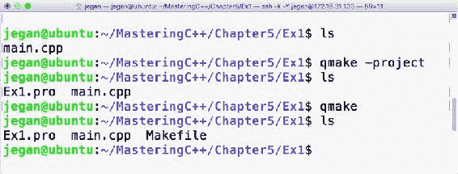

Figure 5.3

当您发出`qmake -project`命令时，qmake 将扫描当前文件夹和当前文件夹下的所有子文件夹，并将头文件和源文件包含在`Ex1.pro`中。顺便说一下，`.pro`文件是一个纯文本文件，可以使用任何文本编辑器打开，如图*图 5.4* :

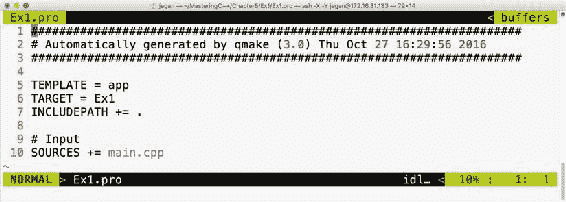

Figure 5.4

现在是以`Ex1.pro`为输入文件创建`Makefile`的时候了。由于`Ex1.pro`文件存在于当前目录中，我们不必显式提供`Ex1.pro`作为自动生成`Makefile`的输入文件。这个想法是，一旦我们有了一个`.pro`文件，我们所需要做的就是从`.pro`文件发布命令生成`Makefile`:`qmake`。这将实现为您的项目创建一个完整的`Makefile`的所有魔力，您可以使用`make`实用程序来构建您的项目，如下图所示:

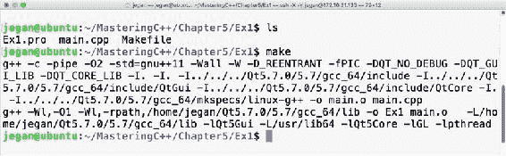

Figure 5.5

这是我们一直在等待的一点，对吗？是的，让我们执行我们的第一个 Qt Hello World 程序，如下图所示:

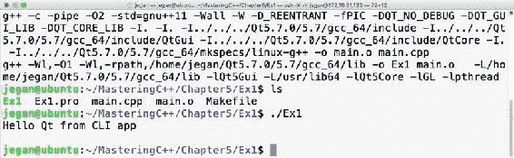

Figure 5.6

恭喜你！您已经完成了第一份 Qt 申请。在本练习中，您学习了如何在 Ubuntu 中设置和配置 Qt，以及如何编写一个简单的 Qt 控制台应用程序，然后构建和运行它。最棒的是你从命令行学到了所有这些。

# Qt 小部件

Qt Widgets 是一个有趣的模块，它支持相当多的小部件，比如按钮、标签、编辑、组合、列表、对话框等等。`QWidget`是所有小部件的基类，而`QObject`是几乎每个 Qt 类的基类。虽然许多编程语言称之为用户界面控件，但 Qt 称之为小部件。虽然 Qt 在许多平台上工作，但它的家仍然是 Linux 小部件在 Linux 世界中很常见。

# 编写我们第一个 Qt 图形用户界面应用程序

我们的第一个控制台应用程序真的很酷，不是吗？让我们继续深入探索。这一次，让我们编写一个简单的基于 GUI 的 Hello World 程序。除了`main.cpp`中的一些小变化外，程序将保持几乎相同。有关完整代码，请参考以下内容:

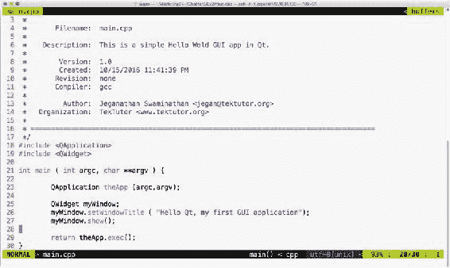

Figure 5.7

等一下。我来解释一下第 23 行和第 29 行`QApplication`的必要性。每个 Qt 图形用户界面应用程序必须恰好有一个`QApplication`实例。`QApplication`为我们的应用程序提供命令行开关支持，因此需要提供**参数计数** ( **argc** )和**参数值** ( **argv** )。基于图形用户界面的应用程序是事件驱动的，所以它们必须响应事件，或者准确地说，Qt 世界中的信号。在第 29 行中，`exec`功能启动`event`循环，确保应用程序等待用户交互，直到用户关闭窗口。其思想是所有的用户事件将由事件队列中的`QApplication`实例接收，然后将通知给它的`Child`小部件。事件队列确保存放在队列中的所有事件都按照它们发生的相同顺序进行处理，即**先进先出** ( **先进先出**)。

如果你想知道如果你注释第 29 行会发生什么，应用程序仍然会编译和运行，但是你可能看不到任何窗口。原因是`main`线程或`main`函数在第 25 行创建了一个`QWidget`的实例，这是我们启动应用程序时看到的窗口。

在第 27 行，显示窗口实例，但是在没有第 29 行的情况下，`main`函数将立即终止应用程序，而不给你机会检查你的第一个 Qt GUI 应用程序。值得一试，所以继续看看有没有 29 号线会发生什么。

让我们生成`Makefile`，如下图截图所示:


Figure 5.8

现在让我们试着用`make`工具编译我们的项目，如下图所示:

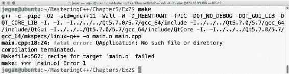

Figure 5.9

很有趣，对吧？我们全新的 Qt 图形用户界面程序无法编译。你注意到致命的错误了吗？没什么大不了的；让我们理解为什么会发生这种情况。原因是我们还没有链接 Qt Widgets 模块，因为`QApplication`类是 Qt Widgets 模块的一部分。在这种情况下，你可能想知道你的第一个 Hello World 程序是如何编译而没有任何问题的。在我们的第一个程序中，`QDebug`类是 **QtCore** 模块的一部分，隐式链接，而其他模块必须显式链接。让我们看看如何做到这一点:

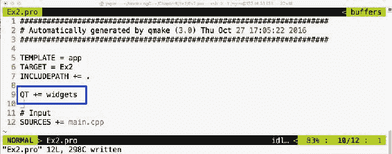

Figure 5.10

我们需要将`QT += widgets`添加到`Ex2.pro`文件中，以便`qmake`实用程序理解它需要在创建最终可执行文件的同时，在 Linux 中链接 Qt Widgets 的**共享对象**(即`.so`文件)，也称为**动态链接库**(即`.dll`文件)。一旦解决了这个问题，我们必须`qmake`使`Makefile`能够反映我们的`Ex2.pro`文件中的新变化，如下图所示:

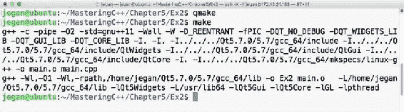

Figure 5.11

酷。让我们现在来看看我们的第一个基于图形用户界面的 Qt 应用。在我的系统中，应用输出如图*图 5.12 所示；*如果你这边一切顺利，你也应该得到类似的输出:


Figure 5.12

如果我们把窗口的标题设为`Hello Qt`就好了，对吧？让我们马上开始吧:


Figure 5.13

在测试新的变更之前，添加第 26 行显示的代码，以确保您使用`make`工具构建项目:

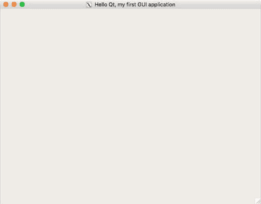

Figure 5.14

# 布局

Qt 是跨平台的应用程序框架，因此它支持一些概念，例如开发在所有平台上看起来一致的应用程序的布局，而不管不同的屏幕分辨率如何。当我们开发基于图形用户界面/人机界面的 Qt 应用程序时，在一个系统中开发的应用程序不应该在另一个具有不同屏幕大小和分辨率的系统中出现不同。这是通过布局在 Qt 框架中实现的。布局有不同的风格。这有助于开发人员通过在窗口或对话框中组织各种小部件来设计专业外观的人机界面/图形用户界面。布局在排列子部件的方式上有所不同。当一个以水平方式排列其子部件时，另一个将以垂直或网格方式排列它们。当窗口或对话框调整大小时，布局会调整其子小部件的大小，这样它们就不会被截断或失去焦点。

# 编写具有水平布局的图形用户界面应用程序

让我们编写一个在对话框中有几个按钮的 Qt 应用程序。Qt 支持各种有用的布局管理器，它们充当了一个不可见的画布，许多`QWidgets`可以在它们被附加到窗口或对话框之前被排列。每个对话框或窗口只能有一种布局。每个小部件只能添加到一个布局中；但是，许多布局可以组合起来设计专业的 UI。

让我们现在开始编写代码。在这个项目中，我们将以模块化的方式编写代码，因此我们将创建三个名为`MyDlg.h`、`MyDlg.cpp`和`main.cpp`的文件。

游戏计划如下:

1.  创建`QApplication`的单个实例。
2.  继承`QDialog`创建自定义对话框。
3.  创建三个按钮。
4.  创建水平方框布局。
5.  将这三个按钮添加到不可见的水平框布局中。
6.  将水平框布局的实例设置为对话框的布局。
7.  显示对话框。
8.  在`QApplication`上启动事件循环。

我们遵循干净的代码实践是很重要的，这样我们的代码就很容易理解，并且可以被任何人维护。由于我们将遵循行业最佳实践，让我们在名为`MyDlg.h`的头文件中声明对话框，在名为`MyDlg.cpp`的源文件中定义对话框，并在具有`main`功能的`main.cpp`中使用`MyDlg.cpp`。每次`MyDlg.cpp`需要一个头文件的时候，让我们把所有的头文件都只包含在`MyDlg.h`中作为惯例；有了这个，我们在`MyDlg.cpp`中唯一会看到的标题就是`MyDlg.h`。

顺便问一下，我有没有告诉过你 Qt 遵循骆驼套管编码惯例？是的，我现在确实提到了。到目前为止，您已经观察到所有 Qt 类都以字母 *Q* 开头，因为 Qt 发明者喜欢 Emacs 中的字母“Q”，他们对这种字体类型非常着迷，以至于他们决定在 Qt 中的任何地方都使用字母 Q。

最后一个建议。如果文件的名称和类的名称相似，那么其他人定位对话框类不是很容易吗？我能听到你答应了。一切就绪！让我们开始编写我们的 Qt 应用程序。首先，参考下面的截图:

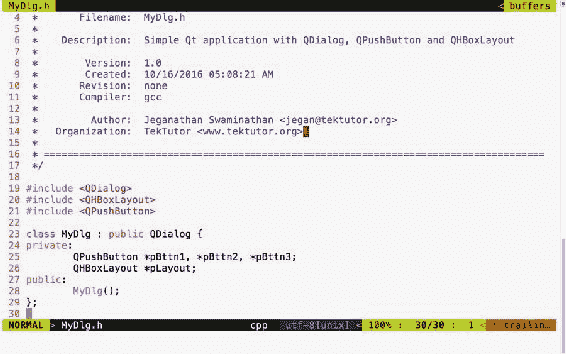

Figure 5.15

在前面的截图中，我们声明了一个名为`MyDlg`的类。它有一个布局、三个按钮和一个构造函数。现在参考这张截图:

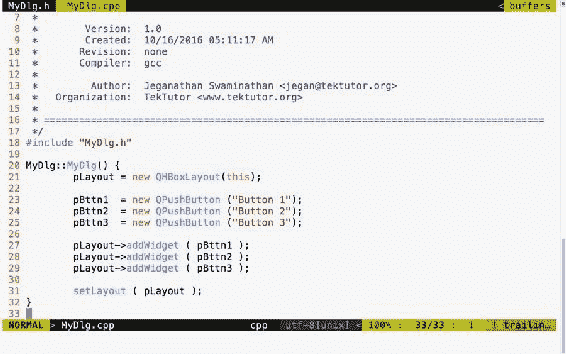

Figure 5.16

正如您在前面的截图中看到的，我们定义了`MyDlg`构造函数，并实例化了布局和三个按钮。在第 27 行到第 29 行，我们在布局中添加了三个按钮。在第 31 行，我们将布局与我们的对话框相关联。仅此而已。在下面的截图中，我们定义了我们的`main`函数，它创建了一个`QApplication`的实例:


Figure 5.17

随后，我们创建了自定义对话框实例并显示了该对话框。最后，在第 27 行，我们开始`event`循环，以便`MyDlg`可以响应用户交互。参考以下截图:

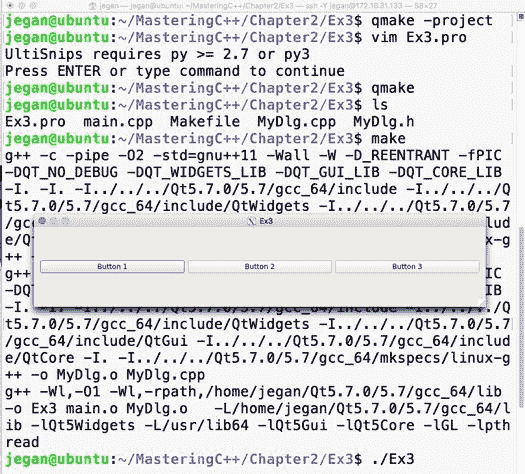

Figure 5.18

前面的截图演示了构建和执行过程，这是我们可爱的应用程序。其实你可以试着玩一下对话框，更好的理解水平布局。首先，水平拉伸对话框，注意所有按钮的宽度增加；然后，看看是否可以减小对话框的宽度，以注意到所有按钮的宽度都减小了。这是任何布局经理的工作。布局管理器排列窗口小部件，检索窗口大小，并在所有子窗口小部件之间平均分配高度和宽度。布局管理器不断通知所有子小部件任何调整大小的事件。然而，由各自的子小部件来决定他们是想要调整自己的大小还是忽略布局调整信号。

要检查此行为，请尝试垂直伸展对话框。随着对话框高度的增加，对话框的高度也会增加，但按钮不会增加高度。这是因为每个 Qt Widget 都有自己的首选大小策略；根据他们的尺寸策略，他们可能会响应或忽略某些布局调整信号。

如果您希望按钮也能垂直伸展，`QPushButton`提供了一种方法来实现这一点。事实上，`QPushButton`就像其他小部件一样，是从`QWidget`延伸出来的。`setSizePolicy()`法源于`QPushButton`的基类，即`QWidget`:

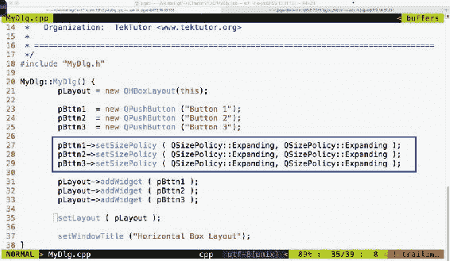

Figure 5.19

你注意到 37 号线了吗？是的，我已经在`MyDlg`的构造器中设置了窗口标题，以保持我们的`main`功能简洁干净。

在启动应用程序之前，请确保您已经使用`make`实用程序构建了项目:


Figure 5.20

在突出显示的部分，我们已经覆盖了所有按钮的默认大小策略。第 27 行第一个参数`QSizePolicy::Expanding`是指横向政策，第二个参数是指纵向政策。要查找`QSizePolicy`的其他可能值，请参考 Qt API 引用附带的助手，如下图所示:

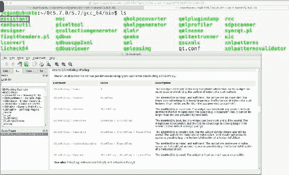

Figure 5.21

# 编写具有垂直布局的图形用户界面应用程序

在上一节中，您学习了如何使用水平框布局。在本节中，您将看到如何在应用程序中使用垂直框布局。

事实上，水平和垂直的盒子布局只是在如何排列小部件方面有所不同。例如，水平框布局将以水平方式从左到右排列其子部件，而垂直框布局将以垂直方式从上到下排列其子部件。

您可以从上一节复制源代码，因为这些更改本质上是微小的。复制代码后，项目目录应该如下所示:


Figure 5.22

让我演示一下从`MyDlg.h`头文件开始的更改，如下所示:

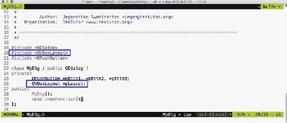

Figure 5.23

我已经把`QHBoxLayout`换成了`QVBoxLayout`；仅此而已。是的，让我们继续进行与`MyDlg.cpp`相关的文件更改:

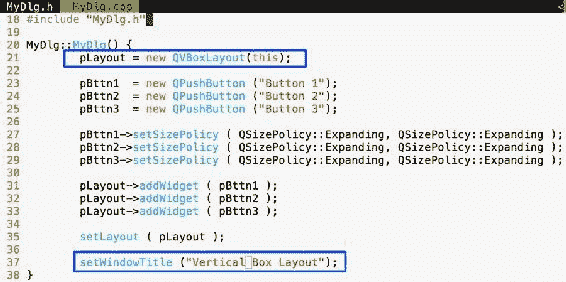

Figure 5.24

`main.cpp`无变化可做；但是，我已经显示了`main.cpp`供您参考，如下所示:

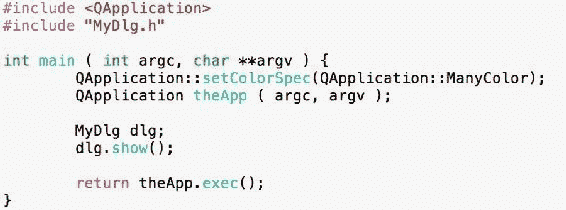

Figure 5.25

现在我们需要做的就是自动生成`Makefile`，然后如下制作并运行程序:

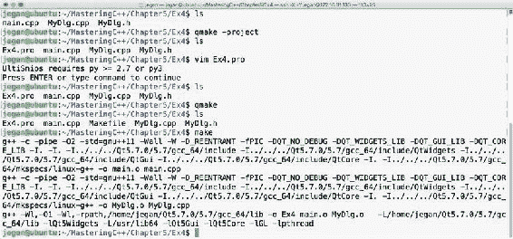

Figure 5.26

让我们执行我们全新的程序并检查输出。下面的输出演示了`QVBoxLayout`以从上到下垂直的方式排列小部件。当窗口被拉伸时，所有按钮的宽度将根据窗口是被拉伸还是被拉伸而增加/减少:

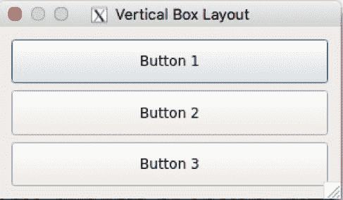

Figure 5.27

# 编写带有方框布局的图形用户界面应用程序

在前几节中，您学习了如何利用`QHBoxLayout`和`QVBoxLayout`。其实这两个班就是`QBoxLayout` **的便民班。**在`QHBoxLayout`的情况下，`QHBoxLayout`类子类化`QBoxLayout`并将`QBoxLayout::Direction`配置为`QBoxLayout::LeftToRight`，而`QVBoxLayout`类子类化`QBoxLayout`并将`QBoxLayout::Direction`配置为`QBoxLayout::TopToBottom`。

除了这些值之外，`QBoxLayout::Direction`还支持各种其他值，如下所示:

*   `QBoxLayout::LeftToRight`:这将从左到右排列小部件
*   `QBoxLayout::RightToLeft`:这将从右向左排列小部件
*   `QBoxLayout::TopToBottom`:这将从上到下排列小部件
*   `QBoxLayout::BottomToTop`:这将从下往上排列小部件

让我们用带有五个按钮的`QBoxLayout`编写一个简单的程序。

先说`MyDlg.h`头文件。我在`MyDlg`类中声明了五个按钮指针和一个`QBoxLayout`指针:


Figure 5.28

让我们来看看我们的`MyDlg.cpp`源文件。如果您注意到下面截图中的第 21 行，`QBoxLayout`构造函数接受两个参数。第一个参数是您希望排列小部件的方向，第二个参数是一个可选参数，它需要布局实例的父地址。

正如您可能已经猜到的那样，`this`指针指的是`MyDlg`实例指针，它恰好是布局的父级。


Figure 5.29

同样，正如您可能已经猜到的那样，`main.cpp`文件不会从我们过去的练习中改变，如下图所示:

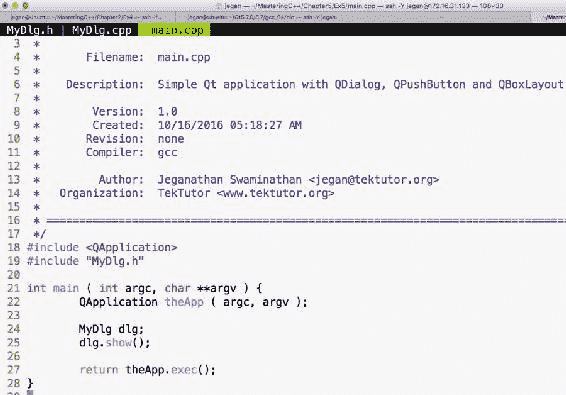

Figure 5.30

让我们编译并运行程序，如下所示:

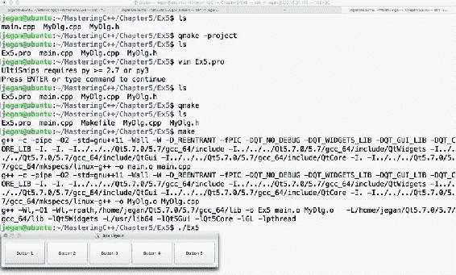

Figure 5.31

如果你注意到输出，它看起来像一个水平的盒子布局输出，对吗？没错，因为我们已经把方向设置为`QBoxLayout::LeftToRight`。如果您将方向修改为`QBoxLayout::RightToLeft`，那么按钮 1 将出现在按钮 1 的右侧，按钮 2 将出现在按钮 1 的左侧，以此类推。因此，输出如下图所示:

*   如果方向设置为`QBoxLayout::RightToLeft`，会看到如下输出:

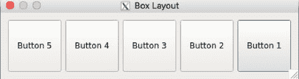

Figure 5.32

*   如果方向设置为`QBoxLayout::TopToBottom`，会看到如下输出:


Figure 5.33

*   如果方向设置为`QBoxLayout::BottomToTop`，会看到如下输出:

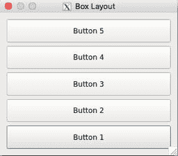

Figure 5.34

在前面的所有场景中，按钮以完全相同的顺序添加到布局中，分别从按钮 1 到按钮 5 开始。但是，根据在`QBoxLayout`构造器中选择的方向，框布局将排列按钮，因此输出会有所不同。

# 编写具有网格布局的图形用户界面应用程序

网格布局允许我们以表格的方式排列小部件。这相当容易，就像一个盒子布局。我们需要做的就是指出每个小部件必须添加到布局中的行和列。由于行和列索引从从零开始的索引开始，行 0 的值表示第一行，列 0 的值表示第一列。理论够了；让我们开始写一些代码。

让我们声明 10 个按钮，并将其添加到两行五列中。除了具体的`QGridLayout`差异之外，其余的东西将保持与前面的练习相同，所以如果你已经理解了到目前为止讨论的概念，那么继续创建`MyDlg.h` **、** `MyDl.cpp`和`main.cpp`。

下面我来展示一下`MyDlg.h`的源代码截图:


Figure 5.35

以下是`MyDlg.cpp`的代码片段:

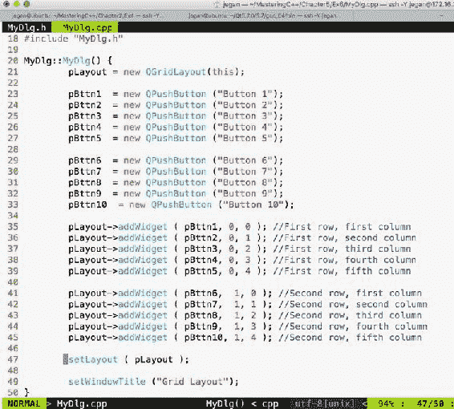

Figure 5.36

`main.cpp`源文件内容将保持与我们之前的练习相同；因此，我跳过了`main.cpp`代码片段。因为您熟悉构建过程，所以我也跳过了它。如果您忘记了这一点，只需查看前面的部分来了解构建过程。

如果您正确键入了代码，您应该会得到以下输出:

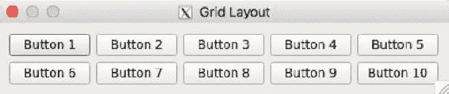

Figure 5.37

事实上，网格布局有更多的东西可以提供。让我们探索如何让一个按钮跨越多个单元格。我保证你将要看到的会更有趣。

我将修改`MyDlg.h`和`MyDlg.cpp`，并保持`main.cpp`与前面的练习相同:

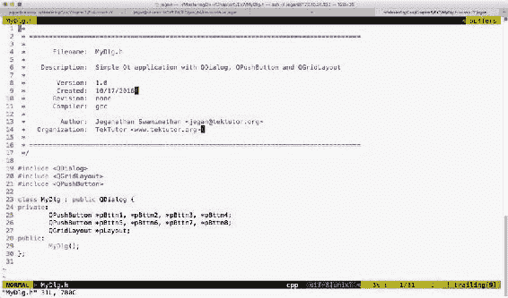

Figure 5.38

我们的`MyDlg.cpp`来了:

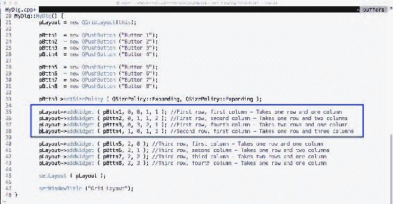

Figure 5.39

注意第 35 到 38 行。现在详细讨论一下`addWidget()`功能。

在第 35 行中，`pLayout->addWidget ( pBttn1, 0, 0, 1, 1 )`代码执行以下操作:

*   前三个参数将 Button 1 添加到网格布局的第一行和第一列
*   第四个参数`1`指示按钮 1 将只占据一行
*   第五个参数`1`指示按钮 1 将只占据一列
*   因此，很明显`pBttn1`应该在单元格(0，0)处渲染，并且应该只占据一个网格单元格

在第 36 行中，`pLayout->addWidget ( pBttn2, 0, 1, 1, 2 )`代码执行以下操作:

*   前三个参数将`Button 2`添加到第一行第二列的网格布局中
*   第四个参数指示`Button 2`将占据一行
*   第五个参数指示`Button 2`将占据两列(即第一行的第二列和第三列)
*   在底线，按钮 2 将呈现在单元格(0，1)中，它应该占据一行和两列

在第 37 行中，`pLayout->addWidget ( pBttn3, 0, 3, 2, 1 )`代码执行以下操作:

*   前三个参数将 Button 3 添加到第一行第四列的网格布局中
*   第四个参数指示按钮 3 将占据两行(即第一行和第四列以及第二行和第四列)
*   第五个参数指示按钮 3 将占据一列

在第 38 行中，`pLayout->addWidget ( pBttn4, 1, 0, 1, 3 )`代码执行以下操作:

*   前三个参数将 Button 4 添加到第二行第一列的网格布局中
*   第四个参数指示按钮 4 将占据一行
*   第五个参数指示按钮 4 将占据三列(即第二行第一，然后是第二和第三列)

检查程序的输出:


Figure 5.40

# 信号和插槽

信号和插槽是 Qt 框架不可分割的一部分。到目前为止，我们已经编写了一些简单但有趣的 Qt 应用程序，但是我们还没有处理事件。现在是时候了解如何在我们的应用程序中支持事件了。

让我们用一个按钮编写一个简单的应用程序。当按钮被点击时，检查我们是否可以在控制台上打印一些东西。

`MyDlg.h`标题演示了如何声明`MyDlg`类:


Figure 5.41

下面的截图演示了如何定义`MyDlg`构造函数来为我们的对话框窗口添加一个按钮:


Figure 5.42

`main.cpp`如下图所示:


Figure 5.43

让我们构建并运行我们的程序，稍后添加对信号和插槽的支持。如果您按照说明正确操作，您的输出应该类似于下面的截图:

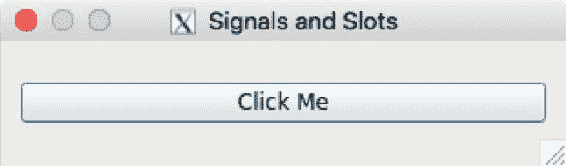

Figure 5.44

如果你点击按钮，你会注意到什么都没有发生，因为我们还没有在我们的应用程序中添加对信号和插槽的支持。好了，是时候揭示秘密指令了，它将帮助你让按钮对按钮点击信号做出反应。等等，是时候了解更多信息了。别担心，这和 Qt 有关。

Qt 信号只不过是事件，而 slot 函数是事件处理函数。有趣的是，信号和槽都是正常的 C++函数；只有当它们被标记为信号或槽时，Qt Framework 才会理解它们的目的，并提供必要的样板代码。

Qt 中的每个小部件都支持一个或多个信号，也可以选择支持一个或多个插槽。因此，在我们编写任何进一步的代码之前，让我们探索一下`QPushButton`支持哪些信号。

让我们将 Qt 助手用于应用编程接口参考:

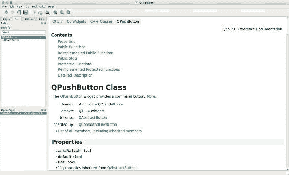

Figure 5.45

如果您观察前面的截图，它有一个内容部分，似乎涵盖了公共插槽，但我们没有看到任何信号列在那里。这是很多信息。如果内容部分没有列出信号，`QPushButton`将不直接支持信号。然而，也许它的基类，也就是`QAbstractButton`，会支持一些信号。`QPushButton`类部分给出了大量有用的信息，比如标题文件名，哪个 Qt 模块必须链接到应用程序——也就是说，必须添加到`.pro`的 qmake 条目——等等。还提到了`QPushButton`的基类。如果您进一步向下滚动，您的 Qt 助手窗口应该如下所示:


Figure 5.46

如果您观察附加继承成员下突出显示的部分，显然 Qt 助手暗示`QPushButton`从`QAbstractButton`继承了四个信号。所以我们需要探索`QAbstractButton`支持的信号，以支持`QPushButton`中的信号。

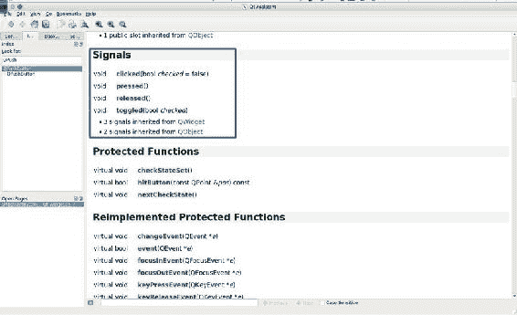

Figure 5.47

在 Qt 助手的帮助下，如上图截图所示，`QAbstractButton`类显然支持四种信号，这四种信号同样适用于`QPushButton`，因为`QPushButton`是`QAbstractButton`的子类。因此，让我们在本练习中使用`clicked()`信号。

为了使用`clicked()`信号，我们需要在`MyDlg.h`和`MyDlg.cpp`中做一些小的改变。因此，我在下面的截图中突出显示了这两个文件的变化:


Figure 5.48

如您所知，`QDebug`类用于调试目的。它为 Qt 应用程序提供了类似于`cout`的功能，但它们并不是信号和插槽真正需要的。我们在这里使用它们只是为了调试。在*图 5.48* 中，第 34 行，void `MyDlg::onButtonClicked()`是我们打算用作事件处理函数的槽函数，该函数必须在按钮点击时调用。

下面的截图应该会让你知道为了支持信号和插槽，你需要在`MyDlg.cpp`中做哪些改变:

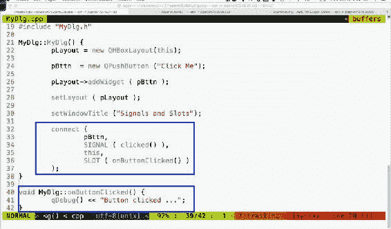

Figure 5.49

如果观察前面截图中的第 40 行到第 42 行，`MyDlg::onButtonClicked()`方法是一个槽函数，只要点击按钮就必须调用。但是除非按钮的`clicked()`信号被映射到`MyDlg::onButtonClicked()`槽，否则当按钮被点击时，Qt 框架不会知道它必须调用`MyDlg::onButtonClicked()`。因此，在第 32 到 37 行中，我们将按钮信号`clicked()`与`MyDlg`实例的`onButtonClicked()`插槽功能连接起来。连接功能由`MyDlg`从`QDialog`继承。这反过来又继承了其最终基类`QObject`的功能。

口头禅是每个想要参与信号和时隙通信的类必须是`QObject`或者它的子类。`QObject`提供了大量的信号和插槽支持，`QObject`是`QtCore`模块的一部分。令人惊讶的是，Qt 框架甚至为命令行应用程序提供了信号和插槽。这就是信号和插槽支持被内置到最终基类`QObject`中的原因，它是 **QtCore** 模块的一部分。

好的，让我们构建并运行我们的程序，看看这些信号在我们的应用程序中是否有效:

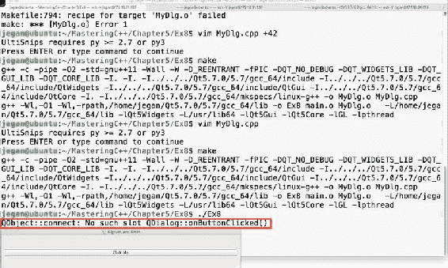

Figure 5.50

有趣的是，我们没有得到编译错误，但当我们点击按钮时，突出显示的警告消息会自动出现。这是来自 Qt 框架的一个提示，我们错过了一个重要的过程，这个过程是使信号和槽工作的强制性的。

让我们回忆一下在头文件和源文件中自动生成`Makefile`的过程:

1.  `qmake -project`命令确保当前文件夹中存在的所有头文件和源文件都包含在`.pro`文件中。
2.  `qmake`命令拾取当前文件夹中的`.pro`文件，并为我们的项目生成`Makefile`。
3.  `make`命令将调用`make`实用程序。然后它在当前目录中执行`Makefile`，并基于`Makefile`中定义的 make 规则构建我们的项目。

在第 1 步中，`qmake`实用程序会扫描我们所有的自定义头文件，并检查它们是否需要信号和插槽支持。任何含有`Q_OBJECT`宏的头文件都会提示`qmake`实用程序它需要信号和插槽支持。因此我们必须在我们的`MyDlg.h`头文件中使用`Q_OBJECT`宏:

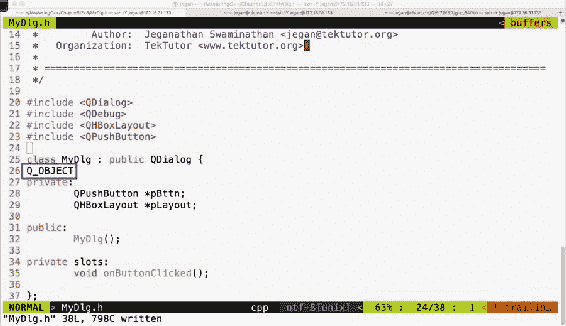

Figure 5.51

一旦在头文件中完成了推荐的更改，我们需要确保发出`qmake`命令。现在`qmake`工具将打开`Ex8.pro`文件来获取我们的项目标题和源文件。当`qmake`解析`MyDlg.h`并找到`Q_OBJECT`宏时，它会了解到我们的`MyDlg.h`需要信号和插槽，然后它会确保在`MyDlg.h`上调用 moc 编译器，以便在名为`moc_MyDlg.cpp`的文件中自动生成样板代码。然后，这将继续并将必要的规则添加到`Makefile`中，以便自动生成的`moc_MyDlg.cpp`文件与其他源文件一起构建。

现在您已经知道了 Qt 信号和插槽的秘密，继续尝试这个过程，并检查您的按钮点击是否打印了按钮点击...消息。我已经开始按照建议的变更构建我们的项目。在下面的截图中，我强调了幕后发生的有趣的事情；与使用花哨的 IDEs 相比，在命令行中工作会有一些优势:

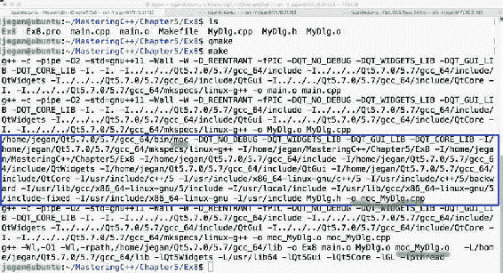

Figure 5.52

现在是我们测试支持信号和插槽的简单应用程序输出的时候了。输出显示在下面的截图中:


Figure 5.53

恭喜你！你可以拍拍你的背。你已经学会了足够多在 Qt 中做很酷的事情。

# 在 Qt 应用程序中使用堆叠布局

由于您已经了解了信号和插槽，在本节中，让我们探讨如何在具有多个窗口的应用程序中使用堆叠布局；每个窗口可以是 **QWidget** 或 **QDialog。**每个页面都可能有自己的子小部件。我们即将开发的应用程序将演示堆叠布局的使用，以及如何在堆叠布局中从一个窗口导航到另一个窗口。


Figure 5.54

这个应用程序将需要相当数量的代码，因此我们必须确保我们的代码结构严谨，以满足结构和功能的质量，尽可能避免代码的味道。

让我们创建四个小部件/窗口，这些小部件/窗口可以堆叠在一个堆叠布局中，其中每个页面可以被开发为一个单独的类，该类被分成两个文件:`HBoxDlg.h`和`HBoxDlg.cpp`等等。

先说`HBoxDlg.h`。由于您熟悉布局，在本练习中，我们将用一种布局创建每个对话框，以便在子窗口之间导航时，您可以区分页面。否则，堆叠布局和其他布局之间将没有连接。


Figure 5.55

以下代码片段来自`HBoxDlg.cpp`文件:


Figure 5.56

同样，让我们写`VBoxDlg.h`如下:

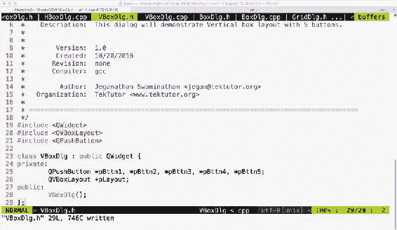

Figure 5.57

让我们用方框布局创建第三个对话框`BoxDlg.h`，如下所示:

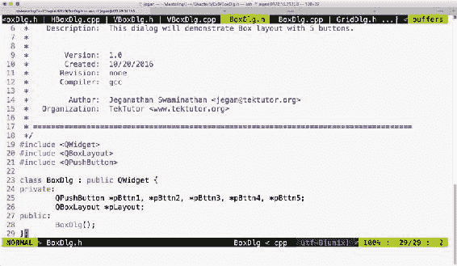

Figure 5.58

相应的`BoxDlg.cpp`源文件如下所示:


Figure 5.59

我们要叠加的第四个对话框是`GridDlg`，那么我们来看看`GridDlg.h`怎么写，如下图截图所示:


Figure 5.60

相应的`GridDlg.cpp`将如下所示:


Figure 5.61

酷，我们已经完成了创建四个可以在`MainDlg`中堆叠的小部件。`MainDlg`将使用`QStackedLayout`，所以本练习的关键是理解堆叠布局是如何工作的。

让我们看看`MainDlg.h`应该怎么写:


Figure 5.62

在`MainDlg`中，我们已经声明了三个槽函数，每个按钮一个，以支持四个窗口之间的导航逻辑。堆叠布局类似于选项卡式小部件，不同之处在于选项卡式小部件将提供自己的可视方式在选项卡之间切换，而在堆叠布局的情况下，则由我们提供切换逻辑。

`MainDlg.cpp`会是这样的:


Figure 5.63

您可以选择一个框布局来容纳三个按钮，因为我们更喜欢向右对齐的按钮。然而，为了确保额外的空间被一些看不见的胶水消耗掉，我们在第 44 行增加了一个拉伸项。

在第 30 行到第 33 行之间，我们添加了堆叠布局中的所有四个子窗口，这样可以一次显示一个窗口。在索引 0 处添加`HBox`对话框，在索引 1 处添加`VBox`对话框，以此类推。

第 53 行到第 58 行演示了前一个按钮的点击信号是如何与其对应的`MainDlg::onPrevPage()`槽功能连接的。必须为“下一步”和“退出”按钮配置类似的连接:

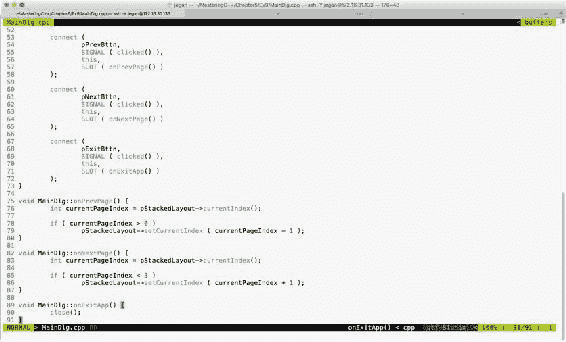

Figure 5.64

第 78 行的`if`条件确保只有当我们在第二个或更晚的子窗口中时，切换逻辑才会发生。由于水平对话框位于索引 0 处，在当前窗口恰好是水平对话框的情况下，我们无法导航到上一个窗口。对于切换到第 85 行的下一个子窗口，也进行了类似的验证。

堆叠布局支持`setCurrentIndex()`方法切换到特定的索引位置；或者，您也可以尝试`setCurrentWidget()`方法，如果它在您的场景中效果更好的话。

`main.cpp`看起来简短，如下所示:

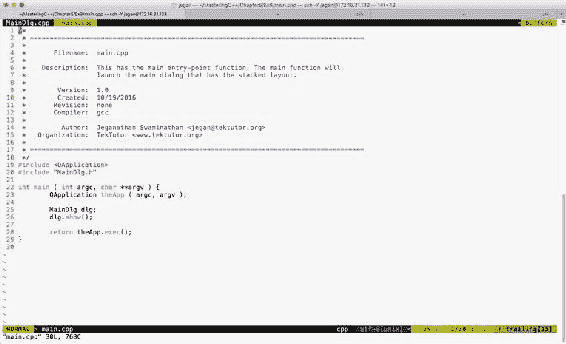

Figure 5.65

我们的`main`函数最棒的地方在于，不管应用逻辑有多复杂，`main`函数都没有任何业务逻辑。这使得我们的代码干净且易于维护。

# 编写一个结合多种布局的简单数学应用程序

在这一节中，让我们探索如何编写一个简单的数学应用程序。作为本练习的一部分，我们将使用`QLineEdit`和`QLabel`小部件以及`QFormLayout`。我们需要设计一个 UI，如下图截图所示:

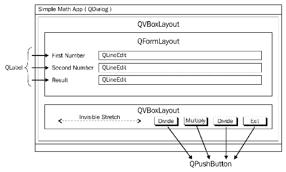

Figure 5.66

`QLabel`是一个通常用于静态文本的小部件，`QLineEdit`将允许用户提供单行输入。如前截图所示，我们将使用`QVBoxLayout`作为主布局，以便垂直排列`QFormLayout`和`QBoxLayout`。`QFormLayout`在你需要创建一个表单的时候会派上用场，这个表单的左边有一个标题，右边是一些小部件。`QGridLayout`可能也可以，但是`QFormLayout`在这种情况下很容易使用。

在本练习中，我们将创建三个文件，即`MyDlg.h`、`MyDlg.cpp`和`main.cpp`。让我们从`MyDlg.h`源代码开始，然后进入其他文件:

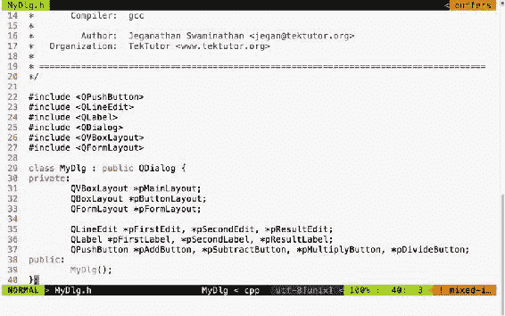

Figure 5.67

在上图中，声明了三种布局。垂直方框布局用作主布局，而方框布局用于以右对齐方式排列按钮。表单布局用于添加标签，即行编辑小部件。本练习还将帮助您了解如何组合多种布局来设计专业的人机界面。

Qt 对单个窗口中可以组合的布局数量没有任何限制。然而，如果可能的话，如果你正在努力开发一个内存占用小的应用程序，考虑用最少的布局设计一个人机界面是一个好主意。否则，在应用程序中使用多种布局肯定没有坏处。

在下面的截图中，你会了解到`MyDlg.cpp`源文件应该如何实现。在`MyDlg`构造器中，所有按钮都被实例化，并在方框布局中进行布局，以便正确对齐。表单布局用于以类似网格的方式保存`QLineEdit`小部件及其对应的`QLabel`小部件。`QLineEdit`小部件通常帮助提供单行输入；在这个特定的练习中，它们帮助我们根据用户的选择提供必须加、减等的数字输入。


Figure 5.68

我们的`main.cpp`源文件最棒的部分是它几乎保持不变，不管我们的应用程序有多复杂。在这个练习中，我想告诉你一个关于`MyDlg`的秘密。你有没有注意到`MyDlg`构造函数是在堆栈中实例化的，而不是在堆中？其思想是当`main()`函数退出时，`main`函数使用的堆栈将被取消，最终释放堆栈中存在的所有堆栈变量。当`MyDlg`被释放时，会导致调用`MyDlg`析构函数。在 Qt 框架中，每个小部件构造器都有一个可选的父小部件指针，它被最顶端的窗口析构器用来释放其子小部件。有趣的是，Qt 维护了一个树状数据结构来管理所有子部件的内存。因此，如果一切顺利，Qt 框架将负责“自动”释放所有子小部件的内存位置。

这有助于 Qt 开发人员专注于应用程序方面，而 Qt 框架将负责内存管理。


Figure 5.69

检查我们新应用程序的输出，你不兴奋吗？如果您构建并执行应用程序，那么您应该会得到类似于下面截图**的输出。**当然，我们还没有添加信号和插槽支持，但是设计出让我们满意的 GUI，然后将我们的重点转移到事件处理上，这是个好主意:


Figure 5.70

如果仔细观察，虽然按钮在`QBoxLayout`上是从右向左排列的，但是按钮并没有向右对齐。出现这种情况的原因是，当窗口展开时，框布局似乎已经划分并分配了所有按钮中可用的额外水平空间。让我们继续，在盒子布局最左边的位置插入一个拉伸项，这样拉伸会吃掉所有多余的空间，使按钮没有扩展的空间。这将给我们带来右对齐的效果。添加拉伸后，代码将如下图所示:

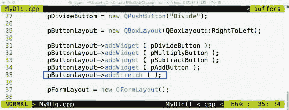

Figure 5.71

继续检查您的输出是否如下图所示。有时候，作为开发人员，我们看到输出时会很兴奋，却忘了编译我们的更改，所以要确保项目再次构建。如果你看不到产出有任何变化，不用担心；只需尝试水平伸展窗口，您应该会看到右对齐的效果，如下图所示:

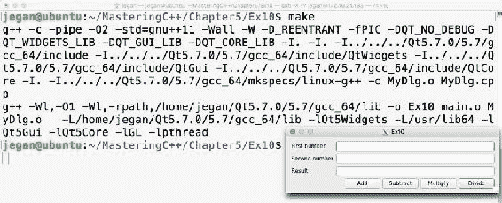

Figure 5.72

现在，既然我们有了一个外观不错的应用程序，让我们添加信号和插槽支持来添加对按钮点击的响应。我们现在不要急于包含加减功能。我们将使用一些`qDebug()`打印语句来检查信号和插槽是否连接正确，然后用实际功能逐渐替换它们。

如果你还记得之前的信号和槽练习，任何对支持信号和槽感兴趣的 Qt 窗口都必须是`QObject`，并且应该在`MyDlg.h`头文件中包含`Q_OBJECT`宏，如下图所示:


Figure 5.73

在从 41 到 45 开始的行中，在私有部分声明了四个槽方法。槽函数是常规的 C++函数，可以像其他 C++函数一样直接调用。然而，在这种情况下，槽函数只打算用`MyDlg`调用。因此，它们被声明为私有函数，但是如果您相信其他人可能会发现连接到您的公共插槽是有用的，它们可以被公开。

酷，如果你已经走到这一步，说明你已经理解了到目前为止讨论的事情。好了，让我们继续执行`MyDlg.cpp`中的插槽功能定义，然后将`clicked()`按钮的信号与相应的插槽功能连接起来:


Figure 5.74

现在是将信号连接到各自插槽的时候了。您可能已经猜到了，我们需要使用`MyDlg`构造函数中的`connect`函数，如下图所示，来获得对应插槽的按钮点击:

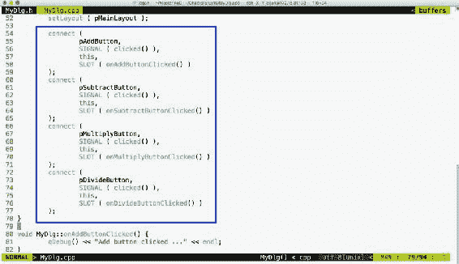

Figure 5.75

我们都准备好了。是的，现在是表演时间。由于我们已经处理了大部分内容，让我们编译并检查我们的小 Qt 应用程序的输出:


Figure 5.76

哎呀！我们遇到一些链接器错误。这个问题的根本原因是我们在应用中启用信号和槽位支持后忘记调用`qmake`。别担心，让我们调用`qmake`和`make`并运行我们的应用程序:


Figure 5.77

太好了，我们已经解决了这个问题。make 实用程序这次似乎没有发出任何噪音，我们能够启动应用程序。让我们检查信号和插槽是否按预期工作。为此，单击添加按钮，看看会发生什么:


Figure 5.78

哇哦！当我们点击添加按钮时，`qDebug()`控制台消息确认`MyDlg::onAddButtonClicked()`插槽被调用。如果你很想查看其他按钮的插槽，请点击其余按钮。

没有业务逻辑，我们的应用程序将是不完整的。因此，让我们将业务逻辑添加到`MyDlg::onAddButtonClicked()`槽函数中，以执行添加并显示结果。一旦您学习了如何集成添加的业务逻辑，您就可以遵循相同的方法并实现剩余的 slot 功能:


Figure 5.79

在`MyDlg::onAddButtonClicked()`功能中，集成了业务逻辑。在第 82 行和第 83 行，我们试图提取用户在`QLineEdit`小部件中键入的值。`QLineEdit`中的`text()`功能返回`QString` **。**`QString`对象提供`toInt()`，方便提取`QString`表示的整数值。一旦这些值被添加并存储在结果变量中，我们需要将结果整数值转换回`QString`，如第 86 行所示，这样结果就可以被送入`QLineEdit`，如第 88 行所示。

同样，您可以继续集成其他数学运算的业务逻辑。一旦你彻底测试了应用程序，你可以移除`qDebug()`控制台的输出。我们添加了`qDebug()`消息用于调试目的，因此现在可以清理它们了。

# 摘要

在本章中，您学习了使用 Qt 应用程序框架开发 C++图形用户界面应用程序。关键要点如下。

*   您学习了在 Linux 中安装 Qt 和所需工具。
*   您已经学习了用 Qt 框架编写简单的基于控制台的应用程序。
*   您已经学习了使用 Qt 框架编写简单的基于图形用户界面的应用程序。
*   您学习了 Qt 信号和槽机制的事件处理，以及元对象编译器如何帮助我们生成信号和槽所需的关键锅炉板代码。
*   您学习了在应用程序开发中使用各种 Qt 布局来开发一个吸引人的人机界面，在许多 Qt 支持的平台上看起来都很棒。
*   您学习了在单个人机界面中组合多种布局来开发专业的人机界面。
*   您学习了相当多的 Qt 小部件，以及它们如何帮助您开发令人印象深刻的人机界面。
*   总的来说，您学习了使用 Qt 应用程序框架开发跨平台图形用户界面应用程序。

在下一章中，您将学习 C++中的多线程编程和 IPC。