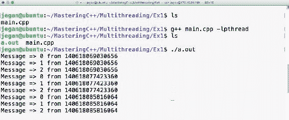
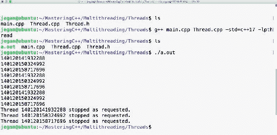
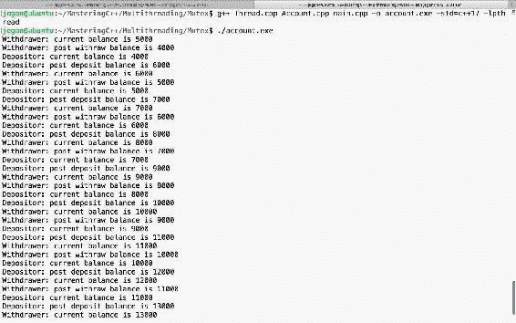
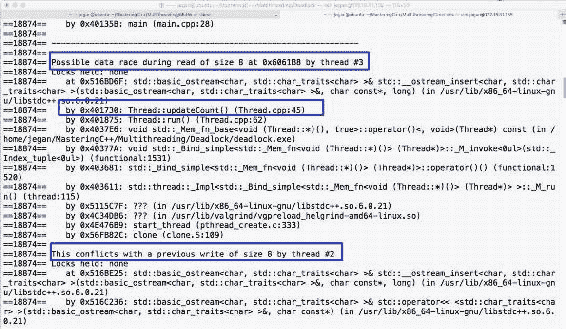
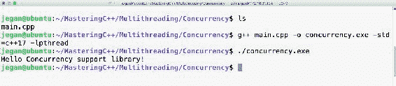

# 多线程编程和进程间通信

本章将涵盖以下主题:

*   POSIX pthreads 简介
*   使用 pthreads 库创建线程
*   线程创建和自我识别
*   开始线程
*   停止线程
*   使用 C++ 线程支持库
*   数据竞争和线程同步
*   接合和分离螺纹
*   从线程发送信号
*   将参数传递给线程
*   死锁和解决方案
*   并发
*   未来、承诺、`packaged_task`等等
*   线程支持库的并发性
*   并发应用程序中的异常处理

让我们通过本章中讨论的一些有趣、易于理解的例子来学习这些主题。

# POSIX pthreads 简介

Unix、Linux 和 macOS 基本上都符合 POSIX 标准。**Unix 的可移植操作系统接口** ( **POSIX** )是一个 IEEE 标准，帮助所有的 Unix 和类似 Unix 的操作系统，也就是 Linux 和 macOS，通过一个接口进行通信。

有趣的是，POSIX 还得到符合 POSIX 的工具的支持——Cygwin、MinGW 和 Linux 的 Windows 子系统——它们在 Windows 平台上提供了一个类似于伪 Unix 的运行时和开发环境。

请注意，pthread 是一个在 Unix、Linux 和 macOS 中使用的符合 POSIX 的 C 库。从 C++ 11 开始，C++ 通过 C++ 线程支持库和并发库本地支持线程。在本章中，我们将了解如何以面向对象的方式使用 pthreads、线程支持和并发库。此外，我们将讨论使用本机 C++ 线程支持和并发库相对于使用 POSIX pthreads 或其他第三方线程框架的优点。

# 使用 pthreads 库创建线程

让我们直接进入正题。你需要理解我们将要讨论的 pthread APIs，这样才能把你的手弄脏。首先，该函数用于创建一个新线程:

```cpp
 #include <pthread.h>
 int pthread_create(
              pthread_t *thread,
              const pthread_attr_t *attr,
              void *(*start_routine)(void*),
              void *arg
 )
```

下表简要说明了前面函数中使用的参数:

| **API 参数** | **评论** |
| `pthread_t *thread` | 线程句柄指针 |
| `pthread_attr_t *attr` | 线程属性 |
| `void *(*start_routine)(void*)` | 线程函数指针 |
| `void * arg` | 线程参数 |

此函数阻塞调用方线程，直到第一个参数中传递的线程退出，如代码所示:

```cpp
int pthread_join ( pthread_t *thread, void **retval )
```

下表简要描述了前面函数中的参数:

| **API 参数** | **评论** |
| `pthread_t thread` | 螺纹手柄 |
| `void **retval` | 指示线程过程退出代码的输出参数 |

接下来的函数应该在线程上下文中使用。这里，`retval`是线程的退出代码，表示调用该函数的线程的退出代码:

```cpp
int pthread_exit ( void *retval )
```

以下是此函数中使用的参数:

| **API 参数** | comment |
| `void *retval` | 线程过程的退出代码 |

以下函数返回线程标识:

```cpp
pthread_t pthread_self(void)
```

让我们编写第一个多线程应用程序:

```cpp
#include <pthread.h>
#include <iostream>

using namespace std;

void* threadProc ( void *param ) {
  for (int count=0; count<3; ++ count)
    cout << "Message " << count << " from " << pthread_self()
         << endl;
  pthread_exit(0);
}

int main() {
  pthread_t thread1, thread2, thread3;

  pthread_create ( &thread1, NULL, threadProc, NULL );
  pthread_create ( &thread2, NULL, threadProc, NULL );
  pthread_create ( &thread3, NULL, threadProc, NULL );

  pthread_join( thread1, NULL );
  pthread_join( thread2, NULL );

  pthread_join( thread3, NULL );

  return 0;

}
```

# 如何编译和运行

可以使用以下命令编译程序:

```cpp
g++ main.cpp -lpthread
```

如您所见，我们需要动态链接 POSIX `pthread`库。

查看下面的截图，并可视化多线程程序的输出:



用 ThreadProc 编写的代码在线程上下文中运行。前面的程序总共有四个线程，包括主线程。我已经用`pthread_join`阻塞了主线程，迫使它等待其他三个线程先完成它们的任务，否则主线程会在它们之前退出。当主线程退出时，应用程序也会退出，这最终会过早地破坏新创建的线程。

虽然我们按照各自的顺序创建了`thread1`、`thread2`和`thread3`，但不能保证它们会按照创建时的完全相同的顺序启动。

操作系统调度程序根据操作系统调度程序使用的算法来决定线程必须启动的顺序。有趣的是，线程开始的顺序在同一个系统的不同运行中可能会有所不同。

# C++ 本身支持线程吗？

从 C++ 11 开始，C++ 本身确实支持线程，它通常被称为 C++ 线程支持库。C++ 线程支持库提供了对 POSIX pthreads C 库的抽象。随着时间的推移，C++ 原生线程支持得到了更大程度的改进。

我强烈建议您在 pthreads 上使用 C++ 本机线程。所有平台都支持 C++ 线程支持库，因为它正式成为标准 C++ 的一部分，而不是 POSIX `pthread`库，后者仅在 Unix、Linux 和 macOS 上受支持，但不直接在 Windows 上受支持。

最好的部分是线程支持在 C++ 17 中已经成熟到了一个新的水平，并且它在 C++ 20 中已经准备好达到下一个水平。因此，考虑在项目中使用 C++ 线程支持库是一个好主意。

# 如何使用本机 C++ 线程特性编写多线程应用程序

有趣的是，使用 C++ 线程支持库编写多线程应用程序非常简单:

```cpp
#include <thread>
using namespace std;
thread instance ( thread_procedure )
```

`thread`类是在 C++ 11 中引入的。这个函数可以用来创建一个线程。这个函数的等价物是 POSIX `pthread`库中的`pthread_create`。

| **参数** | comment |
| `thread_procedure` | 线程函数指针 |

现在来看一下下面代码中返回线程标识的参数:

```cpp
this_thread::get_id ()
```

这个函数相当于 POSIX `pthread`库中的`pthread_self()`函数。参考以下代码:

```cpp
thread::join()
```

`join()`函数用于阻塞调用线程或主线程，以便它将等待，直到已经加入的线程完成其任务。这是非静态函数，因此必须在线程对象上调用。

让我们看看如何使用前面的函数编写一个基于 C++ 的简单多线程程序。请参考以下程序:

```cpp
#include <thread>
#include <iostream>
using namespace std;

void threadProc() {
  for( int count=0; count<3; ++ count ) {
    cout << "Message => "
         << count
         << " from "
         << this_thread::get_id()
         << endl;
  }
}

int main() {
  thread thread1 ( threadProc );
  thread thread2 ( threadProc );
  thread thread3 ( threadProc );

  thread1.join();
  thread2.join();
  thread3.join();

  return 0;
}
```

多线程程序的 C++ 版本看起来比 C 版本简单干净得多。

# 如何编译和运行

以下命令帮助您编译程序:

```cpp
g++ main.cpp -std=c++ 17 -lpthread
```

在前面的命令中，`-std=c++ 17`指示 C++ 编译器启用 C++ 17 特性；但是，程序会在任何支持 C++ 11 的 C++ 编译器上编译，你只需要把`c++ 17`换成`c++ 11`。

程序的输出如下所示:


前面截图中所有以`140`开头的数字都是线程 id。由于我们创建了三个线程，因此`pthread`库分别分配了三个唯一的线程标识。如果您真的很想找到操作系统分配的线程标识，那么在应用程序运行时，您必须在 Linux 中发出以下命令:

```cpp
 ps -T -p <process-id>
```

可能让你惊讶的是`pthread`库分配的线程 ID 会和操作系统分配的不同。因此，从技术上讲，`pthread`库分配的线程标识只是一个线程句柄标识，与操作系统分配的线程标识不同。您可能想考虑的另一个有趣的工具是`top`命令，用于探索流程中的线程:

```cpp
 top -H -p <process-id>
```

这两个命令都需要多线程应用程序的进程标识。以下命令将帮助您找到此标识:

```cpp
ps -ef | grep -i <your-application-name>
```

您也可以探索 Linux 中的`htop`实用程序。

如果你想以编程方式获取操作系统分配的线程标识，你可以在 Linux 中使用以下函数:

```cpp
#include <sys/types.h>
pid_t gettid(void)
```

但是，如果您想编写一个可移植的应用程序，不建议这样做，因为只有在 Unix 和 Linux 中才支持这样做。

# 以面向对象的方式使用标准::线程

如果您一直在寻找看起来类似于 Java 或 Qt 线程中的`Thread`类的 C++ 线程类，我相信您会发现这很有趣:

```cpp
#include <iostream>
#include <thread>
using namespace std;

class Thread {
private:
      thread *pThread;
      bool stopped;
      void run();
public:
      Thread();
      ~Thread();

      void start();
      void stop();
      void join();
      void detach();
};
```

这是一个包装类，在本书中作为 C++ 线程支持库的便利类。`Thread::run()`方法是我们自定义的线程程序。因为我不想让客户端代码直接调用`Thread::run()`方法，所以我声明了运行方法`private`。为了启动线程，客户端代码必须调用`thread`对象上的 start 方法。

对应的`Thread.cpp`源文件如下图:

```cpp
#include "Thread.h"

Thread::Thread() {
     pThread = NULL;
     stopped = false;
}

Thread::~Thread() {
     delete pThread;
     pThread = NULL;
}

void Thread::run() {

     while ( ! stopped ) {
         cout << this_thread::get_id() << endl;
         this_thread::sleep_for ( 1s );
     }
     cout << "\nThread " << this_thread::get_id()
          << " stopped as requested." << endl;
     return;
}

void Thread::stop() {
    stopped = true;
}

void Thread::start() {
    pThread = new thread( &Thread::run, this );
}

void Thread::join() {
     pThread->join();
}

void Thread::detach() {
     pThread->detach();
}
```

从之前的`Thread.cpp`源文件中，你就已经明白了通过调用`stop`方法可以在需要的时候停止线程。这是一个简单而体面的实现；然而，在它可以用于生产之前，还有许多其他的角落情况需要处理。然而，这个实现足够好，可以理解本书中的线程概念。

酷，让我们看看我们的`Thread`类如何在`main.cpp`中使用:

```cpp
#include "Thread.h"

int main() {

      Thread thread1, thread2, thread3;

      thread1.start();
      thread2.start();
      thread3.start();

      thread1.detach();
      thread2.detach();
      thread3.detach();

      this_thread::sleep_for ( 3s );

      thread1.stop();
      thread2.stop();
      thread3.stop();

      this_thread::sleep_for ( 3s );

      return 0;
}
```

我已经创建了三个线程，按照`Thread`类的设计方式，线程只会在`start`函数被调用时才会启动。分离的线程在后台运行；通常，如果您想让线程成为守护进程，您需要分离一个线程。但是，在应用程序退出之前，这些线程会安全地停止。

# 如何编译和运行

以下命令有助于编译程序:

```cpp
g++ Thread.cpp main.cpp -std=c++ 17 -o threads.exe -lpthread
```

程序的输出将如下图所示:



哇哦！我们可以按照设计启动和停止线程，也可以以面向对象的方式启动和停止线程。

# 你学到了什么？

让我们试着回忆一下到目前为止我们讨论过的内容:

*   您已经学习了如何使用 POSIX `pthread` C 库编写多线程应用程序
*   C++ 编译器从 C++ 11 开始支持线程
*   您已经学习了常用的基本 C++ 线程支持库 API
*   您学习了如何使用 C++ 线程支持库编写多线程应用程序
*   现在您知道为什么您应该考虑使用 C++ 线程支持库而不是`pthread` C 库了
*   C++ 线程支持库是跨平台的，不像 POSIX `pthread`库
*   您知道如何以面向对象的方式使用 C++ 线程支持库
*   您知道如何编写不需要同步的简单多线程应用程序

# 同步线程

在理想情况下，线程会提供更好的应用程序性能。但是，有时，注意到应用程序性能由于多线程而降低并不罕见。这个性能问题可能并不真正与多线程有关；真正的罪魁祸首可能是设计。过多使用同步会导致许多与线程相关的问题，这些问题也会导致应用程序性能下降。

无锁线程设计不仅避免了与线程相关的问题，还提高了应用程序的整体性能。然而，在实际世界中，不止一个线程可能必须共享一个或多个公共资源。因此，需要同步访问或修改共享资源的代码的关键部分。有多种同步机制可用于特定场景。在接下来的部分中，我们将通过一些有趣且实用的用例来逐一探讨它们。

# 如果线程不同步会发生什么？

当进程边界内有多个线程共享一个公共资源时，代码的关键部分可以与互斥锁同步。互斥锁是一种互斥锁，只允许一个线程访问由互斥锁保护的关键代码块。让我们举一个简单的例子来实际理解互斥锁应用程序的需求。

让我们来看一个允许三个简单操作的`Bank Savings Account`类，即`getBalance`、`withdraw`和`deposit`。`Account`类可以实现如下代码所示。出于演示的目的，`Account`类以简单的方式设计，忽略了现实世界中需要的角落案例和验证。简化到`Account`类连账号都懒得捕捉的程度。我相信有很多这样的要求为了简单而被悄悄地忽略了。不用担心！我们的重点是通过所示的例子来学习互斥体:

```cpp
#include <iostream>
using namespace std;

class Account {
private:
  double balance;
public:
  Account( double );
  double getBalance( );
  void deposit ( double amount );
  void withdraw ( double amount ) ;
};
```

`Account.cpp`源文件是这样的:

```cpp
#include "Account.h"

Account::Account(double balance) {
  this->balance = balance;
}

double Account::getBalance() {
  return balance;
}

void Account::withdraw(double amount) {
  if ( balance < amount ) {
    cout << "Insufficient balance, withdraw denied." << endl;
    return;
  }

  balance = balance - amount;
}

void Account::deposit(double amount) {
  balance = balance + amount;
}
```

现在，让我们创建两个线程，即`DEPOSITOR`和`WITHDRAWER`。`DEPOSITOR`线程将存入 2000.00 印度卢比，而`WITHDRAWER`线程将每隔一秒提取 1000.00 印度卢比。根据我们的设计，`main.cpp`源文件可以实现如下:

```cpp
#include <thread>
#include "Account.h"
using namespace std;

enum ThreadType {
  DEPOSITOR,
  WITHDRAWER
};

Account account(5000.00);

void threadProc ( ThreadType typeOfThread ) {

  while ( 1 ) {
  switch ( typeOfThread ) {
    case DEPOSITOR: {
      cout << "Account balance before the deposit is "
           << account.getBalance() << endl;

      account.deposit( 2000.00 );

      cout << "Account balance after deposit is "
           << account.getBalance() << endl;
      this_thread::sleep_for( 1s );
}
break;

    case WITHDRAWER: {
      cout << "Account balance before withdrawing is "
           << account.getBalance() << endl;

      account.deposit( 1000.00 );
      cout << "Account balance after withdrawing is "
           << account.getBalance() << endl;
      this_thread::sleep_for( 1s );
    }
    break;
  }
  }
}

int main( ) {
  thread depositor ( threadProc, ThreadType::DEPOSITOR );
  thread withdrawer ( threadProc, ThreadType::WITHDRAWER );

  depositor.join();
  withdrawer.join();

  return 0;
}
```

如果观察`main`函数，线程构造器接受两个参数。第一个参数是您现在已经熟悉的线程过程。第二个参数是可选参数，如果您想将一些参数传递给线程函数，可以提供该参数。

# 如何编译和运行

可以使用以下命令编译程序:

```cpp
g++ Account.cpp main.cpp -o account.exe -std=c++ 17 -lpthread
```

如果您已经按照指示完成了所有步骤，那么您的代码应该会编译成功。

是时候执行和观察我们的程序如何工作了！

别忘了`WITHDRAWER`螺纹总是退 INR 1000.00，而`DEPOSITOR`螺纹总是存 INR 2000.00。以下输出首先传达了这一点。`WITHDRAWER`线开始退出，接着是`DEPOSITOR`线，看起来是存了钱。

虽然我们先启动了`DEPOSITOR`线程，然后启动了`WITHDRAWER`线程，但是看起来操作系统调度器似乎已经先调度了`WITHDRAWER`线程。不能保证这种情况会一直这样发生。

从输出来看，`WITHDRAWER`线程和`DEPOSITOR`线程似乎交替工作。他们会这样持续一段时间。在某个时候，两个线程似乎同时工作，这就是事情会分崩离析的时候，如前面的输出所示:


观察输出的最后四行非常有趣。看起来`WITHDRAWER`和`DEPOSITOR`线程都在检查余额，是 9000.00 INR。您可能会注意到`DEPOSITOR`线程的打印语句不一致；根据`DEPOSITOR`线程，当前余额为 9000.00 印度卢比。因此，当其存款 2000.00 印度卢比时，余额合计应达到 11000.00 印度卢比。但实际上，存款后的余额是 10000.00 印度卢比。这种不一致的原因是`WITHDRAWER`线程在`DEPOSITOR`线程可以存款之前提取了 1000.00 印度卢比。虽然从技术上来说，这种平衡似乎是正确的，但事情很快就会出错；这是需要线程同步的时候。

# 让我们使用互斥体

现在，让我们重构`threadProc`函数，同步修改和访问余额的关键部分。我们需要一个只允许一个线程读取或写入余额的锁定机制。C++ 线程支持库提供了一个名为`mutex`的合适的锁。`mutex`锁是一个排他锁，只允许一个线程在同一个进程边界内操作临界区代码。在获得锁的线程释放`mutex`锁之前，所有其他线程都必须等待轮到它们。一旦线程获得了`mutex`锁，该线程就可以安全地访问共享资源。

`main.cpp`文件可以重构如下；这些更改以粗体突出显示:

```cpp
#include <iostream>
#include <thread>
#include <mutex>
#include "Account.h"
using namespace std;

enum ThreadType {
  DEPOSITOR,
  WITHDRAWER
};

mutex locker;

Account account(5000.00);

void threadProc ( ThreadType typeOfThread ) {

  while ( 1 ) {
  switch ( typeOfThread ) {
    case DEPOSITOR: {

      locker.lock();

      cout << "Account balance before the deposit is "
           << account.getBalance() << endl;

      account.deposit( 2000.00 );

      cout << "Account balance after deposit is "
           << account.getBalance() << endl;

      locker.unlock();
      this_thread::sleep_for( 1s );
}
break;

    case WITHDRAWER: {

      locker.lock();

      cout << "Account balance before withdrawing is "
           << account.getBalance() << endl;

      account.deposit( 1000.00 );
      cout << "Account balance after withdrawing is "
           << account.getBalance() << endl;

      locker.unlock();
      this_thread::sleep_for( 1s );
    }
    break;
  }
  }
}

int main( ) {
  thread depositor ( threadProc, ThreadType::DEPOSITOR );
  thread withdrawer ( threadProc, ThreadType::WITHDRAWER );

  depositor.join();
  withdrawer.join();

  return 0;
}
```

您可能已经注意到互斥体是在全局范围内声明的。理想情况下，我们可以将类内部的互斥体声明为静态成员，而不是全局变量。由于所有线程都应该由同一个互斥体同步，所以要确保使用全局`mutex`锁或静态`mutex`锁作为类成员。

`main.cpp`源文件中重构的`threadProc`如下图；这些更改以粗体突出显示:

```cpp
void threadProc ( ThreadType typeOfThread ) {

  while ( 1 ) {
  switch ( typeOfThread ) {
    case DEPOSITOR: {

      locker.lock();

      cout << "Account balance before the deposit is "
           << account.getBalance() << endl;

      account.deposit( 2000.00 );

      cout << "Account balance after deposit is "
           << account.getBalance() << endl;

      locker.unlock();
      this_thread::sleep_for( 1s );
}
break;

    case WITHDRAWER: {

      locker.lock();

      cout << "Account balance before withdrawing is "
           << account.getBalance() << endl;

      account.deposit( 1000.00 );
      cout << "Account balance after withdrawing is "
           << account.getBalance() << endl;

      locker.unlock();
      this_thread::sleep_for( 1s );
    }
    break;
  }
  }
}
```

包装在`lock()`和`unlock()`之间的代码是互斥锁同步的关键部分。

可以看到`threadProc`函数中有两个临界段块，所以要明白只有一个线程可以进入临界段，这一点很重要。例如，如果淀积器线程已经进入它的临界区，那么提取线程必须等待，直到淀积器线程释放锁，反之亦然。

Technically speaking, we could replace all the raw `lock()` and `unlock()` mutex methods with `lock_guard` as this ensures the mutex is always unlocked even if the critical section block of the code throws an exception. This will avoid starving and deadlock scenarios.

是时候检查我们重构程序的输出了:


太好了，你查过`DEPOSITOR`和`WITHDRAWER`线程上报的余额了吗？是的，他们总是一致的，不是吗？是的，输出确认代码是同步的，并且现在是线程安全的。

虽然我们的代码在功能上是正确的，但是还有改进的空间。让我们重构代码，使其面向对象且高效。

让我们重用`Thread`类，抽象`Thread`类中所有与线程相关的东西，去掉全局变量和`threadProc`。

首先，让我们观察重构的`Account.h`头，如下所示:

```cpp
#ifndef __ACCOUNT_H
#define __ACCOUNT_H

#include <iostream>
using namespace std;

class Account {
private:
  double balance;
public:
  Account( double balance );
  double getBalance();
  void deposit(double amount);
  void withdraw(double amount);
};

#endif
```

可以看到`Account.h`表头没有变化，因为已经看起来很干净了。

相应的`Account.cpp`源文件如下所示:

```cpp
#include "Account.h"

Account::Account(double balance) {
  this->balance = balance;
}

double Account::getBalance() {
  return balance;
}

void Account::withdraw(double amount) {
  if ( balance < amount ) {
    cout << "Insufficient balance, withdraw denied." << endl;
    return;
  }

  balance = balance - amount;
}

void Account::deposit(double amount) {
  balance = balance + amount;
}
```

最好将`Account`类从线程相关的功能中分离出来，以保持整洁。此外，让我们了解一下如何重构我们编写的`Thread`类，以使用前面显示的互斥同步机制:

```cpp
#ifndef __THREAD_H
#define __THREAD_H

#include <iostream>
#include <thread>
#include <mutex>
using namespace std;
#include "Account.h"

enum ThreadType {
   DEPOSITOR,
   WITHDRAWER
};

class Thread {
private:
      thread *pThread;
      Account *pAccount;
      static mutex locker;
      ThreadType threadType;
      bool stopped;
      void run();
public:
      Thread(Account *pAccount, ThreadType typeOfThread);
      ~Thread();
      void start();
      void stop();
      void join();
      void detach();
};

#endif
```

在前面显示的`Thread.h`头文件中，作为重构的一部分，做了一些更改。因为我们希望使用互斥来同步线程，所以`Thread`类包含了 C++ 线程支持库的互斥头。由于所有线程都应该使用相同的`mutex`锁，因此`mutex`实例被声明为静态的。由于所有线程将共享同一个`Account`对象，`Thread`类有一个指向`Account`对象的指针，而不是堆栈对象。

`Thread::run()`方法是我们将要提供给 C++ 线程支持库的`Thread`类构造器的`Thread`函数。由于预计没有人会直接调用`run`方法，因此`run`方法被声明为私有。根据我们的`Thread`类设计，类似于 Java 和 Qt，客户端代码只会调用`start`方法；当操作系统调度程序向`run`发出绿色信号时，`run`线程程序将被自动调用。实际上，这里没有魔法，因为`run`方法地址在创建线程时注册为`Thread`函数。

Generally, I prefer to include all the dependent headers in the user-defined header file, and the user-defined source file includes only its own header. This helps organize the headers in one place, and this discipline helps maintain the code cleaner and also improves the overall readability and code maintainability.

`Thread.cpp`源可以重构如下:

```cpp
#include "Thread.h"

mutex Thread::locker;

Thread::Thread(Account *pAccount, ThreadType typeOfThread) {
  this->pAccount = pAccount;
  pThread = NULL;
  stopped = false;
  threadType = typeOfThread;
}

Thread::~Thread() {
  delete pThread;
  pThread = NULL;
}

void Thread::run() {
    while(1) {
  switch ( threadType ) {
    case DEPOSITOR:
      locker.lock();

      cout << "Depositor: current balance is " << pAccount->getBalance() << endl;
      pAccount->deposit(2000.00);
      cout << "Depositor: post deposit balance is " << pAccount->getBalance() << endl;

      locker.unlock();

      this_thread::sleep_for(1s);
      break;

    case WITHDRAWER:
      locker.lock();

      cout << "Withdrawer: current balance is " << 
               pAccount->getBalance() << endl;
      pAccount->withdraw(1000.00);
      cout << "Withdrawer: post withraw balance is " << 
               pAccount->getBalance() << endl;

      locker.unlock();

      this_thread::sleep_for(1s);
      break;
  }
    }
}

void Thread::start() {
  pThread = new thread( &Thread::run, this );
}

void Thread::stop() {
  stopped = true;
}

void Thread::join() {
  pThread->join();
}

void Thread::detach() {
  pThread->detach();
}
```

`main.cpp`中的`threadProc`功能已经移到了`Thread`类的`run`方法中。毕竟，`main`函数或`main.cpp`源文件不应该有任何类型的业务逻辑，因此它们被重构以提高代码质量。

现在来看看重构后的`main.cpp`源文件有多干净:

```cpp
#include "Account.h"
#include "Thread.h"

int main( ) {

  Account account(5000.00);

  Thread depositor ( &account, ThreadType::DEPOSITOR );
  Thread withdrawer ( &account, ThreadType::WITHDRAWER );

  depositor.start();
  withdrawer.start();

  depositor.join();
  withdrawer.join();

  return 0;
}
```

之前显示的`main()`函数和整个`main.cpp`源文件看起来简短，没有任何令人讨厌的复杂业务逻辑。

C++ supports five types of mutexes, namely `mutex`, `timed_mutex`, `recursive_mutex`, `recursive_timed_mutex`, and `shared_timed_mutex`.

# 如何编译和运行

以下命令帮助您编译重构的程序:

```cpp
g++ Thread.cpp Account.cpp main.cpp -o account.exe -std=c++ 17 -lpthread
```

太棒了！如果一切顺利，程序应该能顺利编译，不会发出任何噪音。

在我们进入下一个主题之前，请快速查看此处显示的输出:



太好了。效果不错。`DEPOSITOR`和`WITHDRAWER`线程似乎可以协同工作，而不会打乱平衡和打印语句。毕竟，我们已经重构了代码，在不修改功能的情况下使代码更加清晰。

# 什么是僵局？

在多线程应用程序中，在我们遇到死锁之前，一切看起来都很酷很有趣。假设有两个线程，即`READER`和`WRITER`。当`READER`线程等待一个已经被`WRITER`获得的锁，而`WRITER`线程等待读取器释放一个属于`READER`的锁时，可能会发生死锁，反之亦然。通常，在死锁情况下，两个线程会无休止地等待对方。

通常，死锁是设计问题。有时，死锁可以很快被检测到，但有时找到根本原因可能会变得非常棘手。因此，底线是同步机制必须在正确的意义上深思熟虑地使用。

让我们用一个简单而实用的例子来理解死锁的概念。我将重用我们的`Thread`类，做一些细微的修改来创建一个死锁场景。

修改后的`Thread.h`表头如下:

```cpp
#ifndef __THREAD_H
#define __THREAD_H

#include <iostream>
#include <string>
#include <thread>
#include <mutex>
#include <string>
using namespace std;

enum ThreadType {
  READER,
  WRITER
};

class Thread {
private:
  string name;
  thread *pThread;
  ThreadType threadType;
  static mutex commonLock;
  static int count;
  bool stopped;
  void run( );
public:
  Thread ( ThreadType typeOfThread );
  ~Thread( );
  void start( );
  void stop( );
  void join( );
  void detach ( );
  int getCount( );
  int updateCount( );
};
#endif
```

`ThreadType`枚举有助于将特定任务分配给线程。`Thread`类有两个新方法:`Thread::getCount()`和`Thread::updateCount()`。这两种方法都将与一个公共的`mutex`锁同步，这样就会产生死锁的情况。

好了，让我们继续回顾`Thread.cpp`源文件:

```cpp
#include "Thread.h"

mutex Thread::commonLock;

int Thread::count = 0;

Thread::Thread( ThreadType typeOfThread ) {
  pThread = NULL;
  stopped = false;
  threadType = typeOfThread;
  (threadType == READER) ? name = "READER" : name = "WRITER";
}

Thread::~Thread() {
  delete pThread;
  pThread = NULL;
}

int Thread::getCount( ) {
  cout << name << " is waiting for lock in getCount() method ..." <<
endl;
  lock_guard<mutex> locker(commonLock);
  return count;
}

int Thread::updateCount( ) {
  cout << name << " is waiting for lock in updateCount() method ..." << endl;
  lock_guard<mutex> locker(commonLock);
  int value = getCount();
  count = ++ value;
  return count;
}

void Thread::run( ) {
  while ( 1 ) {
    switch ( threadType ) {
      case READER:
        cout << name<< " => value of count from getCount() method is " << getCount() << endl;
        this_thread::sleep_for ( 500ms );
      break;

      case WRITER:
        cout << name << " => value of count from updateCount() method is" << updateCount() << endl;
        this_thread::sleep_for ( 500ms );
      break;
    }
  }
}

void Thread::start( ) {
  pThread = new thread ( &Thread::run, this );
}

void Thread::stop( ) {
  stopped = true;
}

void Thread::join( ) {
  pThread->join();
}

void Thread::detach( ) {
  pThread->detach( );
}
```

到现在，你对`Thread`课已经相当熟悉了。因此，让我们集中讨论`Thread::getCount()`和`Thread::updateCount()`方法。`std::lock_guard<std::mutex>`是一个模板类，让我们不用再叫`mutex::unlock()`。在堆栈展开过程中，`lock_guard`析构函数将被调用；这将调用`mutex::unlock()`。

底线是从创建`std::lock_guard<std::mutex>`实例开始，直到方法结束出现的所有语句都由互斥锁保护。
好的，让我们进入`main.cpp`文件:

```cpp
#include <iostream>
using namespace std;

#include "Thread.h"

int main ( ) {

      Thread reader( READER );
      Thread writer( WRITER );
      reader.start( );
      writer.start( );
      reader.join( );
      writer.join( );
      return 0;
}
```

`main()`函数非常不言自明。我们创建了两个线程，即`reader`和`writer`，它们是在创建了各自的线程之后开始的。主线程被迫等待，直到读取器和写入器线程退出。

# 如何编译和运行

您可以使用以下命令编译该程序:

```cpp
g++ Thread.cpp main.cpp -o deadlock.exe -std=c++ 17 -lpthread
```

观察程序的输出，如下所示:


参考`Thread::getCount()`和`Thread::updateCount()`方法的代码片段:

```cpp
int Thread::getCount() {
         cout << name << " is waiting for lock in getCount() method ..." << endl;
         lock_guard<mutex> locker(commonLock);
         cout << name << " has acquired lock in getCount() method ..." << endl;
         return count;
}
int Thread::updateCount() {
        count << name << " is waiting for lock in updateCount() method ..." << endl;
        lock_guard<mutex> locker(commonLock);
        cout << name << " has acquired lock in updateCount() method ..." << endl;
        int value = getCount();
        count = ++ value;
        return count;
}
```

从前面输出的截图图片中，我们可以了解到`WRITER`线程似乎先开始了。根据我们的设计，`WRITER`线程将调用`Thread::updateCount()`方法，该方法又将调用`Thread::getCount()`方法。

从输出的截图中，从打印语句中可以明显看出`Thread::updateCount()`方法首先获取了锁，然后调用了`Thread::getCount()`方法。但是由于`Thread::updateCount()`方法没有释放互斥锁，所以`WRITER`线程调用的`Thread::getCount()`方法无法继续。同时，操作系统调度器已经启动`READER`线程，似乎在等待`WRITER`线程获取的`mutex`锁。因此，`READER`线程要完成任务，必须获得`Thread::getCount()`方法上的锁；然而，在`WRITER`线程释放锁之前，这是不可能的。更糟糕的是，`WRITER`线程只有在自己的`Thread::getCount()`方法调用完成任务后才能完成任务。这就是所谓的**死锁**。

这不是设计问题，就是逻辑问题。在 Unix 或 Linux 中，我们可以利用 Helgrind 工具通过竞争类似的同步问题来寻找死锁。Helgrind 工具与 Valgrind 工具一起提供。最棒的是 Valgrind 和 Helgrind 都是开源工具。

为了获得导致死锁或争用问题的源代码行号，我们需要在调试模式下编译我们的代码，如现在显示的`-g`标志所示:

```cpp
g++ main.cpp Thread.cpp -o deadlock.exe -std=c++ 17 -lpthread -g
```

Helgrind 工具可用于检测死锁和类似问题，如下所示:

```cpp
valgrind --tool=helgrind ./deadlock.exe
```

以下是瓦尔基林输出的简短摘录:



解决这个问题的一个简单方法是重构`Thread::updateCount()`方法，如下所示:

```cpp
int Thread::updateCount() {
        int value = getCount();

        count << name << " is waiting for lock in updateCount() method ..." << endl;
        lock_guard<mutex> locker(commonLock);
        cout << name << " has acquired lock in updateCount() method ..." << endl;
        count = ++ value;

        return count;
}
```

重构程序的输出如下:


有趣的是，对于大多数复杂的问题，解决方案通常会非常简单。换句话说，愚蠢的错误有时可能会导致严重的关键错误。

Ideally, we should strive to prevent the deadlock issue during the design phase so that we wouldn't have to break our head doing complex debugging. The C++ thread support library mutex class offers `mutex::try_lock()` (since C++ 11 ), `std::timed_mutex` (since C++ 11), and `std::scoped_lock` ( since C++ 17 ) to avoid deadlocks and similar issues.

# 你学到了什么？

让我们总结一下要点:

*   我们应该尽可能设计无锁线程
*   与高度同步/顺序线程相比，无锁线程的性能更好
*   互斥是互斥的同步原语
*   互斥有助于同步共享资源的访问，一次一个线程
*   死锁的发生是因为互斥锁的使用不当，或者一般来说，是因为任何同步原语的使用不当
*   死锁是逻辑或设计问题的结果
*   可以使用 Unix 和 Linux 操作系统中的 Helgrind/Valgrind 开源工具来检测死锁

# 共享互斥体

共享互斥同步原语支持两种模式，即共享和独占。在共享模式下，共享互斥体将允许许多线程同时共享资源，而没有任何数据竞争问题。在独占模式下，它就像常规互斥体一样工作，也就是说，它只允许一个线程访问资源。如果您有多个可以安全访问资源的读取器，并且只允许一个线程修改共享资源，那么这是一个合适的锁原语。更多细节请参考 C++ 17 章节。

# 条件变量

条件变量同步原语用于两个或多个线程需要相互通信时，并且仅当它们接收到特定信号或事件时才继续。等待特定信号或事件的线程必须在开始等待信号或事件之前获取互斥体。

让我们试着理解生产者/消费者问题的条件变量的用例。我将创建两个线程，即`PRODUCER`和`CONSUMER`。`PRODUCER`线程将向队列中添加一个值，并通知`CONSUMER`线程。`CONSUMER`线程将等待`PRODUCER`的通知。收到`PRODUCER`线程的通知后，`CONSUMER`线程将从队列中删除条目并打印。

让我们了解一下这里显示的`Thread.h`头是如何利用条件变量和互斥体的:

```cpp
#include <iostream>
#include <thread>
#include <mutex>
#include <condition_variable>
#include <queue>
#include <string>

using namespace std;

enum ThreadType {
  PRODUCER,
  CONSUMER
};

class Thread {
private:
  static mutex locker;
  static condition_variable untilReady;
  static bool ready;
  static queue<int> appQueue;
  thread *pThread;
  ThreadType threadType;
  bool stopped;
  string name;

  void run();
public:
  Thread(ThreadType typeOfThread);
  ~Thread();
  void start();
  void stop();
  void join();
  void detach();
};
```

由于`PRODUCER`和`CONSUMER`线程应该使用相同的互斥体和`conditional_variable`，它们被声明为静态的。条件变量同步原语需要一个谓词函数来使用就绪布尔标志。因此，我也在静态范围内声明了就绪标志。

让我们进入`Thread.cpp`源文件，如下所示:

```cpp
#include "Thread.h"

mutex Thread::locker;
condition_variable Thread::untilReady;
bool Thread::ready = false;
queue<int> Thread::appQueue;

Thread::Thread( ThreadType typeOfThread ) {
  pThread = NULL;
  stopped = false;
  threadType = typeOfThread;
  (CONSUMER == typeOfThread) ? name = "CONSUMER" : name = "PRODUCER";
}

Thread::~Thread( ) {
  delete pThread;
  pThread = NULL;
}

void Thread::run() {
  int count = 0;
  int data = 0;
  while ( 1 ) {
    switch ( threadType ) {
    case CONSUMER: 
    {

      cout << name << " waiting to acquire mutex ..." << endl;

      unique_lock<mutex> uniqueLocker( locker );

      cout << name << " acquired mutex ..." << endl;
      cout << name << " waiting for conditional variable signal..." << endl;

      untilReady.wait ( uniqueLocker, [] { return ready; } );

      cout << name << " received conditional variable signal ..." << endl;

      data = appQueue.front( ) ;

      cout << name << " received data " << data << endl;

      appQueue.pop( );
      ready = false;
    }
      cout << name << " released mutex ..." << endl;
    break;

    case PRODUCER:
    {
      cout << name << " waiting to acquire mutex ..." << endl;
      unique_lock<mutex> uniqueLocker( locker );
      cout << name << " acquired mutex ..." << endl;
      if ( 32000 == count ) count = 0;
      appQueue.push ( ++ count );
      ready = true;
      uniqueLocker.unlock();
      cout << name << " released mutex ..." << endl;
      untilReady.notify_one();
      cout << name << " notified conditional signal ..." << endl;
    }
    break;
  }
  }
}

void Thread::start( ) {
  pThread = new thread ( &Thread::run, this );
}

void Thread::stop( ) {
  stopped = true;
}

void Thread::join( ) {
  pThread->join( );
}

void Thread::detach( ) {
  pThread->detach( );
}
```

在前面的`Thread`课中，我使用了`unique_lock<std::mutex>`。`conditional_variable::wait()`方法预期`unique_lock`，因此我在这里使用`unique_lock`。现在`unique_lock<std::mutex>`支持所有权转移、递归锁定、延迟锁定、手动锁定、解锁不删除`unique_lock`，不像`lock_guard<std::mutex>`。`lock_guard<std::mutex>`实例立即锁定互斥体，当`lock_guard<std::mutex>`实例超出范围时，互斥体自动解锁。但是`lock_guard`不支持手动解锁。

因为我们没有用延迟锁定选项创建`unique_lock`实例，`unique_lock`将立即锁定互斥体，就像`lock_guard`一样。

`Thread::run()`方法是我们的线程函数。根据提供给`Thread`构造器的`ThreadType`，线程实例将表现为`PRODUCER`或`CONSUMER`线程。

`PRODUCER`线程首先锁定互斥体，并向队列追加一个整数，该整数在`PRODUCER`和`CONSUMER`线程之间共享。一旦队列更新，`PRODUCER`会在通知`CONSUMER`前解锁互斥体；否则，`CONSUMER`将无法获取互斥并接收条件变量信号。

`CONSUMER`线程首先获取互斥体，然后等待条件变量信号。接收到条件信号后，`CONSUMER`线程从队列中检索该值并打印该值并重置就绪标志，以便重复该过程，直到应用程序终止。

It is recommended to make use of `unique_lock<std::mutex>`, `lock_guard<std::mutex>`, or `scoped_lock<std::mutex>` to avoid deadlocks. At times, it is possible we may not unlock the mutex that leads to deadlocks; hence, the use of mutex directly isn't recommended.

现在让我们看看`main.cpp`文件中的代码:

```cpp
#include "Thread.h"

int main ( ) {

  Thread producer( ThreadType::PRODUCER );
  Thread consumer( ThreadType::CONSUMER );

  producer.start();
  consumer.start();

  producer.join();
  consumer.join();

  return 0;
} 
```

# 如何编译和运行

使用以下命令编译程序:

```cpp
g++ Thread.cpp main.cpp -o conditional_variable.exe -std=c++ 17 -lpthread
```

以下快照演示了程序的输出:


太好了。我们的条件变量演示工作正常。生产者线程和消费者线程在条件变量的帮助下协同工作。

# 你学到了什么？

让我总结一下您在本节中学到的要点:

*   多个线程可以通过使用条件变量相互发送信号来协同工作
*   条件变量要求等待线程在等待条件信号之前获取互斥体
*   每个条件变量都需要接受互斥体的`unique_lock`
*   `unique_lock<std::mutex>`方法的工作方式与`lock_guard<std::mutex>`完全一样，具有一些额外的有用功能，如延迟锁定、手动锁定/解锁、所有权转移等
*   `Unique_lock`有助于避免死锁，就像`lock_guard`一样，当`unique_lock`实例超出范围时，`unique_lock`包装的互斥体会自动解锁
*   您学习了如何编写一个多线程应用程序，该应用程序包含相互发送同步信号的线程

# 旗语

信号量是另一种有用的线程同步机制。但是与互斥不同，信号量允许多个线程同时访问相似的共享资源。其同步原语支持两种类型，即二进制信号量和计数信号量。

二进制信号量就像互斥体一样工作，也就是说，在任何时候只有一个线程可以访问共享资源。但是，不同的是互斥锁只能由拥有它的同一个线程释放；然而，任何线程都可以释放信号量锁。另一个显著的区别是，通常互斥体在进程边界内工作，而信号量在进程边界内使用。这是因为它是一个重量级锁，不像互斥锁。但是，如果在共享内存区域中创建，互斥体也可以在整个进程中使用。

计算信号量可以让多个线程共享有限数量的共享资源。互斥体允许一个线程一次访问共享资源，而计数信号量允许多个线程共享有限数量的资源，通常至少两个或更多。如果一次一个线程地访问一个共享资源，但是线程跨越了进程边界，那么可以使用二进制信号量。虽然在同一个进程中使用二进制信号量是可能的，因为二进制信号量很大，但它并不高效，但它也可以在同一个进程中工作。

不幸的是，C++ 线程支持库在 C++ 17 之前不支持信号量和共享内存。C++ 17 支持使用原子操作的无锁编程，这必须确保原子操作是线程安全的。信号量和共享内存允许来自其他进程的线程修改共享资源，这对并发模块来说是一个相当大的挑战，以确保跨进程边界的原子操作的线程安全。C++ 20 似乎在并发性上下了很大的赌注，因此我们需要等待并观察它的变化。

然而，这并没有阻止您使用线程支持库提供的互斥体和条件变量来实现自己的信号量。开发一个在进程边界内共享公共资源的自定义信号量类相对容易，但是信号量有两种类型:命名的和未命名的。命名信号量用于跨边界同步公共资源，这很棘手。

或者，您可以围绕 POSIX pthreads 信号量原语编写一个包装类，它支持命名和未命名信号量。如果您正在开发一个跨平台的应用程序，编写跨所有平台工作的可移植代码是一项要求。如果你沿着这条路走下去，你可能最终会为每个平台编写特定于平台的代码——是的，我听说过；听起来很奇怪，对吧？

Qt 应用程序框架本地支持信号量。使用 Qt 框架是一个很好的选择，因为它是跨平台的。缺点是 Qt 框架是第三方框架。

底线是，你可能必须在 pthreads 和 Qt 框架之间做出选择，或者重构你的设计，尝试用原生 C++ 特性来解决问题。仅使用 C++ 原生特性来限制应用程序开发很困难，但可以保证跨所有平台的可移植性。

# 并发

每种现代编程语言都支持并发，提供高级 API，允许同时执行许多任务。C++ 支持从 C++ 11 开始的并发性，并且在 C++ 14 和 C++ 17 中进一步添加了更复杂的 API。虽然 C++ 线程支持库允许多线程，但它需要使用复杂的同步编写冗长的代码；然而，并发性让我们可以执行独立的任务——甚至循环迭代也可以并发运行，而无需编写复杂的代码。底线是并行化通过并发性变得更加容易。

并发支持库是对 C++ 线程支持库的补充。这两个强大的库的结合使用使得 C++ 中的并发编程更加容易。

让我们在下面名为`main.cpp`的文件中使用 C++ 并发编写一个简单的`Hello World`程序:

```cpp
#include <iostream>
#include <future>
using namespace std;

void sayHello( ) {
  cout << endl << "Hello Concurrency support library!" << endl;
}

int main ( ) {
  future<void> futureObj = async ( launch::async, sayHello );
  futureObj.wait( );

  return 0;
}
```

我们试着了解一下`main()`功能。Future 是并发模块的一个对象，它帮助调用者函数以异步方式检索线程传递的消息。`future<void>`中的 void 表示`sayHello()`线程函数，该函数不会向调用者传递任何消息，即`main`线程函数。`async`类允许我们在两种模式下执行一个功能，即`launch::async`或`launch::deferred`模式。

`launch::async`模式允许`async`对象在单独的线程中启动`sayHello()`方法，而`launch::deferred`模式允许`async`对象在不创建单独线程的情况下调用`sayHello()`功能。在`launch::deferred`模式下，`sayHello()`方法调用会有所不同，直到调用线程调用`future::get()`方法。

`futureObj.wait()`语音用于阻塞主线程，让`sayHello()`功能完成任务。`future::wait()`功能类似于线程支持库中的`thread::join()`。

# 如何编译和运行

让我们继续使用以下命令编译程序:

```cpp
g++ main.cpp -o concurrency.exe -std=c++ 17 -lpthread
```

让我们启动`concurrency.exe`，如前所示，并了解其工作原理:



# 使用并发支持库的异步消息传递

让我们稍微修改一下`main.cpp`，上一节写的 Hello World 程序。让我们了解如何将消息从`Thread`函数异步传递给调用者函数:

```cpp
#include <iostream>
#include <future>
using namespace std;

void sayHello( promise<string> promise_ ) {
  promise_.set_value ( "Hello Concurrency support library!" );
}

int main ( ) {
  promise<string> promiseObj;

  future<string> futureObj = promiseObj.get_future( );
  async ( launch::async, sayHello, move( promiseObj ) );
  cout << futureObj.get( ) << endl;

  return 0;
}
```

在之前的程序中，`sayHello()`线程函数使用`promiseObj`将消息异步传递给主线程。注意`promise<string>`暗示`sayHello()`函数预期传递一个字符串消息，因此主线程检索`future<string>`。`future::get()`函数调用将被阻止，直到`sayHello()`线程函数调用`promise::set_value()`方法。

然而，重要的是要理解`future::get()`必须只被调用一次，因为对应的`promise`对象将在调用`future::get()`方法后被析构。

你注意到`std::move()`功能的使用了吗？`std::move()`功能基本上将`promiseObj`的所有权转移到`sayHello()`线程功能，因此`std::move()`被调用后`promiseObj`不能从`main`线程访问。

# 如何编译和运行

让我们继续使用以下命令编译程序:

```cpp
g++ main.cpp -o concurrency.exe -std=c++ 17 -lpthread
```

通过启动`concurrency.exe`观察`concurrency.exe`应用程序如何工作，如下图所示:


你可能已经猜到了，这个程序的输出和我们之前的版本完全一样。但是我们程序的这个版本使用了 promise 和 future 对象，不像以前的版本不支持消息传递。

# 并发任务

并发支持模块支持名为**任务**的概念。任务是跨线程并发发生的工作。可以使用`packaged_task`类创建并发任务。`packaged_task`类方便地连接了`thread`函数、相应的承诺和特征对象。

让我们用一个简单的例子来理解`packaged_task`的用法。下面的程序让我们有机会尝试一下使用 lambda 表达式和函数的函数式编程:

```cpp
#include <iostream>
#include <future>
#include <promise>
#include <thread>
#include <functional>
using namespace std;

int main ( ) {
     packaged_task<int (int, int)>
        addTask ( [] ( int firstInput, int secondInput ) {
              return firstInput + secondInput;
     } );

     future<int> output = addTask.get_future( );
     addTask ( 15, 10 );

     cout << "The sum of 15 + 10 is " << output.get() << endl;
     return 0;
}
```

在之前显示的程序中，我创建了一个名为`addTask`的`packaged_task`实例。`packaged_task< int (int,int)>`实例意味着加法任务将返回一个整数并接受两个整数参数:

```cpp
addTask ( [] ( int firstInput, int secondInput ) {
              return firstInput + secondInput;
}); 
```

前面的代码片段表明它是匿名定义的 lambda 函数。

有趣的是`main.cpp`中的`addTask( )`调用看起来像是一个常规的函数调用。从`packaged_task`实例`addTask`中提取`future<int>`对象，然后使用该对象通过未来对象实例，即`get()`方法检索`addTask`的输出。

# 如何编译和运行

让我们继续使用以下命令编译程序:

```cpp
g++ main.cpp -o concurrency.exe -std=c++ 17 -lpthread
```

让我们快速启动`concurrency.exe`并观察下面显示的输出:


酷！您学习了如何在并发支持库中使用 lambda 函数。

# 使用带有线程支持库的任务

在上一节中，您学习了如何优雅地使用`packaged_task`。我非常喜欢 lambda 函数。它们看起来很像数学。但是不是每个人都喜欢 lambda 函数，因为它们在某种程度上降低了可读性。因此，如果您不喜欢 lambda，那么在并发任务中使用 lambda 函数并不是强制性的。在本节中，您将了解如何使用线程支持库来执行并发任务，如以下代码所示:

```cpp
#include <iostream>
#include <future>
#include <thread>
#include <functional>
using namespace std;

int add ( int firstInput, int secondInput ) {
  return firstInput + secondInput;
}

int main ( ) {
  packaged_task<int (int, int)> addTask( add);

  future<int> output = addTask.get_future( );

  thread addThread ( move(addTask), 15, 10 );

  addThread.join( );

  cout << "The sum of 15 + 10 is " << output.get() << endl;

  return 0;
}
```

# 如何编译和运行

让我们继续使用以下命令编译程序:

```cpp
g++ main.cpp -o concurrency.exe -std=c++ 17 -lpthread
```

让我们启动`concurrency.exe`，如下图截图所示，了解一下上一个程序和当前版本的区别:


是的，输出与上一节相同，因为我们只是重构了代码。

太棒了！您刚刚学习了如何将 C++ 线程支持库与并发组件集成在一起。

# 将线程过程及其输入绑定到 packaged_task

在本节中，您将学习如何将`thread`函数及其各自的参数与`packaged_task`绑定。

让我们从上一节获取代码，并对其进行修改以理解绑定特性，如下所示:

```cpp
#include <iostream>
#include <future>
#include <string>
using namespace std;

int add ( int firstInput, int secondInput ) {
  return firstInput + secondInput;
}

int main ( ) {

  packaged_task<int (int,int)> addTask( add );
  future<int> output = addTask.get_future();
  thread addThread ( move(addTask), 15, 10);
  addThread.join();
  cout << "The sum of 15 + 10 is " << output.get() << endl;
  return 0;
}
```

`std::bind( )`函数将`thread`函数及其参数与各自的任务绑定在一起。因为参数是预先绑定的，所以不需要再次提供输入参数 15 或 10。这些是在 C++ 中使用`packaged_task`的一些便利方式。

# 如何编译和运行

让我们继续使用以下命令编译程序:

```cpp
g++ main.cpp -o concurrency.exe -std=c++ 17 -lpthread
```

让我们启动`concurrency.exe`，如下图截图所示，了解一下上一个程序和当前版本的区别:


恭喜你！到目前为止，您已经学习了很多关于 C++ 并发性的知识。

# 并发库的异常处理

并发支持库还支持通过未来的对象传递异常。

让我们用一个简单的例子来理解异常并发处理机制，如下所示:

```cpp
#include <iostream>
#include <future>
#include <promise>
using namespace std;

void add ( int firstInput, int secondInput, promise<int> output ) {
  try {
         if ( ( INT_MAX == firstInput ) || ( INT_MAX == secondInput ) )
             output.set_exception( current_exception() ) ;
        }
  catch(...) {}

       output.set_value( firstInput + secondInput ) ;

}

int main ( ) {

     try {
    promise<int> promise_;
          future<int> output = promise_.get_future();
    async ( launch::deferred, add, INT_MAX, INT_MAX, move(promise_) );
          cout << "The sum of INT_MAX + INT_MAX is " << output.get ( ) << endl;
     }
     catch( exception e ) {
  cerr << "Exception occured" << endl;
     }
}

```

就像我们将输出消息传递给调用者函数/线程的方式一样，并发支持库也允许您设置在任务或异步函数中发生的异常。当调用者线程调用`future::get()`方法时，将会抛出相同的异常，因此通信异常变得容易。

# 如何编译和运行

让我们继续用下面的命令编译程序。水果叔叔和尤达斯·马尔特:

```cpp
g++ main.cpp -o concurrency.exe -std=c++ 17 -lpthread
```


# 你学到了什么？

让我总结一下要点:

*   并发支持库提供了高级组件，可以同时执行几个任务
*   未来的对象允许调用线程检索异步函数的输出
*   异步函数使用 promise 对象来设置输出或异常
*   `FUTURE`和`PROMISE`对象的类型必须与异步函数设置的值的类型相同
*   并发组件可以无缝地与 C++ 线程支持库结合使用
*   lambda 函数和表达式可以与并发支持库一起使用

# 摘要

在本章中，您了解了 C++ 线程支持库和 pthread C 库之间的区别、互斥同步机制、死锁和防止死锁的策略。您进一步学习了如何使用并发库编写同步函数，并进一步学习了 lambda 函数和表达式。

在下一章中，您将了解测试驱动开发作为一种极端的编程方法。