# 行为驱动发展

本章涵盖以下主题:

*   行为驱动开发概述
*   TDD 与 BDD
*   C++ BDD 框架
*   小黄瓜语言
*   在 Ubuntu 中安装`cucumber-cpp`
*   特征文件
*   小黄瓜支持的口语
*   推荐的`cucumber-cpp`项目文件夹结构
*   编写我们的第一个黄瓜测试用例
*   试运行我们的黄瓜测试用例
*   BDD——一种测试优先的开发方法

在接下来的几节中，让我们以一种实用的方式，用易于理解且有趣的代码示例来研究每个主题。

# 行为驱动开发

**行为驱动开发** ( **BDD** )是一种由外而内的开发技术。BDD 鼓励将需求捕获为一组场景或用例，描述最终用户将如何使用该特性。该场景将精确地表达所提供的输入以及该特性的预期响应。BDD 最棒的地方在于它使用了一种叫做**小黄瓜**的**特定领域语言** ( **DSL** )来描述 BDD 场景。

小黄瓜是一种类似英语的语言，被所有的 BDD 测试框架使用。小黄瓜是一个业务可读的 DSL，它帮助您描述测试用例场景，保留了实现细节。小黄瓜语言关键词是一堆英文单词；因此，软件产品或项目团队中的技术和非技术成员都可以理解这些场景。

我有没有告诉过你，用小黄瓜语言编写的 BDD 场景既是文档又是测试用例？由于小黄瓜语言易于理解，并使用类似英语的关键词，因此产品需求可以作为 BDD 场景直接捕获，而不是枯燥的 Word 或 PDF 文档。根据我的咨询和行业经验，我观察到，当设计在适当的时候被重构时，大多数公司从不更新需求文档。这会导致文档陈旧和不更新，开发团队不会信任这些文档作为参考。因此，从长远来看，为准备需求、高级设计文档和低级设计文档所做的努力是徒劳的，而黄瓜测试用例将一直保持更新和相关。

# TDD 与 BDD

TDD 是一种由内而外的开发技术，而 BDD 是一种由外而内的开发技术。TDD 主要关注单元测试和集成测试用例自动化。

BDD 侧重于端到端的功能测试用例和用户接受测试用例。然而，BDD 也可以用于单元测试、冒烟测试，以及字面上的各种类型的测试。

BDD 是 TDD 方法的延伸；因此，BDD 也大力鼓励测试优先开发。在同一产品中同时使用 BDD 和 TDD 是很自然的；因此，BDD 不能替代 TDD。BDD 可以认为是高级设计文档，而 TDD 是低级设计文档。

# C++ BDD 框架

在 C++ 中，TDD 测试用例是使用 CppUnit、gtest 等测试框架编写的，这些测试框架需要技术背景才能理解它们，因此通常只由开发人员使用。

在 C++ 中，BDD 测试用例是使用一个流行的测试框架编写的，该框架被称为黄瓜-cpp。黄瓜-cpp 框架期望测试用例用 Gherkin 语言编写，而实际的测试用例实现可以用任何测试框架来完成，比如 gtest 或 CppUnit。

然而，在本书中，我们将使用黄瓜-cpp 和 gtest 框架。

# 小黄瓜语言

对于享受 BDD 支持的各种编程语言，小黄瓜是每个 BDD 框架使用的通用语言。

小黄瓜是一种面向行的语言，类似于 YAML 或 Python。小黄瓜将根据缩进解释测试用例的结构。

`#`字符用于小黄瓜中的单行注释。在写这本书的时候，小黄瓜支持 60 个左右的关键词。

小黄瓜是黄瓜框架使用的 DSL。

# 在 Ubuntu 中安装黄瓜 cpp

在 Linux 中安装黄瓜-cpp 框架非常简单。你所需要做的就是下载或者克隆最新的黄瓜 cpp。

以下命令可用于克隆黄瓜-cpp 框架:

```cpp
git clone https://github.com/cucumber/cucumber-cpp.git
```

Linux、Windows 和 Macintosh 都支持黄瓜-cpp 框架。可以在 Windows 上与 Visual Studio 集成，也可以在 macOS 上与 Xcode 集成。

下面的截图演示了 Git 克隆过程:


由于黄瓜-cpp 依赖于有线协议来允许用 C++ 语言编写 BDD 测试用例步骤定义，我们需要安装 Ruby。

# 安装黄瓜-cpp 框架必备软件

以下命令帮助您在 Ubuntu 系统上安装 Ruby。这是黄瓜-cpp 框架所需的必备软件之一:

```cpp
sudo apt install ruby
```

下面的截图演示了 Ruby 的安装过程:


安装完成后，请通过检查版本来确保 Ruby 安装正确。以下命令应该打印系统上安装的 Ruby 版本:

```cpp
ruby --version
```

为了完成 Ruby 安装，我们需要安装`ruby-dev`包，如下所示:

```cpp
sudo apt install ruby-dev
```

接下来，我们需要确保安装 bundler 工具，以便 bundler 工具无缝地安装 Ruby 依赖项:

```cpp
sudo gem install bundler
bundle install
```

如果一切顺利，您可以继续检查黄瓜、Ruby 和 Ruby 工具的正确版本是否安装正确。`bundle install`命令将确保安装了黄瓜和其他 Ruby 依赖项。确保不要以 sudo 用户的身份安装`bundle install`；这将阻止非 root 用户访问 Ruby gem 包:

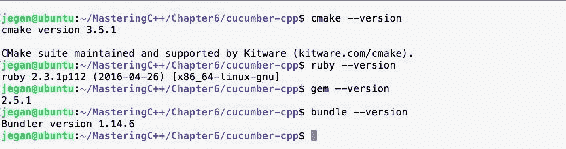

我们差不多完成了，但我们还没有到那一步。我们需要建立黄瓜-cpp 项目；作为其中的一部分，让我们获取黄瓜-cpp 框架的最新测试套件:

```cpp
git submodule init
git submodule update
```

在开始构建之前，我们继续安装忍者和增强库。虽然我们不会在本章中使用 boost 测试框架，但是`travis.sh`脚本文件会查找 boost 库。因此，我建议一般安装增强库，作为黄瓜的一部分:

```cpp
sudo apt install ninja-build
sudo apt-get install libboost-all-dev
```

# 构建和执行测试用例

现在，是时候构建黄瓜-cpp 框架了。让我们创建`build`文件夹。在`cucumber-cpp`文件夹中，会有一个名为`travis.sh`的 shell 脚本。您必须执行脚本来构建和执行测试用例:

```cpp
sudo ./travis.sh
```

虽然前面的方法有效，但我个人的偏好和建议是下面的方法。推荐以下方法的原因是`build`文件夹应该作为非根用户创建，因为一旦`cucumber-cpp`设置完成，任何人都应该能够执行构建。您应该可以在`cucumber-cpp`文件夹下的`README.md`文件中找到说明:

```cpp
git submodule init
git submodule update
cmake -E make_directory build
cmake -E chdir build cmake --DCUKE_ENABLE_EXAMPLES=on ..
cmake --build build
cmake --build build --target test
cmake --build build --target features
```

如果您能够完全按照说明完成前面的所有安装步骤，您就可以开始玩`cucumber-cpp`了。恭喜你！！！

# 特征文件

每个产品特性都有一个专用的特性文件。特征文件是扩展名为`.feature`的文本文件。一个特性文件可以包含任意数量的场景，每个场景相当于一个测试用例。

让我们看一个简单的特性文件示例:

```cpp
1   # language: en
2
3   Feature: The Facebook application should authenticate user login.
4
5     Scenario: Successful Login
6        Given I navigate to Facebook login page https://www.facebook.com
7        And I type jegan@tektutor.org as Email
8        And I type mysecretpassword as Password
9        When I click the Login button
10       Then I expect Facebook Home Page after Successful Login
```

很酷，看起来像简单的英语，对吧？但是相信我，黄瓜测试用例就是这样写的！我理解你的疑问——看起来简单又酷，但这如何验证功能，验证功能的代码在哪里？`cucumber-cpp`框架是一个很酷的框架，但是它本身并不支持任何测试功能；因此`cucumber-cpp`依赖于 gtest、`CppUnit`、其他测试框架。测试用例实现写在`Steps`文件中，在我们的案例中可以使用 gtest 框架用 C++ 编写。然而，任何测试框架都可以工作。

每个特征文件将以`Feature`关键字开始，后跟一行或多行描述，简要描述特征。在特征文件中，`Feature`、`Scenario`、`Given`、`And`、`When`、`Then`都是小黄瓜关键词。

一个特性文件可以包含任意数量的特性场景(测试用例)。例如，在我们的案例中，登录是一项功能，可能有如下多个登录场景:

*   `Success Login`
*   `Unsuccessful Login`
*   `Invalid password`
*   `Invalid username`
*   `The user attempted to login without supplying credentials.`

场景后面的每一行都将转化为`Steps_definition.cpp`源文件中的一个函数。基本上，`cucumber-cpp`框架使用正则表达式将特征文件步骤映射到`Steps_definition.cpp`文件中的相应函数。

# 小黄瓜支持的口语

小黄瓜支持 60 多种口语。作为最佳实践，特性文件的第一行将向黄瓜框架表明我们希望使用英语:

```cpp
1   # language: en
```

以下命令将列出`cucumber-cpp`框架支持的所有口语:

```cpp
cucumber -i18n help
```

名单如下:

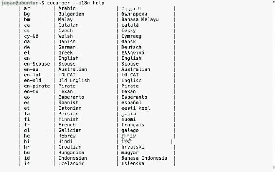

# 推荐的黄瓜-cpp 项目文件夹结构

像 TDD 一样，黄瓜框架也推荐项目文件夹结构。推荐的`cucumber-cpp`项目文件夹结构如下:


`src`文件夹将包含生产代码，也就是说，您的所有项目文件都将保存在`src`目录下。BDD 特性文件将保存在`features`文件夹及其各自的`Steps`文件下，该文件包含增强测试用例或 gtest 用例。在本章中，我们将使用`cucumber-cpp`的 gtest 框架。`wire`文件包含有线协议相关的连接细节，如端口等。`CMakeLists.txt`是构建脚本，它包含构建项目的指令及其依赖细节，就像`MakeBuild`实用程序使用的`Makefile`一样。

# 编写我们的第一个黄瓜测试用例

让我们编写第一个黄瓜测试用例！由于这是我们的第一次练习，我想保持简短。首先，让我们为我们的`HelloBDD`项目创建文件夹结构。

要创建黄瓜项目文件夹结构，我们可以使用`cucumber`实用程序，如下所示:

```cpp
cucumber --init
```

这将确保`features`和`steps_definitions`文件夹是根据黄瓜最佳实践创建的:

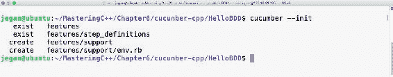

一旦创建了基本的文件夹结构，让我们手动创建其余的文件:

```cpp
mkdir src
cd HelloBDD
touch CMakeLists.txt
touch features/hello.feature
touch features/step_definitions/cucumber.wire
touch features/step_definitions/HelloBDDSteps.cpp
touch src/Hello.h
touch src/Hello.cpp
```

一旦创建了文件夹结构和空文件，项目文件夹结构应该如下图所示:


是时候开始将我们的小黄瓜知识应用到行动中了；因此，让我们首先从特征文件开始:

```cpp
# language: en

Feature: Application should be able to print greeting message Hello BDD!

   Scenario: Should be able to greet with Hello BDD! message
      Given an instance of Hello class is created
      When the sayHello method is invoked
      Then it should return "Hello BDD!"
```

我们来看看`cucumber.wire`文件:

```cpp
host: localhost
port: 3902
```

As Cucumber is implemented in Ruby, the Cucumber steps implementation has to be written in Ruby. This approach discourages using the cucumber-cpp framework for projects that are implemented in platforms other than Ruby. The wire protocol is the solution offered by the cucumber-cpp framework to extend cucumber support for non-Ruby platforms. Basically, whenever the cucumber-cpp framework executes the test cases, it looks for steps definitions, but if Cucumber finds a `.wire` file, it will instead connect to that IP address and port, in order to query the server if the process has definitions for the steps described in the `.feature` file. This helps Cucumber support many platforms apart from Ruby. However, Java and .NET have native Cucumber implementations: Cucumber-JVM and Specflow, respectively. Hence, in order to allow the test cases to be written in C++, the wire protocol is used by cucumber-cpp.

现在让我们看看如何使用 gtest 框架编写步骤文件。

Thanks to Google! The Google Test Framework (gtest) includes **Google Mock Framework** (**gmock**). For C/C++, the gtest framework is one of the best frameworks I have come across, as this is pretty close to the JUnit and Mockito/PowerMock offerings for Java. For a relatively modern language like Java compared to C++, it should be much easier to support mocking with the help of reflection, but from a C/C++ point of view, without the reflection feature from C++, gtest/gmock is nothing short of JUnit/TestNG/Mockito/PowerMock.

您可以在下面的屏幕截图中观察使用 gtest 编写的步骤文件:

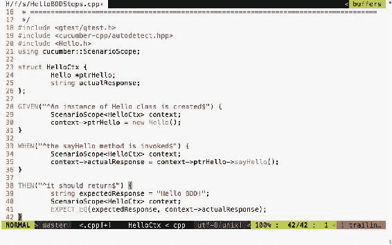

以下头文件确保包含编写黄瓜步骤所需的 gtest 头和黄瓜头:

```cpp
#include <gtest/gtest.h>
#include <cucumber-cpp/autodetect.hpp>
```

现在让我们继续编写步骤:

```cpp
struct HelloCtx {
     Hello *ptrHello;
     string actualResponse;
};
```

`HelloCtx`结构是一个用户定义的测试上下文，用于保存被测对象实例及其测试响应。黄瓜-cpp 框架提供了一个智能的`ScenarioScope`类，允许我们在黄瓜测试场景的所有步骤中访问被测对象及其输出。

对于我们在特征文件中写的每一条`Given`、`When`、`Then`语句，steps 文件中都有对应的函数。借助正则表达式映射对应于`Given`、`When`和`Then`的适当的 cpp 函数。

例如，考虑特征文件中的以下`Given`行:

```cpp
Given an instance of Hello class is created
```

这对应于下面的 cpp 函数，它在 regex 的帮助下被映射。正则表达式中的`^`字符表示模式以`an`开始，`$`字符表示模式以`created`结束:

```cpp
GIVEN("^an instance of Hello class is created$")
{
       ScenarioScope<HelloCtx> context;
       context->ptrHello = new Hello();
}
```

正如`GIVEN`步骤所说，此时，我们必须确保创建了`Hello`对象的一个实例；相应的 C++ 代码写在这个函数中，用来实例化`Hello`类的一个对象。

类似地，以下`When`步骤及其对应的 cpp 函数由黄瓜-cpp 映射:

```cpp
When the sayHello method is invoked
```

正则表达式精确匹配很重要；否则，黄瓜-cpp 框架将报告它找不到 steps 函数:

```cpp
WHEN("^the sayHello method is invoked$")
{
       ScenarioScope<HelloCtx> context;
       context->actualResponse = context->ptrHello->sayHello();
}
```

现在我们来看看`Hello.h`文件:

```cpp
#include <iostream>
#include <string>
using namespace std;

class Hello {
public:
       string sayHello();
};
```

下面是各自的源文件，即`Hello.cpp`:

```cpp
#include "Hello.h"

string Hello::sayHello() {
     return "Hello BDD!";
}
```

As an industry best practice, the only header file that should be included in the source file is its corresponding header file. The rest of the headers required should go into the header files corresponding to the source file. This helps the development team to locate the headers quite easily. BDD is not just about test automation; the expected end result is clean, defectless, and maintainable code.

最后我们来写`CMakeLists.txt`:


第一行暗示了项目的名称。第三行确保黄瓜标题目录和我们项目的`include_directories`在`INCLUDE`路径中。第五行基本上指示`cmake`实用程序从`src`文件夹下的文件，即`Hello.cpp`及其`Hello.h`文件中创建一个库。第七行检测我们的系统上是否安装了 gtest 框架，第八行保证`HelloBDDSteps.cpp`文件编译完成。最后，在第九行，创建了最终的可执行文件，链接了所有具有我们的生产代码的`HelloBDD`库、`HelloBDDSteps`对象文件以及相应的黄瓜和 gtest 库文件。

# 将我们的项目集成到黄瓜中

在开始构建项目之前，我们还需要做最后一个配置:


基本上，我已经评论了`examples`子目录，并在`cucumber-cpp`文件夹下的`CMakeLists.txt`中添加了我们的`HelloBDD`项目，如前所示。

由于我们已经根据黄瓜-cpp 最佳实践创建了项目，让我们导航到`HelloBDD`项目主页并发出以下命令:

```cpp
cmake --build  build
```

It isn't mandatory to comment `add_subdirectory(examples)`. But commenting definitely helps us focus on our project.

下面的屏幕截图显示了构建过程:


# 执行我们的测试用例

现在让我们执行测试用例。这包括两个步骤，因为我们使用的是有线协议。让我们首先在后台模式下启动可执行的测试用例，然后启动黄瓜，如下所示:

```cpp
cmake --build build
build/HelloBDD/HelloBDDSteps > /dev/null &
cucumber HelloBDD
```

重定向到`/dev/null`并不是强制性的。重定向到空设备的主要目的是避免应用程序可能在终端输出中吐出的打印语句分散注意力。因此，这是个人偏好。如果您希望从应用程序中看到调试或一般打印语句，请随意发出命令，无需重定向:

`build/HelloBDD/HelloBDDSteps &`

下面的截图演示了构建和测试执行过程:


恭喜你！我们的第一个黄瓜-cpp 测试用例已经通过。每个场景代表一个测试用例，测试用例包括三个步骤；随着所有步骤的通过，场景被报告为通过。

# 运行你的黄瓜测试用例

要不要在不真正执行的情况下，快速检查特征文件和步骤文件是否写对？黄瓜有一个快速又酷的特点:

```cpp
build/HelloBDD/HelloBDDSteps > /dev/null &
```

该命令将在后台模式下执行我们的测试应用程序。`/dev/null`是 Linux 操作系统中的一个空设备，我们正在将所有不需要的打印语句从`HelloBDDSteps`可执行文件重定向到空设备，以确保它不会在我们执行黄瓜测试用例时分散我们的注意力。

下一个命令将允许我们模拟黄瓜测试场景:

```cpp
cucumber --dry-run 
```

下面的截图显示了测试的执行情况:


# BDD——一种测试优先的开发方法

和 TDD 一样，BDD 也坚持遵循测试优先的开发方法。因此，在这一节中，让我们探索如何按照测试优先的开发方法 BDD 的方式来编写端到端的特性！

让我们举一个简单的例子来帮助我们理解 BDD 的编码风格。我们将编写一个`RPNCalculator`应用程序，它可以进行加法、减法、乘法、除法和复杂的数学表达式，这些表达式在同一个输入中涉及许多数学运算。

让我们按照黄瓜标准创建我们的项目文件夹结构:

```cpp
mkdir RPNCalculator
cd RPNCalculator
cucumber --init
tree
mkdir src
tree
```

下面的截图直观地演示了该过程:


太好了。文件夹结构现已创建。现在，让我们使用 touch 实用程序创建空文件，以帮助我们可视化最终的项目文件夹结构以及文件:

```cpp
touch features/rpncalculator.feature
touch features/step_definitions/RPNCalculatorSteps.cpp
touch features/step_definitions/cucumber.wire
touch src/RPNCalculator.h
touch src/RPNCalculator.cpp
touch CMakeLists.txt
```

创建虚拟文件后，最终的项目文件夹结构将如下图所示:


像往常一样，黄瓜线文件将如下所示。事实上，在本章中，这个文件看起来是一样的:

```cpp
host: localhost
port: 3902
```

现在我们从`rpncalculator.feature`文件开始，如下图截图所示:

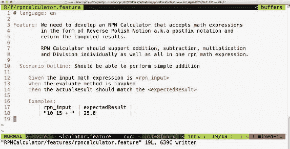

如您所见，特性描述可能非常复杂。你注意到了吗？我用`Scenario Outline`代替了场景。`Scenario Outline`的有趣之处在于，它允许在`Examples`黄瓜部分下以表格的形式描述一组输入和相应的输出。

If you are familiar with SCRUM, does the Cucumber scenario look pretty close to the user story? Yes, that's the idea. Ideally, the SCRUM user stories or use cases can be written as Cucumber scenarios. The Cucumber feature file is a live document that can be executed.

我们需要在`cucumber-cpp`主目录的`CMakeLists.txt`文件中添加我们的项目，如下所示:

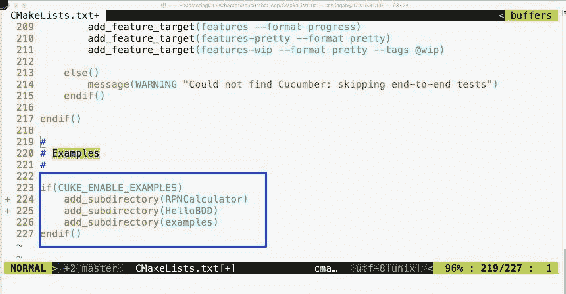

确保`RPNCalculator`文件夹下的`CMakeLists.txt`如下图所示:


现在，让我们使用`cucumber-cpp`主目录中的以下命令来构建我们的项目:

```cpp
cmake --build build
```

让我们使用以下命令来执行我们全新的`RPNCalculator`黄瓜测试用例:

```cpp
build/RPNCalculator/RPNCalculatorSteps &

cucumber RPNCalculator
```

输出如下所示:

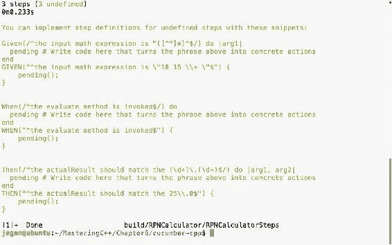

在上一个截图中，我们在特征文件中写的每一个`Given`、`When`和`Then`语句都有两个建议。第一个版本是为 Ruby 准备的，第二个版本是为 C++ 准备的；因此，我们可以放心地忽略步骤建议，如下所示:

```cpp
Then(/^the actualResult should match the (d+).(d+)$/) do |arg1, arg2|
 pending # Write code here that turns the phrase above into concrete actions
end 
```

由于我们还没有实现`RPNCalculatorSteps.cpp`文件，黄瓜框架建议我们为前面的步骤提供实现。让我们将它们复制并粘贴到`RPNCalculatorSteps.cpp`文件中，完成步骤实现，如下所示:

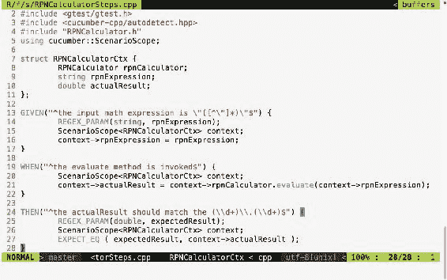 `REGEX_PARAM` is a macro supported by the cucumber-cpp BDD framework, which comes in handy to extract the input arguments from the regular expression and pass them to the Cucumber step functions.

现在，让我们尝试使用以下命令再次构建我们的项目:

```cpp
cmake --build  build
```

构建日志如下所示:


每个成功的开发人员或顾问背后的秘密公式是，他们有很强的调试和解决问题的技能。分析构建报告，尤其是构建失败，是一个人成功应用 BDD 应该获得的关键品质。每个构建错误都会教会我们一些东西！

构建错误很明显，因为我们还没有实现`RPNCalculator`，因为文件是空的。让我们编写最少的代码，以便代码编译:

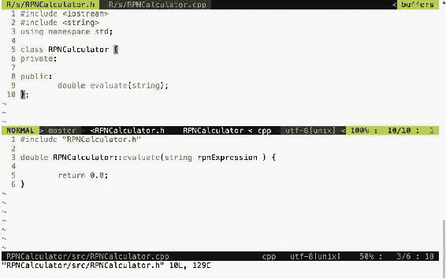

与瀑布模型不同，BDD 导致增量设计和开发。瀑布模型鼓励前期设计。通常，在瀑布模型中，设计是最初完成的，它消耗了整个项目工作的 30-40%。前期设计的主要问题是，我们最初对该特性的了解会更少；通常，我们会有一个模糊的特征知识，但它会随着时间的推移而改进。因此，在前期的设计活动中投入更多的精力并不是一个好主意；相反，在必要时，对重构设计和代码持开放态度。

因此，BDD 是复杂项目的自然选择。

有了这个最小的实现，让我们尝试构建和运行测试用例:

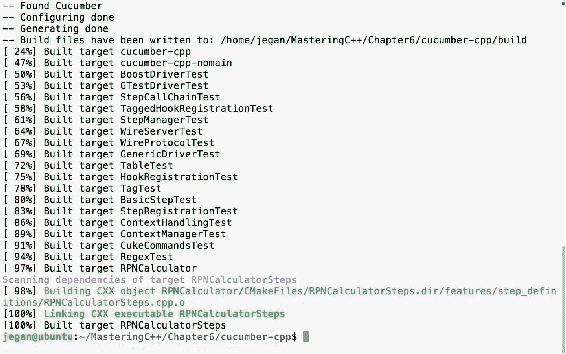

酷！由于代码编译没有错误，让我们现在执行测试用例并观察发生了什么:


黄瓜-cpp 框架用红色突出显示了这些错误，如前面的截图所示。这是意料之中的；测试用例失败，因为`RPNCalculator::evaluate`方法被硬编码为返回`0.0`。

Ideally, we had to write only minimal code to make this pass, but I took the liberty of fast forwarding the steps, with the assumption that you have already read [Chapter 7](07.html#4MLOS0-240c4d898e2d4108b0645aefc6c58389), *Test Driven Development* before reading the current chapter. In that chapter, I have demonstrated every step in detail, including the refactoring.

现在，让我们继续执行代码，让这个测试用例通过。修改后的`RPNCalculator`头文件如下:


相应的`RPNCalculator`源文件如下所示:


根据 BDD 的实践，请注意，根据我们当前的黄瓜场景需求，我们只实现了支持加法操作所必需的代码。像 TDD 一样，在 BDD 中，我们应该只编写满足当前场景所需的代码量；这样，我们可以确保每一行代码都被有效的测试用例覆盖。

# 让我们构建并运行我们的 BDD 测试用例

现在让我们构建和测试。以下命令可分别用于构建、在后台启动步骤以及使用有线协议运行黄瓜测试用例:

```cpp
cmake --build build
 build/RPNCalculator/RPNCalculatorSteps &

cucumber RPNCalculator
```

下面的截图演示了构建和执行黄瓜测试用例的过程:

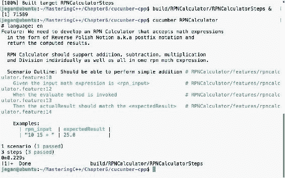

太好了。我们的测试场景现在都是绿色的！让我们继续下一个测试场景。

让我们在特征文件中添加一个场景来测试减法操作，如下所示:

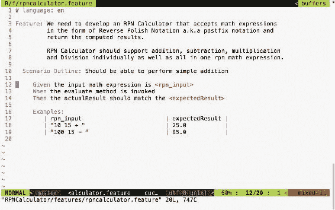

测试输出如下所示:


我们以前见过这个，不是吗？我相信你猜对了；预期结果是`85`，而实际结果是`0`，因为我们还没有增加任何对减法的支持。现在，让我们在应用程序中添加必要的代码来添加减法逻辑:

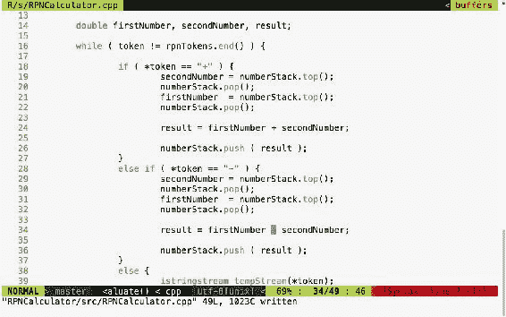

随着代码的改变，让我们重新运行测试用例，看看测试结果是什么:

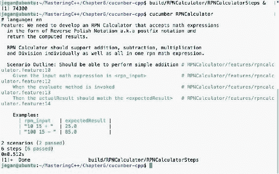

酷，检测报告变回绿色了！

让我们继续，在特征文件中添加一个场景来测试乘法运算:

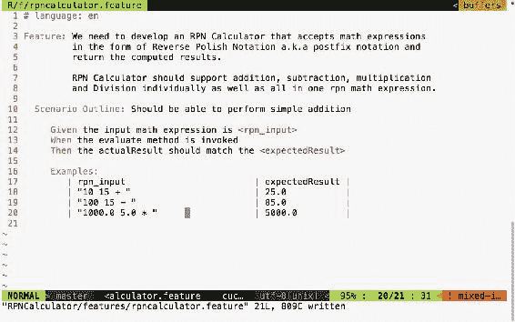

是时候运行测试用例了，如下图所示:


你说得对。是的，我们需要在生产代码中增加对乘法的支持。好了，我们现在就开始吧，如下图所示:

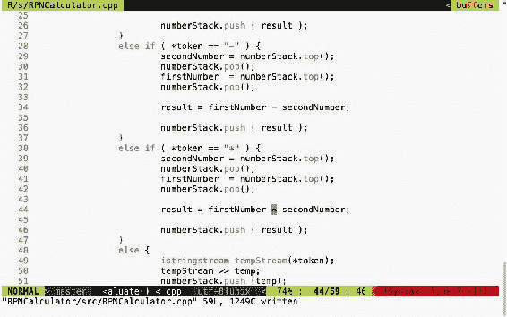

# 测试时间到了！

以下命令分别帮助您构建、启动 steps 应用程序和运行黄瓜测试用例。准确地说，第一个命令构建测试用例，而第二个命令在后台模式下启动黄瓜步骤测试可执行文件。第三个命令执行我们为`RPNCalculator`项目编写的黄瓜测试用例。`RPNCalculatorSteps`可执行文件将作为一个服务器工作，黄瓜可以通过有线协议与之交谈。黄瓜框架将从保存在`step_definitions`文件夹下的`cucumber.wire`文件中获取服务器的连接细节:

```cpp
cmake --build build
 build/RPNCalculator/RPNCalculatorSteps &

cucumber RPNCalculator
```

下面的截图演示了黄瓜测试用例的执行过程:

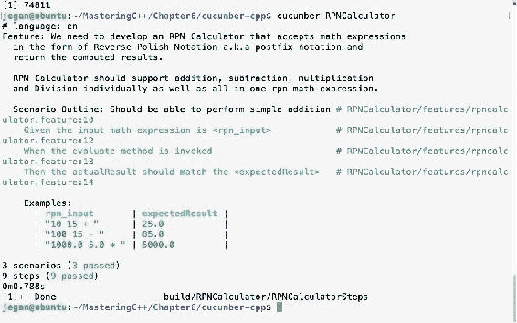

我相信你已经掌握了 BDD 的窍门！是的，BDD 非常简单明了。现在让我们为除法运算添加一个场景，如下图所示:

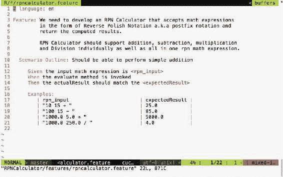

让我们快速运行测试用例，观察测试结果，如下图所示:


是的，我听到你说你知道失败的原因。让我们快速添加对除法的支持，并重新运行测试用例，看看它变成绿色！BDD 让编码变得非常有趣。

我们需要在`RPNCalculator.cpp`中添加以下代码片段:

```cpp
else if ( *token == "/" ) {
      secondNumber = numberStack.top();
      numberStack.pop();
      firstNumber = numberStack.top();
      numberStack.pop();

      result = firstNumber / secondNumber;

      numberStack.push ( result );
}

```

随着代码的改变，让我们检查测试输出:

```cpp
cmake --build build
build/RPNCalculator/RPNCalculatorSteps &
cucumber RPNCalculator
```

下面的截图直观地演示了该过程:

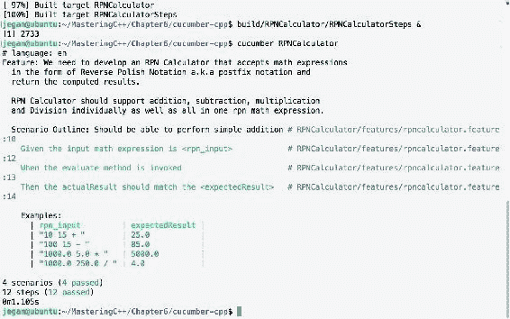

目前为止一切顺利。我们到目前为止测试的所有场景都通过了，这是一个好的迹象。但是让我们尝试一个复杂的表达式，它涉及许多数学运算。比如我们试试 *10.0 5.0 * 1.0 + 100.0 2.0 / -* 。

**Did you know?**
Reverse Polish Notation (postfix notation) is used by pretty much every compiler to evaluate mathematical expressions.

下面的截图演示了复杂表达式测试用例的集成:


让我们再运行一次测试场景，因为这将是对到目前为止实现的整个代码的真正测试，因为这个表达式涉及到我们的简单应用程序支持的所有操作。

以下命令可用于在后台模式下启动应用程序并执行黄瓜测试用例:

```cpp
build/RPNCalculator/RPNCalculatorSteps &
cucumber RPNCalculator
```

下面的截图直观地演示了该过程:


太好了。如果你已经走了这么远，我相信你会理解黄瓜-cpp 和 BDD 编码风格。

**Refactoring and Removing Code Smells**
The `RPNCalculator.cpp` code has too much branching, which is a code smell; hence, the code could be refactored. The good news is that `RPNCalculator.cpp` can be refactored to remove the code smells and has the scope to use the Factory Method, Strategy, and Null Object Design Patterns.

# 摘要

在本章中，您学习了以下内容

*   简而言之，行为驱动开发被称为 BDD。
*   BDD 是一种自顶向下的开发方法，使用小黄瓜语言作为领域特定语言(DSL)。
*   在一个项目中，BDD 和 TDD 可以并行使用，因为它们是相辅相成的，而不是相互替代的。
*   黄瓜-cpp BDD 框架利用有线协议支持非 ruby 平台编写测试用例。
*   通过使用测试优先开发方法实现一个 RPNCalculator，您以一种实用的方式学习了 BDD。
*   BDD 类似于 TDD，它通过以增量方式在短时间内重构代码来鼓励开发干净的代码。
*   您已经学习了使用小黄瓜编写 BDD 测试用例，以及使用谷歌测试框架定义步骤。

在下一章中，您将学习 C++ 调试技术。