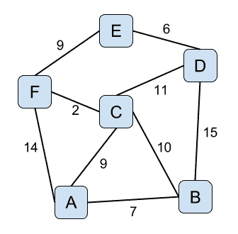
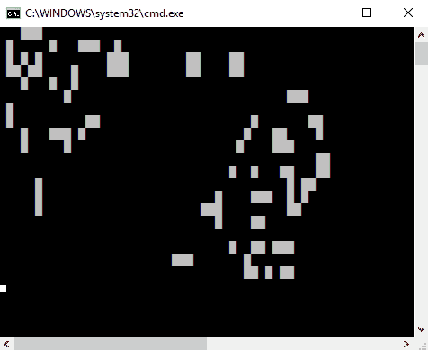

# 算法和数据结构

# 问题

# 45.优先队列

编写一个表示优先级队列的数据结构，该队列为最大的元素提供恒定的时间查找，但对于添加和移除元素具有对数时间复杂度。队列在末尾插入新元素，并从顶部移除元素。默认情况下，队列应该使用`operator<`来比较元素，但是如果第一个参数小于第二个参数，用户应该可以提供一个返回`true`的比较函数对象。实现必须至少提供以下操作:

*   `push()`添加新元素
*   `pop()`移除顶部元素
*   `top()`提供对顶部元素的访问
*   `size()`表示队列中元素的数量
*   `empty()`表示队列是否为空

# 46.循环缓冲器

创建表示固定大小的循环缓冲区的数据结构。当循环缓冲区的填充超出其固定大小时，循环缓冲区会覆盖现有元素。您必须编写的类应该:

*   禁止默认构造
*   支持创建指定大小的对象
*   允许检查缓冲容量和状态(`empty()`、`full()`、`size()`、`capacity()`)
*   添加新元素，这一操作可能会覆盖缓冲区中最旧的元素
*   从缓冲区中移除最旧的元素
*   通过其元素支持迭代

# 47.双缓冲器

编写一个类，该类表示一个缓冲区，可以在两个操作不冲突的情况下同时写入和读取该缓冲区。读操作必须在写操作进行时提供对旧数据的访问。写操作完成后，新写入的数据必须可供读取。

# 48.范围内最常见的元素

编写一个函数，在给定的范围内，返回最频繁的元素及其在该范围内出现的次数。如果多个元素出现相同的最大次数，那么函数应该返回所有元素。比如范围`{1,1,3,5,8,13,3,5,8,8,5}`，应该返回`{5, 3}`和`{8, 3}`。

# 49.文本直方图

写一个程序，给定一个文本，用字母表中每个字母的频率确定并打印一个直方图。频率是每个字母出现的次数占字母总数的百分比。程序应该只计算字母的外观，而忽略数字、符号和其他可能的字符。频率必须根据字母数量而不是文本大小来确定。

# 50.过滤电话号码列表

编写一个函数，给定一个电话号码列表，只返回来自指定国家的号码。该国家由其电话国家代码表示，例如英国为 44。电话号码可能以国家代码开头，一个`+`后跟国家代码，或者没有国家代码。最后一类的必须忽略。

# 51.转换电话号码列表

编写一个函数，给定一个电话号码列表，转换它们，使它们都以一个指定的电话国家代码开始，前面有`+`符号。电话号码中的任何空格也应该删除。以下是输入和输出示例列表:

```cpp
07555 123456    => +447555123456
07555123456     => +447555123456
+44 7555 123456 => +447555123456
44 7555 123456  => +447555123456
7555 123456     => +447555123456
```

# 52.生成字符串的所有排列

编写一个函数，在控制台上打印给定字符串的所有可能排列。您应该提供这个函数的两个版本:一个使用递归，一个不使用。

# 53.电影的平均评分

编写一个程序，计算并打印电影列表的平均评分。每部电影都有一个从 1 到 10 的分级列表(其中 1 是最低分级，10 是最高分级)。为了计算评分，您必须先移除最高和最低评分的 5%，然后再计算它们的平均值。结果必须以单个小数点显示。

# 54.成对算法

编写一个通用函数，在给定一个范围的情况下，从输入范围中返回一个包含成对连续元素的新范围。如果输入范围有奇数个元素，最后一个必须忽略。例如，如果输入范围是`{1, 1, 3, 5, 8, 13, 21}`，结果必须是`{ {1, 1}, {3, 5}, {8, 13}}`。

# 55.Zip 算法

编写一个函数，在给定两个范围的情况下，用这两个范围中的元素对返回一个新的范围。如果两个范围大小不同，结果必须包含与最小输入范围一样多的元素。例如，如果输入范围是`{ 1, 2, 3, 4, 5, 6, 7, 8, 9, 10 }`和`{ 1, 1, 3, 5, 8, 13, 21 }`，结果应该是`{{1,1}, {2,1}, {3,3}, {4,5}, {5,8}, {6,13}, {7,21}}`。

# 56.选择算法

编写一个函数，在给定一个值范围和一个投影函数的情况下，将每个值转换成一个新值，并返回一个包含所选值的新范围。例如，如果您有一个具有`id`、`title`和`author`的活字本，并且有一系列这样的书籍值，那么该功能应该可以只选择书籍的标题。以下是如何使用该函数的示例:

```cpp
struct book
{
   int         id;
   std::string title;
   std::string author;
};

std::vector<book> books{
   {101, "The C++ Programming Language", "Bjarne Stroustrup"},
   {203, "Effective Modern C++", "Scott Meyers"},
   {404, "The Modern C++ Programming Cookbook", "Marius Bancila"}};

auto titles = select(books, [](book const & b) {return b.title; });
```

# 57.分类算法

编写一个函数，在给定一对随机访问迭代器来定义其上下界的情况下，使用 quicksort 算法对范围内的元素进行排序。排序函数应该有两个重载:一个使用`operator<`比较范围的元素并按升序排列，另一个使用用户定义的二进制比较函数比较元素。

# 58.节点之间的最短路径

编写一个程序，给定一个节点网络和它们之间的距离，计算并显示从一个指定节点到所有其他节点的最短距离，以及开始和结束节点之间的路径。作为输入，考虑以下无向图:



该图的程序输出应该如下:

```cpp
A -> A : 0     A
A -> B : 7     A -> B
A -> C : 9     A -> C
A -> D : 20    A -> C -> D
A -> E : 20    A -> C -> F -> E
A -> F : 11    A -> C -> F
```

# 59.黄鼠狼计划

编写一个程序，实现理查德·道金斯的黄鼠狼计算机模拟，用道金斯的话描述如下(*盲人制表师*，第 3 章):

We again use our computer monkey, but with a crucial difference in its program. It again begins by choosing a random sequence of 28 letters, just as before ... it duplicates it repeatedly, but with a certain chance of random error – 'mutation' – in the copying. The computer examines the mutant nonsense phrases, the 'progeny' of the original phrase, and chooses the one which, however slightly, most resembles the target phrase, METHINKS IT IS LIKE A WEASEL.

# 60.生活的游戏

写一个程序实现*约翰·何顿·康威*提出的*生命游戏*元胞自动机。这个游戏的世界是一个正方形格子，可以有两种状态:死亡或活着。每个单元都与其相邻的单元进行交互，每一步都会发生以下事务:

*   任何少于两个活邻居的活细胞都会死亡，好像是人口不足造成的
*   任何有两个或三个活邻居的活细胞都会延续到下一代
*   任何有三个以上活邻居的活细胞都会死亡，就像人口过剩一样
*   任何正好有三个活邻居的死细胞都会变成活细胞，就像通过繁殖一样

每次迭代的游戏状态都应该显示在控制台上，为了方便，你应该选择一个合理的大小，比如 20 行 x 50 列。

# 解决方法

# 45.优先队列

优先级队列是一种抽象数据类型，其元素有一个优先级。优先级队列不是作为先进先出容器工作，而是按照元素的优先级顺序使元素可用。这种数据结构被用在诸如 Dijkstra 最短路径、Prim 算法、堆排序、A*搜索算法、用于数据压缩的霍夫曼码等算法中。

实现优先级队列的一个非常简单的方法是使用`std::vector`作为元素的底层容器，并始终保持其排序。这意味着最大和最小元素总是在两端。然而，这种方法不能提供最有效的操作。

最适合用来实现优先级队列的数据结构是堆。这是一个基于树的数据结构，满足以下属性:如果 *P* 是 *C* 的父节点，那么 *P* 的键(值)大于或等于(在最大堆中)或小于或等于(在最小堆中)C*的键。*

 *标准库提供了几种处理堆的操作:

*   `std::make_heap()`:这将为给定的范围创建一个最大堆，使用`operator<`或用户提供的比较函数对元素进行排序
*   `std::push_heap()`:这将在最大堆的末尾插入一个新元素
*   `std::pop_heap()`:这将移除堆的第一个元素(通过交换第一个和最后一个位置的值，并使子范围`[first, last-1)`成为最大堆)

使用`std::vector`保存数据和堆的标准函数的优先级队列实现可以如下所示:

```cpp
template <class T,
   class Compare = std::less<typename std::vector<T>::value_type>>
class priority_queue
{
   typedef typename std::vector<T>::value_type value_type;
   typedef typename std::vector<T>::size_type size_type;
   typedef typename std::vector<T>::reference reference;
   typedef typename std::vector<T>::const_reference const_reference;
public:
   bool empty() const noexcept { return data.empty(); }
   size_type size() const noexcept { return data.size(); }

   void push(value_type const & value)
   {
      data.push_back(value);
      std::push_heap(std::begin(data), std::end(data), comparer);
   }

   void pop()
   {
      std::pop_heap(std::begin(data), std::end(data), comparer);
      data.pop_back();
   }

   const_reference top() const { return data.front(); }

   void swap(priority_queue& other) noexcept
   {
      swap(data, other.data);
      swap(comparer, other.comparer);
   }
private:
   std::vector<T> data;
   Compare comparer;
};

template<class T, class Compare>
void swap(priority_queue<T, Compare>& lhs,
          priority_queue<T, Compare>& rhs) 
noexcept(noexcept(lhs.swap(rhs)))
{
   lhs.swap(rhs);
}
```

这个类可以如下使用:

```cpp
int main()
{
   priority_queue<int> q;
   for (int i : {1, 5, 3, 1, 13, 21, 8})
   {
      q.push(i);
   }

   assert(!q.empty());
   assert(q.size() == 7);

   while (!q.empty())
   {
      std::cout << q.top() << ' ';
      q.pop();
   }
}
```

# 46.循环缓冲器

循环缓冲区是一个固定大小的容器，其行为就像它的两端被连接起来形成一个虚拟的循环内存布局。它的主要好处是，您不需要大量内存来保留数据，因为旧条目会被新条目覆盖。循环缓冲区用于输入/输出缓冲、有界日志记录(当您只想保留最后的消息时)、异步处理缓冲区等。

我们可以区分两种情况:

1.  添加到缓冲区的元素数量尚未达到其容量(用户定义的固定大小)。在这种情况下，它的行为就像一个常规容器，比如一个向量。
2.  添加到缓冲区的元素数量已达到并超过其容量。在这种情况下，缓冲区的内存被重用，旧的元素被覆盖。

我们可以使用以下方式来表示这样的结构:

*   具有预先分配的元素数量的常规容器
*   一个头指针，用于指示最后插入的元素的位置
*   指示容器中元素数量的大小计数器，不能超过其容量(因为在这种情况下元素将被覆盖)

循环缓冲区的两个主要操作是:

*   向缓冲区添加新元素。我们总是在头指针(或索引)的下一个位置插入。这就是下图所示的`push()`方法。
*   从缓冲区中移除现有元素。我们总是移除最老的元素。该元素位于位置`head - size`(这必须说明索引的循环性质)。这就是下图所示的`pop()`方法。

这种数据结构的实现如下所示:

```cpp
template <class T>
class circular_buffer
{
   typedef circular_buffer_iterator<T> const_iterator;

   circular_buffer() = delete;
public:
   explicit circular_buffer(size_t const size) :data_(size)
   {}

   bool clear() noexcept { head_ = -1; size_ = 0; }
   bool empty() const noexcept { return size_ == 0; }
   bool full() const noexcept { return size_ == data_.size(); }
   size_t capacity() const noexcept { return data_.size(); }
   size_t size() const noexcept { return size_; }

   void push(T const item)
   {
      head_ = next_pos();
      data_[head_] = item;
      if (size_ < data_.size()) size_++;
   }

   T pop()
   {
      if (empty()) throw std::runtime_error("empty buffer");
      auto pos = first_pos();
      size_--;
      return data_[pos];
   }

   const_iterator begin() const
   {
      return const_iterator(*this, first_pos(), empty());
   }

   const_iterator end() const
   {
      return const_iterator(*this, next_pos(), true);
   }

private:
   std::vector<T> data_;
   size_t head_ = -1;
   size_t size_ = 0;

   size_t next_pos() const noexcept 
   { return size_ == 0 ? 0 : (head_ + 1) % data_.size(); }
   size_t first_pos() const noexcept 
   { return size_ == 0 ? 0 : (head_ + data_.size() - size_ + 1) % 
                             data_.size(); }

   friend class circular_buffer_iterator<T>;
};
```

由于映射在连续内存布局上的索引的循环特性，这个类的迭代器类型不能是指针类型。迭代器必须能够通过对索引应用模运算来指向元素。这是一个迭代器的可能实现:

```cpp
template <class T>
class circular_buffer_iterator
{
   typedef circular_buffer_iterator        self_type;
   typedef T                               value_type;
   typedef T&                              reference;
   typedef T const&                        const_reference;
   typedef T*                              pointer;
   typedef std::random_access_iterator_tag iterator_category;
   typedef ptrdiff_t                       difference_type;
public:
   circular_buffer_iterator(circular_buffer<T> const & buf, 
                            size_t const pos, bool const last) :
   buffer_(buf), index_(pos), last_(last)
   {}

   self_type & operator++ ()
   {
      if (last_)
         throw std::out_of_range("Iterator cannot be incremented past the end of range.");
      index_ = (index_ + 1) % buffer_.data_.size();
      last_ = index_ == buffer_.next_pos();
      return *this;
   }

   self_type operator++ (int)
   {
      self_type tmp = *this;
      ++*this;
      return tmp;
   }

   bool operator== (self_type const & other) const
   {
      assert(compatible(other));
      return index_ == other.index_ && last_ == other.last_;
   }

   bool operator!= (self_type const & other) const
   {
      return !(*this == other);
   }

   const_reference operator* () const
   {
      return buffer_.data_[index_];
   }

   const_reference operator-> () const
   {
      return buffer_.data_[index_];
   }
private:
   bool compatible(self_type const & other) const
   {
      return &buffer_ == &other.buffer_;
   }

   circular_buffer<T> const & buffer_;
   size_t index_;
   bool last_;
};
```

实现所有这些之后，我们可以编写如下代码。请注意，在注释中，第一个范围显示了内部向量的实际内容，第二个范围显示了迭代器访问公开的逻辑内容:

```cpp
int main()
{
   circular_buffer<int> cbuf(5); // {0, 0, 0, 0, 0} -> {}

   cbuf.push(1);                 // {1, 0, 0, 0, 0} -> {1}
   cbuf.push(2);                 // {1, 2, 0, 0, 0} -> {1, 2}
   cbuf.push(3);                 // {1, 2, 3, 0, 0} -> {1, 2, 3}

   auto item = cbuf.pop();       // {1, 2, 3, 0, 0} -> {2, 3}
   cbuf.push(4);                 // {1, 2, 3, 4, 0} -> {2, 3, 4}
   cbuf.push(5);                 // {1, 2, 3, 4, 5} -> {2, 3, 4, 5}
   cbuf.push(6);                 // {6, 2, 3, 4, 5} -> {2, 3, 4, 5, 6}

   cbuf.push(7);                 // {6, 7, 3, 4, 5} -> {3, 4, 5, 6, 7}
   cbuf.push(8);                 // {6, 7, 8, 4, 5} -> {4, 5, 6, 7, 8}

   item = cbuf.pop();            // {6, 7, 8, 4, 5} -> {5, 6, 7, 8}
   item = cbuf.pop();            // {6, 7, 8, 4, 5} -> {6, 7, 8}
   item = cbuf.pop();            // {6, 7, 8, 4, 5} -> {7, 8}

   item = cbuf.pop();            // {6, 7, 8, 4, 5} -> {8}
   item = cbuf.pop();            // {6, 7, 8, 4, 5} -> {}

   cbuf.push(9);                 // {6, 7, 8, 9, 5} -> {9}
}
```

# 47.双缓冲器

这里描述的问题是典型的双缓冲情况。双缓冲是多缓冲最常见的情况，这是一种允许读者看到数据的完整版本而不是由作者产生的部分更新版本的技术。这是一种避免闪烁的常用技术，尤其是在计算机图形学中。

为了实现所请求的功能，我们应该写入的缓冲区类必须有两个内部缓冲区:一个包含正在写入的临时数据，另一个包含已完成(或已提交)的数据。写操作完成后，临时缓冲区的内容被写入主缓冲区。对于内部缓冲区，下面的实现使用`std::vector`。当写操作完成时，我们只交换两个缓冲区的内容，而不是将数据从一个缓冲区复制到另一个缓冲区，这是一个更快的操作。对完整数据的访问提供了`read()`功能，该功能将读取缓冲区的内容复制到指定的输出，或者提供了直接元素访问(过载的`operator[]`)。对读缓冲区的访问与`std::mutex`同步，以确保在一个线程向缓冲区写入数据时从另一个线程读取数据是安全的:

```cpp
template <typename T>
class double_buffer
{
   typedef T           value_type;
   typedef T&          reference;
   typedef T const &   const_reference;
   typedef T*          pointer;
public:
   explicit double_buffer(size_t const size) :
      rdbuf(size), wrbuf(size)
   {}

   size_t size() const noexcept { return rdbuf.size(); }

   void write(T const * const ptr, size_t const size)
   {
      std::unique_lock<std::mutex> lock(mt);
      auto length = std::min(size, wrbuf.size());
      std::copy(ptr, ptr + length, std::begin(wrbuf));
      wrbuf.swap(rdbuf);
   }

   template <class Output>
   void read(Output it) const
   {
      std::unique_lock<std::mutex> lock(mt);
      std::copy(std::cbegin(rdbuf), std::cend(rdbuf), it);
   }

   pointer data() const
   {
       std::unique_lock<std::mutex> lock(mt);
       return rdbuf.data();
   }

   reference operator[](size_t const pos)
   {
      std::unique_lock<std::mutex> lock(mt);
      return rdbuf[pos];
   }

   const_reference operator[](size_t const pos) const
   {
      std::unique_lock<std::mutex> lock(mt);
      return rdbuf[pos];
   }

   void swap(double_buffer other)
   {
      std::swap(rdbuf, other.rdbuf);
      std::swap(wrbuf, other.wrbuf);
   }

private:
   std::vector<T>     rdbuf;
   std::vector<T>     wrbuf;
   mutable std::mutex mt;
};
```

下面是这个双缓冲区类如何用于两个不同实体的写入和读取的示例:

```cpp
template <typename T>
void print_buffer(double_buffer<T> const & buf)
{
   buf.read(std::ostream_iterator<T>(std::cout, " "));
   std::cout << std::endl;
}

int main()
{
   double_buffer<int> buf(10);

   std::thread t([&buf]() {
      for (int i = 1; i < 1000; i += 10)
      {
         int data[] = { i, i + 1, i + 2, i + 3, i + 4, 
                        i + 5, i + 6,i + 7,i + 8,i + 9 };
         buf.write(data, 10);

         using namespace std::chrono_literals;
         std::this_thread::sleep_for(100ms);
       }
   });

   auto start = std::chrono::system_clock::now();
   do
   {
      print_buffer(buf);

      using namespace std::chrono_literals;
      std::this_thread::sleep_for(150ms);
   } while (std::chrono::duration_cast<std::chrono::seconds>(
            std::chrono::system_clock::now() - start).count() < 12);

   t.join();
}
```

# 48.范围内最常见的元素

为了确定并返回一个范围内最频繁的元素，您应该执行以下操作:

*   在`std::map`中计算每个元素的外观。关键是元素，值是它的出现次数。
*   使用`std::max_element()`确定地图的最大元素。结果是一个地图元素，即一对包含该元素及其出现次数的元素。

*   复制所有值(外观计数)等于最大元素值的地图元素，并将其作为最终结果返回。

下面的列表显示了前面描述的步骤的实现:

```cpp
template <typename T>
std::vector<std::pair<T, size_t>> find_most_frequent(
   std::vector<T> const & range)
{
   std::map<T, size_t> counts;
   for (auto const & e : range) counts[e]++;

   auto maxelem = std::max_element(
      std::cbegin(counts), std::cend(counts),
      [](auto const & e1, auto const & e2) {
         return e1.second < e2.second;
   });

   std::vector<std::pair<T, size_t>> result;

   std::copy_if(
      std::begin(counts), std::end(counts),
      std::back_inserter(result),
      [maxelem](auto const & kvp) {
         return kvp.second == maxelem->second;
   });

   return result;
}
```

`find_most_frequent()`功能可以如下使用:

```cpp
int main()
{
   auto range = std::vector<int>{1,1,3,5,8,13,3,5,8,8,5};
   auto result = find_most_frequent(range);

   for (auto const & e : result)
   {
      std::cout << e.first << " : " << e.second << std::endl;
   }
}
```

# 49.文本直方图

直方图是数字数据分布的表示。广为人知的直方图是用于摄影和图像处理的颜色和图像直方图。如这里所述，文本直方图是给定文本中字母出现频率的表示。这个问题部分类似于前面的问题，只是范围元素现在是字符，我们必须确定它们的频率。要解决这个问题，您应该:

*   用地图统计每个字母的外观。关键是字母，数值是它的出现次数。
*   计数时，忽略所有不是字母的字符。大写和小写字符必须视为相同，因为它们代表相同的字母。
*   使用`std::accumulate()`统计给定文本中所有字母的出现总数。
*   使用`std::for_each()`或基于范围的`for`循环遍历地图的所有元素，并将外观计数转换为频率。

以下是问题的可能实现:

```cpp
std::map<char, double> analyze_text(std::string_view text)
{
   std::map<char, double> frequencies;
   for (char ch = 'a'; ch <= 'z'; ch++)
      frequencies[ch] = 0;

   for (auto ch : text)
   {
      if (isalpha(ch))
         frequencies[tolower(ch)]++;
   }

   auto total = std::accumulate(
      std::cbegin(frequencies), std::cend(frequencies),
      0ull,
      [](auto sum, auto const & kvp) {
         return sum + static_cast<unsigned long long>(kvp.second);
   });

   std::for_each(
      std::begin(frequencies), std::end(frequencies),
      [total](auto & kvp) {
         kvp.second = (100.0 * kvp.second) / total;
   });

   return frequencies;
}
```

以下程序在控制台上打印文本中字母的频率:

```cpp
int main()
{
   auto result = analyze_text(R"(Lorem ipsum dolor sit amet, consectetur 
      adipiscing elit, sed do eiusmod tempor incididunt ut labore et 
      dolore magna aliqua.)");

   for (auto const & kvp : result)
   {
      std::cout << kvp.first << " : "
                << std::fixed
                << std::setw(5) << std::setfill(' ')
                << std::setprecision(2) << kvp.second << std::endl;
   }
}
```

# 50.过滤电话号码列表

这个问题的解决方案相对简单:你必须遍历所有的电话号码，并将以国家代码开头的电话号码复制到一个单独的容器(如`std::vector`)中。例如，如果指定的国家代码是 44，则必须同时检查 44 和+44。使用`std::copy_if()`功能可以以这种方式过滤输入范围。此处显示了此问题的解决方案:

```cpp
bool starts_with(std::string_view str, std::string_view prefix)
{
   return str.find(prefix) == 0;
}

template <typename InputIt>
std::vector<std::string> filter_numbers(InputIt begin, InputIt end,
                                        std::string const & countryCode)
{
   std::vector<std::string> result;
   std::copy_if(
      begin, end,
      std::back_inserter(result),
      [countryCode](auto const & number) {
         return starts_with(number, countryCode) ||
                starts_with(number, "+" + countryCode);
   });
   return result;
}

std::vector<std::string> filter_numbers(
   std::vector<std::string> const & numbers,
   std::string const & countryCode)
{
   return filter_numbers(std::cbegin(numbers), std::cend(numbers), 
                         countryCode);
}
```

这是该功能的使用方法:

```cpp
int main()
{
   std::vector<std::string> numbers{
      "+40744909080",
      "44 7520 112233",
      "+44 7555 123456",
      "40 7200 123456",
      "7555 123456"
   };

   auto result = filter_numbers(numbers, "44");

   for (auto const & number : result)
   {
      std::cout << number << std::endl;
   }
}
```

# 51.转换电话号码列表

这个问题在某些方面与前一个有些相似。但是，我们不能选择以指定国家代码开头的电话号码，而是必须转换每个号码，使它们都以前面带有`+`的国家代码开头。有几种情况必须考虑:

*   电话号码以 0 开头。表示没有国家代码的数字。要修改数字以包括国家代码，我们必须用实际的国家代码替换 0，前面加`+`。
*   电话号码以国家代码开头。在这种情况下，我们只需在开头加上`+`符号。
*   电话号码以`+`开头，后面跟着国家代码。在这种情况下，数字已经是预期的格式。
*   这些情况都不适用，因此结果是通过将`+`前面的国家代码和电话号码连接起来获得的。

For simplicity, we will ignore the possibility that the number is actually prefixed with another country code. You can take it as a further exercise to modify the implementation so that it can handle phone numbers with a different country prefix. These numbers should be removed from the list.

在上述所有情况下，数字都可能包含空格。根据要求，这些必须拆除。`std::remove_if()`和`isspace()`功能用于此目的。

以下是所述解决方案的实现:

```cpp
bool starts_with(std::string_view str, std::string_view prefix)
{
   return str.find(prefix) == 0;
}

void normalize_phone_numbers(std::vector<std::string>& numbers,
                             std::string const & countryCode)
{
   std::transform(
      std::cbegin(numbers), std::cend(numbers),
      std::begin(numbers),
      [countryCode](std::string const & number) {
         std::string result;
         if (number.size() > 0)
         {
            if (number[0] == '0')
               result = "+" + countryCode + 
                        number.substr(1);
            else if (starts_with(number, countryCode))
               result = "+" + number;
            else if (starts_with(number, "+" + countryCode))
               result = number;
            else
               result = "+" + countryCode + number;
      }

      result.erase(
         std::remove_if(std::begin(result), std::end(result),
            [](const char ch) {return isspace(ch); }),
         std::end(result));

      return result;
   });
}
```

以下程序根据要求对给定的电话号码列表进行标准化，并将其打印在控制台上:

```cpp
int main()
{
   std::vector<std::string> numbers{
      "07555 123456",
      "07555123456",
      "+44 7555 123456",
      "44 7555 123456",
      "7555 123456"
   };

   normalize_phone_numbers(numbers, "44");

   for (auto const & number : numbers)
   {
      std::cout << number << std::endl;
   }
}
```

# 52.生成字符串的所有排列

您可以通过利用标准库中的一些通用算法来解决这个问题。两个必选版本中最简单的就是非递归版本，至少在你使用`std::next_permutation()`的时候是这样。该函数将输入范围(需要排序)转换为所有可能排列集合中的下一个排列，按照`operator<`或指定的比较函数对象的字典顺序排列。如果这样的排列存在，那么它返回`true`，否则，它将范围转换为第一个排列并返回`false`。因此，基于`std::next_permuation()`的非递归实现如下所示:

```cpp
void print_permutations(std::string str)
{
   std::sort(std::begin(str), std::end(str));

   do
   {
      std::cout << str << std::endl;
   } while (std::next_permutation(std::begin(str), std::end(str)));
}
```

递归的选择稍微复杂一点。实现它的一种方法是有一个输入和输出字符串；最初，输入字符串是我们想要为其生成置换的字符串，而输出字符串是空的。我们每次从输入字符串中提取一个字符，并将其放入输出字符串中。当输入字符串为空时，输出字符串代表下一个置换。执行此操作的递归算法如下:

*   如果输入字符串为空，则打印输出字符串并返回
*   否则，迭代输入字符串中的所有字符，并且对于每个元素:
    *   通过从输入字符串中移除第一个字符并将其连接到输出字符串的末尾来递归调用方法
    *   旋转输入字符串，使第一个字符成为最后一个，第二个字符成为第一个，依此类推

下图直观地解释了该算法:


为了旋转输入字符串，我们可以使用标准库函数`std::rotate()`，它对一系列元素执行向左旋转。所描述的递归算法的实现如下所示:

```cpp
void next_permutation(std::string str, std::string perm)
{
   if (str.empty()) std::cout << perm << std::endl;
   else
   {
      for (size_t i = 0; i < str.size(); ++i)
      {
         next_permutation(str.substr(1), perm + str[0]);

         std::rotate(std::begin(str), std::begin(str) + 1, std::end(str));
      }
   }
}

void print_permutations_recursive(std::string str)
{
   next_permutation(str, "");
}
```

这就是这两种实现的使用方式:

```cpp
int main()
{
   std::cout << "non-recursive version" << std::endl;
   print_permutations("main");

   std::cout << "recursive version" << std::endl;
   print_permutations_recursive("main");
}
```

# 53.电影的平均评分

这个问题需要使用截断平均值来计算电影等级。这是对中心趋势的统计测量，其中平均值是在丢弃概率分布或样本的高端和低端部分后计算的。通常，这是通过在两端移除等量的点来完成的。对于此问题，您需要删除最高和最低用户评分的 5%。

计算给定范围的截断平均值的函数应执行以下操作:

*   对范围进行排序，以便对元素进行排序(升序或降序)
*   移除两端所需的元素百分比
*   计算所有剩余元素的总和
*   通过将总和除以元素的剩余数量来计算平均值

这里显示的`truncated_mean()`功能实现了所描述的算法:

```cpp
double truncated_mean(std::vector<int> values, double const percentage)
{
   std::sort(std::begin(values), std::end(values));
   auto remove_count = static_cast<size_t>(
                          values.size() * percentage + 0.5);

   values.erase(std::begin(values), std::begin(values) + remove_count);
   values.erase(std::end(values) - remove_count, std::end(values));

   auto total = std::accumulate(
      std::cbegin(values), std::cend(values),
      0ull,
      [](auto const sum, auto const e) {
         return sum + e; });
   return static_cast<double>(total) / values.size();
}
```

使用此功能来计算和打印电影平均评分的程序可能如下所示:

```cpp
struct movie
{
   int              id;
   std::string      title;
   std::vector<int> ratings;
};

void print_movie_ratings(std::vector<movie> const & movies)
{
   for (auto const & m : movies)
   {
      std::cout << m.title << " : " 
                << std::fixed << std::setprecision(1)
                << truncated_mean(m.ratings, 0.05) << std::endl;
   }
}

int main()
{
   std::vector<movie> movies
   {
      { 101, "The Matrix", {10, 9, 10, 9, 9, 8, 7, 10, 5, 9, 9, 8} },
      { 102, "Gladiator", {10, 5, 7, 8, 9, 8, 9, 10, 10, 5, 9, 8, 10} },
      { 103, "Interstellar", {10, 10, 10, 9, 3, 8, 8, 9, 6, 4, 7, 10} }
   };

   print_movie_ratings(movies);
}
```

# 54.成对算法

针对该问题提出的成对函数必须将输入范围的相邻元素配对，并产生添加到输出范围的`std::pair`元素。下面的代码清单提供了两种实现:

*   一个以迭代器为参数的通用函数模板:开始和结束迭代器定义输入范围，输出迭代器定义输出范围中要插入结果的位置
*   以`std::vector<T>`作为输入参数并返回`std::vector<std::pair<T, T>>`作为结果的重载；这个简单地称为第一个重载:

```cpp
template <typename Input, typename Output>
void pairwise(Input begin, Input end, Output result)
{
   auto it = begin;
   while (it != end)
   {
      auto v1 = *it++; if (it == end) break;
      auto v2 = *it++;
      result++ = std::make_pair(v1, v2);
   }
}
template <typename T>
std::vector<std::pair<T, T>> pairwise(std::vector<T> const & range)
{
   std::vector<std::pair<T, T>> result;
   pairwise(std::begin(range), std::end(range),
            std::back_inserter(result));
   return result;
}
```

以下程序对整数向量的元素进行配对，并在控制台上打印配对:

```cpp
int main()
{
   std::vector<int> v{ 1, 1, 3, 5, 8, 13, 21 };
   auto result = pairwise(v);

   for (auto const & p : result)
   {
      std::cout << '{' << p.first << ',' << p.second << '}' << std::endl;
   }
}
```

# 55.Zip 算法

这个问题与前一个问题相对类似，尽管有两个输入范围，而不是只有一个。结果还是一个`std::pair`的范围。但是，这两个输入范围可能包含不同类型的元素。同样，这里显示的实现包含两个重载:

*   以迭代器为参数的通用函数。每个输入范围的开始和结束迭代器定义其边界，输出迭代器定义输出范围中必须写入结果的位置。
*   一个接受两个`std::vector`参数的函数，一个保存类型为`T`的元素，一个保存类型为`U`的元素，并返回一个`std::vector<std::pair<T, U>>`。这个重载只是调用前一个重载:

```cpp
template <typename Input1, typename Input2, typename Output>
void zip(Input1 begin1, Input1 end1, 
         Input2 begin2, Input1 end2, 
         Output result)
{
```

```cpp
   auto it1 = begin1;
   auto it2 = begin2;
   while (it1 != end1 && it2 != end2)
   {
      result++ = std::make_pair(*it1++, *it2++);
   }
}

template <typename T, typename U>
std::vector<std::pair<T, U>> zip(
   std::vector<T> const & range1, 
   std::vector<U> const & range2)
{
   std::vector<std::pair<T, U>> result;

   zip(std::begin(range1), std::end(range1),
       std::begin(range2), std::end(range2),
       std::back_inserter(result));

   return result;
}
```

在下面的清单中，您可以看到两个整数向量压缩在一起，结果打印在控制台上:

```cpp
int main()
{
   std::vector<int> v1{ 1, 2, 3, 4, 5, 6, 7, 8, 9, 10 };
   std::vector<int> v2{ 1, 1, 3, 5, 8, 13, 21 };

   auto result = zip(v1, v2);
   for (auto const & p : result)
   {
      std::cout << '{' << p.first << ',' << p.second << '}' << std::endl;
   }
}
```

# 56.选择算法

您必须实现的`select()`函数将一个`std::vector<T>`作为输入参数和一个类型为`F`的函数，并返回一个`std::vector<R>`作为结果，其中`R`是将`F`应用到`T`的结果。我们可以在编译时使用`std::result_of()`来推断调用表达式的返回类型。在内部，`select()`函数应该使用`std::transform()`迭代输入向量的元素，将函数`f`应用于每个元素，并将结果插入输出向量。

下面的清单显示了这个函数的实现:

```cpp
template <
   typename T, typename A, typename F,
   typename R = typename std::decay<typename std::result_of<
                typename std::decay<F>::type&(
                typename std::vector<T, A>::const_reference)>::type>::type>
std::vector<R> select(std::vector<T, A> const & c, F&& f)
{
   std::vector<R> v;
   std::transform(std::cbegin(c), std::cend(c),
                  std::back_inserter(v),
                  std::forward<F>(f));
   return v;
}
```

该功能可以如下使用:

```cpp
int main()
{
   std::vector<book> books{
      {101, "The C++ Programming Language", "Bjarne Stroustrup"},
      {203, "Effective Modern C++", "Scott Meyers"},
      {404, "The Modern C++ Programming Cookbook", "Marius Bancila"}};

   auto titles = select(books, [](book const & b) {return b.title; });
   for (auto const & title : titles)
   {
      std::cout << title << std::endl;
   }
}
```

# 57.分类算法

**快速排序**是对定义了总顺序的数组元素的比较排序算法。当实现良好时，它明显快于*合并排序*或*堆排序*。

虽然在最坏的情况下，算法会进行比较(当范围已经排序时)，但平均来说复杂度只有。Quicksort 是一个分治算法；它将一个较大的范围划分成较小的范围，并递归地对它们进行排序。有几种分区方案。在这里显示的实现中，我们使用了由*东尼·霍尔*开发的原始实现。该方案的算法用伪代码描述如下:

```cpp
algorithm quicksort(A, lo, hi) is
   if lo < hi then
      p := partition(A, lo, hi)
      quicksort(A, lo, p)
      quicksort(A, p + 1, hi)

algorithm partition(A, lo, hi) is
   pivot := A[lo]
   i := lo - 1
   j := hi + 1
   loop forever
      do
         i := i + 1
      while A[i] < pivot

      do
         j := j - 1
      while A[j] > pivot

      if i >= j then
         return j

      swap A[i] with A[j]
```

算法的通用实现应该使用迭代器，而不是数组和索引。以下实现的要求是迭代器是随机访问的(因此它们可以在恒定时间内移动到任何元素):

```cpp
template <class RandomIt>
RandomIt partition(RandomIt first, RandomIt last)
{
   auto pivot = *first;
   auto i = first + 1;
   auto j = last - 1;
   while (i <= j)
   {
      while (i <= j && *i <= pivot) i++;
      while (i <= j && *j > pivot) j--;
      if (i < j) std::iter_swap(i, j);
   }

   std::iter_swap(i - 1, first);

   return i - 1;
}

template <class RandomIt>
void quicksort(RandomIt first, RandomIt last)
{
   if (first < last)
   {
      auto p = partition(first, last);
      quicksort(first, p);
      quicksort(p + 1, last);
   }
}
```

如下所示的`quicksort()`功能可用于分类各种类型的容器:

```cpp
int main()
{
   std::vector<int> v{ 1,5,3,8,6,2,9,7,4 };
   quicksort(std::begin(v), std::end(v));

   std::array<int, 9> a{ 1,2,3,4,5,6,7,8,9 };
   quicksort(std::begin(a), std::end(a));

   int a[]{ 9,8,7,6,5,4,3,2,1 };
   quicksort(std::begin(a), std::end(a));
}
```

要求是排序算法必须允许指定用户定义的比较函数。在这种情况下，唯一的变化是分区函数，我们使用用户定义的比较函数，而不是使用`operator <`和`>`来比较当前元素和透视:

```cpp
template <class RandomIt, class Compare>
RandomIt partitionc(RandomIt first, RandomIt last, Compare comp)
{
   auto pivot = *first;
   auto i = first + 1;
   auto j = last - 1;
   while (i <= j)
   {
      while (i <= j && comp(*i, pivot)) i++;
      while (i <= j && !comp(*j, pivot)) j--;
      if (i < j) std::iter_swap(i, j);
   }

   std::iter_swap(i - 1, first);

   return i - 1;
}

template <class RandomIt, class Compare>
void quicksort(RandomIt first, RandomIt last, Compare comp)
{
   if (first < last)
   {
      auto p = partitionc(first, last, comp);
      quicksort(first, p, comp);
      quicksort(p + 1, last, comp);
   }
}
```

有了这个重载，我们可以按降序对一个范围进行排序，如下例所示:

```cpp
int main()
{
   std::vector<int> v{ 1,5,3,8,6,2,9,7,4 };
   quicksort(std::begin(v), std::end(v), std::greater<>());
}
```

也可以实现快速排序算法的迭代版本。迭代版本的性能在大多数情况下与递归版本相同，但是当范围已经排序时，在最坏的情况下会退化为。从算法的递归版本转换为迭代版本相对简单；这是通过使用堆栈来模拟递归调用和存储分区的边界来实现的。以下是使用`operator<`比较元素的版本的迭代实现:

```cpp
template <class RandomIt>
void quicksorti(RandomIt first, RandomIt last)
{
   std::stack<std::pair<RandomIt, RandomIt>> st;
   st.push(std::make_pair(first, last));
   while (!st.empty())
   {
      auto iters = st.top();
      st.pop();

      if (iters.second - iters.first < 2) continue;

      auto p = partition(iters.first, iters.second);

      st.push(std::make_pair(iters.first, p));
      st.push(std::make_pair(p+1, iters.second));
   }
}
```

这种迭代实现可以像递归实现一样使用:

```cpp
int main()
{
   std::vector<int> v{ 1,5,3,8,6,2,9,7,4 };
   quicksorti(std::begin(v), std::end(v));
}
```

# 58.节点之间的最短路径

要解决提出的问题，您必须使用 Dijkstra 算法来寻找图中的最短路径。虽然最初的算法找到了两个给定节点之间的最短路径，但这里的要求是找到一个指定节点和图中所有其他节点之间的最短路径，这是算法的另一个版本。

实现该算法的一种有效方法是使用优先级队列。算法的伪代码(见[https://en.wikipedia.org/wiki/Dijkstra%27s_algorithm](https://en.wikipedia.org/wiki/Dijkstra%27s_algorithm))如下:

```cpp
function Dijkstra(Graph, source):
   dist[source] ← 0                 // Initialization

   create vertex set Q
   for each vertex v in Graph: 
      if v ≠ source
         dist[v] ← INFINITY         // Unknown distance from source to v
         prev[v] ← UNDEFINED        // Predecessor of v

      Q.add_with_priority(v, dist[v])

   while Q is not empty:            // The main loop
      u ← Q.extract_min()           // Remove and return best vertex
      for each neighbor v of u:     // only v that is still in Q
         alt ← dist[u] + length(u, v) 
         if alt < dist[v]
            dist[v] ← alt
            prev[v] ← u
            Q.decrease_priority(v, alt)

   return dist[], prev[]
```

为了表示该图，我们可以使用以下数据结构，它可以用于方向图或单向图。该类支持添加新的顶点和边，并且可以返回顶点列表和指定顶点的邻居(即节点和到它们的距离):

```cpp
template <typename Vertex = int, typename Weight = double>
class graph
{
public:
   typedef Vertex                     vertex_type;
   typedef Weight                     weight_type;
   typedef std::pair<Vertex, Weight>  neighbor_type;
   typedef std::vector<neighbor_type> neighbor_list_type;
public:
   void add_edge(Vertex const source, Vertex const target, 
                 Weight const weight, bool const bidirectional = true)
   {
      adjacency_list[source].push_back(std::make_pair(target, weight));
      adjacency_list[target].push_back(std::make_pair(source, weight));
   }

   size_t vertex_count() const { return adjacency_list.size(); }
   std::vector<Vertex> verteces() const
   {
      std::vector<Vertex> keys;
      for (auto const & kvp : adjacency_list)
         keys.push_back(kvp.first);
      return keys;
   }

   neighbor_list_type const & neighbors(Vertex const & v) const
   {
      auto pos = adjacency_list.find(v);
      if (pos == adjacency_list.end())
         throw std::runtime_error("vertex not found");
      return pos->second;
   }

   constexpr static Weight Infinity = 
             std::numeric_limits<Weight>::infinity();
private:
   std::map<vertex_type, neighbor_list_type> adjacency_list;
};
```

前面伪代码中描述的最短路径算法的实现如下所示。使用`std::set`(即自平衡二叉查找树)代替优先级队列。`std::set`具有与二进制堆(用于优先级队列)相同的添加和移除顶部元素的复杂度。另一方面，`std::set`还允许在中查找和移除任何其他元素，这有助于通过再次移除和插入来实现对数时间中的递减键步骤:

```cpp
template <typename Vertex, typename Weight>
void shortest_path(
   graph<Vertex, Weight> const & g,
   Vertex const source,
   std::map<Vertex, Weight>& min_distance,
   std::map<Vertex, Vertex>& previous)
{
   auto const n = g.vertex_count();
   auto const verteces = g.verteces();

   min_distance.clear();
   for (auto const & v : verteces)
      min_distance[v] = graph<Vertex, Weight>::Infinity;
   min_distance[source] = 0;

   previous.clear();

   std::set<std::pair<Weight, Vertex> > vertex_queue;
   vertex_queue.insert(std::make_pair(min_distance[source], source));

   while (!vertex_queue.empty())
   {
      auto dist = vertex_queue.begin()->first;
      auto u = vertex_queue.begin()->second;

      vertex_queue.erase(std::begin(vertex_queue));

      auto const & neighbors = g.neighbors(u);
      for (auto const & neighbor : neighbors)
      {
         auto v = neighbor.first;
         auto w = neighbor.second;
         auto dist_via_u = dist + w;
         if (dist_via_u < min_distance[v])
         {
            vertex_queue.erase(std::make_pair(min_distance[v], v));

            min_distance[v] = dist_via_u;
            previous[v] = u;
            vertex_queue.insert(std::make_pair(min_distance[v], v));
         }
      }
   }
}
```

以下助手函数以指定的格式打印结果:

```cpp
template <typename Vertex>
void build_path(
   std::map<Vertex, Vertex> const & prev, Vertex const v,
   std::vector<Vertex> & result)
{
   result.push_back(v);

   auto pos = prev.find(v);
   if (pos == std::end(prev)) return;

   build_path(prev, pos->second, result);
}

template <typename Vertex>
std::vector<Vertex> build_path(std::map<Vertex, Vertex> const & prev, 
                               Vertex const v)
{
   std::vector<Vertex> result;
   build_path(prev, v, result);
   std::reverse(std::begin(result), std::end(result));
   return result;
}

template <typename Vertex>
void print_path(std::vector<Vertex> const & path)
{
   for (size_t i = 0; i < path.size(); ++i)
   {
      std::cout << path[i];
      if (i < path.size() - 1) std::cout << " -> ";
   }
}
```

以下程序解决了给定的任务:

```cpp
int main()
{
   graph<char, double> g;
   g.add_edge('A', 'B', 7);
   g.add_edge('A', 'C', 9);
   g.add_edge('A', 'F', 14);
   g.add_edge('B', 'C', 10);
   g.add_edge('B', 'D', 15);
   g.add_edge('C', 'D', 11);
   g.add_edge('C', 'F', 2);
   g.add_edge('D', 'E', 6);
   g.add_edge('E', 'F', 9);

   char source = 'A';
   std::map<char, double> min_distance;
   std::map<char, char> previous;
   shortest_path(g, source, min_distance, previous);

   for (auto const & kvp : min_distance)
   {
      std::cout << source << " -> " << kvp.first << " : "
                << kvp.second << '\t';

      print_path(build_path(previous, kvp.first));

      std::cout << std::endl;
   }
}
```

# 59.黄鼠狼计划

黄鼠狼计划是理查德·道金斯提出的一个思维实验，旨在证明累积的小改进(突变给个体带来好处，从而被自然选择选择)如何产生快速结果，而不是主流的误解，即进化发生在大跳跃中。维基百科上描述的黄鼠狼模拟算法(见[https://en.wikipedia.org/wiki/Weasel_program](https://en.wikipedia.org/wiki/Weasel_program))如下:

1.  从 28 个字符的随机字符串开始。
2.  制作这个字符串的 100 个副本，每个字符有 5%的几率被随机字符替换。
3.  将每个新字符串与目标 methanks IT IS LIKE A weak 进行比较，并给每个字符串打分(字符串中正确且位置正确的字母数量)。
4.  如果任何一个新字符串有满分(28 分)，那么停止。
5.  否则，取得分最高的字符串，进入第 2 步。

一个可能的实现如下。`make_random()`功能创建一个与目标长度相同的随机起始序列；`fitness()`函数计算每个变异字符串的得分(即与目标的相似度)；`mutate()`函数从父级产生一个新的字符串，每个字符都有一定的变异机会:

```cpp
class weasel
{
   std::string target;
   std::uniform_int_distribution<> chardist;
   std::uniform_real_distribution<> ratedist;
   std::mt19937 mt;
   std::string const allowed_chars = "ABCDEFGHIJKLMNOPQRSTUVWXYZ ";
public:
   weasel(std::string_view t) :
      target(t), chardist(0, 26), ratedist(0, 100)
   {
      std::random_device rd;
      auto seed_data = std::array<int, std::mt19937::state_size> {};
      std::generate(std::begin(seed_data), std::end(seed_data), 
      std::ref(rd));
      std::seed_seq seq(std::begin(seed_data), std::end(seed_data));
      mt.seed(seq);
   }
```

```cpp
   void run(int const copies)
   {
      auto parent = make_random();
      int step = 1;
      std::cout << std::left << std::setw(5) << std::setfill(' ') 
                << step << parent << std::endl;

      do
      {
         std::vector<std::string> children;
         std::generate_n(std::back_inserter(children), copies, 
            [parent, this]() {return mutate(parent, 5); });

         parent = *std::max_element(
            std::begin(children), std::end(children),
            [this](std::string_view c1, std::string_view c2) {
               return fitness(c1) < fitness(c2); });

         std::cout << std::setw(5) << std::setfill(' ') << step 
                << parent << std::endl;

         step++;
      } while (parent != target);
   }
private:
   weasel() = delete;

   double fitness(std::string_view candidate) const
   {
      int score = 0;
      for (size_t i = 0; i < candidate.size(); ++i)
      {
         if (candidate[i] == target[i])
            score++;
      }
      return score;
   }

   std::string mutate(std::string_view parent, double const rate)
   {
      std::stringstream sstr;
      for (auto const c : parent)
      {
         auto nc = ratedist(mt) > rate ? c : allowed_chars[chardist(mt)];
         sstr << nc;
      }
      return sstr.str();
    }

   std::string make_random()
   {
      std::stringstream sstr;
      for (size_t i = 0; i < target.size(); ++i)
      {
         sstr << allowed_chars[chardist(mt)];
      }
      return sstr.str();
   }
};
```

该类可以这样使用:

```cpp
int main()
{
   weasel w("METHINKS IT IS LIKE A WEASEL");
   w.run(100);
}
```

# 60.生活的游戏

下面展示的类`universe`按照描述实现游戏。有几个感兴趣的功能:

*   `initialize()`生成起始布局；虽然书中附带的代码包含了更多的选项，但这里只列出了两个:`random`生成随机布局，`ten_cell_row`代表网格中间的一行 10 个单元格。
*   `reset()`将所有单元格设置为`dead`。
*   `count_neighbors()`返回存活邻居的数量。它使用了一个辅助变量函数模板`count_alive()`。虽然这可以用 fold 表达式来实现，但是在 Visual C++中还不支持，因此我选择不在这里使用它。
*   `next_generation()`根据过渡规则产生新的游戏状态。
*   `display()`在控制台上显示游戏状态；这使用系统调用来擦除控制台，尽管您可以使用其他方法来这样做，例如特定的操作系统 API。
*   `run()`初始化起始布局，然后以用户指定的间隔、用户指定的迭代次数或无限期(如果迭代次数设置为 0)生成新的一代。

```cpp
class universe
{
private:
   universe() = delete;
public:
   enum class seed
   {
      random, ten_cell_row
   };
public:
   universe(size_t const width, size_t const height):
      rows(height), columns(width),grid(width * height), dist(0, 4)
   {
      std::random_device rd;
      auto seed_data = std::array<int, std::mt19937::state_size> {};
      std::generate(std::begin(seed_data), std::end(seed_data), 
      std::ref(rd));
      std::seed_seq seq(std::begin(seed_data), std::end(seed_data));
      mt.seed(seq);
   }

   void run(seed const s, int const generations, 
            std::chrono::milliseconds const ms = 
               std::chrono::milliseconds(100))
   {
      reset();
      initialize(s);
      display();

      int i = 0;
      do 
      {
         next_generation();
         display();

         using namespace std::chrono_literals;
         std::this_thread::sleep_for(ms);
      } while (i++ < generations || generations == 0);
   }

private:
   void next_generation()
   {
      std::vector<unsigned char> newgrid(grid.size());

      for (size_t r = 0; r < rows; ++r)
      {
         for (size_t c = 0; c < columns; ++c)
         {
            auto count = count_neighbors(r, c);

            if (cell(c, r) == alive)
            {
               newgrid[r * columns + c] = 
                  (count == 2 || count == 3) ? alive : dead;
            }
            else 
            {
               newgrid[r * columns + c] = (count == 3) ? alive : dead;
            }
         }
      }

      grid.swap(newgrid);
   }

   void reset_display()
   {
#ifdef WIN32
      system("cls");
#endif
   }

   void display()
   {
      reset_display();

      for (size_t r = 0; r < rows; ++r)
      {
         for (size_t c = 0; c < columns; ++c)
         {
            std::cout << (cell(c, r) ? '*' : ' ');
         }
         std::cout << std::endl;
      }
   }

   void initialize(seed const s)
   {
      if (s == seed::ten_cell_row)
      {
         for (size_t c = columns / 2 - 5; c < columns / 2 + 5; c++)
            cell(c, rows / 2) = alive;
      }
      else
      {
         for (size_t r = 0; r < rows; ++r)
         {
            for (size_t c = 0; c < columns; ++c)
            {
               cell(c, r) = dist(mt) == 0 ? alive : dead;
            }
         }
      }
   }

   void reset()
   {
      for (size_t r = 0; r < rows; ++r)
      {
         for (size_t c = 0; c < columns; ++c)
         {
            cell(c, r) = dead;
         }
      }
   }

   int count_alive() { return 0; }

   template<typename T1, typename... T>
   auto count_alive(T1 s, T... ts) { return s + count_alive(ts...); }

   int count_neighbors(size_t const row, size_t const col)
   {
      if (row == 0 && col == 0) 
         return count_alive(cell(1, 0), cell(1,1), cell(0, 1));
      if (row == 0 && col == columns - 1)
         return count_alive(cell(columns - 2, 0), cell(columns - 2, 1), 
                            cell(columns - 1, 1));
      if (row == rows - 1 && col == 0)
         return count_alive(cell(0, rows - 2), cell(1, rows - 2), 
                            cell(1, rows - 1));
      if (row == rows - 1 && col == columns - 1)
         return count_alive(cell(columns - 1, rows - 2), 
                            cell(columns - 2, rows - 2), 
                            cell(columns - 2, rows - 1));
```

```cpp
      if (row == 0 && col > 0 && col < columns - 1)
         return count_alive(cell(col - 1, 0), cell(col - 1, 1), 
                            cell(col, 1), cell(col + 1, 1), 
                            cell(col + 1, 0));
      if (row == rows - 1 && col > 0 && col < columns - 1)
         return count_alive(cell(col - 1, row), cell(col - 1, row - 1), 
                            cell(col, row - 1), cell(col + 1, row - 1), 
                            cell(col + 1, row));
      if (col == 0 && row > 0 && row < rows - 1)
         return count_alive(cell(0, row - 1), cell(1, row - 1), 
                            cell(1, row), cell(1, row + 1), 
                            cell(0, row + 1));
      if (col == columns - 1 && row > 0 && row < rows - 1)
         return count_alive(cell(col, row - 1), cell(col - 1, row - 1), 
                            cell(col - 1, row), cell(col - 1, row + 1), 
                            cell(col, row + 1));

      return count_alive(cell(col - 1, row - 1), cell(col, row - 1), 
                         cell(col + 1, row - 1), cell(col + 1, row), 
                         cell(col + 1, row + 1), cell(col, row + 1), 
                         cell(col - 1, row + 1), cell(col - 1, row));
   }

   unsigned char& cell(size_t const col, size_t const row)
   {
      return grid[row * columns + col];
   }

private:
   size_t rows;
   size_t columns;

   std::vector<unsigned char> grid;
   const unsigned char alive = 1;
   const unsigned char dead = 0;

   std::uniform_int_distribution<> dist;
   std::mt19937 mt;
};
```

这就是游戏如何从随机状态开始运行 100 次迭代:

```cpp
int main()
{
   using namespace std::chrono_literals;
   universe u(50, 20);
   u.run(universe::seed::random, 100, 100ms);
}
```

下面是一个程序输出的例子(截图代表了生命游戏宇宙中的一次迭代):

*