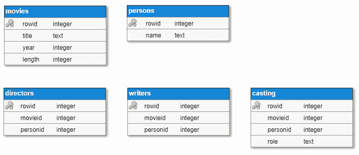

# 档案、图像和数据库

# 问题

# 79.在 ZIP 存档中查找文件

编写一个程序，可以搜索并打印 ZIP 存档中所有名称与用户提供的正则表达式匹配的文件(例如，使用`^.*\.jpg$`查找扩展名为`.jpg`的所有文件)。

# 80.将文件压缩到 ZIP 存档或从中解压缩

编写一个可以执行以下操作的程序:

*   递归地将文件或用户指定目录的内容压缩到 ZIP 存档中
*   将 ZIP 存档的内容解压缩到用户指定的目标目录

# 81.使用密码将文件压缩到 ZIP 存档或从中解压缩

编写一个可以执行以下操作的程序:

*   将文件或用户指定目录的内容递归压缩到受密码保护的 ZIP 存档中
*   将受密码保护的 ZIP 存档的内容解压缩到用户指定的目标目录

# 82.创建代表国旗的巴布亚新几内亚

编写一个程序，生成一个代表罗马尼亚国旗的 PNG 文件，如下所示。图像的像素大小以及目标文件的路径应由用户提供:

# 83.创建验证文本 PNG 图像

编写一个程序，可以创建类似验证码的 PNG 图像，用于向系统验证人类用户。这样的形象应该有:

*   渐变背景
*   一系列随机字母，以不同的角度左右显示
*   图像上不同颜色的几条随机线(在文本上方)

下面是这样一个图像的例子:

# 84.EAN-13 条形码发生器

编写一个程序，可以为标准第 13 版中的任何国际商品编号生成带有 EAN-13 条形码的 PNG 图像。为简单起见，图像应该只包含条形码，并且可以跳过条形码下打印的 EAN-13 号码。以下是数字`5901234123457`的预期输出示例:

# 85.从 SQLite 数据库中读取电影

编写一个程序，从 SQLite 数据库中读取电影并显示在控制台上。每部电影必须有一个数字标识符，一个标题，发行年份，以分钟为单位的长度，导演名单，编剧名单，以及演员和角色名称都包括在内的演员阵容。以下是应用于此目的的数据库的示意图:

# 86.以事务方式将电影插入 SQLite 数据库

扩展了为前面的问题编写的程序，这样它就可以将新电影添加到数据库中。电影可以从控制台或文本文件中读取。将电影数据插入数据库中的几个表必须以事务方式执行。

# 87.在 SQLite 数据库中处理电影图像

修改为前面的问题编写的程序，以支持将媒体文件(如图像，但也包括视频)添加到电影中。这些文件必须存储在数据库中的一个单独的表中，并且具有唯一的数字标识符、电影标识符、名称(通常是文件名)、可选描述和实际的媒体内容，以 blob 的形式存储。以下是必须添加到现有数据库中的表的结构图:

为这个问题编写的程序必须支持几个命令:

*   列出符合搜索标准的所有电影(尤其是标题)...

# 解决方法

# 79.在 ZIP 存档中查找文件

有各种各样的库为使用 ZIP 存档提供支持。免费提供的中，使用最多的包括 7z 的 *ZipLib* 、 *Info-Zip* 、 *MiniZip* 和 *LZMA SDK* 。然后，还有商业实现。对于本书中关于 ZIP 存档的问题，我选择了`ZipLib`。这是一个围绕标准库流构建的轻量级开源跨平台 C++ 11 库，没有额外的依赖关系。该图书馆及其文档可在[https://bitbucket.org/wbenny/ziplib](https://bitbucket.org/wbenny/ziplib)获得。

要实现所需的功能，您必须:

*   使用`ZipFile::Open()`打开 ZIP 存档
*   使用`ZipArchive::GetEntry() ...`枚举档案中的所有条目

# 80.将文件压缩到 ZIP 存档或从中解压缩

为了解决这个由两部分组成的问题，我们将使用我们看到的相同的`ZipLib`库来解决前面的问题。这个问题的解决方案由两个功能组成，一个能够对 ZIP 存档执行压缩，另一个能够对 ZIP 存档执行解压缩。

为了执行请求的压缩，我们应该执行以下操作:

*   如果源路径代表常规文件，则使用`ZipFile::AddFile()`将该文件添加到 ZIP 存档中
*   如果源路径表示递归目录，则:
    *   递归地遍历目录中的所有条目
    *   如果条目是一个目录，那么在 ZIP 存档中创建一个目录条目...

# 81.使用密码将文件压缩到 ZIP 存档或从中解压缩

这个问题与前面的问题非常相似，只是增加了文件必须加密的内容。`ZipLib`库仅支持 PKWare 加密。如果您需要使用另一种加密方法，那么您必须使用另一个库。如下所示的`compress()`和`decompress()`功能与前面问题的实现类似，但除了表示文件加密/解密密码的额外参数之外，还有一些不同之处:

*   将加密文件添加到归档中是通过`ZipFile::AddEncryptedFile()`而不是`ZipFile::AddFile()`完成的
*   解压时，密码必须用`ZipArchiveEntry::SetPassword() ...`设置

# 82.创建代表国旗的巴布亚新几内亚

使用 PNG 文件功能最丰富的库是 *libpng* ，一个用 C 语言编写的独立于平台的开源库，也有 C++ 库，其中一些是 *libpng* 的包装器，如 *png++* 、*lode pg*或 *PNGWriter* 。对于本书中的问题，我们将使用最后一个， *PNGWriter* 。它是一个开源库，可以在 Linux、Unix、macOS 和 Windows 上运行。其支持的功能包括打开现有的巴布亚新几内亚图像；绘制和读取 RGB、HSV 和 CMYK 颜色空间中的像素；基本形状；缩放；双线性插值；完整的 TrueType 抗锯齿和旋转文本支持；和贝塞尔曲线。它是 *libpng* 的包装器，也需要`FreeType2`库来存储文本...

# 83.创建验证文本 PNG 图像

这个问题可以用和前面有国旗的问题类似的方式解决。如果你还没有先做那个，我建议你先做，然后再继续这个。

图像必须具备三个基本要素:

*   渐变颜色背景。这可以通过从图像的一侧到另一侧绘制不同颜色的线(垂直或水平)来实现。可以使用`pngwriter::line()`功能画线。有几个可用的重载；下面代码中使用的一个取 RGB 颜色空间的红色、绿色和蓝色通道的开始和结束位置以及三个值。
*   字母随机显示的随机文本...

# 84.EAN-13 条形码发生器

维基百科上描述的*国际商品编号*(又名*欧洲商品编号*或 *EAN* )是一种描述条形码符号和编号系统的标准，在全球贸易中用于识别特定制造商特定包装配置中的特定零售产品类型。最常用的 EAN 标准是 13 位数的 EAN-13。标准的描述，包括条形码应该如何生成的信息，可以在维基百科上的[https://en.wikipedia.org/wiki/International_Article_Number](https://en.wikipedia.org/wiki/International_Article_Number)找到，在本书中不会详细介绍。以下是编号为 5901234123457 的 EAN-13 条形码，在问题描述中作为示例给出(来源:维基百科):...

# 85.从 SQLite 数据库中读取电影

SQLite 是一个用 C 语言编写的进程内关系数据库管理库(尽管大量编程语言提供了对它的绑定)。SQLite 不是客户机-服务器数据库引擎，而是嵌入到应用中的引擎。整个数据库，包括表、索引、触发器和视图，都包含在一个磁盘文件中。因为访问数据库意味着访问本地磁盘文件，而不需要任何进程间通信，所以与其他关系数据库引擎相比，SQLite 具有更好的性能。SQLite，顾名思义，使用 SQL，虽然它没有实现所有的功能(比如`RIGHT OUTER JOIN`)。SQLite 不仅用于网络浏览器(几个主要的浏览器...

# 86.将电影插入 SQLite 数据库

这个问题的解决方案建立在前一个问题的基础上。你必须先解决这个问题，然后才能继续。此外，此处代码中使用的函数`split()`与问题 27*中的函数`split()`相同，该函数使用可能的分隔符列表*将字符串拆分为标记，该函数来自[第 3 章](03.html)、*字符串和正则表达式*。为此，这里不再一一列举。在这本书的源代码中，你会发现一个名为`cppchallenger86.db`的数据库文件，它为这个问题准备了几条记录。

下面的函数`read_movie()`从控制台读取关于电影的信息(标题、发行年份、以分钟为单位的长度、导演、编剧和演员)，创建一个`movie`对象，并返回它。...

# 87.在 SQLite 数据库中处理电影图像

如果您还没有这样做，您必须先完成前面两个问题，然后再继续这个问题。对于这个问题，我们必须用一个额外的表来扩展数据库模型，以存储图像和可能的其他媒体文件，如视频。媒体文件的实际内容必须存储在 blob 字段中，但也应该存储其他属性，如描述和文件名。

When you are using large objects you have two options: either store them directly in the database as blobs or keep them in separate files and store only the file paths in the database. According to the tests performed by the developers of SQLite, for objects smaller than 100KB, reads are faster when ...