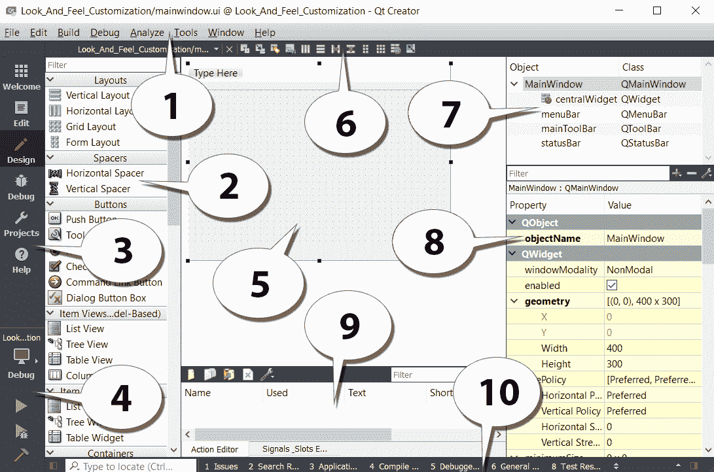
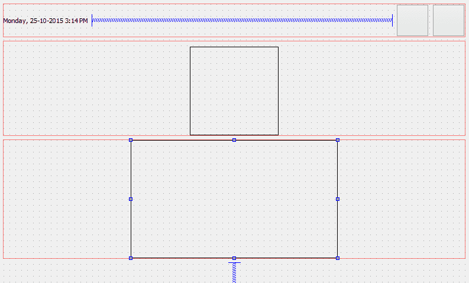
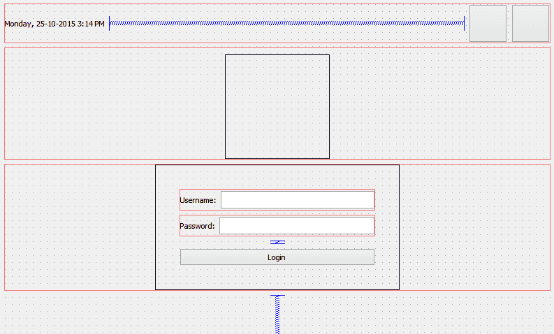
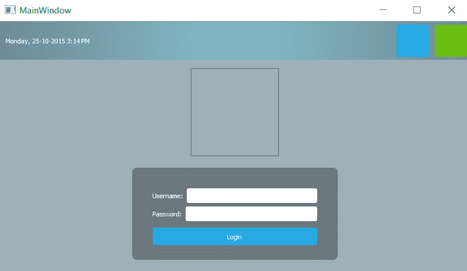
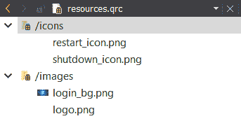
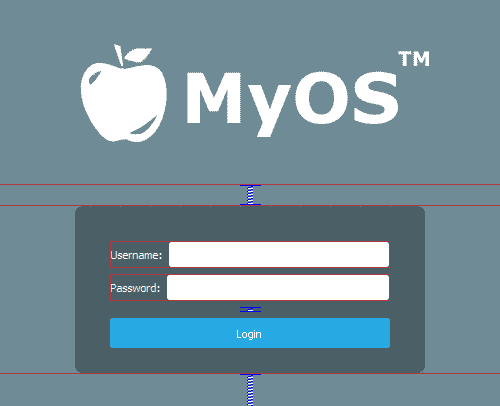
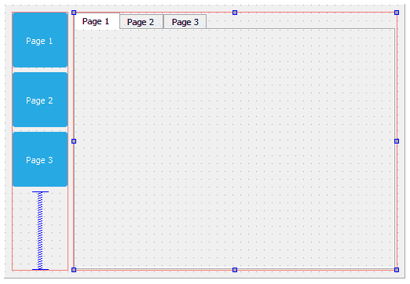
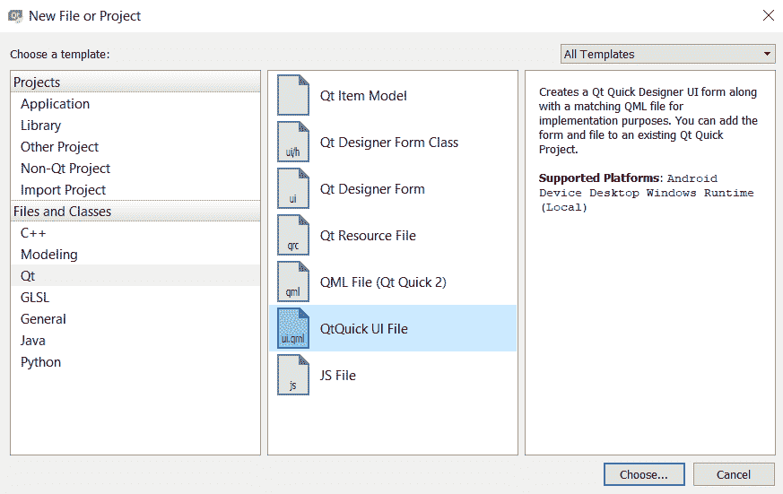
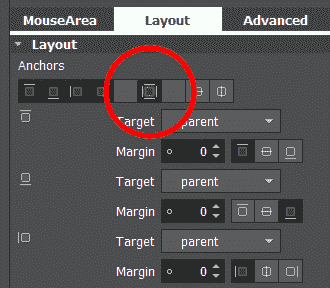

# 使用 Qt 设计器进行外观定制

我们将在本章介绍以下食谱:

*   在 Qt 设计器中使用样式表
*   自定义基本样式表
*   使用样式表创建登录屏幕
*   在样式表中使用资源
*   自定义属性和子控件
*   **Qt 建模语言** ( **QML** )中的造型
*   将 QML 对象指针暴露给 C++

# 介绍

Qt 5 允许我们通过大多数人都熟悉的方法轻松设计程序的用户界面。Qt 不仅为我们提供了一个强大的用户界面工具包，名为 **Qt** **Designer** ，让我们不用写一行代码就能设计出自己的用户界面，它还允许高级用户通过一种简单的脚本语言 **Qt Style Sheets** 定制自己的用户界面组件。

# 技术要求

本章的技术要求包括 Qt 5.11.2 MinGW 32 位、Qt Creator 4.8.2 和 Windows 10。

本章使用的所有代码均可从以下 GitHub 资源库下载，网址为:[https://GitHub . com/PacktPublishing/Qt5-CPP-GUI-Programming-cook book-第二版/tree/master/Chapter01](https://github.com/PacktPublishing/Qt5-CPP-GUI-Programming-Cookbook-Second-Edition/tree/master/Chapter01) 。

查看以下视频，查看正在运行的代码:[http://bit.ly/2TqQJ3I](http://bit.ly/2TqQJ3I)

# 在 Qt 设计器中使用样式表

在这个例子中，我们将学习如何通过使用样式表和资源来改变程序的外观和感觉，并使它看起来更加专业。Qt 允许你使用一种叫做 Qt Style Sheets 的样式表语言来装饰你的**图形 u** **ser 界面****s**(**GUI**)，这种样式表语言与网页设计师用来装饰他们的网站的**层叠样式表** ( **CSS** )非常相似。

# 怎么做…

让我们从学习如何创建新项目开始，并熟悉 Qt 设计器:

1.  打开 **Qt Creator** 创建一个新项目。如果这是你第一次使用 Qt Creator，你可以点击大按钮，上面写着+新项目，或者直接进入文件| **新文件**或项目。
2.  在项目窗口下选择应用程序，然后选择 Qt 小部件应用程序。
3.  单击选择...底部的按钮。将弹出一个窗口，要求您插入项目名称及其位置。
4.  多次单击“下一步”，然后单击“完成”按钮创建项目。我们现在将保持默认设置。项目创建完成后，首先看到的是窗口左侧有成吨大图标的面板，称为模式选择器面板；我们将在后面的*中详细讨论它是如何工作的...*段。
5.  你会看到你所有的源文件都列在模式选择器面板旁边的边栏面板上。这是您可以选择要编辑哪个文件的地方，在本例中是`mainwindow.ui`，因为我们即将开始设计程序的 UI。

6.  双击`mainwindow.ui`文件，会看到一个完全不同的界面凭空出现。Qt Creator 实际上帮助您从脚本编辑器切换到 UI 编辑器(Qt Designer)，因为它在您试图打开的文件上检测到了`.ui`扩展名。
7.  您还会注意到，模式选择器面板上突出显示的按钮已从“编辑”按钮更改为“设计”按钮。通过单击位于模式选择器面板上半部分的按钮之一，您可以切换回脚本编辑器或切换到任何其他工具。
8.  让我们回到 Qt 设计器，看看`mainwindow.ui`文件。这基本上是我们程序的主窗口(正如文件名所暗示的)，默认情况下是空的，上面没有任何小部件。您可以尝试通过按下模式选择器面板底部的运行按钮(绿色箭头按钮)来编译和运行程序，一旦编译完成，您将看到一个空窗口弹出。
9.  让我们在程序的用户界面中添加一个按钮，方法是点击窗口小部件框中的按钮项(在按钮类别下)，并将其拖动到表单编辑器的主窗口中。保持按钮处于选中状态，现在您将在窗口右侧的属性编辑器中看到该按钮的所有属性。向下滚动到中间，寻找一个名为样式表的属性。这是您将样式应用于小部件的地方，小部件可以递归地继承或不继承其子代或孙代，这取决于您如何设置样式表。或者，您可以在表单编辑器中右键单击用户界面中的任何小部件，然后选择“更改样式表”...从弹出式菜单中。
10.  您可以单击样式表属性的输入字段直接编写样式表代码，或者单击输入字段旁边的…按钮打开编辑样式表窗口，该窗口有更大的空间为样式表编写更长的代码。在窗口顶部，您可以找到几个按钮，如添加资源、添加渐变、添加颜色和添加字体，如果您不记得属性的名称，这些按钮可以帮助您开始编码。让我们尝试使用“编辑样式表”窗口做一些简单的样式设置。
11.  单击添加颜色并选择一种颜色。
12.  从颜色选择器窗口中选择一种随机颜色；比如说，一种纯红色。然后单击确定。
13.  在“编辑样式表”窗口的文本字段中添加了一行代码，在我的示例中如下所示:

```cpp
color: rgb(255, 0, 0);
```

14.  单击“确定”按钮，按钮上的文本应该会变成红色。

# 它是如何工作的...

在开始学习如何设计自己的 UI 之前，让我们花点时间熟悉一下 Qt Designer 的界面:



前面截图的解释如下:

1.  **菜单栏**:菜单栏包含特定于应用程序的菜单，可以轻松访问基本功能，如创建新项目、保存文件、撤消、重做、复制和粘贴。它还允许您访问 Qt Creator 附带的开发工具，如编译器、调试器和分析器。
2.  Widget Box:这里可以找到 Qt Designer 提供的所有不同类型的 Widget。您可以通过单击小部件框中的一个小部件并将其拖动到表单编辑器中，将小部件添加到程序的用户界面中。

3.  **模式选择器**:模式选择器是一个侧面板，放置快捷按钮，方便用户使用不同的工具。通过单击模式选择器面板上的“编辑”或“设计”按钮，可以在脚本编辑器和表单编辑器之间快速切换，这对于多任务处理非常有用。您还可以以同样的速度和方式轻松导航到调试器和分析器工具。
4.  **构建快捷方式**:构建快捷方式位于模式选择器面板的底部。通过按此处的快捷按钮，您可以轻松地构建、运行和调试项目。
5.  **表单编辑器**:表单编辑器是你编辑程序 UI 的地方。您可以通过从小部件框中选择一个小部件并将其拖动到表单编辑器中，向程序中添加不同的小部件。
6.  **表单工具栏**:从这里可以快速选择不同的表单进行编辑。单击小部件框顶部的下拉框，并选择要用 Qt 设计器打开的文件。下拉框旁边是用于在表单编辑器的不同模式之间切换的按钮，以及用于更改用户界面布局的按钮。
7.  对象检查器:对象检查器列出当前`.ui`文件中的所有小部件。所有小部件都是根据它们在层次结构中的父子关系排列的。您可以从对象检查器中选择一个小部件，以在属性编辑器中显示其属性。
8.  属性编辑器:属性编辑器将显示您从对象检查器窗口或表单编辑器窗口中选择的小部件的所有属性。
9.  动作编辑器和信号和插槽编辑器:此窗口包含两个编辑器，动作编辑器和信号和插槽编辑器，可以从窗口下方的选项卡访问。操作编辑器是您创建可以添加到程序用户界面的菜单栏或工具栏的操作的地方。
10.  **输出窗格**:输出窗格由几个不同的窗口组成，显示与脚本编译和调试相关的信息和输出消息。您可以通过按下前面带有数字的按钮在不同的输出窗格之间切换，例如 1 问题、2 搜索结果或 3 应用程序输出。

# 还有更多…

在前一节中，我们讨论了如何通过 C++ 编码将样式表应用于 Qt Widgets。虽然这种方法确实很有效，但大多数时候，负责设计程序用户界面的人不是程序员，而是专门设计用户友好界面的用户界面设计师。在这种情况下，最好让 UI 设计人员用不同的工具设计程序的布局和样式表，而不要乱动代码。Qt 提供了一个名为 **Qt Creator** 的一体化编辑器。

Qt Creator 由几个不同的工具组成，如脚本编辑器、编译器、调试器、分析器和 UI 编辑器。UI 编辑器，也叫 **Qt Designer** ，是设计人员不用写任何代码就能设计程序 UI 的完美工具。这是因为 Qt Designer 采用了*所见即所得*的方法，提供了最终结果的精确可视化表示，这意味着无论你用 Qt Designer 设计什么，当程序编译和运行时，在视觉上都会完全相同。

Qt 样式表和 CSS 的相似之处如下:

*   典型的 CSS 代码是这样的:

```cpp
h1 { color: red; background-color: white;}
```

*   这就是 Qt 样式表的外观，它几乎与前面的 CSS 相同:

```cpp
QLineEdit { color: red; background-color: white;}
```

如您所见，它们都包含一个选择器和一个声明块。每个声明包含一个属性和值，用冒号分隔。在 Qt 中，通过在 C++ 代码中调用`QObject::setStyleSheet()`函数，可以将样式表应用于单个小部件。例如，考虑以下内容:

```cpp
myPushButton->setStyleSheet("color : blue");
```

前面的代码将把带有`myPushButton`变量名的按钮文本变成蓝色。您可以通过在 Qt 设计器的样式表属性字段中编写声明来获得相同的结果。我们将在下面的*定制基本样式表*一节中进一步讨论 Qt 设计器。

Qt Style Sheets 还支持 CSS2 标准中定义的所有不同类型的选择器，包括通用选择器、类型选择器、类选择器和 ID 选择器，这允许我们将样式应用于非常特定的单个小部件或一组小部件。例如，如果我们想用`usernameEdit`对象名更改特定行编辑小部件的背景颜色，我们可以通过使用标识选择器来引用它来实现:

```cpp
QLineEdit#usernameEdit { background-color: blue }
```

To learn about all the selectors available in CSS2 (which are also supported by Qt Style Sheets), please refer to this document: [http://www.w3.org/TR/REC-CSS2/selector.html](http://www.w3.org/TR/REC-CSS2/selector.html).

# 自定义基本样式表

在前面的方法中，您学习了如何使用 Qt Designer 将样式表应用于小部件。让我们疯狂一点，通过创建一些其他类型的小部件，将它们的样式属性更改为一些奇怪的东西，以便学习。

但是，这一次，我们不会将样式逐个应用于每个小部件，而是将学习将样式表应用于主窗口，并让它继承到所有其他小部件的层次结构中，这样从长远来看，样式表更容易管理和维护。

# 怎么做…

在下面的示例中，我们将格式化画布上不同类型的小部件，并向样式表添加一些代码来更改其外观:

1.  通过选择样式表并单击样式表属性旁边的小箭头按钮，从`PushButton`中移除样式表。此按钮会将属性恢复为默认值，在本例中为空样式表。
2.  通过将小部件框中的小部件一个接一个地拖动到表单编辑器中，向用户界面添加一些小部件。我添加了行编辑、组合框、水平滑块、单选按钮和复选框。

3.  为了简单起见，通过从对象检查器中选择菜单栏、主工具栏和状态栏，右键单击并选择删除，从用户界面中删除它们。现在，您的用户界面应该如下所示:


4.  从表单编辑器或对象检查器中选择主窗口，然后右键单击并选择“更改样式表”...打开“编辑样式表”窗口。在样式表中插入以下内容:

```cpp
border: 2px solid gray;
border-radius: 10px;
padding: 0 8px;
background: yellow;
```

5.  你会看到一个奇怪的用户界面，所有的东西都用黄色覆盖，有一个厚厚的边框。这是因为前面的样式表没有选择器，这意味着样式将应用于主窗口的子小部件，一直向下到层次结构。为了改变这种情况，让我们尝试一些不同的方法:

```cpp
QPushButton {
    border: 2px solid gray;
    border-radius: 10px;
    padding: 0 8px;
    background: yellow;
}
```

6.  这一次，只有`PushButton`会获得前面代码中描述的样式，其他所有小部件都会恢复默认样式。您可以尝试在用户界面上再添加几个按钮，它们看起来都一样:


7.  发生这种情况是因为我们特别告诉选择器将样式应用于所有带有`QPushButton`类的小部件。我们还可以通过在样式表中提及按钮的名称，将样式应用于其中一个按钮，如下面的代码所示:

```cpp
QPushButton#pushButton_3 {
 border: 2px solid gray;
 border-radius: 10px;
 padding: 0 8px;
 background: yellow;
}
```

8.  一旦理解了这个方法，我们就可以将以下代码添加到样式表中:

```cpp
QPushButton {
    color: red;
    border: 0px;
    padding: 0 8px;
    background: white;
}

QPushButton#pushButton_2 {
    border: 1px solid red;
    border-radius: 10px;
}
```

9.  这段代码基本上改变了所有按钮的样式，以及`pushButton_2`按钮的一些属性。我们保持`pushButton_3`的样式表不变。现在按钮将如下所示:


10.  第一组样式表将把`QPushButton`类型的所有小部件变成没有边框和红色文本的白色矩形按钮。第二组样式表只改变一个名为`pushButton_2`的特定`QPushButton`部件的边框。请注意`pushButton_2`的背景色和文本色分别保持为白色和红色，因为我们没有在第二组样式表中覆盖它们，因此它将返回到第一组样式表中描述的样式，因为它适用于所有`QPushButton`小部件。第三个按钮的文本也变成了红色，因为我们没有在第三组样式表中描述 Color 属性。

11.  使用以下代码创建另一组使用通用选择器的样式表:

```cpp
* {
 background: qradialgradient(cx: 0.3, cy: -0.4, fx: 0.3, fy: -0.4, radius: 1.35, stop: 0 #fff, stop: 1 #888);
 color: rgb(255, 255, 255);
 border: 1px solid #ffffff;
}
```

12.  通用选择器将影响所有小部件，不管它们的类型如何。因此，前面的样式表将对所有小部件的背景应用一种漂亮的渐变颜色，并将它们的文本设置为白色，带有一个也是白色的单像素实心轮廓。我们可以使用`rgb`函数(`rgb(255, 255, 255)`)或十六进制代码(`#ffffff`)来描述颜色值，而不是写颜色的名称(即白色)。
13.  和以前一样，前面的样式表不会影响按钮，因为我们已经给了它们自己的样式，这将覆盖通用选择器中描述的一般样式。请记住，在 Qt 中，当不止一种风格对一个小部件有影响时，最终会使用更具体的风格。这就是用户界面现在的样子:


# 它是如何工作的...

如果你曾经参与过使用 HTML 和 CSS 的 web 开发，那么 Qt 的样式表和 CSS 的工作方式完全一样。样式表提供了描述小部件表示的定义——小部件组中每个元素的颜色是什么，边框应该有多厚，等等。如果您在样式表中指定小部件的名称，它将使用您提供的名称更改特定`PushButton`小部件的样式。其他小部件都不会受到影响，将保持默认样式。

要更改小部件的名称，请从表单编辑器或对象检查器中选择小部件，并在属性窗口中更改名为对象名称的属性。如果您以前使用过标识选择器来更改小部件的样式，更改其对象名称将会破坏样式表并丢失样式。要解决这个问题，只需在样式表中更改对象名。

# 使用样式表创建登录屏幕

接下来，我们将学习如何将我们在前面的示例中学习的所有知识放在一起，并为一个假想的操作系统创建一个假的图形登录屏幕。为了设计一个好的用户界面，样式表不是你唯一需要掌握的东西。您还需要学习如何使用 Qt Designer 中的布局系统整齐地排列小部件。

# 怎么做…

让我们从以下步骤开始:

1.  在我们开始做任何事情之前，我们需要设计图形登录屏幕的布局。为了生产出好的软件，计划是非常重要的。下面是我做的一个布局设计示例，向您展示我想象的登录屏幕的外观。只要能清楚地传达信息，像这样的简单线条画就足够了:


2.  再次回到 Qt 设计器。
3.  我们将首先在顶部面板放置小部件，然后在它下面放置徽标和登录表单。
4.  选择主窗口，将其宽度和高度分别从`400`和`300`更改为`800`和`600`，因为我们需要更大的空间来放置所有小部件。
5.  单击“显示小部件”类别下的标签，并将其从小部件框拖动到表单编辑器中。
6.  将标签的 objectName 属性更改为`currentDateTime`，将其文本属性更改为当前日期和时间，仅用于显示目的，如`Monday, 25-10-2015 3:14 PM`。
7.  单击按钮类别下的`PushButton`并将其拖动到表单编辑器中。再次重复这个过程，因为我们在顶部面板上有两个按钮。重命名两个按钮`restartButton`和`shutdownButton`。
8.  选择主窗口，然后单击窗体工具栏上的小图标按钮，当您将鼠标悬停在该按钮上时，它会显示“垂直布局”。您将看到小部件自动排列在主窗口上，但这还不是我们想要的。
9.  单击“布局”类别下的水平布局小部件并将其拖动到主窗口。

10.  单击并拖动两个按钮和文本标签进入水平布局。您将看到三个小部件排列成水平行，但垂直方向它们位于屏幕中间。水平排列几乎正确，但垂直位置完全偏离。
11.  从“间隔”类别中单击并拖动一个垂直间隔，并将其放置在我们之前在*步骤 9* 中创建的水平布局下方(红色矩形轮廓下方)。所有的小部件都被垫片推到顶部。
12.  在文本标签和两个按钮之间放置一个水平间隔，使它们保持分开。这将确保文本标签始终向左，按钮向右对齐。
13.  将两个按钮的水平策略和垂直策略属性设置为固定，并将最小大小属性设置为`55 x 55`。将按钮的文本属性设置为空，因为我们将使用图标而不是文本。我们将在下面的【使用样式表中的资源】一节中学习如何在按钮部件中放置图标。
14.  您的用户界面应该如下所示:


接下来，我们将使用以下步骤添加徽标:

1.  在顶部面板和垂直隔板之间添加水平布局，作为徽标的容器。
2.  添加水平布局后，您会发现布局高度太薄(几乎为零高度)，无法添加任何小部件。这是因为布局是空的，它被它下面的垂直间隔推到零高度。为了解决这个问题，我们可以将其**垂直边距【layoutTopMargin 或 layoutBottomMargin)设置为暂时更大，直到一个小部件添加到布局中。**
3.  向您刚刚创建的水平布局添加一个标签，并将其重命名为`logo`。在下面的*使用样式表中的资源*一节中，我们将了解更多关于如何在标签中插入图像以将其用作徽标的信息。现在，只需清空文本属性，并将其水平策略和垂直策略属性都设置为固定。将最小尺寸属性设置为`150 x 150`。
4.  如果您尚未将布局的垂直边距设置为零，请将其设置为零。

5.  徽标现在看起来是不可见的，所以我们将只放置一个临时样式表来使其可见，直到我们在下面的*使用样式表中的资源*部分向其添加图像。样式表非常简单:

```cpp
border: 1px solid;
```

6.  您的用户界面应该如下所示:


现在，让我们使用以下步骤创建登录表单:

1.  在徽标布局和垂直间隔之间添加水平布局。将 layoutTopMargin 属性设置为一个大数字(即`100`)，这样可以更容易地向其中添加小部件。
2.  在刚刚创建的水平布局中添加垂直布局。此布局将用作登录表单的容器。将其 layoutTopMargin 设置为低于水平布局的数字(即`20`)，这样我们就可以在其中放置小部件。
3.  右键单击刚刚创建的垂直布局，然后选择变形为| QWidget。垂直布局被转换成一个空的小部件。这一步非常重要，因为我们将为登录表单调整容器的宽度和高度。布局小部件不包含任何宽度和高度属性，只包含边距，因为布局会向其周围的空白空间扩展，考虑到它没有任何大小属性，这是有意义的。在您将布局转换为`QWidget`对象后，它将自动继承小部件类的所有属性，因此我们现在能够调整其大小以满足我们的需求。

4.  将我们刚刚从布局转换的`QWidget`对象重命名为`loginForm`，并将其水平策略和垂直策略属性都更改为固定。将最小尺寸参数设置为`350 x 200`。
5.  由于我们已经在水平布局中放置了`loginForm`小部件，我们现在可以将其 layoutTopMargin 属性设置回零。
6.  将与徽标相同的样式表添加到`loginForm`小部件中，使其暂时可见，除了这次我们需要在前面添加一个标识选择器，这样它只会将样式应用到`loginForm`而不会应用到其子小部件中:

```cpp
#loginForm { border: 1px solid; }
```

7.  您的用户界面应该如下所示:



我们还没有完成登录表单。现在我们已经为登录表单创建了容器，是时候在表单中放入更多的小部件了:

1.  将两个水平布局放入登录表单容器中。我们需要两种布局:一种用于用户名字段，另一种用于密码字段。
2.  为您刚刚添加的每个布局添加标签和线条编辑。将上方标签的文本属性更改为`Username:`，将下方标签的文本属性更改为`Password:`。将两行编辑分别重命名为`username`和`password`。
3.  在密码布局下方添加一个按钮，将其文本属性更改为`Login`。更名为`loginButton`。
4.  您可以在密码布局和登录按钮之间添加一个垂直间隔，使它们稍微分开。放置垂直间隔后，将其“大小类型”属性更改为“固定”，并将“高度”更改为 5。
5.  选择`loginForm`容器，将其所有边距设置为`35`。这是为了通过在登录表单的四周添加一些空间来使其看起来更好。
6.  将`Username`、`Password`和`loginButton`小部件的“高度”属性设置为`25`，这样它们看起来就不会那么局促了。
7.  您的用户界面应该如下所示:



我们还没完呢！如您所见，登录表单和徽标都粘贴在主窗口的顶部，因为它们下面有垂直间隔。徽标和登录表单应该放在主窗口的中央，而不是顶部。要解决此问题，请使用以下步骤:

1.  在顶部面板和徽标布局之间添加另一个垂直间隔，这将抵消底部的间隔，平衡对齐。
2.  如果您认为徽标贴得离登录表单太近，可以在徽标布局和登录表单布局之间添加一个垂直间隔。将其大小类型属性设置为固定，高度属性设置为`10`。
3.  右键单击顶部面板的布局，然后选择变形为| QWidget。改名`topPanel`。布局必须转换为 QWidget，因为我们不能将样式表应用于布局，因为它除了边距之外没有任何属性。
4.  主窗口的边缘有一点空白——我们不想要。要删除边距，请从“对象检查器”窗口(位于主窗口面板的正下方)中选择 centralWidget 对象，并将所有边距值设置为零。
5.  通过单击“运行”按钮(带有绿色箭头图标)来运行项目，以查看程序的外观。如果一切顺利，你应该会看到这样的情况:


6.  让我们使用样式表来装饰用户界面！因为所有重要的小部件都被赋予了一个对象名，所以我们更容易从主窗口向其应用样式表，因为我们将只向主窗口写入样式表，并让它们继承层次树。
7.  在对象检查器窗口中右键单击主窗口，然后选择更改样式表....
8.  将以下代码添加到样式表中:

```cpp
#centralWidget { background: rgba(32, 80, 96, 100); }
```

9.  主窗口的背景会改变颜色。我们将在下面的*使用样式表*中的资源部分学习如何使用图像作为背景。所以颜色只是暂时的。
10.  在 Qt 中，如果您想将样式应用到主窗口本身，您必须将它们应用到它的 centralWidget，而不是主窗口，因为窗口只是一个容器。
11.  给顶部面板添加一个漂亮的渐变颜色:

```cpp
#topPanel { 
    background-color: qlineargradient(spread:reflect, x1:0.5, y1:0, x2:0, y2:0, stop:0 rgba(91, 204, 233, 100), stop:1 rgba(32, 80, 96, 100));
}
```

12.  将黑色应用于登录表单，使其看起来半透明。我们还将通过设置`border-radius`属性使登录表单容器的角稍微变圆:

```cpp
#loginForm { 
 background: rgba(0, 0, 0, 80);
 border-radius: 8px;
}
```

13.  将样式应用于常规类型的小部件:

```cpp
QLabel { color: white; }
QLineEdit { border-radius: 3px; }
```

14.  前面的样式表将所有标签的文本更改为白色，这也包括小部件上的文本，因为在内部，Qt 在有文本的小部件上使用相同类型的标签。此外，我们将线编辑小部件的角做得稍微圆一些。

15.  将样式表应用于用户界面上的所有按钮:

```cpp
QPushButton {
    color: white;
    background-color: #27a9e3;
    border-width: 0px;
    border-radius: 3px;
}
```

16.  前面的样式表将所有按钮的文本更改为白色，然后将其背景颜色设置为蓝色，并使其边角也稍微变圆。
17.  为了将事情推得更远，我们将使用`hover`关键字使按钮的颜色在鼠标经过时发生变化:

```cpp
QPushButton:hover { background-color: #66c011; }
```

18.  当我们将鼠标悬停在按钮上时，前面的样式表会将按钮的背景颜色更改为绿色。我们将在下面的*自定义属性和子控件*部分对此进行更多讨论。
19.  您可以进一步调整小部件的大小和边距，使它们看起来更好。记得删除登录表单的边框线，方法是删除我们之前在*步骤 6* 中直接应用到它的样式表。
20.  您的登录屏幕应该如下所示:



# 它是如何工作的...

这个例子更侧重于 Qt 的布局系统。Qt 的布局系统允许我们的应用程序 GUI 通过排列每个小部件的子对象，在给定的空间内自动排列自己。前面示例中使用的间隔项有助于向外推动布局中包含的小部件，以沿着间隔项的宽度创建间距。

要将小部件定位到布局的中间，请在布局中放置两个间隔项:一个在小部件的左侧，一个在小部件的右侧。然后，小部件将被两个间隔器推到布局的中间。

# 在样式表中使用资源

Qt 为我们提供了一个独立于平台的资源系统，允许我们在程序的可执行文件中存储任何类型的文件以备后用。我们可以在可执行文件中存储的文件类型没有限制——图像、音频、视频、HTML、XML、文本文件、二进制文件等都是允许的。

资源系统对于将资源文件(如图标和翻译文件)嵌入到可执行文件中非常有用，这样应用程序就可以随时访问它。为了实现这一点，我们必须在`.qrc`文件中告诉 Qt 我们想要将哪些文件添加到它的资源系统中，并且 Qt 将在构建过程中处理其余的文件。

# 怎么做

要向我们的项目添加新的`.qrc`文件，请转到文件|新文件或项目。然后，在文件和类类别下选择 Qt，并选择 Qt 资源文件。之后，给它一个名称(即`resources`)，然后单击“下一步”按钮，然后单击“完成”按钮。`.qrc`文件现在将由 Qt 创建者创建并自动打开。您不必直接以 XML 格式编辑`.qrc`文件，因为 Qt Creator 为您提供了管理资源的用户界面。

要将图像和图标添加到项目中，您需要确保图像和图标位于项目的目录中。在 Qt 创建器中打开`.qrc`文件时，单击添加按钮，然后单击添加前缀按钮。**前缀**用于对您的资源进行分类，以便当您的项目中有大量资源时，可以更好地管理它们:

1.  将刚刚创建的前缀重命名为`/icons`。
2.  单击添加创建另一个前缀，然后单击添加前缀。
3.  将新前缀重命名为`/images`。
4.  选择`/icon`前缀并点击添加，然后点击添加文件。
5.  将出现文件选择窗口；使用它来选择所有图标文件。按住键盘上的 *Ctrl* 键，同时单击文件进行选择，可以一次选择多个文件。完成后，单击打开。
6.  选择`/images`前缀，点击添加按钮，然后点击添加文件按钮。文件选择窗口将再次弹出，这次我们将选择背景图像。
7.  重复前面的步骤，但是这次我们将在`/images`前缀上添加标志图像。完成后，不要忘记按下 *Ctrl* + *S* 进行保存。您的`.qrc`文件现在应该如下所示:



8.  回到`mainwindow.ui`文件；让我们利用刚刚添加到项目中的资源。选择位于顶部面板的重启按钮。向下滚动属性编辑器，直到看到**图标**属性。单击带有下拉箭头图标的小按钮，然后从菜单中单击“选择资源”。

9.  将弹出“选择资源”窗口。单击左侧面板上的图标前缀，并选择右侧面板上的重启图标。按确定。
10.  按钮上会出现一个小图标。图标看起来非常小，因为默认图标大小设置为 16 x 16。将图标大小属性更改为`50 x 50`，您将看到图标变大。对关闭按钮重复上述步骤，除了这次，选择关闭图标。
11.  这两个按钮现在应该如下所示:


12.  让我们使用添加到资源文件中的图像作为我们的徽标。选择徽标小部件，并移除我们之前添加的样式表以呈现其轮廓。
13.  向下滚动属性编辑器，直到看到位图属性。
14.  单击位图属性后面的小下拉按钮，并从菜单中选择“选择资源”。选择徽标图像，然后单击确定。徽标大小不再遵循您之前设置的尺寸；而是遵循图像的实际尺寸。我们不能改变它的尺寸，因为这只是 pixmap 属性的工作方式。
15.  如果您想要更多地控制徽标的尺寸，可以从 pixmap 属性中移除图像，并改用样式表。您可以使用以下代码将图像应用于图标容器:

```cpp
border-image: urlimg/logo.png);
```

16.  要获取图像的路径，请在文件列表窗口中右键单击图像的名称，然后选择复制路径。该路径将保存到操作系统的剪贴板中，现在您可以将其粘贴到前面的样式表中。使用此方法将确保图像符合您应用样式的小部件的尺寸。您的徽标现在应该如下图所示:



17.  使用样式表将壁纸图像应用于背景。因为背景尺寸会根据窗口大小而变化，所以我们不能在这里使用 pixmap。相反，我们将在样式表中使用`border-image`属性。右键单击主窗口，然后选择更改样式表...打开“编辑样式表”窗口。我们将在 centralWidget 的样式表下添加一个新行:

```cpp
#centralWidget {
    background: rgba(32, 80, 96, 100);
    border-image: urlimg/login_bg.png);
}
```

18.  真的那么简单容易！您的登录屏幕现在应该如下所示:


# 它是如何工作的...

Qt 中的资源系统在编译时将二进制文件(如图像和翻译文件)存储在可执行文件中。它读取项目中的资源集合文件(`.qrc`)来定位需要存储在可执行文件中的文件，并将它们包含在构建过程中。一个`.qrc`文件看起来是这样的:

```cpp
<!DOCTYPE RCC><RCC version="1.0">
 <qresource>
 <file>img/copy.png</file>
 <file>img/cut.png</file>
 <file>img/new.png</file>
 <file>img/open.png</file>
 <file>img/paste.png</file>
 <file>img/save.png</file>
 </qresource>
 </RCC>
```

它使用 XML 格式存储资源文件的路径，这些路径与包含它们的目录相关。列出的资源文件必须与`.qrc`文件位于同一个目录，或其子目录之一。

# 自定义属性和子控件

Qt 的样式表系统使我们能够轻松创建令人惊叹的专业外观的 ui。在本例中，我们将学习如何为小部件设置自定义属性，并使用它们在不同的样式之间切换。

# 怎么做…

让我们按照以下步骤自定义小部件属性和子控件:

1.  让我们创建一个新的 Qt 项目。我为此准备了 UI。用户界面左侧包含三个按钮，右侧包含一个带有三个页面的选项卡小部件，如下图所示:



2.  这三个按钮是蓝色的，因为我在主窗口中添加了以下样式表(而不是单个按钮):

```cpp
QPushButton {
    color: white;
    background-color: #27a9e3;
    border-width: 0px;
    border-radius: 3px;
}
```

3.  我将通过向主窗口添加以下样式表来解释 Qt 中的伪状态，您可能很熟悉:

```cpp
QPushButton:hover {
    color: white;
    background-color: #66c011;
    border-width: 0px;
    border-radius: 3px;
}
```

4.  我们在前面的*中使用了前面的样式表，使用样式表*创建一个登录屏幕，当有鼠标悬停事件时，使按钮改变颜色。这可以通过 Qt 样式表的伪状态来实现，在这种情况下，伪状态是由冒号将单词悬停与`QPushButton`类分开。每个小部件都有一组通用伪状态，如活动、禁用和启用，还有一组适用于其小部件类型的伪状态。例如`QPushButton`有开放、平坦等状态，但`QLineEdit`没有。让我们添加`pressed`伪状态，当用户点击按钮时，将按钮的颜色更改为`yellow`:

```cpp
QPushButton:pressed {
    color: white;
    background-color: yellow;
    border-width: 0px;
    border-radius: 3px;
}
```

5.  **伪状态**允许用户根据适用的条件加载一组不同的样式表。Qt 通过在 Qt 样式表中实现动态属性进一步推进了这个概念。这允许我们在满足自定义条件时更改小部件的样式表。我们可以利用这个特性，根据我们可以在 Qt 中使用自定义属性设置的自定义条件来更改按钮的样式表。首先，我们将把这个样式表添加到我们的主窗口中:

```cpp
QPushButton[pagematches=true] {
    color: white;
    background-color: red;
    border-width: 0px;
    border-radius: 3px;
}
```

6.  如果`pagematches`属性返回真，这将按钮的背景颜色变为红色。显然，`QPushButton`类中不存在这个属性。但是，我们可以使用`QObject::setProperty()`将其添加到我们的按钮中:

```cpp
ui->button1->setProperty("pagematches", true);
```

```cpp
private slots:
void on_tabWidget_currentChanged(int index);
```

```cpp
void MainWindow::on_tabWidget_currentChanged(int index) {
    // Set all buttons to false
    ui->button1->setProperty("pagematches", false);
    ui->button2->setProperty("pagematches", false);
    ui->button3->setProperty("pagematches", false);

    // Set one of the buttons to true
    if (index == 0)
        ui->button1->setProperty("pagematches", true);
    else if (index == 1)
        ui->button2->setProperty("pagematches", true);
    else
        ui->button3->setProperty("pagematches", true);

    // Update buttons style
    ui->button1->style()->polish(ui->button1);
    ui->button2->style()->polish(ui->button2);
    ui->button3->style()->polish(ui->button3);
}
```

7.  前面的代码在 Tab Widget 切换当前页面时将所有三个按钮的`pagematches`属性设置为`false`。在我们决定哪个按钮应该变成红色之前，一定要重置一切。
8.  检查事件信号提供的`index`变量，它会告诉你当前页面的索引号。根据索引号，将其中一个按钮的`pagematches`属性设置为`true`。

9.  通过调用`polish()`刷新所有三个按钮的样式。您可能还想在`mainwindow.h`中添加以下标题:

```cpp
#include <QStyle>
```

10.  构建并运行项目。现在，每当您将选项卡小部件切换到不同的页面时，您应该会看到三个按钮变为红色。此外，当鼠标悬停时，按钮将变为绿色，当您单击它们时，按钮将变为黄色:


# 它是如何工作的...

Qt 为用户提供了向任何类型的小部件添加自定义属性的自由。如果您想在满足特殊条件时更改特定的小部件，自定义属性非常有用，默认情况下，Qt 不提供这样的上下文。这允许用户扩展 Qt 的可用性，并使其成为定制解决方案的灵活工具。例如，如果我们的主窗口上有一行按钮，并且我们需要其中一个按钮根据选项卡小部件当前显示的页面来更改其颜色，则这些按钮不可能知道何时应该更改其颜色，因为 Qt 本身没有针对这种情况的内置上下文。为了解决这个问题，Qt 给了我们一个向小部件添加自己属性的方法，它使用了一个名为`QObject::setProperty()`的通用函数。要读取自定义属性，我们可以使用另一个名为`QObject::property()`的函数。

接下来，我们将讨论 Qt 样式表中的子控件。通常，一个小部件不仅仅是一个单一的对象，而是多个对象或控件的组合，用于形成一个更复杂的小部件。这些对象被称为**子控件**。

例如，一个旋转框小部件包含一个输入字段、一个向下按钮、一个向上按钮、一个向上箭头和一个向下箭头，这与其他一些小部件相比相当复杂。在这种情况下，如果我们愿意，Qt 允许我们使用样式表更改每个子控件，从而赋予我们更多的灵活性。我们可以通过在小部件的类名后面指定子控件的名称来做到这一点，用双冒号分隔。例如，如果我想将向下按钮的图像更改为旋转框，我可以编写如下样式表:

```cpp
QSpinBox::down-button {
    image: urlimg/spindown.png);
    subcontrol-origin: padding;
    subcontrol-position: right bottom;
}
```

这只会将图像应用到我的旋转框的向下按钮，而不会应用到小部件的任何其他部分。通过组合自定义属性、伪状态和子控件，Qt 为我们提供了一种非常灵活的方法来定制用户界面。

Visit the following link to learn more about pseudo-states and sub-controls in Qt:
[http://doc.qt.io/qt-5.12/stylesheet-reference.html](http://doc.qt.io/qt-5.12/stylesheet-reference.html).

# Qt 建模语言中的样式(QML)

**Qt 元语言**或 **Qt 建模语言** ( **QML** )是一种受 JavaScript 启发的用户界面标记语言，由 Qt 用来设计用户界面。Qt 为您提供 **Qt 快速组件**(由 QML 技术驱动的小部件)，无需 C++ 编程即可轻松设计触摸友好的用户界面。我们将按照下一节中给出的步骤，学习如何使用 QML 和 Qt 快速组件来设计我们程序的用户界面。

# 怎么做…

让我们按照以下步骤了解 QML 的造型:

1.  通过转到文件|新建文件或项目来创建新项目。选择项目类别下的应用程序，然后选择 Qt 快速应用程序-空。
2.  按选择...按钮，它会将您带到下一个窗口。插入项目名称，然后再次单击“下一步”按钮。
3.  将出现另一个窗口，要求您选择所需的最低 Qt 版本。选择计算机上安装的最新版本，然后单击“下一步”。
4.  再次单击“下一步”，然后单击“完成”。Qt Creator 现在将为您创建一个新项目。
5.  QML 项目和 C++ Qt 项目之间有一些区别。您将在项目资源中看到一个`main.qml`文件。该`.qml`文件是使用 QML 标记语言编写的用户界面描述文件。如果您双击`main.qml`文件，Qt Creator 将打开脚本编辑器，您将看到如下内容:

```cpp
import QtQuick 2.5
import QtQuick.Window 2.2
Window {
    visible: true
    width: 640
    height: 480
    title: qsTr("Hello World")
}
```

6.  这个文件告诉 Qt 创建一个 640 x 480 分辨率的空窗口，窗口标题写着`Hello World`。
7.  如果你在你的项目中打开`main.cpp`文件，你会看到这行代码:

```cpp
QQmlApplicationEngine engine;
engine.load(QUrl(QStringLiteral("qrc:/main.qml")));
```

8.  前面的代码告诉 Qt 的 QML 引擎在程序启动时加载`main.qml`文件。如果你想加载另一个`.qml`文件，你知道去哪里找代码。
9.  如果现在构建项目，得到的只是一个空窗口。要添加用户界面元素，让我们首先创建一个快速用户界面文件，方法是转到文件|新文件或项目，并在文件和类|快速用户界面类别下选择快速用户界面文件:



10.  输入组件名称为`Main`，然后输入组件表单名称为`MainForm`。单击下一步，然后单击完成:


11.  名为`MainForm.ui.qml`的新文件已添加到您的项目资源中。如果 Qt 设计器(用户界面编辑器)在创建时没有自动打开`MainForm.ui.qml`文件，请尝试双击打开该文件。您将看到一个完全不同的用户界面编辑器，与我们在所有以前的食谱中所做的 C++ 项目相比。这个编辑器也叫 **Qt 快速设计器**；它是专门为编辑 QML 的用户界面而设计的。
12.  当`main.qml`被 QML 引擎加载时，也会将`MainForm.ui.qml`导入到 UI 中，因为`MainForm`是在`main.qml`文件中被调用的。Qt 将根据命名约定通过搜索其`.qml`文件来检查`MainForm`是否是有效的用户界面。这个概念类似于我们之前所有食谱中的 C++ 项目；`main.qml`文件的作用类似于`main.cpp`文件，`MainForm.ui.qml`文件的作用类似于`MainWindow`类。也可以创建其他 UI 模板，在`main.qml`中使用。希望这种比较能让我们更容易理解 QML 是如何工作的。
13.  打开`MainForm.ui.qml`。您应该只看到“导航”窗口中列出的一个项目:项目。Item 项基本上是窗口的基本布局，不应该被删除。它类似于我们在上一节中使用的 centralWidget。

14.  画布现在真的是空的，让我们从左边的 QML 类型面板拖动鼠标区域和文本项到画布上。调整鼠标区域的大小以填充整个画布。此外，确保鼠标区域和文本项目都放置在导航器面板中的项目项目下，如下图所示:


15.  M **ouse Area** 物品是无敌物品，当鼠标点击它，或者手指触摸它(对于移动平台)时就会被触发。鼠标区域项目也用于按钮组件，我们稍后将使用它。文本项是不言自明的:它是一个在应用程序上显示文本块的标签。

16.  在导航窗口中，我们可以通过点击项目旁边类似眼睛的图标来隐藏或显示项目。当项目被隐藏时，它不会显示在画布上，也不会显示在编译的应用程序上。就像 C++ Qt 项目中的小部件一样，Qt 快速组件是基于父子关系以层次结构排列的。所有子项目都将以缩进位置放在父项目下。在我们的示例中，您可以看到“鼠标区域”和“文本”项目与“项目”项目相比稍微靠右，因为它们都是“项目”项目的子项目。我们可以通过使用导航窗口中的单击和拖动方法来重新排列父子关系以及它们在层次结构中的位置。您可以尝试单击文本项，并将其拖动到鼠标区域的顶部。然后，您将看到文本项改变了它的位置，现在位于鼠标区域下方，缩进更宽:


17.  我们可以使用导航窗口顶部的箭头按钮来重新排列它们，如前面的截图所示。父项发生的任何事情也会影响它的所有子项，例如移动父项，隐藏和显示父项。

You can pan around the canvas view by holding the middle mouse button (or mouse scroll) while moving your mouse around. You can also zoom in and out by scrolling your mouse while holding the Ctrl key on your keyboard. By default, scrolling your mouse will move the canvas view up and down. However, if your mouse cursor is on top of the horizontal scroll bar of the canvas, scrolling the mouse will move the view to the left and right.

18.  删除鼠标区域和文本项，因为我们将学习如何使用 QML 和 Qt Quick 从头开始创建用户界面。
19.  将项目的大小设置为`800 x 600`，因为我们需要更大的空间来放置小部件。
20.  将我们在之前的 C++ 项目中使用的图片，样式表中的*使用资源*配方，复制到 QML 项目的文件夹中，因为我们将使用 QML 重新创建相同的登录屏幕。
21.  将图像添加到资源文件中，以便我们可以将它们用于用户界面。

22.  打开 Qt 快速设计器并切换到“资源”窗口。单击背景图像并将其直接拖到画布上。切换到“属性”窗格上的“布局”选项卡，然后单击填充锚点按钮，此处用红色圆圈表示。这将使背景图像始终保持窗口大小:



23.  单击矩形组件并将其从“库”窗口拖到画布上。我们将把它作为我们项目的顶部面板。
24.  对于顶部面板，启用顶部锚定、左侧锚定和右侧锚定，以便面板粘附到窗口顶部并遵循其宽度。确保所有边距都设置为零。
25.  转到顶部面板的颜色属性，并选择渐变模式。设置第一种颜色为`#805bcce9`，第二种颜色为`#80000000`。这将创建一个带有蓝色渐变的半透明面板。
26.  将文本小部件添加到画布中，并使其成为顶部面板的子组件。出于显示目的，将其文本属性设置为当前日期和时间(例如，2015 年 10 月 26 日星期一下午 3:14)。然后，将文本颜色设置为白色。
27.  切换到布局选项卡，并启用顶部锚点和左侧锚点，这样文本小部件将始终粘附在屏幕的左上角。
28.  在屏幕上添加鼠标区域，并将其大小设置为`50 x 50`。然后，通过在导航窗口中将它拖到顶部面板的顶部，使它成为顶部面板的子面板。
29.  将鼠标区域的颜色设置为蓝色(`#27a9e3`)并将其半径设置为`2`，使其边角稍微变圆。启用顶部锚点和右侧锚点，使其贴在窗口的右上角。将顶部锚点的边距设置为`8`，将右侧锚点的边距设置为`10`，以创造一些空间。

30.  打开“资源”窗口，将关闭图标拖到画布上。使它成为我们刚才创建的鼠标区域项目的子项目。然后，启用填充锚点，使其适合鼠标区域的大小。
31.  唷，这是一个很大的步骤！现在，您的项目应该在导航窗口中按如下方式排列:


32.  当主窗口改变大小时，父子关系和布局锚对于将小部件保持在正确的位置非常重要。您的顶部面板应该如下所示:


33.  让我们处理登录表单。通过从“资源库”窗口拖动矩形，将新矩形添加到画布中。将矩形调整到`360 x 200`并将其半径设置为`15`。
34.  将其颜色设置为`#80000000`，将变为黑色，透明度为 50%。
35.  启用垂直中心锚点和水平中心锚点，使矩形始终与窗口中心对齐。然后，将垂直中心锚的**边距**设置为`100`，使其稍微向下移动到底部，这样我们就有空间放置徽标了。下面的截图说明了锚点的设置:


36.  将文本对象添加到画布。使它们成为登录表单(矩形小部件)的子代，并将它们的文本属性设置为`Username:`和`Password:`。将它们的文本颜色更改为白色，并相应地对它们进行定位。这次我们不需要设置边距，因为它们会跟随矩形的位置。
37.  向画布中添加两个文本输入对象，并将它们放在我们刚刚创建的文本小部件旁边。确保输入的文本也是登录表单的子项。由于文本输入不包含任何背景颜色属性，我们需要在画布上添加两个矩形作为背景。
38.  在画布上添加两个矩形，并使每个矩形都成为我们刚刚创建的一个文本输入的子对象。将**半径**属性设置为`5`，给它们一些圆角。之后，在两个矩形上启用**填充锚点**，这样它们将跟随文本输入小部件的大小。
39.  让我们在密码字段下面创建登录按钮。在画布上添加一个鼠标区域，使其成为登录表单的子窗体。将它调整到您喜欢的尺寸，并将其移动到位。
40.  由于鼠标区域不包含任何背景颜色属性，我们需要添加一个矩形小部件，并使其成为鼠标区域的子对象。将矩形的颜色设置为蓝色(`#27a9e3`)并启用填充锚点，使其与鼠标区域非常匹配。
41.  将文本对象添加到画布中，并使其成为登录按钮的子对象。将其文本颜色更改为白色，并将其文本属性设置为`Login`。最后，启用水平中心锚点和垂直中心锚点，使其与按钮的中心对齐。

42.  您现在将获得一个登录表单，它看起来非常类似于我们在 C++ 项目中制作的表单:


43.  该加 logo 了，其实很简单。打开“资源”窗口，将徽标图像拖到画布上。
44.  使其成为登录表单的子表单，并将其大小设置为`512 x 200`。
45.  把它放在登录表单的顶部，你就完成了。
46.  这就是整个用户界面在编译时的样子。我们已经成功地从 C++ 项目中重新创建了登录屏幕，但是这次我们使用了 QML 和 Qt Quick:


# 它是如何工作的...

与表单编辑器相比，Qt 快速编辑器在应用程序中放置小部件时使用了非常不同的方法。用户可以决定哪种方法最适合他们的目的。以下截图显示了 Qt 快速设计器的外观:


我们现在来看看编辑器用户界面的各种元素:

1.  导航器:“导航器”窗口以树形结构显示当前 QML 文件中的项目。它类似于我们在前面的*中使用的另一个 Qt 设计器中的对象操作器窗口，使用带有 Qt 设计器的样式表*部分。
2.  库:库窗口显示 QML 所有可用的 Qt 快速组件或 Qt 快速控制。您可以点按它并将其拖到画布窗口以添加到您的用户界面。您也可以创建自己的自定义 QML 组件并在此显示。

3.  资源:“资源”窗口显示列表中的所有资源，这些资源可以在用户界面设计中使用。
4.  导入:通过“导入”窗口，您可以将不同的 QML 模块导入到当前的 QML 文件中，例如蓝牙模块、网络工具包模块或定位模块，从而为 QML 项目添加附加功能。
5.  属性窗格:类似于我们在前面的配方中使用的属性编辑器，QML 设计器中的属性窗格显示所选项目的属性。您也可以在代码编辑器中更改项的属性。
6.  anvas:画布是您创建 QML 组件和设计应用程序的工作区域。
7.  状态窗格:状态窗格显示 QML 项目中的不同状态，描述用户界面配置，如用户界面控件、它们的属性和行为以及可用的操作。
8.  连接:这个面板是您为画布中的每个 QML 组件设置信号处理程序的地方，它支持 Qt 提供的信号和插槽机制。

# 将 QML 对象指针暴露给 C++

有时，我们希望通过 C++ 脚本修改 QML 对象的属性，例如更改标签的文本、隐藏/显示小部件或更改其大小。Qt 的 QML 引擎允许你将你的 QML 对象注册到 C++ 类型，这将自动公开它的所有属性。

# 怎么做…

我们想在 QML 创建一个标签，并偶尔更改其文本。为了将标签对象公开给 C++，我们可以执行以下步骤:

1.  创建一个名为`MyLabel`的 C++ 类，它从`mylabel.h`中的`QObject`类扩展而来:

```cpp
class MyLabel : public QObject {
Q_OBJECT
public:
    // Object pointer
    QObject* myObject;
    explicit MyLabel(QObject *parent = 0);

    // Must call Q_INVOKABLE so that this function can be used in QML
    Q_INVOKABLE void SetMyObject(QObject* obj);
}
```

2.  在`mylabel.cpp`源文件中，定义一个名为`SetMyObject()`的函数保存对象指针。该功能稍后将在 QML 的`mylabel.cpp`中调用:

```cpp
void MyLabel::SetMyObject(QObject* obj) {
    // Set the object pointer
    myObject = obj;
}
```

3.  在`main.cpp`中，包括`MyLabel`标题，并使用
    `qmlRegisterType()`功能将其注册到 QML 发动机:

```cpp
include "mylabel.h"
int main(int argc, char *argv[]) {
    // Register your class to QML
    qmlRegisterType<MyLabel>("MyLabelLib", 1, 0, "MyLabel");
}
```

4.  注意`qmlRegisterType()`中需要声明四个参数。除了声明你的类名(`MyLabel`)之外，还需要声明你的库名(`MyLabelLib`)及其版本(1.0)，该版本将用于将你的类导入到 QML。
5.  将 QML 引擎映射到我们在 QML 的标签对象，并通过在我们的 QML 文件中调用`import MyLabelLib 1.0`来导入我们之前在*步骤 3* 中定义的类库。请注意，库名及其版本号必须与您在`main.cpp`中声明的匹配，否则将引发错误。在 QML 声明`MyLabel`并将其标识设置为`mylabels`后，在标签初始化后，调用`mylabel.SetMyObject(myLabel)`将其指针暴露给 C/C++ :

```cpp
import MyLabelLib 1.0
ApplicationWindow {
    id: mainWindow
    width: 480
    height: 640
    MyLabel {
        id: mylabel
    }
    Label {
        id: helloWorldLabel
        text: qsTr("Hello World!")
        Component.onCompleted: {
            mylabel.SetMyObject(hellowWorldLabel);
        }
    }
}
```

6.  等到标签完全初始化后，再将其指针暴露给 C/C++，否则可能会导致程序崩溃。为了确保它被完全启动，在`Component.onCompleted`中调用`SetMyObject()`函数，而不是在任何其他函数或事件回调中。现在 QML 标签已经暴露给 C/C++，我们可以通过调用`setProperty()`函数来改变它的任何属性。例如，我们可以将其可见性设置为`true`并将文本更改为`Bye bye world!`:

```cpp
// QVariant automatically detects your data type
myObject->setProperty("visible", QVariant(true));
myObject->setProperty("text", QVariant("Bye bye world!"));
```

7.  除了更改属性，我们还可以通过调用以下内容来调用它的函数:

```cpp
QMetaObject::invokeMethod():
QVariant returnedValue;
QVariant message = "Hello world!";
QMetaObject::invokeMethod(myObject, "myQMLFunction", Q_RETURN_ARG(QVariant, returnedValue), Q_ARG(QVariant, message));
qDebug() << "QML function returned:" << returnedValue.toString();
```

8.  或者，简单地说，如果我们不期望从函数中返回任何值，我们可以用两个参数调用`invokedMethod()`函数:

```cpp
QMetaObject::invokeMethod(myObject, "myQMLFunction");
```

# 它是如何工作的...

QML 的设计使得它可以通过 C++ 代码进行扩展。Qt QML 模块中的类允许 QML 对象从 C++ 中使用和操作，QML 引擎与 Qt 元对象系统相结合的能力允许从 QML 直接调用 C++ 功能。要向 QML 添加一些 C++ 数据或用法，它应该来自一个 QObject 派生类。QML 对象类型可以从 C++ 中创建，并在监督下访问它们的属性，调用它们的方法，并获得它们的信号警报。这是可能的，因为所有 QML 对象类型都是使用 QObject 派生类执行的，允许 QML 引擎通过 Qt 元对象系统强制加载和检查对象。