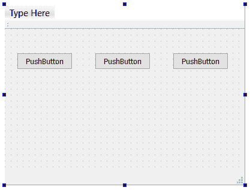
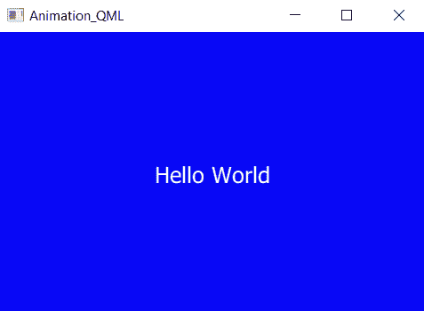

# Qt 和 QML 的状态和动画

本章将涵盖以下食谱:

*   Qt 中的属性动画
*   使用缓和曲线控制属性动画
*   创建动画组
*   创建嵌套动画组
*   Qt 中的状态机
*   QML 的状态、过渡和动画
*   使用动画师的动画小部件属性
*   雪碧动画

# 介绍

Qt 通过其强大的动画框架提供了一种简单的方法来动画小部件或继承`QObject`类的任何其他对象。动画可以单独使用，也可以与状态机框架一起使用，状态机框架允许根据小部件的当前活动状态播放不同的动画。Qt 的动画框架
也支持分组动画，可以同时移动多个图形项，或者依次移动。

# 技术要求

本章的技术要求包括 Qt 5.11.2 MinGW 32 位、Qt Creator 4.8.2 和 Windows 10。

本章使用的所有代码都可以从下面的 GitHub 链接下载:[https://GitHub . com/PacktPublishing/Qt5-CPP-GUI-编程-cook book-第二版/树/master/Chapter03](https://github.com/PacktPublishing/Qt5-CPP-GUI-Programming-Cookbook-Second-Edition/tree/master/Chapter03) 。

查看以下视频，查看正在运行的代码:[http://bit.ly/2ToKkpU](http://bit.ly/2ToKkpU)

# Qt 中的属性动画

在这个例子中，我们将学习如何使用 Qt 的属性动画类来动画化我们的**图形用户界面** ( **图形用户界面**)元素，这是其强大动画框架的一部分，允许我们用最少的努力创建流畅的动画。

# 怎么做…

在下面的示例中，我们将创建一个新的小部件项目，并通过更改按钮的属性来激活按钮:

1.  让我们创建一个新的`Qt Widgets Application`项目。之后，用 Qt Designer 打开`mainwindow.ui`，在主窗口放置一个按钮，如下图:


2.  打开`mainwindow.cpp`，在源代码的开头添加下面一行代码:

```cpp
 #include <QPropertyAnimation>
```

3.  之后，打开`mainwindow.cpp`，将以下代码添加到构造函数中:

```cpp
QPropertyAnimation *animation = new QPropertyAnimation(ui->pushButton, "geometry");
animation->setDuration(10000);
animation->setStartValue(ui->pushButton->geometry());
animation->setEndValue(QRect(200, 200, 100, 50));
animation->start();
```

# 它是如何工作的...

制作图形用户界面元素动画的一种更常见的方法是通过 Qt 提供的属性动画类，称为`QPropertyAnimation`类。这个类是动画框架的一部分，它利用 Qt 中的计时器系统在给定的持续时间内改变图形用户界面元素的属性。

我们在这里试图完成的是将按钮从一个位置移动到另一个位置，同时一路放大按钮的大小。通过在*第 2 步*的源代码中包含`QPropertyAnimation`头，我们将能够访问 Qt 提供的`QPropertyAnimation`类并利用其功能。

*步骤 3* 中的代码基本上创建了一个新的属性动画，并将其应用到我们刚刚在 Qt Designer 中创建的**按钮**上。我们特别要求属性动画类更改按钮的几何属性，并将其持续时间设置为 3，000 毫秒(3 秒)。

然后，动画的开始值被设置为按钮的初始几何形状，因为很明显，我们希望它从我们最初在 Qt Designer 中放置按钮的位置开始。最终值被设置为我们想要的样子；在这种情况下，我们将在`x: 200`和`y: 200`将按钮移动到新的位置，同时沿途将其大小更改为`width: 100`和`height: 50`。

之后，调用`animation` *|* `start()`开始动画。编译并运行项目。您应该看到按钮开始在主窗口中缓慢移动，同时一次扩大一点大小，直到它到达目的地。您可以通过更改前面代码中的值来更改动画持续时间以及目标位置和比例。使用 Qt 的属性动画系统制作一个图形用户界面元素的动画真的那么简单！

# 还有更多…

Qt 为我们提供了几个不同的子系统来为我们的 GUI 创建动画，包括计时器、时间线、动画框架、状态机框架和图形视图框架:

*   **定时器** : Qt 为我们提供了重复性和单次触发的定时器。当达到超时值时，将通过 Qt 的信号和时隙机制触发一个事件回调函数。您可以利用计时器在给定的时间间隔内更改图形用户界面元素的属性(颜色、位置、比例等)来创建动画。
*   **时间轴**:时间轴定期调用一个槽来动画化一个 GUI 元素。它非常类似于重复计时器，但是当槽被触发时，时间轴不是一直做同样的事情，而是向槽提供一个值来指示它的当前帧索引，以便您可以根据给定的值做不同的事情(例如偏移到子画面表的不同空间)。
*   **动画框架**:动画框架通过允许动画化图形用户界面元素的属性，使得动画化图形用户界面元素变得容易。动画通过使用缓和曲线来控制。缓和曲线描述了一个控制动画速度的函数，导致不同的加速和减速模式。Qt 支持的缓和曲线类型包括线性、二次、三次、四次、正弦、指数、圆形和弹性。
*   **状态机框架** : Qt 为我们提供了用于创建和执行状态图的类，这些类允许每个 GUI 元素在被信号触发时从一种状态移动到另一种状态。状态机框架中的状态图是分层的，这意味着每个状态也可以嵌套在其他状态中。
*   **图形视图框架**:图形视图框架是一个强大的图形引擎，用于可视化和与大量定制的 2D 图形项目进行交互。如果你是一个有经验的程序员，你可以使用图形视图框架来绘制你的图形用户界面，并以完全手动的方式来制作它们的动画。

通过利用我们在这里提到的所有强大功能，我们能够轻松地创建一个直观的现代图形用户界面。在本章中，我们将研究使用 Qt 制作图形用户界面元素动画的实用方法。

# 使用缓和曲线控制属性动画

在这个例子中，我们将学习如何利用缓和曲线使我们的动画更有趣。我们仍将使用之前的源代码，它使用属性动画来制作按钮动画。

# 怎么做…

在以下示例中，我们将学习如何在动画中添加缓和曲线:

1.  在调用`start()`函数之前，定义缓和曲线并将其添加到属性动画中:

```cpp
QPropertyAnimation *animation = new QPropertyAnimation(ui->pushButton, "geometry");
animation->setDuration(3000);
animation->setStartValue(ui->pushButton->geometry());
animation->setEndValue(QRect(200, 200, 100, 50));

QEasingCurve curve;
curve.setType(QEasingCurve::OutBounce);
animation->setEasingCurve(curve);
animation->start();
```

2.  调用`setLoopCount()`功能，设置您希望它重复多少个循环:

```cpp
QPropertyAnimation *animation = new QPropertyAnimation(ui->pushButton, "geometry");
animation->setDuration(3000);
animation->setStartValue(ui->pushButton->geometry());
animation->setEndValue(QRect(200, 200, 100, 50));

QEasingCurve curve;
curve.setType(EasingCurve::OutBounce);
animation->setEasingCurve(curve);
animation->setLoopCount(2);
animation->start();
```

3.  将缓和曲线应用到动画之前，调用`setAmplitude()`、`setOvershoot()`和`setPeriod()`:

```cpp
QEasingCurve curve;
curve.setType(QEasingCurve::OutBounce);
curve.setAmplitude(1.00);
curve.setOvershoot(1.70);
curve.setPeriod(0.30);
animation->setEasingCurve(curve);
animation->start();
```

# 它是如何工作的...

要让缓和曲线控制动画，您只需要定义一条**缓和曲线**，并在调用`start()`函数之前将其添加到属性动画中。你也可以尝试其他几种类型的缓和曲线，看看哪一种最适合你。这里有一个例子:

```cpp
animation->setEasingCurve(QEasingCurve::OutBounce);
```

如果您希望动画在播放完毕后循环播放，您可以调用`setLoopCount()`函数来设置您希望它重复播放的循环次数，或将无限循环的值设置为`-1`:

```cpp
animation->setLoopCount(-1);
```

在将缓和曲线应用到属性动画之前，可以设置几个参数来细化缓和曲线。这些参数包括**振幅**、**超调**、**周期**:

*   **振幅**:振幅越高，将应用于动画的弹跳或弹性弹簧效果越高。
*   **过冲**:一些曲线函数由于阻尼效应会产生过冲(超过其最终值)曲线。通过调整过冲值，我们能够增加或减少这种影响。
*   **周期**:设置一个小的周期值会给曲线一个高的频率。大周期会给它一个小频率。

然而，这些参数并不适用于所有曲线类型。请参考 Qt 文档，了解哪个参数适用于哪种曲线类型。

# 还有更多…

虽然**属性动画**工作得非常好，但有时看着图形用户界面元素以恒定的速度动画化会觉得有点无聊。我们可以通过添加**缓和曲线**来控制运动，让动画看起来更有趣。Qt 中可以使用许多类型的缓和曲线，以下是其中一些:


从上图中可以看出，每条缓和曲线都会产生不同的缓和效果。

For the full list of easing curves available in Qt, please refer to the Qt documentation at [http://doc.qt.io/qt-5/qeasingcurve.html#Type-enum](http://doc.qt.io/qt-5/qeasingcurve.html#Type-enum).

# 创建动画组

在本例中，我们将学习如何使用动画组来管理组中包含的动画的状态。

# 怎么做…

让我们按照以下步骤创建一个动画组:

1.  我们将使用前面的示例，但是这一次，我们将在主窗口中再添加两个按钮，如下图所示:



2.  在主窗口的构造器中为每个按钮定义动画:

```cpp
QPropertyAnimation *animation1 = new QPropertyAnimation(ui->pushButton, "geometry");
animation1->setDuration(3000);
animation1->setStartValue(ui->pushButton->geometry());
animation1->setEndValue(QRect(50, 200, 100, 50));

QPropertyAnimation *animation2 = new QPropertyAnimation(ui->pushButton_2, "geometry");
animation2->setDuration(3000);
animation2->setStartValue(ui->pushButton_2->geometry());
animation2->setEndValue(QRect(150, 200, 100, 50));

QPropertyAnimation *animation3 = new QPropertyAnimation(ui->pushButton_3, "geometry");
animation3->setDuration(3000);
animation3->setStartValue(ui->pushButton_3->geometry());
animation3->setEndValue(QRect(250, 200, 100, 50));
```

3.  创建缓和曲线，并将相同的曲线应用于所有三个动画:

```cpp
QEasingCurve curve;
curve.setType(QEasingCurve::OutBounce);
curve.setAmplitude(1.00);
curve.setOvershoot(1.70);
curve.setPeriod(0.30);

animation1->setEasingCurve(curve);
animation2->setEasingCurve(curve);
animation3->setEasingCurve(curve);
```

4.  将缓和曲线应用于所有三个动画后，我们将创建一个动画组，并将所有三个动画添加到该组中:

```cpp
QParallelAnimationGroup *group = new QParallelAnimationGroup;
group->addAnimation(animation1);
group->addAnimation(animation2);
group->addAnimation(animation3);
```

5.  从我们刚刚创建的动画组中调用`start()`函数:

```cpp
group->start();
```

# 它是如何工作的...

由于我们现在使用的是**动画组**，我们不再从单个动画中调用`start()`功能。相反，我们将从刚刚创建的动画组中调用`start()`函数。如果您现在编译并运行该示例，您将看到所有三个按钮同时播放。这是因为我们使用的是**平行动画组**。您可以用一个**顺序动画组**替换它，然后再次运行该示例:

```cpp
QSequentialAnimationGroup *group = new QSequentialAnimationGroup;
```

这一次，一次只有一个按钮会播放动画，而其他按钮会耐心等待轮到它们。优先级是根据首先将哪个动画添加到动画组来设置的。您可以通过简单地重新排列添加到组中的动画序列来更改动画序列。例如，如果我们希望按钮 3 首先开始动画，然后是按钮 2，然后是按钮 1，代码将如下所示:

```cpp
group->addAnimation(animation3);
group->addAnimation(animation2);
group->addAnimation(animation1);
```

由于属性动画和动画组都继承自`QAbstractAnimator`类，这意味着您也可以将一个动画组添加到另一个动画组中，以形成更复杂的嵌套动画组。

# 还有更多…

Qt 允许我们创建多个动画，并将它们分组到一个动画组中。一个组通常负责管理其动画的状态(也就是说，它决定何时开始、停止、恢复和暂停它们)。目前，Qt 为动画组提供了两种类型的类:`QParallelAnimationGroup`和`QSequentialAnimationGroup`:

*   `QParallelAnimationGroup`:顾名思义，一个平行动画组同时运行其组内的所有动画。当持续时间最长的动画完成运行时，该组被视为已完成。
*   `QSequentialAnimationGroup`:顺序动画组按顺序运行其动画，这意味着它一次只运行一个动画，并且当当前动画完成时只播放下一个动画。

# 创建嵌套动画组

使用**嵌套动画组**的一个很好的例子是，当你有几个平行的动画组，并且你想按顺序播放这些组。

# 怎么做…

让我们按照以下步骤创建一个嵌套动画组，以顺序播放不同的动画组:

1.  我们将使用上一个示例中的用户界面，并在主窗口中添加几个按钮，如下所示:


2.  为按钮创建所有动画，然后创建**缓和曲线**并将其应用于所有动画:

```cpp
QPropertyAnimation *animation1 = new QPropertyAnimation(ui->pushButton, "geometry");
animation1->setDuration(3000);
animation1->setStartValue(ui->pushButton->geometry());
animation1->setEndValue(QRect(50, 50, 100, 50));

QPropertyAnimation *animation2 = new QPropertyAnimation(ui->pushButton_2, "geometry");
animation2->setDuration(3000);
animation2->setStartValue(ui->pushButton_2->geometry());
animation2->setEndValue(QRect(150, 50, 100, 50));

QPropertyAnimation *animation3 = new QPropertyAnimation(ui->pushButton_3, "geometry");
animation3->setDuration(3000);
animation3->setStartValue(ui->pushButton_3->geometry());
animation3->setEndValue(QRect(250, 50, 100, 50));
```

接下来，应用以下代码:

```cpp
QPropertyAnimation *animation4 = new QPropertyAnimation(ui->pushButton_4, "geometry");
animation4->setDuration(3000);
animation4->setStartValue(ui->pushButton_4->geometry());
animation4->setEndValue(QRect(50, 200, 100, 50));

QPropertyAnimation *animation5 = new QPropertyAnimation(ui->pushButton_5, "geometry");
animation5->setDuration(3000);
animation5->setStartValue(ui->pushButton_5->geometry());
animation5->setEndValue(QRect(150, 200, 100, 50));

QPropertyAnimation *animation6 = new QPropertyAnimation(ui->pushButton_6, "geometry");
animation6->setDuration(3000);
animation6->setStartValue(ui->pushButton_6->geometry());
animation6->setEndValue(QRect(250, 200, 100, 50));
```

然后，应用以下代码:

```cpp
QEasingCurve curve;
curve.setType(QEasingCurve::OutBounce);
curve.setAmplitude(1.00);
curve.setOvershoot(1.70);
curve.setPeriod(0.30);

animation1->setEasingCurve(curve);
animation2->setEasingCurve(curve);
animation3->setEasingCurve(curve);
animation4->setEasingCurve(curve);
animation5->setEasingCurve(curve);
animation6->setEasingCurve(curve);
```

3.  创建两个**动画组**，一个用于上栏的按钮，另一个用于下栏:

```cpp
QParallelAnimationGroup *group1 = new QParallelAnimationGroup;
group1->addAnimation(animation1);
group1->addAnimation(animation2);
group1->addAnimation(animation3);

QParallelAnimationGroup *group2 = new QParallelAnimationGroup;
group2->addAnimation(animation4);
group2->addAnimation(animation5);
group2->addAnimation(animation6);
```

4.  我们将创建另一个动画组，用于存储我们之前创建的两个动画组:

```cpp
QSequentialAnimationGroup *groupAll = new QSequentialAnimationGroup;
groupAll->addAnimation(group1);
groupAll->addAnimation(group2);
groupAll->start();
```

# 它是如何工作的...

我们在这里尝试做的是先播放上栏按钮的动画，然后播放下栏按钮的动画。由于两个动画组都是**平行动画组**，当调用`start()`功能时，属于各自组的按钮将同时被动画化。

不过这次的组是**顺序动画组**，也就是说一次只播放一个平行动画组，第一个结束后再播放另一个。动画组是一个非常方便的系统，允许我们用简单的编码创建非常复杂的图形用户界面动画。Qt 将为我们处理困难的部分，这样我们就不必。

# Qt 中的状态机

A **状态机**可以用于很多目的，但是，在本章中，我们将只讨论与动画相关的主题。

# 怎么做…

在 Qt 中实现状态机一点也不难。让我们从以下步骤开始:

1.  我们将为示例程序设置一个新的用户界面，如下所示:


2.  我们将在源代码中包含一些标题:

```cpp
#include <QStateMachine>
#include <QPropertyAnimation>
#include <QEventTransition>
```

3.  在我们主窗口的构造函数中，添加以下代码来创建一个新的**状态机**和两个**状态**，我们稍后将使用它们:

```cpp
QStateMachine *machine = new QStateMachine(this);
QState *s1 = new QState();
QState *s2 = new QState();
```

4.  我们将定义在每个状态下我们应该做什么，在这种情况下，将改变标签的**文本**，以及按钮的**位置**和**大小**:

```cpp
QState *s1 = new QState();
s1->assignProperty(ui->stateLabel, "text", "Current state: 1");
s1->assignProperty(ui->pushButton, "geometry", QRect(50, 200, 100, 50));

QState *s2 = new QState();
s2->assignProperty(ui->stateLabel, "text", "Current state: 2");
s2->assignProperty(ui->pushButton, "geometry", QRect(200, 50, 140, 100));
```

5.  完成后，让我们继续在源代码中添加**事件转换**类:

```cpp
QEventTransition *t1 = new QEventTransition(ui->changeState, QEvent::MouseButtonPress);
t1->setTargetState(s2);
s1->addTransition(t1);

QEventTransition *t2 = new QEventTransition(ui->changeState, QEvent::MouseButtonPress);
t2->setTargetState(s1);
s2->addTransition(t2);
```

6.  将我们刚刚创建的所有状态添加到**状态机**中，并将状态 1 定义为初始状态。然后，调用`machine->start()`运行状态机:

```cpp
machine->addState(s1);
machine->addState(s2);
machine->setInitialState(s1);
machine->start();
```

7.  如果您现在运行示例程序，您会注意到一切都很好，除了按钮没有经历平滑过渡，它只是瞬间跳到我们之前设置的位置和大小。这是因为我们没有使用**属性动画**来创建平滑过渡。
8.  回到事件转换步骤，添加以下代码行:

```cpp
QEventTransition *t1 = new QEventTransition(ui->changeState, QEvent::MouseButtonPress);
t1->setTargetState(s2);
t1->addAnimation(new QPropertyAnimation(ui->pushButton, "geometry"));
s1->addTransition(t1);

QEventTransition *t2 = new QEventTransition(ui->changeState, QEvent::MouseButtonPress);
t2->setTargetState(s1);
t2->addAnimation(new QPropertyAnimation(ui->pushButton, "geometry"));
s2->addTransition(t2);
```

9.  您也可以在动画中添加一条**缓和曲线**，使其看起来更有趣:

```cpp
QPropertyAnimation *animation = new QPropertyAnimation(ui->pushButton, "geometry");
animation->setEasingCurve(QEasingCurve::OutBounce);
QEventTransition *t1 = new QEventTransition(ui->changeState, QEvent::MouseButtonPress);
t1->setTargetState(s2);
t1->addAnimation(animation);
s1->addTransition(t1);

QEventTransition *t2 = new QEventTransition(ui->changeState, QEvent::MouseButtonPress);
t2->setTargetState(s1);
t2->addAnimation(animation);
s2->addTransition(t2);
```

# 它是如何工作的...

主窗口布局上有两个**按钮**和一个**标签**。左上角的按钮按下后会触发状态变化，而右上角的标签会改变文字，显示我们当前处于哪个状态，下面的按钮会根据当前状态进行动画显示。`QEventTransition`类定义了什么会触发一种状态和另一种状态之间的转换。

在我们的例子中，当点击 changeState 按钮(左上角的那个)时，我们希望状态从状态 1 变为状态 2。之后，当再次按下同一个按钮时，我们也想从状态 2 变回状态 1。这可以通过创建另一个**事件转换**类并将目标状态设置回状态 1 来实现。然后，将这些转换添加到它们各自的状态中。我们告诉 Qt 使用属性动画类向目标值平滑地插入属性，而不是直接将属性分配给小部件。就是这么简单！没有必要设置起始值和结束值，因为我们已经调用了`assignProperty()`函数，该函数已经自动分配了结束值。

# 还有更多…

Qt 中的**状态机框架**提供了用于创建和执行状态图的类。Qt 的事件系统用于驱动状态机，其中状态之间的转换可以通过使用*信号*来触发，然后另一端的*插槽*将被信号调用来执行一个动作，例如播放动画。

一旦你理解了状态机的基础，你就可以用它们来做其他事情。状态机框架中的状态图是分层的。就像上一节中的动画组一样，状态也可以嵌套在其他状态中:


# QML 的状态、过渡和动画

如果您更喜欢使用 QML 而不是 C++，Qt 还在 Qt Quick 中提供了类似的功能，允许您用最少的代码行轻松地制作图形用户界面元素的动画。在这个例子中，我们将学习如何与 QML 实现这一点。

# 怎么做…

让我们按照以下步骤开始创建一个不断改变背景颜色的窗口:

1.  我们将创建一个新的 Qt 快速应用程序项目，并设置我们的用户界面，如下所示:



2.  以下是我的`main.qml`文件的样子:

```cpp
import QtQuick 2.9
import QtQuick.Window 2.3
Window {
    visible: true
    width: 480;
    height: 320;
    Rectangle {
        id: background;
        anchors.fill: parent;
        color: "blue";
    }
    Text {
        text: qsTr("Hello World");
        anchors.centerIn: parent;
        color: "white";
        font.pointSize: 15;
    }
}
```

3.  将**彩色动画**添加到`Rectangle`对象:

```cpp
Rectangle {
    id: background;
    anchors.fill: parent;
    color: "blue";
    SequentialAnimation on color {
        ColorAnimation { to: "yellow"; duration: 1000 }
        ColorAnimation { to: "red"; duration: 1000 }
        ColorAnimation { to: "blue"; duration: 1000 }
        loops: Animation.Infinite;
    }
}
```

4.  向`text`对象添加数字动画:

```cpp
Text {
    text: qsTr("Hello World");
    anchors.centerIn: parent;
    color: "white";
    font.pointSize: 15;
    SequentialAnimation on opacity {
        NumberAnimation { to: 0.0; duration: 200}
        NumberAnimation { to: 1.0; duration: 200}
        loops: Animation.Infinite;
    }
}
```

5.  向其中添加另一个数字动画:

```cpp
Text {
    text: qsTr("Hello World");
    anchors.centerIn: parent;
    color: "white";
    font.pointSize: 15;
    SequentialAnimation on opacity {
        NumberAnimation { to: 0.0; duration: 200}
        NumberAnimation { to: 1.0; duration: 200}
        loops: Animation.Infinite;
    }
    NumberAnimation on rotation {
        from: 0;
        to: 360;
        duration: 2000;
        loops: Animation.Infinite;
    }
}
```

6.  定义两个状态，一个叫做`PRESSED`状态，另一个叫做`RELEASED`状态。然后，将默认状态设置为`RELEASED`:

```cpp
Rectangle {
    id: background;
    anchors.fill: parent;
    state: "RELEASED";
    states: [
        State {
            name: "PRESSED"
            PropertyChanges { target: background; color: "blue"}
        },
        State {
            name: "RELEASED"
            PropertyChanges { target: background; color: "red"}
        }
    ]
}
```

7.  之后，在`Rectangle`对象内创建一个鼠标区域，这样我们就可以点击它:

```cpp
MouseArea {
    anchors.fill: parent;
    onPressed: background.state = "PRESSED";
    onReleased: background.state = "RELEASED";
}
```

8.  给`Rectangle`对象添加一些过渡:

```cpp
transitions: [
    Transition {
        from: "PRESSED"
        to: "RELEASED"
        ColorAnimation { target: background; duration: 200}
    },
    Transition {
        from: "RELEASED"
        to: "PRESSED"
        ColorAnimation { target: background; duration: 200}
    }
]
```

# 它是如何工作的...

主窗口由一个蓝色矩形和静态文本组成，上面写着 Hello World。我们希望背景颜色从蓝色变成黄色，然后变成红色，再循环回到蓝色。这可以通过使用 QML 的彩色动画类型轻松实现。我们在*步骤 3* 所做的基本上是在`Rectangle`对象内创建一个顺序动画组，然后在该组内创建三个不同颜色的动画，这将每 1000 毫秒(1 秒)改变一次对象的颜色。我们还设置动画无限循环。

在*第 4 步*中，我们想使用数字动画来动画化静态文本的`alpha`值。我们在`Text`对象中创建了另一个连续动画组，并创建了两个数字动画来将`alpha`值从`0`动画化到`1`并返回。然后，我们设置动画无限循环。

然后，在*步骤 5* 中，我们通过添加另一个数字动画来旋转 Hello World 文本。在*步骤 6* 中，我们想要在点击`Rectangle`对象时使其从一种颜色变为另一种颜色。松开鼠标后，`Rectangle`对象将变回初始颜色。为了实现这一点，首先我们需要定义两个状态，一个叫做`PRESSED`状态，另一个叫做`RELEASED`状态。然后，我们将默认状态设置为`RELEASED`。

现在，当您编译并运行该示例时，背景将在按下时立即变为蓝色，并在释放鼠标时变回红色。这很好，我们可以通过在切换颜色时给它一点过渡来进一步增强它。这可以通过向`Rectangle`对象添加过渡来轻松实现。

# 还有更多…

在 QML，您可以使用八种不同类型的属性动画，如下所示:

*   **锚点动画**:动画化锚点值的变化
*   **颜色动画**:动画显示颜色值的变化
*   **数字动画**:动画化实体类型值的变化
*   **父动画**:动画显示父值的变化
*   **路径动画**:沿路径动画化一个项目
*   **属性动画**:动画显示属性值的变化
*   **旋转动画**:动画显示旋转值的变化
*   **矢量 3d 动画**:动画显示矢量 3D 值的变化

就像 C++版本一样，这些动画也可以分组在一个动画组中，以顺序或并行播放动画。您还可以使用缓和曲线控制动画，并确定何时使用状态机播放这些动画，就像我们在上一节中所做的那样。

# 使用动画师的动画小部件属性

在本食谱中，我们将学习如何使用 QML 提供的动画制作功能来制作图形用户界面小部件属性的动画。

# 怎么做…

如果执行以下步骤，制作 QML 对象的动画非常容易:

1.  创建一个`Rectangle`对象，并添加一个缩放动画师:

```cpp
Rectangle {
    id: myBox;
    width: 50;
    height: 50;
    anchors.horizontalCenter: parent.horizontalCenter;
    anchors.verticalCenter: parent.verticalCenter;
    color: "blue";
    ScaleAnimator {
        target: myBox;
        from: 5;
        to: 1;
        duration: 2000;
        running: true;
    }
}
```

2.  添加旋转动画制作人，并在平行动画组中设置运行值，但不在任何单个动画制作人中设置:

```cpp
ParallelAnimation {
    ScaleAnimator {
        target: myBox;
        from: 5;
        to: 1;
        duration: 2000;
    }
    RotationAnimator {
        target: myBox;
        from: 0;
        to: 360;
        duration: 1000;
    }
    running: true;
}
```

3.  向缩放动画器添加缓和曲线:

```cpp
ScaleAnimator {
    target: myBox;
    from: 5;
    to: 1;
    duration: 2000;
    easing.type: Easing.InOutElastic;
    easing.amplitude: 2.0;
    easing.period: 1.5;
    running: true;
}
```

# 它是如何工作的...

动画师类型可以像任何其他动画类型一样使用。我们希望在 2000 毫秒(2 秒)内将矩形从 5 的大小缩放到 1 的大小。我们创建了一个蓝色`Rectangle`对象，并添加了一个缩放动画师。我们将初始值设置为 5，最终值设置为 1。然后，我们将动画持续时间设置为`2000`，并将运行值设置为真，以便在程序启动时播放。

就像动画类型一样，动画师也可以分组(即平行动画组或顺序动画组)。QtQuick 还会将动画组视为*动画师*，并尽可能在场景图的渲染线程上运行。在*第二步*中，我们想要将两个不同的动画师组成一个平行的动画组，这样他们就可以同时一起运行。

我们将保留之前创建的缩放动画师，并添加另一个旋转动画师来旋转`Rectangle`对象。这一次，在平行动画组中设置运行值，但不在任何单个动画制作人中设置。

就像 C++版本一样，QML 也支持缓和曲线，它们可以很容易地应用于任何动画或动画师类型。

在 QML 有一种叫做动画师的东西，它不同于通常的动画类型，尽管它们之间有一些相似之处。与常规动画类型不同，动画师类型直接在 Qt Quick 的场景图上操作，而不是 QML 对象及其属性。动画运行时，QML 属性的值不会更改，因为它只会在动画完成后更改。使用动画师类型的好处是它直接在场景图的渲染线程上操作，这意味着它的性能会比在 UI 线程上运行稍好。

# 雪碧动画

在这个例子中，我们将学习如何在 QML 创建雪碧动画。

# 怎么做…

让我们按照以下步骤在应用程序窗口中运行一匹马:

1.  我们将需要添加我们的精灵表到 Qt 的资源系统，以便它可以在程序中使用。打开`qml.qrc`，点击添加|添加文件按钮。选择您的精灵工作表图像，并按下 *Ctrl* + *S* 保存资源文件。
2.  在`main.qml`中创建新的空窗口:

```cpp
import QtQuick 2.9
import QtQuick.Window 2.3
Window {
    visible: true
    width: 420
    height: 380
    Rectangle {
        anchors.fill: parent
        color: "white"
    }
}
```

3.  完成后，我们将开始在 QML 创建一个`AnimatedSprite`对象:

```cpp
import QtQuick 2.9
import QtQuick.Window 2.3
Window {
    visible: true;
    width: 420;
    height: 380;
    Rectangle {
        anchors.fill: parent;
        color: "white";
    }
```

然后，设置以下内容:

```cpp
AnimatedSprite {
        id: sprite;
        width: 128;
        height: 128;
        anchors.centerIn: parent;
        source: "qrc:///horse_1.png";
        frameCount: 11;
        frameWidth: 128;
        frameHeight: 128;
        frameRate: 25;
        loops: Animation.Infinite;
        running: true;
    }
}
```

4.  在窗口中添加鼠标区域并检查`onClicked`事件:

```cpp
MouseArea {
    anchors.fill: parent;
    onClicked: {
        if (sprite.paused)
            sprite.resume();
        else
            sprite.pause();
    }
}
```

5.  如果你现在编译并运行示例程序，你会看到一匹小马在窗口中间奔跑。多有趣:


6.  接下来，我们想尝试做一些很酷的事情。我们会在播放它的跑步动画时，让马跑过窗户，无限循环！首先，我们需要从 QML 移除`anchors.centerIn: parent`并用`x`和`y`值替换它:

```cpp
AnimatedSprite {
    id: sprite;
    width: 128;
    height: 128;
    x: -128;
    y: parent.height / 2;
    source: "qrc:///horse_1.png";
    frameCount: 11;
    frameWidth: 128;
    frameHeight: 128;
    frameRate: 25;
    loops: Animation.Infinite;
    running: true;
}
```

7.  向 sprite 对象添加数字动画并设置其属性，如下所示:

```cpp
NumberAnimation {
    target: sprite;
    property: "x";
    from: -128;
    to: 512;
    duration: 3000;
    loops: Animation.Infinite;
    running: true;
}
```

8.  如果你现在编译并运行示例程序，你会看到小马发疯了，开始跑过窗户！

# 它是如何工作的...

在这个配方中，我们将动画精灵对象放在窗口的中间，并将其图像源设置为我们刚刚添加到项目资源中的精灵表。然后，我们计算 sprite 表中有多少帧属于正在运行的动画，在本例中是 11 帧。我们还通知 Qt 动画每一帧的尺寸，在这种情况下是`128 x 128`。之后，我们将帧率设置为`25`以获得合适的速度，然后将其设置为无限循环。然后我们将运行值设置为`true`，这样当程序开始运行时，动画将默认播放。

然后，在*第 4 步*中，我们希望能够暂停动画并通过点击窗口恢复动画。我们只需在点击鼠标区域时检查精灵当前是否暂停。如果精灵动画暂停，则动画恢复；否则，动画会暂停。

在*步骤 6* 中，我们将`anchors.centerIn`替换为`x`和`y`值，这样动画精灵对象就不会锚定在窗口的中心，这将使其无法四处移动。然后，我们在动画精灵中创建一个数字动画来激活其`x`属性。我们将左侧的`start`值设置为窗外的某个地方，将右侧的`end`值设置为窗外的某个地方。之后，我们将持续时间设置为`3,000 milliseconds` (3 秒)，并使其无限循环。

最后，我们还将`running`值设置为`true`，这样当程序开始运行时，它会默认播放动画。

# 还有更多…

精灵动画被广泛使用，尤其是在游戏开发中。精灵用于角色动画、粒子动画，甚至图形用户界面动画。一个精灵表由许多图像组合成一个，然后可以一次一个地分解并显示在屏幕上。精灵表中不同图像(或精灵)之间的过渡会产生动画错觉，我们通常称之为精灵动画。在 QML 使用`AnimatedSprite`类型可以轻松实现雪碧动画。

In this example program, I am using a free and open source image  that was created by **bluecarrot16** under the `CC-BY 3.0/GPL 3.0/GPL 2.0/OGA-BY 3.0` license. The image can be obtained legally at [http://opengameart.org/content/lpc-horse](http://opengameart.org/content/lpc-horse).