# OpenGL 实现

在这一章中，我们将介绍以下食谱:

*   在 Qt 中设置**打开图形库** ( **OpenGL** )
*   你好世界！
*   渲染 2D 形状
*   渲染三维形状
*   OpenGL 中的纹理
*   OpenGL 中的基本照明
*   使用键盘控制移动对象
*   QML 的三维画布

# 介绍

本章我们将学习如何使用 OpenGL，一个强大的渲染**应用程序接口** ( **API** ，并将其与 Qt 相结合。OpenGL 是一个跨语言、跨平台的 API，用于通过我们计算机图形芯片内的**图形处理单元** ( **GPU** )在屏幕上绘制 2D 和 3D 图形。在本章中，我们将学习 OpenGL 3 而不是 2，因为尽管与较新的可编程管道相比，固定功能管道对初学者来说更容易掌握，但它被认为是遗留代码，已被大多数现代 3D 渲染软件所否决。Qt 5 支持这两个版本，所以如果你需要你的软件向后兼容，切换到 OpenGL 2 应该没有问题。

# 技术要求

本章的技术要求包括 Qt 5.11.2 MinGW 32 位、Qt Creator 4.8.2 和 Windows 10。

本章使用的所有代码都可以从下面的 GitHub 链接下载:[https://GitHub . com/PacktPublishing/Qt5-CPP-GUI-编程-cook book-第二版/树/master/Chapter05](https://github.com/PacktPublishing/Qt5-CPP-GUI-Programming-Cookbook-Second-Edition/tree/master/Chapter05) 。

查看以下视频，查看正在运行的代码:[http://bit.ly/2FrX4Ho](http://bit.ly/2FrX4Ho)

# 在 Qt 中设置 OpenGL

在这个食谱中，我们将学习如何在 Qt 5 中设置 OpenGL。

# 怎么做…

按照以下步骤学习如何在 Qt 中设置 OpenGL:

1.  通过转到文件|新文件或项目，创建一个新的 Qt 小部件应用程序。
2.  我们将删除`mainwindow.ui`文件，因为我们不打算在本例中使用它。右键单击`mainwindow.ui`文件，从下拉菜单中选择删除文件。然后，会出现一个消息框，要求您确认。勾选永久删除文件，然后按确定按钮。
3.  对`mainwindow.h`和`mainwindow.cpp`重复步骤 2。我们在这个项目中也不需要这两个文件。
4.  打开您的项目文件(`.pro`)并通过在`QT +=`后面添加一个`opengl`关键字将`OpenGL`模块添加到您的项目中，如下所示:

```cpp
QT += core gui opengl
```

5.  您还需要在项目文件中添加另一行，以便它在启动过程中加载`OpenGL`和`GLu` (OpenGL 实用程序)库。没有这两个库，您的程序将无法运行:

```cpp
LIBS += -lopengl32 -lglu32
```

6.  打开`main.cpp`并用`QtOpenGL`表头替换`mainwindow.h`:

```cpp
#include <QtOpenGL>
```

7.  从您的`main.cpp`文件中删除所有与`MainWindow`类相关的代码，并用以下代码片段中突出显示的代码替换它:

```cpp
#include <QApplication>
#include <QtOpenGL>

int main(int argc, char *argv[]) {
  QApplication app(argc, argv);

  QOpenGLWindow window;
 window.setTitle("Hello World!");
 window.resize(640, 480);
 window.show();

  return app.exec();
}
```

8.  如果您现在编译并运行项目，您将看到一个黑色背景的空窗口。别担心——你的程序现在运行在 OpenGL 上:

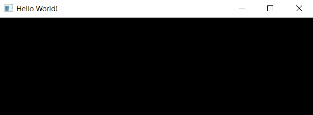

# 它是如何工作的...

为了访问与 OpenGL 相关的头文件，如`QtOpenGL`、`QOpenGLFunctions`，必须将`OpenGL`模块添加到项目文件(`.pro`)中。我们在主窗口中使用了`QOpenGLWindow`类，而不是`QMainWindow`，因为它被设计来轻松创建执行 OpenGL 渲染的窗口，并且由于其小部件模块中没有依赖项，因此与`QOpenGLWidget`相比，它提供了更好的性能。

我们必须调用`setSurfaceType(QWindow::OpenGLSurface)`来告诉 Qt 我们更喜欢使用 OpenGL 将图像渲染到屏幕上，而不是`QPainter`。`QOpenGLWindow`类提供了几个虚拟功能(`initializeGL()`、`resizeGL()`、`paintGL()`等)，方便我们设置 OpenGL，进行图形渲染。在下面的例子中，我们将学习如何使用这些函数。

# 还有更多…

OpenGL 是一个跨语言、跨平台的应用编程接口，用于通过我们计算机图形芯片中的图形处理器在屏幕上绘制 2D 和 3D 图形。这些年来，计算机图形技术发展迅速——如此之快，以至于软件行业很难跟上它的步伐。

2008 年，维护和开发 OpenGL 的公司 Khronos Group 宣布发布 OpenGL 3.0 规范，在整个行业引起了巨大的骚动和争议。这主要是因为 OpenGL 3.0 本应摒弃 OpenGL API 的整个固定功能管道，而对于大玩家来说，一夜之间从固定功能管道突然切换到可编程管道简直是一项不可能完成的任务。这导致了 OpenGL 的两个不同的主要版本被维护。

在本章中，我们将使用较新的 OpenGL 3，而不是较旧的、已弃用的 OpenGL 2。这两个版本的编码风格和语法差异很大，切换起来非常麻烦。然而，性能的提高将使它值得花时间切换到 OpenGL 3。

# 你好世界！

在本章中，我们将学习如何在 Qt 5 中使用 OpenGL 3。`glBegin`、`glVertex2f`、`glColor3f`、`glMatrixMode`、`glLoadIdentity`等常见的 OpenGL 功能都已从 OpenGL 3 中移除。OpenGL 3 使用顶点缓冲区对象将数据批量发送到 GPU，而不是通过`glVertex2f()`等功能逐个发送，在等待 CPU 逐个提交数据的同时减缓了渲染速度。因此，我们将所有数据打包到顶点缓冲对象中，并将其全部发送到一个巨大的包中，并指示 GPU 通过着色器编程计算结果像素。我们还将学习如何通过一种叫做 **OpenGL 着色语言** ( **GLSL** )的类似 C 的编程语言来创建简单的着色器程序。

# 怎么做…

让我们从以下步骤开始:

1.  我们将创建一个名为`RenderWindow`的新类，它继承自`QOpenGLWindow`类。转到文件|新建文件或项目，然后在文件和类类别下选择 C++ 类。命名类`RenderWindow`，将其基类设置为`QOpenGLWindow`。然后，继续创建 C++ 类:


2.  转到我们刚刚创建的`renderwindow.h`文件，并在源代码顶部添加以下标题:

```cpp
#include <GL/glu.h>
#include <QtOpenGL>
#include <QSurfaceFormat>
#include <QOpenGLFunctions>
#include <QOpenGLWindow>
#include <QOpenGLBuffer>
#include <QOpenGLVertexArrayObject>
#include <QOpenGLShader>
#include <QOpenGLShaderProgram>
```

3.  我们需要创建几个函数和变量，如下所示:

```cpp
class RenderWindow : public QOpenGLWindow {
public:
    RenderWindow();

protected:
    void initializeGL();
 void paintGL();
 void paintEvent(QPaintEvent *event);
 void resizeEvent(QResizeEvent *event);
```

4.  我们将继续并添加一些私有变量:

```cpp
private:
    QOpenGLContext* openGLContext;
 QOpenGLFunctions* openGLFunctions;
 QOpenGLShaderProgram* shaderProgram;
 QOpenGLVertexArrayObject* vao;
 QOpenGLBuffer* vbo_vertices;
};
```

5.  打开`renderwindow.cpp`定义类构造函数，如下。我们必须告诉渲染窗口使用 OpenGL 曲面类型；启用运行 3.2 版的核心配置文件(而不是兼容性配置文件)；创建一个 OpenGL 上下文；最后，将我们刚刚创建的概要文件应用到上下文中:

```cpp
RenderWindow::RenderWindow() {
    setSurfaceType(QWindow::OpenGLSurface);

    QSurfaceFormat format;
    format.setProfile(QSurfaceFormat::CoreProfile);
    format.setVersion(3, 2);
    setFormat(format);

    openGLContext = new QOpenGLContext();
    openGLContext->setFormat(format);
    openGLContext->create();
    openGLContext->makeCurrent(this);
}
```

6.  我们需要定义`initializeGL()`函数，如下。此函数将在渲染开始前调用。首先，我们定义顶点和片段着色器:

```cpp
void RenderWindow::initializeGL() {
    openGLFunctions = openGLContext->functions();

    static const char *vertexShaderSource =
    "#version 330 core\n"
    "layout(location = 0) in vec2 posAttr;\n"
    "void main() {\n"
    "gl_Position = vec4(posAttr, 0.0, 1.0); }";

    static const char *fragmentShaderSource =
    "#version 330 core\n"
    "out vec4 col;\n"
    "void main() {\n"
    "col = vec4(1.0, 0.0, 0.0, 1.0); }";
```

7.  我们启动`shaderProgram`并声明一个`vertices`数组。然后，我们还创建了一个`QOpenGLVertexArrayObject`对象:

```cpp
    shaderProgram = new QOpenGLShaderProgram(this);
    shaderProgram->addShaderFromSourceCode(QOpenGLShader::Vertex, vertexShaderSource);
    shaderProgram->addShaderFromSourceCode(QOpenGLShader::Fragment, fragmentShaderSource);
    shaderProgram->link();

    GLfloat vertices[] = {
    -1.0f, -1.0f,
    1.0f, -1.0f,
    0.0f, 1.0f };

    vao = new QOpenGLVertexArrayObject();
    vao->create();
    vao->bind();
```

8.  让我们通过定义`vbo_vertices`继续编写我们的代码:

```cpp
    vbo_vertices = new QOpenGLBuffer(QOpenGLBuffer::VertexBuffer);
    vbo_vertices->create();
    vbo_vertices->setUsagePattern(QOpenGLBuffer::StaticDraw);
    vbo_vertices->bind();
    vbo_vertices->allocate(vertices, sizeof(vertices) * sizeof(GLfloat));

    vao->release();
}
```

9.  我们将从给`paintEvent()`函数添加一些代码开始:

```cpp
void RenderWindow::paintEvent(QPaintEvent *event) {
    Q_UNUSED(event);
    glViewport(0, 0, width(), height());
    glClearColor(0.39f, 0.58f, 0.93f, 1.f);
    glClear(GL_COLOR_BUFFER_BIT);
```

10.  然后我们将在调用`glDrawArrays()`之前绑定 VAO 和着色器程序:

```cpp
    vao->bind();
    shaderProgram->bind();
    shaderProgram->bindAttributeLocation("posAttr", 0);
    shaderProgram->enableAttributeArray(0);
    shaderProgram->setAttributeBuffer(0, GL_FLOAT, 0, 2);
    glDrawArrays(GL_TRIANGLES, 0, 3);
    shaderProgram->release();
    vao->release();
}
```

11.  通过添加以下代码，可以在调整渲染窗口大小时刷新视口:

```cpp
void RenderWindow::resizeEvent(QResizeEvent *event) {
    Q_UNUSED(event);
    glViewport(0, 0, this->width(), this->height());
    this->update();
}
```

12.  如果您现在编译并运行项目，您应该能够看到在蓝色背景前面绘制了一个红色矩形:

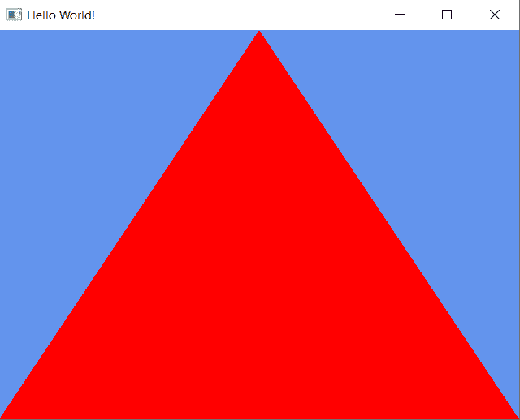

# 它是如何工作的...

我们必须将 OpenGL 版本设置为 3.x，将表面格式设置为核心配置文件，这样我们就可以访问更新的着色器管道，这与旧的、不推荐使用的兼容性配置文件完全不同。OpenGL 2.x 仍然存在于兼容性配置文件中，只是为了允许 OpenGL 程序在旧硬件上运行。创建的配置文件必须应用到 OpenGL 上下文，然后才能工作。

在 OpenGL 3 和更高版本中，大部分计算都是通过着色器程序在 GPU 中完成的，因为所有常见的固定函数现在都已完全弃用。因此，在前面的示例中，我们创建了一个非常简单的顶点着色器和片段着色器。

着色器程序由三个不同的部分组成:几何着色器(可选)、顶点着色器和片段着色器。几何着色器在将数据传递给顶点着色器之前计算几何的创建；顶点着色器在将数据传递给片段着色器之前处理顶点的位置和运动；最后，片段着色器计算并在屏幕上显示结果像素。

在前面的例子中，我们只使用了顶点和片段着色器，并排除了几何着色器，因为它是可选的。您可以将 GLSL 代码保存在一个文本文件中，并通过调用`addShaderFromFile()`将其加载到您的 Qt 5 程序中，但是由于我们的着色器非常简单和简短，所以我们只是直接在我们的 C++ 源代码中定义它。

之后，我们使用一种叫做**顶点缓冲对象** ( **VBO** )的东西来批量存储顶点位置，然后将其发送到 GPU。我们还可以使用 VBO 存储其他信息，如法线、纹理坐标和顶点颜色。你可以发送任何你想要的东西到图形处理器，只要它匹配你的着色器代码中的输入。然后，我们将 VBO 添加到一个**顶点数组对象** ( **VAO** )中，并将整个 VAO 发送到 GPU 进行处理。你可以在 VAO 中添加许多不同的 vbo，因为 VAO 就像任何普通的 C++ 数组一样。

就像我们前几章所学的一样，所有的绘图都发生在`paintEvent()`函数内，只有在 Qt 认为需要刷新屏幕时才会调用。要强制 Qt 更新屏幕，手动调用`update()`。此外，我们必须通过调用`glViewport(x, y ,width, height)`来更新视窗屏幕的大小。

# 渲染 2D 形状

由于我们已经学习了如何在屏幕上绘制第一个矩形，我们将在这一部分进一步增强它。我们将采取前面的例子，并从那里继续。

# 怎么做…

让我们从这个例子开始:

1.  打开`renderwindow.h`，再添加两个 vbo，一个叫做`vbo_vertices2`，另一个叫做`vbo_colors`，如下代码所示:

```cpp
private:
    QOpenGLContext* openGLContext;
    QOpenGLFunctions* openGLFunctions;
    QOpenGLShaderProgram* shaderProgram;
    QOpenGLVertexArrayObject* vao;
    QOpenGLBuffer* vbo_vertices;
    QOpenGLBuffer* vbo_vertices2;
    QOpenGLBuffer* vbo_colors;
```

2.  打开`renderwindow.cpp`并将以下代码添加到着色器代码中，如以下片段中突出显示的那样:

```cpp
static const char *vertexShaderSource =
    "#version 330 core\n"
    "layout(location = 0) in vec2 posAttr;\n"
 "layout(location = 1) in vec3 colAttr;\n"
 "out vec3 fragCol;\n"
    "void main() {\n"
 "fragCol = colAttr;\n"
    "gl_Position = vec4(posAttr, 1.0, 1.0); }";
```

3.  将高亮显示的代码添加到片段着色器，如下所示:

```cpp
static const char *fragmentShaderSource =
    "#version 330 core\n"
 "in vec3 fragCol;\n"
    "out vec4 col;\n"
    "void main() {\n"
 "col = vec4(fragCol, 1.0); }";
```

4.  将`vertices`数组改为如下内容:

```cpp
GLfloat vertices[] = {
    -0.3f, -0.5f,
    0.8f, -0.4f,
    0.2f, 0.6f };

GLfloat vertices2[] = {
    0.5f, 0.3f,
    0.4f, -0.8f,
    -0.6f, -0.2f };

GLfloat colors[] = {
    1.0f, 0.0f, 0.0f,
    0.0f, 1.0f, 0.0f,
    0.0f, 0.0f, 1.0f };
```

5.  由于在前面的例子中我们已经初始化了`vbo_vertices`，这次我们只需要初始化另外两个 vbo，即`vbo_vertices`和`vbo_colors`:

```cpp
vbo_vertices2 = new QOpenGLBuffer(QOpenGLBuffer::VertexBuffer);
vbo_vertices2->create();
vbo_vertices2->setUsagePattern(QOpenGLBuffer::StaticDraw);
vbo_vertices2->bind();
vbo_vertices2->allocate(vertices2, sizeof(vertices2) * sizeof(GLfloat));

vbo_colors = new QOpenGLBuffer(QOpenGLBuffer::VertexBuffer);
vbo_colors->create();
vbo_colors->setUsagePattern(QOpenGLBuffer::StaticDraw);
vbo_colors->bind();
vbo_colors->allocate(colors, sizeof(colors) * sizeof(GLfloat));
```

6.  在我们开始使用`glDrawArrays()`绘制三角形之前，我们还必须将`vbo_colors`的数据添加到着色器的`colAttr`属性中。在将数据发送到着色器之前，请确保调用`bind()`将 VBO 设置为当前活动的 VBO。位置标识(在本例中为 0 和 1)必须与着色器中使用的位置标识匹配:

```cpp
vbo_vertices->bind();
shaderProgram->bindAttributeLocation("posAttr", 0);
shaderProgram->enableAttributeArray(0);
shaderProgram->setAttributeBuffer(0, GL_FLOAT, 0, 2);

vbo_colors->bind();
shaderProgram->bindAttributeLocation("colAttr", 1);
shaderProgram->enableAttributeArray(1);
shaderProgram->setAttributeBuffer(1, GL_FLOAT, 0, 3);

glDrawArrays(GL_TRIANGLES, 0, 3);
```

7.  就在前面的代码之后，我们将发送`vbo_vertices2`和`vbo_colors`到着色器属性，并再次调用`glDrawArrays()`来绘制第二个三角形:

```cpp
vbo_vertices2->bind();
shaderProgram->bindAttributeLocation("posAttr", 0);
shaderProgram->enableAttributeArray(0);
shaderProgram->setAttributeBuffer(0, GL_FLOAT, 0, 2);

vbo_colors->bind();
shaderProgram->bindAttributeLocation("colAttr", 1);
shaderProgram->enableAttributeArray(1);
shaderProgram->setAttributeBuffer(1, GL_FLOAT, 0, 3);

glDrawArrays(GL_TRIANGLES, 0, 3);
```

8.  如果您现在构建程序，您应该能够在屏幕上看到两个三角形，其中一个三角形位于另一个三角形之上:

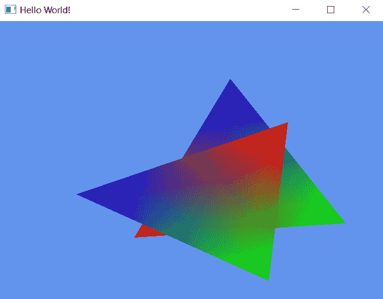

# 它是如何工作的...

OpenGL 支持的几何图元类型有点、线、线段、线环、多边形、四边形、四边形条、三角形、三角形条和三角形扇。在这个例子中，我们画了两个三角形，其中每个形状都有一组顶点和颜色，这样 OpenGL 就知道形状应该如何渲染。

彩虹色效果是通过为每个顶点赋予不同的颜色来创建的。OpenGL 将自动在每个顶点之间插入颜色，并将其显示在屏幕上。目前，首先呈现的形状将出现在稍后呈现的其他形状的后面。这是因为我们在 2D 空间中渲染形状，并且不涉及深度信息来检查哪个形状位于前面等等。我们将在下面的例子中学习如何进行深度检查。

# 渲染三维形状

在上一节中，我们学习了如何在屏幕上绘制简单的 2D 形状。然而，为了充分利用 OpenGL API，我们还需要学习如何使用它来渲染 3D 图像。简而言之，3D 图像只是使用 2D 形状创建的错觉，堆叠方式使它们看起来像是 3D 的。

# 怎么做...

这里的主要成分是深度值，它决定了哪些形状应该出现在其他形状的前面或后面。位于另一个曲面后面的图元形状(深度比另一个形状浅)将不会被渲染(或被部分渲染)。OpenGL 提供了一种简单的方法来实现这一点:

1.  让我们从前面的 2D 例子继续我们的项目。通过在`renderwindow.cpp`的`initializeGL()`功能中添加`glEnable(GL_DEPTH_TEST)`来启用深度测试:

```cpp
void RenderWindow::initializeGL()
{
    openGLFunctions = openGLContext->functions();
    glEnable(GL_DEPTH_TEST);
```

2.  我们将把我们的`vertices`数组变成更长的东西，这是一个三维立方体形状的顶点信息。我们现在可以移除`colors`数组，因为这次您没有向着色器提供颜色信息。我们也可以出于同样的原因除去`vbo_colors` VBO:

```cpp
GLfloat vertices[] = {
    -1.0f,-1.0f,-1.0f,1.0f,-1.0f,-1.0f,-1.0f,-1.0f, 1.0f,
    1.0f,-1.0f,-1.0f,1.0f,-1.0f, 1.0f,-1.0f,-1.0f, 1.0f,
    -1.0f, 1.0f,-1.0f,-1.0f, 1.0f, 1.0f,1.0f, 1.0f,-1.0f,
    1.0f, 1.0f,-1.0f,-1.0f, 1.0f, 1.0f,1.0f, 1.0f, 1.0f,
    -1.0f,-1.0f, 1.0f,1.0f,-1.0f, 1.0f,-1.0f, 1.0f, 1.0f,
    1.0f,-1.0f, 1.0f,1.0f, 1.0f, 1.0f,-1.0f, 1.0f, 1.0f,
    -1.0f,-1.0f,-1.0f,-1.0f, 1.0f,-1.0f,1.0f,-1.0f,-1.0f,
    1.0f,-1.0f,-1.0f,-1.0f, 1.0f,-1.0f,1.0f, 1.0f,-1.0f,
    -1.0f,-1.0f, 1.0f,-1.0f, 1.0f,-1.0f,-1.0f,-1.0f,-1.0f,
    -1.0f,-1.0f, 1.0f,-1.0f, 1.0f, 1.0f,-1.0f, 1.0f,-1.0f,
    1.0f,-1.0f, 1.0f,1.0f,-1.0f,-1.0f,1.0f, 1.0f,-1.0f,
    1.0f,-1.0f, 1.0f,1.0f, 1.0f,-1.0f,1.0f, 1.0f, 1.0f
  };
```

3.  在`paintEvent()`功能中，我们必须将`GL_DEPTH_BUFFER_BIT`添加到`glClear()`功能中，因为我们在上一步`initializeGL()`中启用了深度检查:

```cpp
glClear(GL_COLOR_BUFFER_BIT | GL_DEPTH_BUFFER_BIT);
```

4.  之后，我们需要将矩阵信息发送到名为**模型-视图-投影** ( **MVP** )的着色器，以便 GPU 知道如何在 2D 屏幕上渲染 3D 形状。MVP 矩阵是投影矩阵、视图矩阵和模型矩阵相乘的结果。乘法顺序非常重要，这样才能得到正确的结果:

```cpp
QMatrix4x4 matrixMVP;
QMatrix4x4 model, view, projection;
model.translate(0, 1, 0);
model.rotate(45, 0, 1, 0);
view.lookAt(QVector3D(5, 5, 5), QVector3D(0, 0, 0), QVector3D(0, 1, 0));
projection.perspective(60.0f, ((float)this->width()/(float)this->height()), 0.1f, 100.0f);
matrixMVP = projection * view * model;
shaderProgram->setUniformValue("matrix", matrixMVP);
```

5.  将`glDrawArrays()`中的最后一个值更改为`36`，因为我们现在在立方体形状中有 36 个三角形:

```cpp
glDrawArrays(GL_TRIANGLES, 0, 36);
```

6.  我们必须返回到着色器代码并更改它的某些部分，如以下代码中突出显示的那样:

```cpp
static const char *vertexShaderSource =
    "#version 330 core\n"
    "layout(location = 0) in vec3 posAttr;\n"
    "uniform mat4 matrix;\n"
    "out vec3 fragPos;\n"
    "void main() {\n"
    "fragPos = posAttr;\n"
    "gl_Position = matrix * vec4(posAttr, 1.0); }";

static const char *fragmentShaderSource =
    "#version 330 core\n"
    "in vec3 fragPos;\n"
    "out vec4 col;\n"
    "void main() {\n"
    "col = vec4(fragPos, 1.0); }";
```

7.  如果您现在构建并运行项目，您应该会看到一个彩色的立方体出现在屏幕上。我们对颜色使用相同的`vertices`数组，这给出了这个多彩的结果:

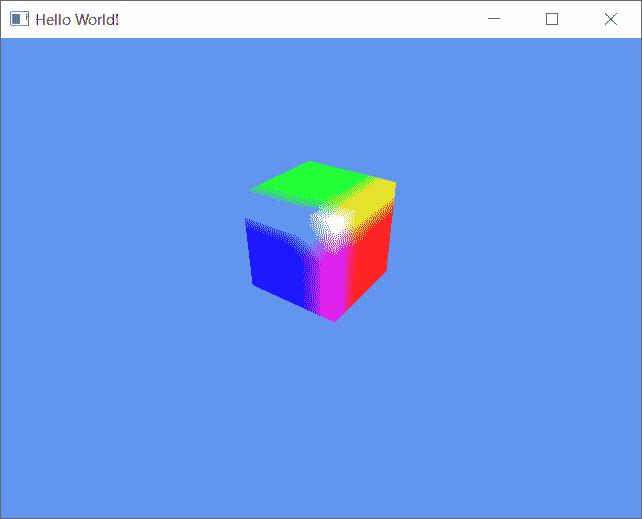

8.  尽管结果看起来很好，但如果我们真的想展示 3D 效果，那就是制作立方体的动画。为此，首先我们需要打开`renderwindow.h`并添加以下变量。请注意，在现代 C++ 标准中，您可以初始化头文件中的变量，而在旧的 C++ 标准中却不是这样:

```cpp
QTime* time;
int currentTime = 0;
int oldTime = 0;
float deltaTime = 0;
float rotation = 0;
```

9.  打开`renderwindow.cpp`，将以下高亮显示的代码添加到类构造函数中:

```cpp
openGLContext = new QOpenGLContext();
openGLContext->setFormat(format);
openGLContext->create();
openGLContext->makeCurrent(this);

time = new QTime();
time->start();
```

10.  之后，在你的`paintEvent()`函数顶部添加以下高亮显示的代码。`deltaTime`是每帧经过时间的值，用于使动画速度一致，与帧率性能无关:

```cpp
void RenderWindow::paintEvent(QPaintEvent *event) {
    Q_UNUSED(event);
    // Delta time for each frame
    currentTime = time->elapsed();
 deltaTime = (float)(currentTime - oldTime) / 1000.0f;
 oldTime = currentTime;
```

11.  在您的 MVP 矩阵代码上添加以下高亮显示的代码，并将`rotation`变量应用于`rotate()`函数，如下所示:

```cpp
rotation += deltaTime * 50;

QMatrix4x4 matrixMVP;
QMatrix4x4 model, view, projection;
model.translate(0, 1, 0);
model.rotate(rotation, 0, 1, 0);
```

12.  在`paintEvent()`函数结束时调用`update()`函数，以便在每次抽奖结束时反复调用`paintEvent()`。由于我们正在更改`paintEvent()`函数中的`rotation`值，我们可以给观众一种旋转立方体的错觉:

```cpp
    glDrawArrays(GL_TRIANGLES, 0, 36);

    shaderProgram->release();
    vao->release();

    this->update();
}
```

13.  如果你现在编译并运行程序，你应该会在你的渲染窗口中看到一个旋转的立方体！

# 它是如何工作的...

在任何 3D 渲染中，深度都非常重要，因此我们需要通过调用`glEnable(GL_DEPTH_TEST)`来启用 OpenGL 中的深度测试功能。当我们清除缓冲区时，我们还必须指定`GL_DEPH_BUFFER_BIT`，以便深度信息也被清除，以便正确渲染下一个图像。

我们在 OpenGL 中使用 MVP 矩阵，这样 GPU 就知道如何正确渲染三维图形。在 OpenGL 3 及更高版本中，OpenGL 不再通过固定函数自动处理此问题。程序员可以根据他们的用例自由灵活地定义自己的矩阵，然后通过着色器将其提供给图形处理器，以渲染最终图像。模型矩阵包含 3D 对象的变换数据，即对象的位置、旋转和比例。另一方面，视图矩阵是摄像机或视图信息。最后，投影矩阵告诉图形处理器在将 3D 世界投影到 2D 屏幕上时使用哪种投影方法。

在我们的示例中，我们使用了**透视**投影方法，该方法可以更好地感知距离和深度。透视投影的反面是**正投影**投影，使一切看起来都是平的平行的:

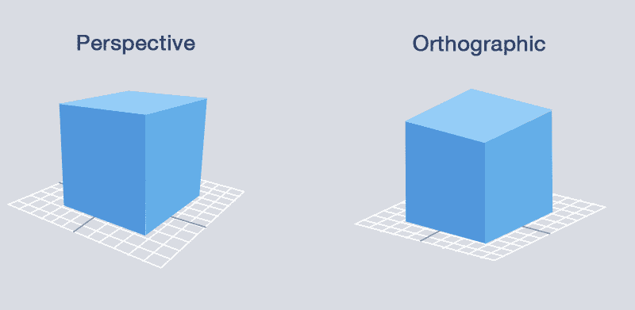

在这个例子中，我们使用了一个定时器来增加旋转值 50。将其乘以`deltaTime`值。`deltaTime`值因渲染帧速率而异。但是，它使以不同帧速率渲染的不同硬件的最终动画速度保持一致。

记得手动调用`update()`让屏幕刷新，否则立方体不会动画化。

# OpenGL 中的纹理

OpenGL 允许我们将图像(也称为纹理)映射到三维形状或多边形。这个过程也被称为纹理映射。在这种情况下，Qt 5 似乎是与 OpenGL 的最佳组合，因为它提供了一种简单的方法来加载属于常见格式之一(BMP、JPEG、PNG、TARGA、TIFF 等)的图像，并且您不必自己实现它。我们将使用前面的例子与一个旋转的立方体，并试图用纹理映射它！

# 怎么做…

让我们按照以下步骤学习如何在 OpenGL 中使用纹理:

1.  打开`renderwindow.h`并添加变量，这些变量在以下代码块中突出显示:

```cpp
QOpenGLContext* openGLContext;
QOpenGLFunctions* openGLFunctions;
QOpenGLShaderProgram* shaderProgram;
QOpenGLVertexArrayObject* vao;
QOpenGLBuffer* vbo_vertices;
QOpenGLBuffer* vbo_uvs;
QOpenGLTexture* texture;
```

2.  我们必须在`initializeGL()`函数中调用`glEnable(GL_TEXTURE_2D)`来启用纹理映射功能:

```cpp
void RenderWindow::initializeGL()
{
    openGLFunctions = openGLContext->functions();
    glEnable(GL_DEPTH_TEST);
    glEnable(GL_TEXTURE_2D);
```

3.  我们需要在`QOpenGLTexture`类下初始化我们的`texture`变量。我们将从我们的应用程序文件夹中加载一个名为`brick.jpg`的纹理图像，并通过调用`mirrored()`来翻转该图像。OpenGL 使用不同的坐标系，这就是为什么我们需要在将纹理传递给着色器之前翻转纹理。我们还会相应地将`min`和`max`过滤器设置为`Nearest`和`Linear`，如下所示:

```cpp
texture = new QOpenGLTexture(QImage(qApp->applicationDirPath() + "/brick.jpg").mirrored());
texture->setMinificationFilter(QOpenGLTexture::Nearest);
texture->setMagnificationFilter(QOpenGLTexture::Linear);
```

4.  添加另一个名为`uvs`的数组。这是我们保存立方体对象纹理坐标的地方:

```cpp
GLfloat uvs[] = {
    0.0f, 0.0f, 1.0f, 0.0f, 0.0f, 1.0f,
    1.0f, 0.0f, 1.0f, 1.0f, 0.0f, 1.0f,
    0.0f, 0.0f, 0.0f, 1.0f, 1.0f, 0.0f,
    1.0f, 0.0f, 0.0f, 1.0f, 1.0f, 1.0f,
    1.0f, 0.0f, 0.0f, 0.0f, 1.0f, 1.0f,
    0.0f, 0.0f, 0.0f, 1.0f, 1.0f, 1.0f,
    0.0f, 0.0f, 0.0f, 1.0f, 1.0f, 0.0f,
    1.0f, 0.0f, 0.0f, 1.0f, 1.0f, 1.0f,
    0.0f, 1.0f, 1.0f, 0.0f, 0.0f, 0.0f,
    0.0f, 1.0f, 1.0f, 1.0f, 1.0f, 0.0f,
    1.0f, 1.0f, 1.0f, 0.0f, 0.0f, 0.0f,
    1.0f, 1.0f, 0.0f, 0.0f, 0.0f, 1.0f
};
```

5.  我们必须修改我们的顶点着色器，以便它采用纹理坐标来计算纹理将应用于对象表面的位置。这里，我们只需将纹理坐标传递给片段着色器，无需修改:

```cpp
static const char *vertexShaderSource =
    "#version 330 core\n"
    "layout(location = 0) in vec3 posAttr;\n"
 "layout(location = 1) in vec2 uvAttr;\n"
    "uniform mat4 matrix;\n"
    "out vec3 fragPos;\n"
 "out vec2 fragUV;\n"
    "void main() {\n"
    "fragPos = posAttr;\n"
 "fragUV = uvAttr;\n"
    "gl_Position = matrix * vec4(posAttr, 1.0); }";
```

6.  在片段着色器中，我们通过调用`texture()`函数来创建纹理，该函数接收来自`fragUV`的纹理坐标信息和来自`tex`的图像采样器:

```cpp
static const char *fragmentShaderSource =
    "#version 330 core\n"
    "in vec3 fragPos;\n"
    "in vec2 fragUV;\n"
    "uniform sampler2D tex;\n"
    "out vec4 col;\n"
    "void main() {\n"
    "vec4 texCol = texture(tex, fragUV);\n"
 "col = texCol; }";
```

7.  我们还必须为纹理坐标初始化 VBO:

```cpp
vbo_uvs = new QOpenGLBuffer(QOpenGLBuffer::VertexBuffer);
vbo_uvs->create();
vbo_uvs->setUsagePattern(QOpenGLBuffer::StaticDraw);
vbo_uvs->bind();
vbo_uvs->allocate(uvs, sizeof(uvs) * sizeof(GLfloat));
```

8.  在`paintEvent()`函数中，调用`glDrawArrays()`之前，我们必须将纹理坐标信息发送给着色器，然后绑定纹理:

```cpp
vbo_uvs->bind();
shaderProgram->bindAttributeLocation("uvAttr", 1);
shaderProgram->enableAttributeArray(1);
shaderProgram->setAttributeBuffer(1, GL_FLOAT, 0, 2); 
texture->bind();
glDrawArrays(GL_TRIANGLES, 0, 36);
```

9.  如果您现在编译并运行程序，您应该会在屏幕上看到一个旋转的砖块立方体:

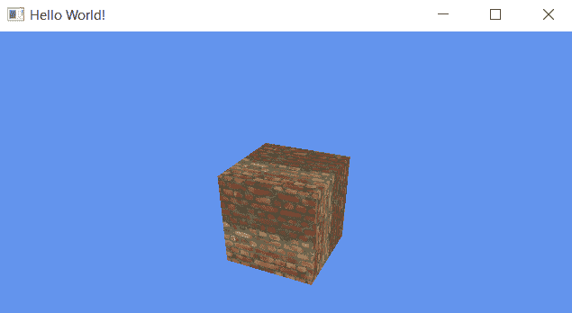

# 它是如何工作的...

Qt 5 让加载纹理变得非常简单。只需要一行代码就可以加载一个图像文件，翻转它，并将其转换为与 OpenGL 兼容的纹理。纹理坐标是让 OpenGL 知道如何在屏幕上显示之前将纹理粘贴到对象表面的信息。

`min`和`max`滤镜是滤镜，当应用于比分辨率更大的表面时，会使纹理看起来更好。该选项的默认设置是 GL _ NERSATE，代表**最近邻过滤**。当近距离观看时，该滤镜会使纹理看起来像像素一样。另一个常见的设置是 GL_LINEAR，代表**双线性过滤**。该过滤器采用两个相邻的片段，并对它们进行插值，以创建近似的颜色，这看起来比 GL _ release 好得多:

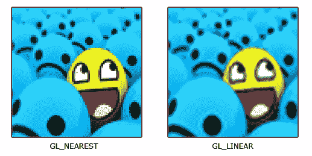

# OpenGL 中的基本照明

在这个例子中，我们将学习如何使用 OpenGL 和 Qt 5 为我们的 3D 场景添加一个简单的点光源。

# 怎么做…

让我们从以下步骤开始:

1.  同样，我们将使用前面的例子，并在旋转的立方体附近添加一个点光源。打开`renderwindow.h`并在文件中添加另一个名为`vbo_normals`的变量:

```cpp
QOpenGLBuffer* vbo_uvs;
QOpenGLBuffer* vbo_normals;
QOpenGLTexture* texture;
```

2.  打开`renderwindow.cpp`并在`initializeGL()`功能中添加另一个名为`normals`的数组:

```cpp
GLfloat normals[] = {
    0.0f, -1.0f, 0.0f, 0.0f, -1.0f, 0.0f, 0.0f, -1.0f, 0.0f,
    0.0f, -1.0f, 0.0f, 0.0f, -1.0f, 0.0f, 0.0f, -1.0f, 0.0f,
    0.0f, 1.0f, 0.0f, 0.0f, 1.0f, 0.0f, 0.0f, 1.0f, 0.0f,
    0.0f, 1.0f, 0.0f, 0.0f, 1.0f, 0.0f, 0.0f, 1.0f, 0.0f,
    1.0f, 0.0f, 0.0f, 1.0f, 0.0f, 0.0f, 1.0f, 0.0f, 0.0f,
    1.0f, 0.0f, 0.0f, 1.0f, 0.0f, 0.0f, 1.0f, 0.0f, 0.0f,
    0.0f, 0.0f, 1.0f, 0.0f, 0.0f, 1.0f, 0.0f, 0.0f, 1.0f,
    0.0f, 0.0f, 1.0f, 0.0f, 0.0f, 1.0f, 0.0f, 0.0f, 1.0f,
    -1.0f, 0.0f, 0.0f, -1.0f, 0.0f, 0.0f, -1.0f, 0.0f, 0.0f,
    -1.0f, 0.0f, 0.0f, -1.0f, 0.0f, 0.0f, -1.0f, 0.0f, 0.0f,
    0.0f, 0.0f, -1.0f, 0.0f, 0.0f, -1.0f, 0.0f, 0.0f, -1.0f,
    0.0f, 0.0f, -1.0f, 0.0f, 0.0f, -1.0f, 0.0f, 0.0f, -1.0f
};
```

3.  通过添加以下代码初始化`initializeGL()`中的`vbo_normals` VBO:

```cpp
vbo_normals = new QOpenGLBuffer(QOpenGLBuffer::VertexBuffer);
vbo_normals->create();
vbo_normals->setUsagePattern(QOpenGLBuffer::StaticDraw);
vbo_normals->bind();
vbo_normals->allocate(normals, sizeof(normals) * sizeof(GLfloat));
```

4.  由于这次我们将要编写的着色器将比我们在前面的例子中使用的要长得多，让我们将着色器代码移到文本文件中，并通过调用`addShaderFromSourceFile()`将它们加载到程序中:

```cpp
shaderProgram = new QOpenGLShaderProgram(this);
shaderProgram->addShaderFromSourceFile(QOpenGLShader::Vertex, qApp->applicationDirPath() + "/vertex.txt");
shaderProgram->addShaderFromSourceFile(QOpenGLShader::Fragment, qApp->applicationDirPath() + "/fragment.txt");
shaderProgram->link();
```

5.  完成后，向`paintEvent()`函数添加以下代码，将法线 VBO 传递给着色器:

```cpp
vbo_normals->bind();
shaderProgram->bindAttributeLocation("normalAttr", 2);
shaderProgram->enableAttributeArray(2);
shaderProgram->setAttributeBuffer(2, GL_FLOAT, 0, 3);
```

6.  让我们打开刚刚创建的两个包含着色器代码的文本文件。首先，我们需要对顶点着色器进行一些更改，如下所示:

```cpp
#version 330 core
layout(location = 0) in vec3 posAttr;
layout(location = 1) in vec2 uvAttr;
layout(location = 2) in vec3 normalAttr;
uniform mat4 matrix;
out vec3 fragPos;
out vec2 fragUV;
out vec3 fragNormal;

void main() {
    fragPos = posAttr;
    fragUV = uvAttr;
    fragNormal = normalAttr;
    gl_Position = matrix * vec4(posAttr, 1.0);
}
```

7.  我们还将对片段着色器进行一些更改。我们将在着色器代码中创建一个名为`calcPointLight()`的函数:

```cpp
#version 330 core
in vec3 fragPos;
in vec2 fragUV;
in vec3 fragNormal;
uniform sampler2D tex;
out vec4 col;

vec3 calcPointLight() {
 vec4 texCol = texture(tex, fragUV);
 vec3 lightPos = vec3(1.0, 2.0, 1.5);
 vec3 lightDir = normalize(lightPos - fragPos);
 vec4 lightColor = vec4(1.0, 1.0, 1.0, 1.0);
 float lightIntensity = 1.0;
```

8.  继续前面的代码，我们使用`calcPointLight()`计算光照，并将结果片段输出到`col`变量，如下所示:

```cpp
    // Diffuse
 float diffuseStrength = 1.0;
 float diff = clamp(dot(fragNormal, lightDir), 0.0, 1.0);
 vec4 diffuse = diffuseStrength * diff * texCol * lightColor * lightIntensity;
 return diffuse;
}

void main() {
    vec3 finalColor = calcPointLight();
    col = vec4(finalColor, 1.0); 
}
```

9.  如果您现在编译并运行程序，您应该会看到灯光在起作用:

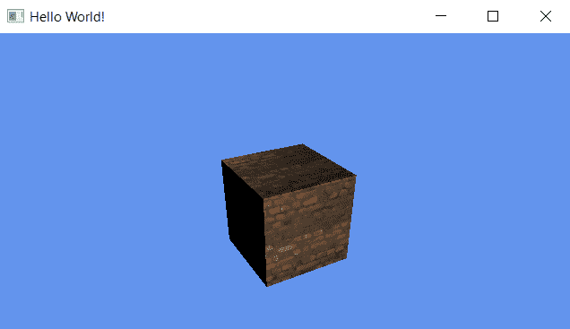

# 它是如何工作的...

在 OpenGL 3 及更高版本中，固定功能照明不再存在。你不能再调用`glEnable(GL_LIGHT1)`给你的 3D 场景增加光线。添加灯光的新方法是在着色器中计算自己的灯光。这为您提供了根据需要创建所有类型灯光的灵活性。旧方法在大多数硬件中最多有 16 个灯的限制，但是，有了新的可编程管道，您可以在场景中有任意数量的灯；但是，照明模型将需要完全由您在着色器中编码，这不是一项容易的任务。

除此之外，我们还需要为立方体的每个表面添加一个表面法线值。曲面法线指示曲面面向的位置，用于照明计算。

前面的例子非常简化，让你理解光照在 OpenGL 中是如何工作的。在实际使用案例中，您可能需要从 C++ 传递一些变量，如光强度、光颜色和光位置，或者从材质文件中加载它，而不是在着色器代码中硬编码它。

# 使用键盘控制移动对象

在本节中，我们将了解如何使用键盘控件在 OpenGL 中移动对象。Qt 提供了一种使用虚拟功能检测键盘事件的简单方法，即`keyPressEvent()`和`keyReleaseEvent()`。我们将使用前面的例子并添加到其中。

# 怎么做…

要使用键盘控制移动对象，请按照下列步骤操作:

1.  打开`renderwindow.h`并声明两个叫做`moveX`和`moveZ`的浮点数。然后，声明一个名为`movement`的`QVector3D`变量:

```cpp
QTime* time;
int currentTime = 0;
int oldTime = 0;
float deltaTime = 0;
float rotation = 0;
float moveX = 0;
float moveZ = 0;
QVector3D movement = QVector3D(0, 0, 0);
```

2.  我们还将声明两个名为`keyPressEvent()`和`keyReleaseEvent()`的函数:

```cpp
protected:
    void initializeGL();
    void paintEvent(QPaintEvent *event);
    void resizeEvent(QResizeEvent *event);
 void keyPressEvent(QKeyEvent *event);
 void keyReleaseEvent(QKeyEvent *event);
```

3.  我们将在`renderwindow.cpp`中实现`keyPressEvent()`功能:

```cpp
void RenderWindow::keyPressEvent(QKeyEvent *event) {
    if (event->key() == Qt::Key_W) { moveZ = -10; }
    if (event->key() == Qt::Key_S) { moveZ = 10; }
    if (event->key() == Qt::Key_A) { moveX = -10; }
    if (event->key() == Qt::Key_D) { moveX = 10; }
}
```

4.  我们还将实现`keyReleaseEvent()`功能:

```cpp
void RenderWindow::keyReleaseEvent(QKeyEvent *event) {
    if (event->key() == Qt::Key_W) { moveZ = 0; }
    if (event->key() == Qt::Key_S) { moveZ = 0; }
    if (event->key() == Qt::Key_A) { moveX = 0; }
    if (event->key() == Qt::Key_D) { moveX = 0; }
}
```

5.  之后，我们将注释掉`paintEvent()`中的旋转代码，并添加移动代码，如下面的代码片段所示。我们不想被旋转分散注意力，只想专注于运动:

```cpp
//rotation += deltaTime * 50;
movement.setX(movement.x() + moveX * deltaTime);
movement.setZ(movement.z() + moveZ * deltaTime);

QMatrix4x4 matrixMVP;
QMatrix4x4 model, view, projection;
model.translate(movement.x(), 1, movement.z());
```

6.  如果现在编译运行程序，按下 *W* 、 *A* 、 *S* 和 *D* 应该可以移动立方体。

# 它是如何工作的...

我们在这里所做的是不断添加`moveX`和`moveZ`值的`movement`向量的`x`和`z`值。当按下一个键时，`moveX`和`moveZ`将变成正数或负数，这取决于按下的是哪个按钮；否则，它将为零。在`keyPressEvent()`功能中，我们检查了按下的键盘按钮是 *W* 、 *A* 、 *S* 还是*D*；然后我们相应地设置变量。要获取 Qt 使用的关键名称的完整列表，请访问[http://doc.qt.io/qt-5/qt.html#Key-enum](http://doc.qt.io/qt-5/qt.html#Key-enum)。

我们可以做运动输入的一种方法是按住同一个键，不释放它。Qt 5 会在一段时间后重复按键事件，但它不是很流畅，因为现代操作系统会限制按键事件以防止重复键入。不同操作系统之间的键盘输入间隔不同。您可以通过调用`QApplication::setKeyboardInterval()`来设置间隔，但这可能不适用于每个操作系统。因此，我们没有采用这种方法。

取而代之的是，当按键被按下或释放时，我们只设置`moveX`和`moveZ`一次，然后我们在我们的游戏循环中不断地将该值应用到`movement`向量，使其连续移动而不受输入间隔的影响。

# QML 的 3D 画布

在这个食谱中，我们将学习如何使用 Qt 5 渲染 3D 图像。

# 怎么做…

让我们通过以下示例了解如何在 QML 使用 3D 画布:

1.  让我们从在 Qt Creator 中创建新项目开始这个例子。这一次，我们将选择 Qt 快速应用程序——画布 3D，而不是我们在前面示例中选择的其他选项:

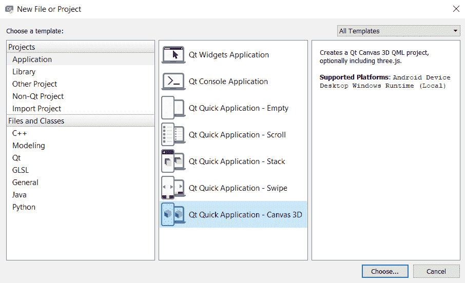

2.  之后，Qt Creator 会问你是否要创建一个基于`three.js` JavaScript 库的项目。选中创建基于三个. js 的应用程序选项，然后按下一步按钮继续:


3.  创建项目后，您会注意到项目资源中已经有一些 JavaScript ( `.js`)文件。这很正常，因为 Qt 画布 3D 应用程序使用 JavaScript 和 WebGL 技术在屏幕上呈现 3D 图像。在这种情况下，它正在运行一个名为`three.js`的基于 WebGL 的渲染库，与编写纯 WebGL 代码相比，这使得我们的编程工作更加简单和容易:


4.  向我们的项目资源添加一个图像文件——我们将在本例中使用它。通过在项目窗格中右键单击`qml.qrc`并选择在编辑器中打开，用 Qt 创建器打开`qml.qrc`。Qt Creator 打开资源文件后，点击**添加**按钮，然后点击【添加文件】按钮，从电脑中选择想要的图像文件。在我的例子中，我添加了一个`brick.jpg`图像，它将被用作我们的 3D 对象的表面纹理:

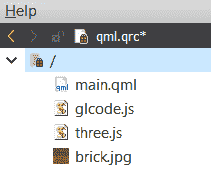

5.  之后，使用 Qt Creator 打开`glcode.js`。您将看到文件中已经编写了大量代码。它所做的基本上是使用`three.js`库在屏幕上渲染一个简单的 3D 立方体。您可以立即构建项目并运行它，看看它是什么样子。但是，我们将稍微修改一下代码，以定制它的输出。
6.  在`initializeGL()`功能中，我们将为场景添加一个方向光，加载我们刚刚添加到项目资源中的纹理文件，然后将纹理应用到定义 3D 立方体表面属性的材质上:

```cpp
function initializeGL(canvas) {
    scene = new THREE.Scene();
    camera = new THREE.PerspectiveCamera(75, canvas.width / canvas.height, 0.1, 1000);
    camera.position.z = 5;
    var directionalLight = new THREE.DirectionalLight(0xffffff);
 directionalLight.position.set(1, 1, 1).normalize();
 scene.add(directionalLight);
    var texture = THREE.ImageUtils.loadTexture('brick.jpg');
 var material = new THREE.MeshLambertMaterial({ map: texture });
```

7.  我们还将通过在所有维度中将其比例设置为`3`来使立方体的比例稍微大一点。我们还将背景颜色设置为浅灰色:

```cpp
 var cubeGeometry = new THREE.BoxGeometry(3, 3, 3);
    cube = new THREE.Mesh(cubeGeometry, material);
    cube.rotation.set(0.785, 0.785, 0.0);
    scene.add(cube);
    renderer = new THREE.Canvas3DRenderer({ canvas: canvas, antialias: true, devicePixelRatio: canvas.devicePixelRatio });
    renderer.setSize(canvas.width, canvas.height);
    renderer.setClearColor(0xa9a9a9, 1);
}
```

8.  在`paintGL()`功能中，在渲染场景之前，添加一行额外的代码来旋转三维立方体:

```cpp
function paintGL(canvas) {
 cube.rotation.y -= 0.005;
    renderer.render(scene, camera);
}
```

9.  我个人觉得窗口尺寸有点太小了，所以也在`main.qml`文件中更改了窗口的`width`和`height`，如下代码所示:

```cpp
import QtQuick 2.4
import QtCanvas3D 1.0
import QtQuick.Window 2.2
import "glcode.js" as GLCode
Window {
    title: qsTr("Qt_Canvas_3D")
 width: 800
 height: 600
    visible: true
```

10.  完成后，构建并运行项目。你应该能看到一个砖块纹理的三维立方体，在屏幕上慢慢旋转:

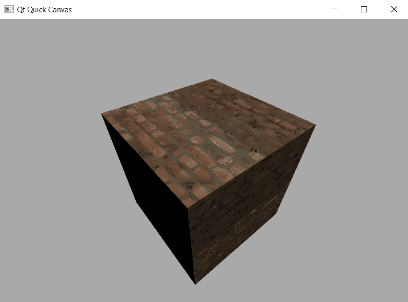

# 它是如何工作的...

最初，`three.js`是一个跨浏览器的 JavaScript 库/API，使用 WebGL 技术在 web 浏览器中显示动画 3D 计算机图形。然而，Qt Canvas 3D 也使用网络技术，特别是网络图形语言技术，来渲染 3D 图像，就像在网络浏览器上一样。这意味着 Qt 画布 3D 不仅支持`three.js`，而且所有基于 WebGL 技术的不同类型的库都将在 Qt 画布 3D 上完美工作。然而，Qt 画布 3D 仅适用于基于 QML 的项目，不适用于 C++。

If you are interested to learn more about `three.js`, check out their website at [http://threejs.org](http://threejs.org).