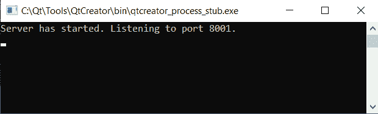
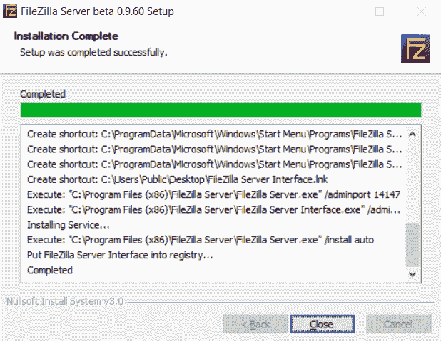
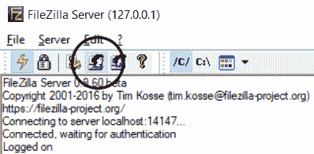
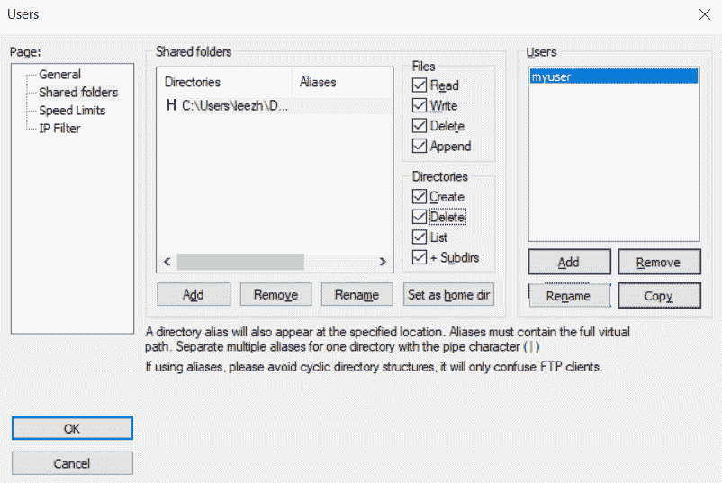

# 六、使用网络和管理大型文档

在本章中，我们将介绍以下食谱:

*   创建一个 TCP 服务器
*   创建一个 TCP 客户端
*   使用文件传输协议上传和下载文件

# 介绍

在本章中，我们将学习如何使用 Qt 5 的网络模块创建网络服务器程序和客户端程序。我们还将学习如何创建一个使用**文件传输协议** ( **FTP** )从服务器上传和下载文件的程序。最后，我们将学习如何使用 Qt 5 和 C++ 语言向特定的 web 服务发送 HTTP 请求。

# 技术要求

本章的技术要求包括 Qt 5.11.2 MinGW 32 位、Qt Creator 4.8.2、Windows 10、FileZilla Server 0.9.60。

本章使用的所有代码可从以下 GitHub 链接下载:[https://GitHub . com/PacktPublishing/Qt5-CPP-GUI-Programming-cook book-第二版/树/主/第 06 章](https://github.com/PacktPublishing/Qt5-CPP-GUI-Programming-Cookbook-Second-Edition/tree/master/Chapter06)。

查看以下视频，查看正在运行的代码:[http://bit.ly/2TqR9XQ](http://bit.ly/2TqR9XQ)

# 创建一个 TCP 服务器

在本食谱中，我们将学习如何在 Qt 5 中创建**传输控制协议** ( **TCP** )服务器。在我们能够创建一个允许您上传和下载文件的服务器之前，让我们将它缩小一点，并学习如何创建一个接收和发送文本的网络服务器。

# 怎么做…

按照以下步骤创建一个 TCP 服务器:

1.  首先，让我们从文件|新文件或项目中创建一个 Qt 控制台应用项目，如下图所示:


2.  之后，再次转到文件|新建文件或项目。但是这次，在 C++ 类别下选择 C++ Class，如下图截图所示:


3.  然后，将你的班级命名为`server`。将其基类设置为`QObject`，并确保在单击“下一步”按钮之前选中了“包含对象”选项。一旦创建了类，将为您创建两个文件-`server.h`和`server.cpp`，如下图所示:


4.  之后，打开你的项目文件(`.pro`)并加入`network`模块，如下图所示:

```cpp
QT += core network
```

5.  完成后，打开`server.h`并添加以下标题:

```cpp
#include <QTcpServer>
#include <QTcpSocket>
#include <QVector>
#include <QDebug>
```

6.  紧接着，声明`startServer()`和`sendMessageToClients()`函数，如下代码所示:

```cpp
public:
    server(QObject *parent = nullptr);
    void startServer();
    void sendMessageToClients(QString message);
```

7.  然后为`server`类声明以下槽函数:

```cpp
public slots:
    void newClientConnection();
    void socketDisconnected();
    void socketReadReady();
    void socketStateChanged(QAbstractSocket::SocketState state);
```

8.  最后，声明两个私有变量，如下面的代码所示:

```cpp
private:
    QTcpServer* chatServer;
    QVector<QTcpSocket*>* allClients;
```

9.  完成上一步后，打开`server.cpp`并定义`startServer()`功能。这里，我们创建一个`QVector`容器来存储所有连接到服务器的客户端，并在后面的步骤中使用它来发送消息。这在以下示例中显示:

```cpp
void server::startServer() {
    allClients = new QVector<QTcpSocket*>;
    chatServer = new QTcpServer();
    chatServer->setMaxPendingConnections(10);
    connect(chatServer, &QTcpServer::newConnection, this, &server::newClientConnection);
    if (chatServer->listen(QHostAddress::Any, 8001))
        qDebug() << "Server has started. Listening to port 8001.";
    else
        qDebug() << "Server failed to start. Error: " + chatServer->errorString();
}
```

10.  接下来，我们实现`sendMessageToClients()`函数，在这里我们迭代上一步刚刚创建的`allClients`容器，并将消息发送给他们每个人，如下例所示:

```cpp
void server::sendMessageToClients(QString message) {
    if (allClients->size() > 0) {
        for (int i = 0; i < allClients->size(); i++) {
            if (allClients->at(i)->isOpen() && allClients->at(i)->isWritable()) {
                allClients->at(i)->write(message.toUtf8());
            }
        }
    }
}
```

11.  之后，我们将开始实现插槽功能。让我们从下面的代码开始:

```cpp
void server::newClientConnection() {
    QTcpSocket* client = chatServer->nextPendingConnection();
    QString ipAddress = client->peerAddress().toString();
    int port = client->peerPort();
    connect(client, &QTcpSocket::disconnected, this, &server::socketDisconnected);
    connect(client, &QTcpSocket::readyRead,this, &server::socketReadReady);
    connect(client, &QTcpSocket::stateChanged, this, &server::socketStateChanged);
    allClients->push_back(client);
    qDebug() << "Socket connected from " + ipAddress + ":" + QString::number(port);
}
```

12.  然后，我们继续`socketDisconnected()`功能。当客户端与服务器断开连接时，将调用该 slot 函数，如下例所示:

```cpp
void server::socketDisconnected() {
    QTcpSocket* client = qobject_cast<QTcpSocket*>(QObject::sender());
    QString socketIpAddress = client->peerAddress().toString();
    int port = client->peerPort();
    qDebug() << "Socket disconnected from " + socketIpAddress + ":" + QString::number(port);
}
```

13.  接下来，我们将定义`socketReadReady()`函数，该函数将在客户端向服务器发送文本消息时被触发，如下例所示:

```cpp
void server::socketReadReady() {
    QTcpSocket* client = qobject_cast<QTcpSocket*>(QObject::sender());
    QString socketIpAddress = client->peerAddress().toString();
    int port = client->peerPort();
    QString data = QString(client->readAll());
    qDebug() << "Message: " + data + " (" + socketIpAddress + ":" + QString::number(port) + ")";
    sendMessageToClients(data);
}
```

14.  之后，让我们实现`socketStateChanged()`函数，当客户端的联网状态发生变化时，将调用该函数，如下例所示:

```cpp
void server::socketStateChanged(QAbstractSocket::SocketState state) {
    QTcpSocket* client = qobject_cast<QTcpSocket*>(QObject::sender());
    QString socketIpAddress = client->peerAddress().toString();
    int port = client->peerPort();

    qDebug() << "Socket state changed (" + socketIpAddress + ":" + QString::number(port) + "): " + desc;
}
```

15.  我们还需要在`socketStateChanged()`中添加以下代码来打印出客户端的状态:

```cpp
QString desc;
if (state == QAbstractSocket::UnconnectedState)
    desc = "The socket is not connected.";
else if (state == QAbstractSocket::HostLookupState)
    desc = "The socket is performing a host name lookup.";
else if (state == QAbstractSocket::ConnectingState)
    desc = "The socket has started establishing a connection.";
else if (state == QAbstractSocket::ConnectedState)
    desc = "A connection is established.";
else if (state == QAbstractSocket::BoundState)
    desc = "The socket is bound to an address and port.";
else if (state == QAbstractSocket::ClosingState)
    desc = "The socket is about to close (data may still be waiting to be written).";
else if (state == QAbstractSocket::ListeningState)
    desc = "For internal use only.";
```

16.  最后，让我们打开`main.cpp`，并添加以下示例中突出显示的代码，以便启动服务器:

```cpp
#include <QCoreApplication>
#include "server.h"

int main(int argc, char *argv[]) {
    QCoreApplication a(argc, argv);
 server* myServer = new server();
 myServer->startServer();
    return a.exec();
}
```

17.  您现在可以尝试运行服务器程序，但是您将无法测试它，因为我们还没有创建客户端程序，如下图所示:



18.  让我们继续下一个示例项目，并学习如何创建客户端程序。稍后我们将再次回来测试这个程序。

# 它是如何工作的...

网络连接主要有两种类型:**传输控制协议** ( **TCP** )连接和**用户数据报协议** ( **UDP** )连接。TCP 是可靠的网络连接，而 UDP 是不可靠的。

这两种连接的目的截然不同:

*   **TCP 联网**通常用于要求每一条数据都按顺序发送和接收的程序。它还确保客户端收到数据，并且服务器收到通知。像消息软件、网络服务器和数据库这样的程序使用 TCP 网络。
*   **UDP 联网**另一方面，不需要服务器和客户端之间持续的牵手。由于连接不可靠，因此也没有关于数据是否被成功接收的反馈。丢弃数据包是可以容忍的，数据的顺序甚至可能与发送的顺序不同。UDP 连接通常由应用使用，这些应用将大量数据流式传输到客户端，而对其数据包传递没有严格要求，例如视频游戏、视频会议软件和域名系统。

通过其信号和插槽机制，使用 Qt 5 创建网络软件要容易得多。我们需要做的就是将`QTcpServer`类和`QTcpSocket`类发出的信号连接到我们的槽函数。然后，我们将实现这些槽函数，并定义在这些函数中要做什么。

We used a **QVector** container to store the pointers to all the clients that have connected to the server so that we can use it to deliver the messages later on.

为了使这个示例项目简单，我们简单地向所有客户发送文本消息，有点像群聊。你可以自由探索其他可能性，并做出自己的改变来改进程序。

# 创建一个 TCP 客户端

由于我们在前面的食谱中已经创建了一个 TCP 服务器，我们现在需要一个客户端程序来完成这个项目。因此，在本食谱中，我们将学习如何使用 Qt 5 及其网络模块创建一个 TCP 客户端程序。

# 怎么做...

要在 Qt 5 中创建一个 TCP 客户端，让我们执行以下操作:

1.  首先，让我们从文件|新文件或项目创建一个新的 Qt Widgets 应用项目。
2.  项目创建完成后，我们打开`mainwindow.ui`设置图形用户界面，如下图所示。请注意，中央小部件的布局方向必须垂直:


3.  然后，右击显示“连接”的按钮，从菜单中创建一个`clicked()`插槽功能。然后，在发送按钮上重复相同的步骤。因此，将在源代码中为您创建两个 slot 函数，这可能看起来像也可能不像我们在下面的代码中看到的，这取决于您的小部件的名称:

```cpp
void on_connectButton_clicked();
void on_sendButton_clicked();
```

4.  接下来，打开`mainwindow.h`并添加以下标题:

```cpp
#include <QDebug>
#include <QTcpSocket>
```

5.  然后，声明`printMessage()`函数和三个槽函数:`socketConnected()`、`socketDisconnected()`和`socketReadyRead()`，如下代码所示:

```cpp
public:
    explicit MainWindow(QWidget *parent = 0);
    ~MainWindow();
 void printMessage(QString message);

private slots:
    void on_connectButton_clicked();
    void on_sendButton_clicked();
 void socketConnected();
 void socketDisconnected();
 void socketReadyRead();
```

6.  之后，还要声明以下变量:

```cpp
private:
    Ui::MainWindow *ui;
 bool connectedToHost;
 QTcpSocket* socket;
```

7.  完成后，您可以进入`mainwindow.cpp`并定义`printMessage()`功能，如下例所示:

```cpp
void MainWindow::printMessage(QString message) {
    ui->chatDisplay->append(message);
}
```

8.  然后，我们将实现`on_connectButton_clicked()`功能，当点击连接按钮时，该功能将被触发，如下代码所示:

```cpp
void MainWindow::on_connectButton_clicked() {
    if (!connectedToHost) {
        socket = new QTcpSocket();
        connect(socket, &QTcpSocket::connected, this, &MainWindow::socketConnected);
        connect(socket, &QTcpSocket::disconnected, this, &MainWindow::socketDisconnected);
        connect(socket, &QTcpSocket::readyRead, this, &MainWindow::socketReadyRead);
        socket->connectToHost("127.0.0.1", 8001);
    } else {
        QString name = ui->nameInput->text();
        socket->write("<font color=\"Orange\">" + name.toUtf8() + " has left the chat room.</font>");
        socket->disconnectFromHost();
    }
}
```

9.  我们还定义了`on_sendButton_clicked()`函数，点击发送按钮后会调用该函数，如下例所示:

```cpp
void MainWindow::on_sendButton_clicked() {
    QString name = ui->nameInput->text();
    QString message = ui->messageInput->text();
    socket->write("<font color=\"Blue\">" + name.toUtf8() + "</font>: " + message.toUtf8());
    ui->messageInput->clear();
}
```

10.  紧接着，我们实现`socketConnected()`函数，当客户端程序成功连接到服务器时将调用该函数，如以下代码所示:

```cpp
void MainWindow::socketConnected() {
    qDebug() << "Connected to server.";
    printMessage("<font color=\"Green\">Connected to server.</font>");
    QString name = ui->nameInput->text();
    socket->write("<font color=\"Purple\">" + name.toUtf8() + " has joined the chat room.</font>");
    ui->connectButton->setText("Disconnect");
    connectedToHost = true;
}
```

11.  目前我们还没有完成。我们还需要实现`socketDisconnected()`功能，只要客户端与服务器断开连接，就会触发该功能，如下代码所示:

```cpp
void MainWindow::socketDisconnected() {
    qDebug() << "Disconnected from server.";
    printMessage("<font color=\"Red\">Disconnected from server.</font>");
    ui->connectButton->setText("Connect");
    connectedToHost = false;
}
```

12.  最后，我们还需要定义`socketReadyRead()`函数，该函数打印出服务器发送的消息，如下例所示:

```cpp
void MainWindow::socketReadyRead() {
    printMessage(socket->readAll());
}
```

13.  在我们运行客户端程序之前，我们必须首先打开我们在前面的食谱中创建的服务器程序。然后，构建并运行客户端程序。程序打开后，点击连接按钮。成功连接到服务器后，在底部的行编辑小部件中键入内容，然后按发送按钮。您应该会看到类似以下截图的内容:


14.  让我们转到服务器程序，如下图所示，看看终端窗口上是否有打印的内容:


15.  恭喜，你成功创建了一个看起来有点像**互联网中继聊天** ( **IRC** )聊天室的程序！

# 它是如何工作的...

为了做到这一点，我们需要两个程序:一个连接所有客户端并传递其消息的服务器程序，以及一个由用户用来发送和接收来自其他用户的消息的客户端程序。

由于服务器程序只是坐在幕后，默默地解决一切，它不需要任何用户界面，因此我们只需要它作为一个 Qt 控制台应用。

然而，客户端程序需要一个视觉上令人愉快但易于使用的图形用户界面，以便用户读写他们的消息。因此，我们将客户端程序创建为 Qt Widgets 应用。

与服务器程序相比，客户端程序相对简单。它所做的只是连接到服务器，发送用户输入的消息，并打印出服务器发送给它的所有内容。

# 使用文件传输协议上传和下载文件

我们已经学会了如何创建简单的聊天软件，在用户之间分发文本消息。接下来，我们将学习如何创建一个使用 FTP 上传和下载文件的程序。

# 怎么做...

让我们从观察以下步骤开始:

1.  对于这个项目，我们需要安装一个名为 **FileZilla Server** 的软件，我们将把它用作 FTP 服务器。点击下载文件服务器按钮，可从[https://filezilla-project.org](https://filezilla-project.org)下载文件服务器，如下图截图所示:


2.  下载安装程序后，运行安装程序并同意所有默认选项安装**文件服务器**，如下图所示:



3.  完成后，打开文件服务器并按下连接按钮，如下图所示:


4.  服务器启动后，单击位于文件服务器控制面板顶部的用户图标，如下图所示:



5.  用户窗口打开后，单击用户列表下的添加按钮添加新用户。然后，在“共享文件夹”列表下添加一个共享文件夹，用户将从其中上传和下载文件，如下图所示:



6.  我们现在已经完成了设置**文件服务器**。让我们进入 Qt Creator，创建一个新的 Qt Widgets 应用项目。然后，打开`mainwindow.ui`，设置图形用户界面，如下图所示:


7.  然后，右键单击打开按钮、上传按钮和设置文件夹按钮，创建各自的`clicked()`槽功能，如下代码所示:

```cpp
private slots:
    void on_openButton_clicked();
    void on_uploadButton_clicked();
    void on_setFolderButton_clicked();
```

8.  之后，双击列表小部件并选择转到插槽....然后，选择 itemDoubleClicked(qlistwightitem *)选项，点击确定，如下图截图所示:


9.  创建完槽函数后，打开`mainwindow.h`并添加以下标题:

```cpp
#include <QDebug>
#include <QNetworkAccessManager>
#include <QNetworkRequest>
#include <QNetworkReply>
#include <QFile>
#include <QFileInfo>
#include <QFileDialog>
#include <QListWidgetItem>
#include <QMessageBox>
```

10.  然后，声明`getFileList()`功能，如下所示:

```cpp
public:
    explicit MainWindow(QWidget *parent = 0);
    ~MainWindow();
 void getFileList();
```

11.  然后声明以下插槽函数:

```cpp
void downloadFileListFinished();
void uploadFileListFinished();
void uploadFileProgress(qint64 bytesSent, qint64 bytesTotal);
void uploadFileFinished();
void downloadFileProgress(qint64 byteReceived,qint64 bytesTotal);
void downloadFileFinished();
```

12.  紧接着，声明以下变量:

```cpp
private:
    Ui::MainWindow *ui;
 QNetworkAccessManager* manager;
 QString ftpAddress;
 int ftpPort;
 QString username;
 QString password;
 QNetworkReply* downloadFileListReply;
 QNetworkReply* uploadFileListReply;
 QNetworkReply* uploadFileReply;
 QNetworkReply* downloadFileReply;
 QStringList fileList;
 QString uploadFileName;
 QString downloadFileName;
```

13.  然后，打开`mainwindow.cpp`，将以下代码添加到类构造函数中:

```cpp
MainWindow::MainWindow(QWidget *parent) : QMainWindow(parent), ui(new Ui::MainWindow) {
    ui->setupUi(this);
 manager = new QNetworkAccessManager(this);
 ftpAddress = "ftp://127.0.0.1/";
 ftpPort = 21;
 username = "myuser";
 password = "123456";
 getFileList();
}
```

14.  之后，执行`getFileList()`功能，如下代码所示:

```cpp
void MainWindow::getFileList() {
    QUrl ftpPath;
    ftpPath.setUrl(ftpAddress + "files.txt");
    ftpPath.setUserName(username);
    ftpPath.setPassword(password);
    ftpPath.setPort(ftpPort);
    QNetworkRequest request;
    request.setUrl(ftpPath);
    downloadFileListReply = manager->get(request);
    connect(downloadFileListReply, SIGNAL(finished()), this, SLOT(downloadFileListFinished()));
}
```

15.  然后定义`on_openButton_clicked()`槽功能，点击【打开】按钮触发，如下代码所示:

```cpp
void MainWindow::on_openButton_clicked() {
    QString fileName = QFileDialog::getOpenFileName(this, "Select File", qApp->applicationDirPath());
    ui->uploadFileInput->setText(fileName);
}
```

16.  完成后，实现单击上传按钮时调用的槽函数，如下例所示:

```cpp
void MainWindow::on_uploadButton_clicked() {
    QFile* file = new QFile(ui->uploadFileInput->text());
    QFileInfo fileInfo(*file);
    uploadFileName = fileInfo.fileName();

    QUrl ftpPath;
    ftpPath.setUrl(ftpAddress + uploadFileName);
    ftpPath.setUserName(username);
    ftpPath.setPassword(password);
    ftpPath.setPort(ftpPort);

    if (file->open(QIODevice::ReadOnly)) {
        ui->uploadProgress->setEnabled(true);
        ui->uploadProgress->setValue(0);
```

17.  然后，继续实现前面的功能，如下面的代码所示:

```cpp
    QNetworkRequest request;
    request.setUrl(ftpPath);

    uploadFileReply = manager->put(request, file);
    connect(uploadFileReply, QNetworkReply::uploadProgress, this, &MainWindow::uploadFileProgress);
    connect(uploadFileReply, QNetworkReply::finished, this, &MainWindow::uploadFileFinished);
    } else {
        QMessageBox::warning(this, "Invalid File", "Failed to open file for upload.");
    }
}
```

18.  下面的代码显示了`on_setFolderButton_clicked()`槽功能的样子:

```cpp
void MainWindow::on_setFolderButton_clicked() {
    QString folder = QFileDialog::getExistingDirectory(this, tr("Open Directory"), qApp->applicationDirPath(), QFileDialog::ShowDirsOnly);
    ui->downloadPath->setText(folder);
}
```

19.  接下来，定义当双击列表小部件的一个项目时将触发的 slot 函数，如以下代码所示:

```cpp
void MainWindow::on_fileList_itemDoubleClicked(QListWidgetItem *item) {
    downloadFileName = item->text();

    QString folder = ui->downloadPath->text();
    if (folder != "" && QDir(folder).exists()) {
        QUrl ftpPath;
        ftpPath.setUrl(ftpAddress + downloadFileName);
        ftpPath.setUserName(username);
        ftpPath.setPassword(password);
        ftpPath.setPort(ftpPort);
```

20.  然后，使用以下代码继续实现前面的功能:

```cpp
    QNetworkRequest request;
    request.setUrl(ftpPath);

    downloadFileReply = manager->get(request);
    connect(downloadFileReply, QNetworkReply::downloadProgress, this, MainWindow::downloadFileProgress);
    connect(downloadFileReply, &QNetworkReply::finished, this, &MainWindow::downloadFileFinished);
    } else {
        QMessageBox::warning(this, "Invalid Path", "Please set the download path before download.");
    }
}
```

21.  我们还没有完全完成。接下来，我们将实现`downloadFileListFinished()`函数，当从服务器下载完文件列表后，会自动调用该函数，如下代码所示:

```cpp
void MainWindow::downloadFileListFinished() {
    if(downloadFileListReply->error() != QNetworkReply::NoError)
        QMessageBox::warning(this, "Failed", "Failed to load file list: " + downloadFileListReply->errorString());
    else {
        QByteArray responseData;
        if (downloadFileListReply->isReadable())
            responseData = downloadFileListReply->readAll();
        ui->fileList->clear();
        fileList = QString(responseData).split(",");
        if (fileList.size() > 0) {
            for (int i = 0; i < fileList.size(); i++) {
                if (fileList.at(i) != "") {
                    ui->fileList->addItem(fileList.at(i));
                }
            }
        }
    }
}
```

22.  我们还需要实现将文件列表更新到服务器时调用的函数，如下例所示:

```cpp
void MainWindow::uploadFileListFinished() {
    if(uploadFileListReply->error() != QNetworkReply::NoError)
        QMessageBox::warning(this, "Failed", "Failed to update file list: " + uploadFileListReply->errorString());
    else
        getFileList();
}
```

23.  `uploadFileProgress()`功能用于在上传文件到服务器时显示进度条，看起来像下面的代码:

```cpp
void MainWindow::uploadFileProgress(qint64 bytesSent, qint64 bytesTotal) {
    qint64 percentage = 100 * bytesSent / bytesTotal;
    ui->uploadProgress->setValue((int) percentage);
}
```

24.  接下来，我们将定义文件上传到服务器后会发生什么。这个函数比其他函数稍微长一点，所以我们将它分成几个部分，这样您就不会被它弄糊涂了。首先，我们将遍历文件列表，看看它是否已经存在，如下例所示:

```cpp
void MainWindow::uploadFileFinished() {
    if(uploadFileReply->error() != QNetworkReply::NoError)
        QMessageBox::warning(this, "Failed", "Failed to upload file: " + uploadFileReply->errorString());
    else {
        bool exists = false;
        if (fileList.size() > 0) {
            for (int i = 0; i < fileList.size(); i++) {
                if (fileList.at(i) == uploadFileName)
                    exists = true;
            }
        }
        if (!exists)
            fileList.append(uploadFileName);
```

25.  然后，我们将创建一个名为`files.txt`的文本文件，并将最新的文件列表保存在其中，如下代码所示:

```cpp
QString fileName = "files.txt";
QFile* file = new QFile(qApp->applicationDirPath() + "/" + fileName);
file->open(QIODevice::ReadWrite);
if (fileList.size() > 0) {
    for (int j = 0; j < fileList.size(); j++) {
        if (fileList.at(j) != "")
            file->write(QString(fileList.at(j) + ",").toUtf8());
    }
}
file->close();
```

26.  之后打开`files.txt`发送到 FTP 服务器更新文件列表，如下代码所示:

```cpp
QFile* newFile = new QFile(qApp->applicationDirPath() + "/" + fileName);
if (newFile->open(QIODevice::ReadOnly)) {
    QUrl ftpPath;
    ftpPath.setUrl(ftpAddress + fileName);
    ftpPath.setUserName(username);
    ftpPath.setPassword(password);
    ftpPath.setPort(ftpPort);
```

27.  然后，继续编写将文件列表发送到 FTP 服务器的代码，如下例所示:

```cpp
            QNetworkRequest request;
            request.setUrl(ftpPath);
            uploadFileListReply = manager->put(request, newFile);
            connect(uploadFileListReply, &QNetworkReply::finished, this, &MainWindow::uploadFileListFinished);
            file->close();
        }
        QMessageBox::information(this, "Success", "File successfully uploaded.");
    }
}
```

28.  我们还需要定义更新进度条的函数，以便从 FTP 服务器下载文件，如以下代码所示:

```cpp
void MainWindow::downloadFileProgress(qint64 byteReceived,qint64 bytesTotal) {
    qint64 percentage = 100 * byteReceived / bytesTotal;
    ui->downloadProgress->setValue((int) percentage);
}
```

29.  紧接着，我们可以开始实现`downloadFileFinished()`函数，当从服务器下载了一个文件时，就会调用这个函数。首先，我们需要检查文件是否已经成功下载，如下例所示:

```cpp
void MainWindow::downloadFileFinished() {
    if(downloadFileReply->error() != QNetworkReply::NoError)
        QMessageBox::warning(this, "Failed", "Failed to download file: " + downloadFileReply->errorString());
    else {
        QByteArray responseData;
        if (downloadFileReply->isReadable())
            responseData = downloadFileReply->readAll();
```

30.  如果有，我们会将文件保存到用户设置的下载目录中，如下面的代码所示:

```cpp
        if (!responseData.isEmpty()) {
            QString folder = ui->downloadPath->text();
            QFile file(folder + "/" + downloadFileName);
            file.open(QIODevice::WriteOnly);
            file.write((responseData));
            file.close();
            QMessageBox::information(this, "Success", "File successfully downloaded.");
        }
    }
}
```

31.  在我们开始测试程序之前，让我们创建一个名为`files.txt`的空文本文件，并将其放在您链接到您在文件服务器中设置的 FTP 用户的文件夹中。

32.  最后，构建并运行程序。试着上传一些文件到文件传输协议服务器。如果可行，文件列表应该更新并显示在列表小部件上。然后，尝试双击列表小部件上的文件名，并将文件下载到您的计算机上，如下图所示:


33.  恭喜，您现在已经成功创建了一个工作的 FTP 程序！

# 它是如何工作的...

虽然这个项目要大得多，代码也更长，但它实际上与我们在前面的食谱中所做的 TCP 网络项目非常相似。我们还利用了 Qt 5 提供的信号和插槽机制，让我们的生活更加轻松。

以前 Qt 直接通过`QFtp`类支持 FTP。然而，`QFtp`类在更新的版本中已经被弃用，所以我们必须通过使用网络类来实现我们自己的类，比如`QNetworkRequest`、`QNetworkReply`等等。

因为我们不再有`QFtp`类，所以没有办法直接从**文件服务器**获取文件列表。因此，我们开发了一种解决这个问题的方法，即使用文本文件来存储文件列表。

进度条对于这个项目显示上传和下载进度非常重要。这对于上传或下载大文件特别有用。