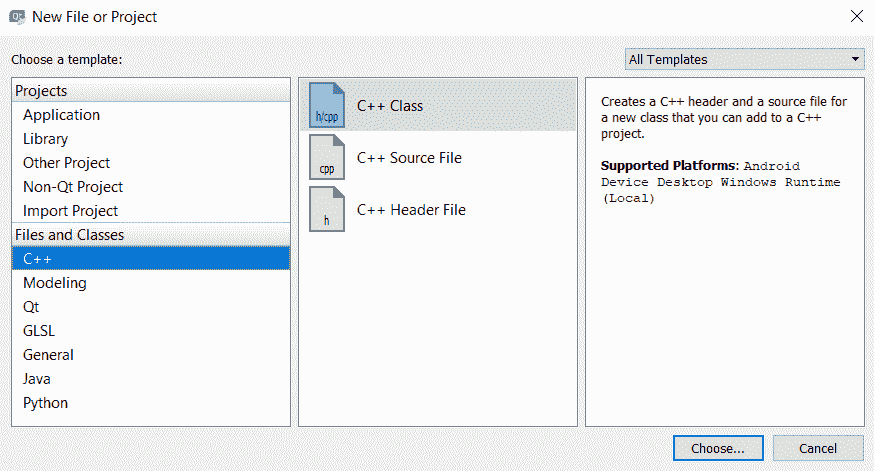
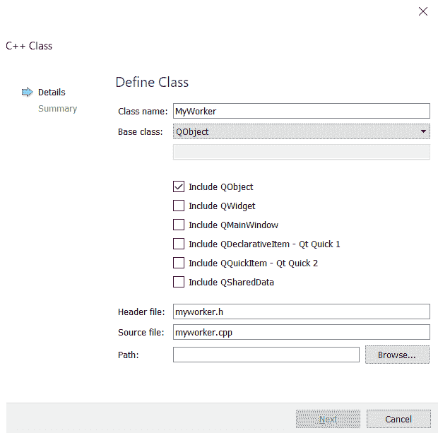

# 七、线程基础——异步编程

本章将涵盖以下食谱:

*   使用线程
*   对象和线程
*   数据保护和线程间共享数据
*   使用不可运行的流程

# 介绍

大多数现代软件并行运行其进程，并将任务卸载到不同的线程，以利用现代 CPU 多核架构。这样，软件可以通过同时运行多个进程来提高效率，而不会影响性能。在本章中，我们将学习如何利用线程来提高我们的 Qt 5 应用的性能和效率。

# 技术要求

本章的技术要求包括安装 Qt 5.11.2 MinGW 32 位、Qt Creator 4.8.2 和 Windows 10。

本章使用的所有代码都可以从下面的 GitHub 链接下载:[https://GitHub . com/PacktPublishing/Qt5-CPP-GUI-编程-cook book-第二版/树/master/Chapter07](https://github.com/PacktPublishing/Qt5-CPP-GUI-Programming-Cookbook-Second-Edition/tree/master/Chapter07) 。

查看以下视频，查看正在运行的代码:[http://bit.ly/2TnFJUU](http://bit.ly/2TnFJUU)

# 使用线程

Qt 5 提供了多种创建和使用线程的方法。您可以在高级方法和低级方法之间进行选择。高级方法更容易上手，但受限于你能用它们做什么。另一方面，低级方法更灵活，但对初学者不友好。在本食谱中，我们将学习如何使用其中一种高级方法轻松创建多线程 Qt 5 应用。

# 怎么做…

让我们按照以下步骤学习如何创建多线程应用:

1.  创建一个 Qt 小部件应用并打开`main.cpp`。然后，在文件顶部添加以下标题:

```cpp
#include <QFuture>
#include <QtConcurrent/QtConcurrent>
#include <QFutureWatcher>
#include <QThread>
#include <QDebug>
```

2.  然后，在`main()`函数之前创建一个名为`printText()`的函数:

```cpp
void printText(QString text, int count) {
    for (int i = 0; i < count; ++ i)
        qDebug() << text << QThread::currentThreadId();
    qDebug() << text << "Done";
}
```

3.  之后，在`main()`功能中添加以下代码:

```cpp
int main(int argc, char *argv[]) {
    QApplication a(argc, argv);
    MainWindow w;
    w.show();
 printText("A", 100);
 printText("B", 100);
    return a.exec();
}
```

4.  如果您现在构建并运行程序，您应该会看到在打印`B`之前先打印`A`。请注意，它们的线程标识都是相同的。这是因为我们正在主线程中运行`printText()`函数:

```cpp
...
"A" 0x2b82c
"A" 0x2b82c
"A" 0x2b82c
"A" Done
...
"B" 0x2b82c
"B" 0x2b82c
"B" 0x2b82c
"B" Done
```

5.  为了将它们分成不同的线程，让我们使用 Qt 5 提供的名为`QFuture`的高级类。让我们注释掉`main()`中的两个`printText()`函数，并改用下面的代码:

```cpp
QFuture<void> f1 = QtConcurrent::run(printText, QString("A"), 100);
QFuture<void> f2 = QtConcurrent::run(printText, QString("B"), 100);
QFuture<void> f3 = QtConcurrent::run(printText, QString("C"), 100);
f1.waitForFinished();
f2.waitForFinished();
f3.waitForFinished();
```

6.  如果您再次构建并运行程序，您应该会在调试窗口上看到类似这样的内容，这意味着三个`printText()`函数现在并行运行:

```cpp
...
"A" 0x271ec
"C" 0x26808
"B" 0x27a40
"A" 0x271ec
"C" Done
"B" 0x27a40
"A" Done
"B" Done
```

7.  我们也可以使用`QFutureWatcher`通过信号和时隙机制通知一个`QObject`类:

```cpp
QFuture<void> f1 = QtConcurrent::run(printText, QString("A"), 100);
QFuture<void> f2 = QtConcurrent::run(printText, QString("B"), 100);
QFuture<void> f3 = QtConcurrent::run(printText, QString("C"), 100);

QFutureWatcher<void> futureWatcher;
QObject::connect(&futureWatcher, QFutureWatcher<void>::finished, &w, MainWindow::mySlot);
futureWatcher.setFuture(f1);

f1.waitForFinished();
f2.waitForFinished();
f3.waitForFinished();
```

8.  之后，打开`mainwindow.h`并声明槽功能:

```cpp
public slots:
    void mySlot();
```

9.  `mySlot()`功能在`mainwindow.cpp`中是这样的:

```cpp
void MainWindow::mySlot() {
    qDebug() << "Done!" << QThread::currentThreadId();
}
```

10.  如果您再次构建并运行该程序，这一次，您将看到如下结果:

```cpp
...
"A" 0x271ec
"C" 0x26808
"B" 0x27a40
"A" 0x271ec
"C" Done
"B" 0x27a40
"A" Done
"B" Done
Done! 0x27ac0
```

11.  即使`QFutureWatcher`链接到`f1`，但是`Done!`消息只有在所有线程执行完毕后才会被打印出来。这是因为`mySlot()`正在主线程中运行，调试窗口中`Done!`消息旁边显示的线程标识证明了这一点。

# 它是如何工作的...

默认情况下，在任何 Qt 5 应用中都有一个主线程(也称为图形用户界面线程)。您创建的其他线程称为**工作线程**。

与 GUI 相关的类，比如`QWidgets`、`QPixmap`，只能存在于主线程中，所以在处理这些类的时候一定要格外小心。

`QFuture`是处理异步计算的高级类。

我们使用`QFutureWatcher`类让`QFuture`与信号和插槽交互。您甚至可以使用它在进度条上显示操作进度。

# 对象和线程

接下来，我们想探索一些其他的方法，以便在 Qt 5 应用中使用线程。Qt 5 提供了一个名为`QThread`的类，它可以让你更好地控制如何创建和执行一个线程。一个`QThread`对象通过调用`run()`函数开始在线程中执行其事件循环。在这个例子中，我们将通过`QThread`学习如何让`QObject`异步协同工作。

# 怎么做…

让我们从执行以下步骤开始:

1.  创建一个新的 Qt 小部件应用项目。然后，转到文件|新文件或项目...并创建一个 C++ 类:



2.  之后命名新类`MyWorker`，使其继承自`QObject`类。不要忘记默认包括`QObject`类:



3.  一旦创建了`MyWorker`类，打开`myworker.h`并在顶部添加以下标题:

```cpp
#include <QObject>
#include <QDebug>
```

4.  之后，将以下信号和插槽功能也添加到文件中:

```cpp
signals:
    void showResults(int res);
    void doneProcess();

public slots:
    void process();
```

5.  接下来，打开`myworker.cpp`并执行`process()`功能:

```cpp
void MyWorker::process() {
    int result = 0;
    for (int i = 0; i < 2000000000; ++ i) {
        result += 1;
    }
    emit showResults(result);
    emit doneProcess();
}
```

6.  之后，打开`mainwindow.h`并在顶部添加以下标题:

```cpp
#include <QDebug>
#include <QThread>
#include "myworker.h"
```

7.  然后，声明一个槽函数，如下面的代码所示:

```cpp
public slots:
    void handleResults(int res);
```

8.  完成后，打开`mainwindow.cpp`并执行`handResults()`功能:

```cpp
void MainWindow::handleResults(int res) {
    qDebug() << "Handle results" << res;
}
```

9.  最后，我们将向`MainWindow`类的类构造函数添加以下代码:

```cpp
MainWindow::MainWindow(QWidget *parent) : QMainWindow(parent), ui(new Ui::MainWindow){
    ui->setupUi(this);
    QThread* workerThread = new QThread;
    MyWorker *workerObject = new MyWorker;
    workerObject->moveToThread(workerThread);
    connect(workerThread, &QThread::started, workerObject, &MyWorker::process);
    connect(workerObject, &MyWorker::doneProcess, workerThread, &QThread::quit);
    connect(workerObject, &MyWorker::doneProcess, workerObject, &MyWorker::deleteLater);
    connect(workerObject, &MyWorker::showResults, this, &MainWindow::handleResults);
    connect(workerThread, &QThread::finished, workerObject, &MyWorker::deleteLater);
    workerThread->start();
}
```

10.  立即构建并运行程序。您应该看到，在调试窗口上打印一行消息之前，主窗口会弹出，几秒钟内什么也不做:

```cpp
Final result: 2000000000
```

11.  结果是在一个单独的线程中计算的，这就是为什么主窗口可以平滑显示，甚至可以在计算过程中用鼠标移动。为了查看在主线程上运行计算时的区别，让我们注释掉一些代码，直接调用`process()`函数:

```cpp
//QThread* workerThread = new QThread;
MyWorker *workerObject = new MyWorker;
//workerObject->moveToThread(workerThread);
//connect(workerThread, &QThread::started, workerObject, &MyWorker::process);
//connect(workerObject, &MyWorker::doneProcess, workerThread, &QThread::quit);
connect(workerObject, &MyWorker::doneProcess, workerObject, &MyWorker::deleteLater);
connect(workerObject, &MyWorker::showResults, this, &MainWindow::handleResults);
//connect(workerThread, &QThread::finished, workerObject, &MyWorker::deleteLater);
//workerThread->start();
workerObject->process();
```

12.  立即构建并运行项目。这一次，主窗口只会在计算完成后出现在屏幕上。这是因为计算阻塞了主线程(或图形用户界面线程)并阻止了主窗口的显示。

# 它是如何工作的...

`QThread`是异步运行进程的替代方法，除了使用`QFuture`类。与`QFuture`相比，它给了我们更多的控制权，我们将在下面的食谱中演示。

请注意，移动到工作线程的`QObject`类不能有任何父类，因为 Qt 的设计方式是整个对象树必须存在于同一个线程中。因此，当你调用`moveToThread()`时，一个`QObject`类的所有孩子也会被移动到工作线程。

如果您希望您的工作线程与主线程通信，请使用信号和插槽机制。

我们使用`QThread`类提供的`started`信号通知我们的工作对象开始计算，因为工作线程已经创建。

然后，当计算完成后，我们发出`showResult`和`doneProcess`信号通知线程退出，同时将最终结果传递给主线程进行打印。

最后，我们还使用信号和槽机制来安全地删除工作线程和工作对象。

# 数据保护和线程间共享数据

即使多线程使进程异步运行，也会有线程必须停止并等待其他线程的时候。这通常发生在两个线程同时修改同一个变量的时候。强制线程相互等待以保护共享资源(如数据)是很常见的。Qt 5 还提供了低级方法和高级机制来同步线程。

# 怎么做…

我们将继续使用上一个示例项目中的代码，因为我们已经建立了一个多线程工作程序:

1.  打开`myworker.h`，添加如下表头:

```cpp
#include <QObject>
#include <QDebug>
#include <QMutex>
```

2.  然后，我们将添加两个新变量，并对类构造函数进行一些更改:

```cpp
public:
    explicit MyWorker(QMutex *mutex);
 int* myInputNumber;
 QMutex* myMutex;

signals:
    void showResults(int res);
    void doneProcess();
```

3.  之后，打开`myworker.cpp`，将类构造函数改为如下代码。我们不再需要父输入，因为对象没有父项:

```cpp
MyWorker::MyWorker(QMutex *mutex) {
 myMutex = mutex;
}
```

4.  我们还会将`process()`功能更改为如下所示:

```cpp
void MyWorker::process() {
    myMutex->lock();
    for (int i = 1; i < 100000; ++ i){
        *myInputNumber += i * i + 2 * i + 3 * i;
    }
    myMutex->unlock();
    emit showResults(*myInputNumber);
    emit doneProcess();
}
```

5.  完成后，打开`mainwindow.cpp`并对代码进行一些更改:

```cpp
MainWindow::MainWindow(QWidget *parent) : QMainWindow(parent), ui(new Ui::MainWindow) {
    ui->setupUi(this);

    int myNumber = 5;
    QMutex* newMutex = new QMutex;

    QThread* workerThread = new QThread;
    QThread* workerThread2 = new QThread;
    QThread* workerThread3 = new QThread;
    MyWorker *workerObject = new MyWorker(newMutex);
    MyWorker *workerObject2 = new MyWorker(newMutex);
    MyWorker *workerObject3 = new MyWorker(newMutex);
```

6.  之后，我们将工作对象的`myInputNumber`变量设置为`myNumber`。请注意，我们引用的是它的指针而不是值:

```cpp
workerObject->myInputNumber = &myNumber;
workerObject->moveToThread(workerThread);
connect(workerThread, &QThread::started, workerObject, &MyWorker::process);
connect(workerObject, &MyWorker::doneProcess, workerThread, &QThread::quit);
connect(workerObject, &MyWorker::doneProcess, workerObject, &MyWorker::deleteLater);
connect(workerObject, &MyWorker::showResults, this, &MainWindow::handleResults);
connect(workerThread, &QThread::finished, workerObject, &MyWorker::deleteLater);
```

7.  重复上一步两次，设置`workerObject2`、`workerThread2`、`workerObject3`和`workerThread3`:

```cpp
workerObject2->myInputNumber = &myNumber;
workerObject2->moveToThread(workerThread2);
connect(workerThread2, &QThread::started, workerObject2, &MyWorker::process);
connect(workerObject2, &MyWorker::doneProcess, workerThread2, &QThread::quit);
connect(workerObject2, &MyWorker::doneProcess, workerObject2, &MyWorker::deleteLater);
connect(workerObject2, &MyWorker::showResults, this, &MainWindow::handleResults);
connect(workerThread2, &QThread::finished, workerObject2, &MyWorker::deleteLater);

workerObject3->myInputNumber = &myNumber;
workerObject3->moveToThread(workerThread3);
connect(workerThread3, &QThread::started, workerObject3, &MyWorker::process);
connect(workerObject3, &MyWorker::doneProcess, workerThread3, &QThread::quit);
connect(workerObject3, &MyWorker::doneProcess, workerObject3, &MyWorker::deleteLater);
connect(workerObject3, &MyWorker::showResults, this, &MainWindow::handleResults);
connect(workerThread3, &QThread::finished, workerObject3, &MyWorker::deleteLater);
```

8.  最后，我们将通过调用`start()`开始运行这些线程:

```cpp
workerThread->start();
workerThread2->start();
workerThread3->start();
```

9.  如果您现在构建并运行该程序，无论运行多少次，您都应该看到一致的结果:

```cpp
Final result: -553579035
Final result: -1107158075
Final result: -1660737115
```

10.  我们每次运行程序都会得到结果，因为互斥锁确保只有一个线程能够修改数据，而其他线程等待数据完成。要了解没有互斥锁的区别，让我们注释一下代码:

```cpp
void MyWorker::process() {
 //myMutex->lock();

    for (int i = 1; i < 100000; ++ i) {
        *myInputNumber += i * i + 2 * i + 3 * i;
    }

 //myMutex->unlock();

    emit showResults(*myInputNumber);
    emit doneProcess();
}
```

11.  再次构建并运行程序。这一次，当你运行程序时，你会得到一个非常不同的结果。例如，我在三种情况下运行它时获得了以下结果:

```cpp
1st time:
Final result: -589341102
Final result: 403417142
Final result: -978935318

2nd time:
Final result: 699389030
Final result: -175723048
Final result: 1293365532

3rd time:
Final result: 1072831160
Final result: 472989964
Final result: -534842088
```

12.  发生这种情况是因为`myNumber`数据被所有线程以随机顺序同时操纵，这是由于并行计算的特性。通过锁定互斥体，我们确保数据只能由单个线程修改，从而消除了这个问题。

# 它是如何工作的...

Qt 5 提供了`QMutex`和`QReadWriteLock`两个类，用于多个线程访问和修改同一数据时的数据保护。我们在前面的例子中只使用了`QMutex`，但是这两个类本质上非常相似。唯一的区别是`QReadWriteLock`允许其他线程在写入数据的同时读取数据。与`QMutex`不同，它将读和写状态分开，但一次只能出现一个状态(要么锁定为读，要么锁定为写)，而不是两者都出现。对于复杂的函数和语句，使用高级的`QMutexLocker`类代替`QMutex`来简化代码，更容易调试。

这种方法的缺点是，当数据被单个线程修改时，所有其他线程都将无所事事。最好不要与多个线程共享数据，除非没有其他方法，因为这将停止其他线程并挫败并行计算的目标。

# 使用不可运行的流程

在本食谱中，我们将学习如何使用另一种高级方法轻松创建多线程 Qt 5 应用。我们将使用本食谱中的`QRunnable`和`QThreadPool`课程。

# 怎么做…

让我们从执行以下步骤开始:

1.  创建一个新的 Qt Widgets Application 项目，并创建一个名为`MyProcess`的新 C++ 类，该类继承了`QRunnable`类。
2.  接下来，打开`myprocess.h`并添加以下标题:

```cpp
#include <QRunnable>
#include <QDebug>
```

3.  然后，声明`run()`功能，如下所示:

```cpp
class MyProcess : public QRunnable {
public:
    MyProcess();
 void run();
};
```

4.  之后，打开`myprocess.cpp`并定义`run()`功能:

```cpp
void MyProcess::run() {
    int myNumber = 0;
    for (int i = 0; i < 100000000; ++ i) {
        myNumber += i;
    }
    qDebug() << myNumber;
}
```

5.  完成后，将以下标题添加到`mainwindow.h`:

```cpp
#include <QMainWindow>
#include <QThreadPool>
#include "myprocess.h"
```

6.  之后，我们将通过添加以下代码来实现类构造函数:

```cpp
MainWindow::MainWindow(QWidget *parent) : QMainWindow(parent), ui(new Ui::MainWindow) {
  ui->setupUi(this);

  MyProcess* process = new MyProcess;
  MyProcess* process2 = new MyProcess;
  MyProcess* process3 = new MyProcess;
  MyProcess* process4 = new MyProcess;

  QThreadPool::globalInstance()->start(process);
  QThreadPool::globalInstance()->start(process2);
  QThreadPool::globalInstance()->start(process3);
  QThreadPool::globalInstance()->start(process4);

  qDebug() << QThreadPool::globalInstance()->activeThreadCount();
}
```

7.  现在，构建并运行该项目。您应该看到这些进程正在不同的线程中成功运行，其中活动线程数为 4。
8.  `QThreadPool`类在执行完最后一个进程后会自动停用线程。让我们尝试通过暂停程序三秒钟并再次打印出活动线程数来证明这一点:

```cpp
qDebug() << QThreadPool::globalInstance()->activeThreadCount();
this->thread()->sleep(3);
qDebug() << QThreadPool::globalInstance()->activeThreadCount();
```

9.  再次构建并运行程序。这一次，您应该看到活动线程数是四，然后，三秒钟后，活动线程数变成零。这是因为所有的流程都已经执行了。

# 它是如何工作的...

`QRunnable`类与管理线程集合的`QThreadPool`类协同工作。`QThreadPool`类自动管理和回收单个`QThreads` 对象，以避免过于频繁地创建和销毁线程，这有助于降低计算成本。

要使用`QThreadPool`，必须对`QRunnable`对象进行子类化，并实现名为`run()`的虚拟函数。默认情况下，当最后一个线程退出`run`功能时，`QThreadPool`会自动删除`QRunnable`对象。您可以通过调用`setAutoDelete()`将`autoDelete`变量更改为`false`来更改此行为。

默认情况下，超过 30 秒未使用的线程将过期。您可以在线程运行之前通过调用`setExpiryTimeout()`来更改该持续时间。否则，它不会对超时设置产生任何影响。

也可以通过调用`setMaxThreadCount()`设置可以使用的最大线程数。要获取当前活动线程的总数，只需调用`activeThreadCount()`。