# 用 Qt5 构建触摸屏应用程序

本章将涵盖以下食谱:

*   为移动应用程序设置 Qt
*   与 QML 一起设计基本用户界面
*   触摸事件
*   QML 的动画
*   使用模型/视图显示信息
*   集成 QML 和 C++

# 介绍

Qt 不仅是 PC 平台的跨平台软件开发套件；它还支持移动平台，如 iOS 和安卓。Qt 的开发人员早在 2010 年就推出了 **Qt Quick** ，它提供了一种简单的方法来构建高度动态的自定义用户界面，用户只需最少的编码就可以轻松创建流畅的过渡和效果。Qt Quick 使用了一种名为 **QML** 的声明性脚本语言，类似于网络开发中使用的 **JavaScript** 语言。高级用户还可以用 C++创建自定义函数，并将其移植到 Qt Quick 以增强其功能。目前，Qt Quick 支持多个平台，如视窗、Linux、苹果、iOS 和安卓。

# 技术要求

本章的技术要求包括适用于 armeabi-v7a 的 Qt 5.11.2 MinGW 32 位/安卓、Qt Creator 4.8.2 和 Windows 10。

本章使用的所有代码可从以下 GitHub 链接下载:[https://GitHub . com/PacktPublishing/Qt5-CPP-GUI-Programming-cook book-第二版/树/主/第 08 章](https://github.com/PacktPublishing/Qt5-CPP-GUI-Programming-Cookbook-Second-Edition/tree/master/Chapter08)。

查看以下视频，查看正在运行的代码:[http://bit.ly/2FlnIS0](http://bit.ly/2FlnIS0)

# 为移动应用程序设置 Qt

在本例中，我们将学习如何在 Qt Quick 中设置我们的 Qt 项目，并使其能够被构建和导出到移动设备。

# 怎么做…

让我们开始学习如何使用 Qt 5 创建我们的第一个移动应用程序:

1.  首先，让我们通过转到文件|新文件或项目来创建一个新项目。然后，会弹出一个窗口供您选择项目模板。选择 Qt 快速应用程序-空，然后单击选择...按钮，如下图所示:


2.  之后，插入项目名称并选择项目位置。单击“下一步”按钮，它会要求您选择项目所需的最小 Qt 版本。

Please make sure that you select a version that exists on your computer, otherwise you won't be able to run it properly.

3.  完成后，单击“下一步”按钮继续。

4.  然后，Qt Creator 会问你想在你的项目中使用哪个工具包。这些**工具包**基本上是不同的编译器，你可以用它们来为不同的平台编译你的项目。由于我们正在为移动平台开发应用程序，我们将启用安卓套件(如果您运行的是苹果电脑，则启用 iOS 套件)，以便构建您的应用程序并将其导出到您的移动设备，如下图所示。您也可以启用其中一个桌面套件，以便事先在桌面上测试您的程序。请注意，如果您是第一次使用安卓套件，您需要配置它，以便 Qt 可以找到安卓软件开发工具包的目录。完成后，单击下一步:

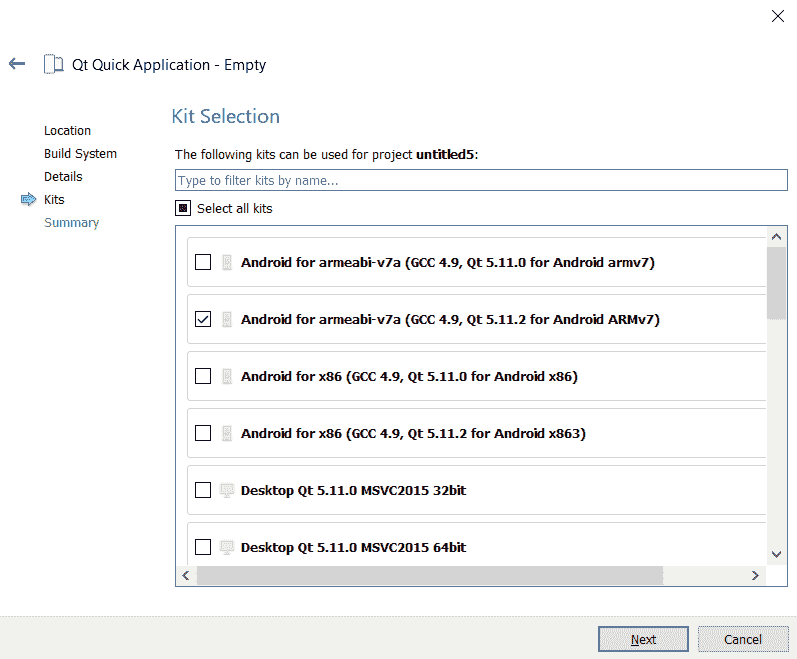

5.  项目创建完成后，Qt Creator 会自动从您的项目中打开一个名为`main.qml`的文件。您将看到一种不同类型的脚本，如下面的代码所示，它与您通常的 C/C++项目非常不同:

```cpp
import QtQuick 2.11
import QtQuick.Window 2.11

Window {
    visible: true
    width: 640
    height: 480
    title: qsTr("Hello World")
}
```

6.  点击位于 Qt Creator 左下角的绿色箭头按钮，立即构建并运行项目，如下图所示。如果您将默认工具包设置为其中一个桌面工具包，项目编译完成后将弹出一个空窗口:


7.  我们可以在不同的工具包之间切换，方法是转到“项目”界面，选择您想要用来构建项目的工具包，如下图所示。您还可以管理计算机上所有可用的工具包，或者从“项目”界面向项目添加新的工具包:

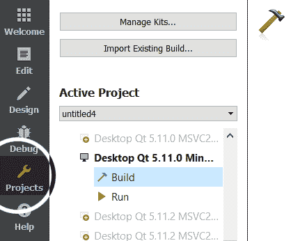

8.  如果这是您第一次构建和运行项目，您需要在构建设置下为安卓工具包创建一个模板。一旦您点击了“构建安卓 APK”标签下的“创建模板”按钮，如下图所示，Qt 将生成在安卓设备上运行您的应用程序所需的所有文件。如果您不打算在项目中使用渐变，请禁用将渐变文件复制到安卓目录选项。否则，您可能会在尝试编译应用程序并将其部署到移动设备时遇到问题:


9.  创建模板后，单击运行按钮。您现在应该会看到以下窗口弹出，询问它应该导出到哪个设备:


10.  选择当前连接到计算机的设备，然后按“确定”按钮。等待一段时间，让它构建项目，您应该可以在移动设备上运行一个空白应用程序。

# 它是如何工作的…

Qt Quick 应用程序项目与表单应用程序项目有很大不同。你大部分时间都在写 QML 脚本，而不是写 C/C++代码。需要**安卓软件开发工具包** ( **SDK** )、**安卓原生开发工具包** ( **NDK** )、 **Java 开发工具包** ( **JDK** )和 **Apache Ant** 将你的应用程序构建并导出到安卓平台。或者，您也可以在您的安卓套件中使用 Gradle 而不是 Apache Ant。您所需要做的就是启用使用 Gradle 而不是 Ant 选项，并为 Qt 提供 Gradle 的安装路径。请注意，Qt Creator 目前不支持安卓工作室:

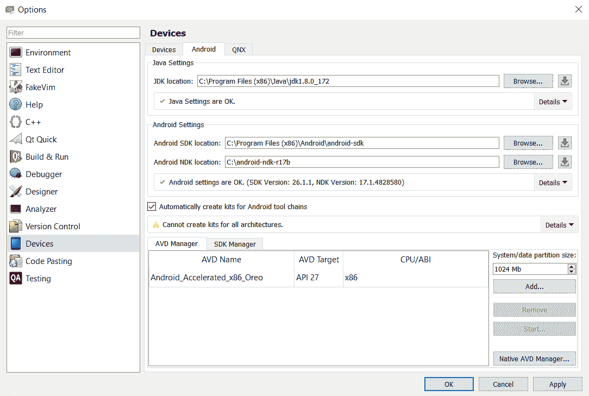

如果您在安卓设备上运行该应用，请确保您已经启用了 **USB 调试模式**。要启用 USB 调试模式，您需要首先在安卓设备上启用开发人员选项，方法是转到“设置”|“关于电话”，然后轻按“内部版本号”七次。之后，进入设置|开发者选项，你会看到菜单中的**调试选项。启用该选项后，您现在可以将应用程序导出到您的设备进行测试。**

为了构建 iOS 平台，您需要在 Mac 上运行 Qt Creator，并确保最新的 Xcode 也安装在您的 Mac 上。要在 iOS 设备上测试您的应用程序，您需要在苹果公司注册一个开发人员帐户，在开发人员门户网站注册您的设备，并将配置安装到您的 Xcode，这比安卓要复杂得多。一旦您从苹果公司获得开发人员帐户，您将可以访问开发人员门户。

# 与 QML 一起设计基本用户界面

在这个例子中，我们将学习如何使用 Qt 快速设计器来设计我们程序的用户界面。

# 怎么做…

让我们按照以下步骤开始:

1.  首先，创建一个新的 Qt Quick 应用程序项目，就像我们在前面的食谱中所做的那样。

You can also use the previous project files if you wish to.

2.  您将在项目资源中看到一个 QML 文件— `main.qml`。这是我们实现应用程序逻辑的地方，但是我们还需要另一个 QML 文件来定义用户界面。

3.  让我们通过转到文件|新文件或项目来创建 QML 用户界面文件，然后在 Qt 类别下选择 QtQuick 用户界面文件，如下图所示:


4.  我们把组件名`Main`和组件表单名`MainForm`叫做:


5.  一旦`MainForm.ui.qml`文件被创建，它将被 Qt 创建者打开。与我们在前面章节中使用的编辑器相比，您将看到完全不同的用户界面编辑器。这个编辑器叫做 **Qt 快速设计器**，专门用来为 Qt 快速项目设计用户界面。该编辑器的组件描述如下:

6.  我们将制作一个简单的登录屏幕。从“库”窗口，将两个文本小部件拖到画布上。

7.  将文本小部件的文本属性设置为`Username:`和`Password:`:

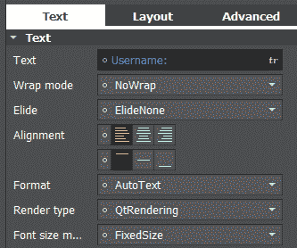

8.  将两个矩形从“资源库”窗口拖到画布上，然后将两个文本输入小部件拖到画布上，并将每个小部件都作为您刚刚添加到画布上的矩形的父级。将矩形的边框属性设置为`1`，半径设置为`5`。然后，将其中一个文本字段的回显模式设置为密码。
9.  现在，我们将通过将鼠标区域小部件与矩形和文本小部件相结合来手动创建一个按钮小部件。将鼠标区域小部件拖到画布上，然后将矩形和文本小部件拖到画布上，并将它们作为鼠标区域的父项。将矩形的颜色设置为`#bdbdbd`，然后将其边框属性设置为`1`，将其半径设置为`5`。然后，将文本设置为`Login`，并确保鼠标区域的大小与矩形相同。
10.  之后，将另一个矩形拖到画布上，作为登录表单的容器，这样看起来会很整洁。将其边框颜色设置为`#5e5858`，将其边框属性设置为`2`。然后，将其半径属性设置为`5`以使其拐角看起来有点圆。
11.  确保我们在上一步中添加的矩形位于导航窗口中层次结构的顶部，以便它出现在所有其他小部件的后面。您可以通过按下位于导航窗口顶部的箭头按钮来排列小部件在层次结构中的位置，如下所示:

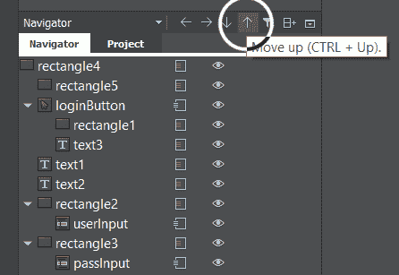

12.  接下来，我们将导出三个小部件——鼠标区域和两个文本输入小部件——作为根项目的别名属性，以便稍后我们可以从`main.qml`文件访问这些小部件。通过单击小部件名称后面的小图标，并确保图标变为打开状态，可以导出小部件。
13.  到目前为止，您的用户界面应该如下所示:


14.  现在让我们打开`main.qml`。默认情况下，Qt Creator 不会在 Qt 快速设计器中打开此文件，而是使用脚本编辑器打开。这是因为所有与用户界面设计相关的任务都是在`MainForm.ui.qml`中完成的，`main.qml`只是用来定义将要应用于 UI 的逻辑和功能。但是，您可以使用 Qt 快速设计器打开它，通过单击编辑器左侧边栏中的“设计”按钮来预览用户界面。
15.  在脚本顶部，添加第三行，将对话框模块导入`main.qml`，如下代码所示:

```cpp
import QtQuick 2.9
import QtQuick.Window 2.3
import QtQuick.Dialogs 1.2
```

16.  之后，用以下代码替换以下代码:

```cpp
Window {
    visible: true
    width: 360
    height: 360
    MainForm {
        anchors.fill: parent
        loginButton.onClicked: {
            messageDialog.text = "Username is " + userInput.text + " and password is " + passInput.text
            messageDialog.visible = true
        }
    }
```

17.  我们继续定义`messageDialog`如下:

```cpp
    MessageDialog {
        id: messageDialog
        title: "Fake login"
        text: ""
        onAccepted: {
            console.log("You have clicked the login button")
            Qt.quit()
        }
    }
}
```

18.  在您的电脑上构建并运行此程序，当您单击登录按钮时，您应该会得到一个显示消息框的简单程序:

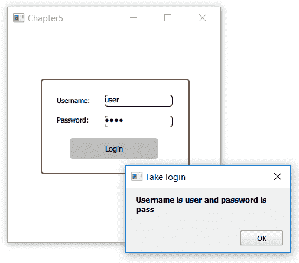

# 它是如何工作的…

从 Qt 5.4 开始，引入了一个新的文件扩展名`.ui.qml`。QML 引擎像正常的`.qml`文件一样处理它，但是禁止在其中写入任何逻辑实现。它作为用户界面定义模板，可以在不同的`.qml`文件中重用。UI 定义和逻辑实现的分离提高了 QML 代码的可维护性，并创建了更好的工作流。

Qt Quick–Basic 下的所有小部件都是最基本的小部件，我们可以使用它们来混合、匹配和创建新类型的小部件，如下所示:

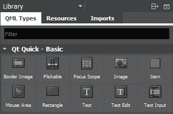

在前面的示例中，我们已经学习了如何将三个小部件组合在一起——一个文本、一个鼠标区域和一个矩形，以形成一个按钮小部件。但是，如果你很懒，你可以通过转到库窗口中的
导入选项卡，然后点击<添加导入>按钮，将预先制作的模块导入到你的 Qt Quick 项目中。然后，从下拉列表中选择要添加到项目中的模块，如下所示。一旦您在 QML 脚本和 C++编程方面取得了进步，您也可以创建自己的 Qt Quick 模块:


我们在`main.qml`中导入`QtQuick.Dialogs.qml 1.0`模块，创建了一个消息框，显示用户按下登录按钮时填写的用户名和密码，这样我们就可以证明用户界面功能在工作。如果部件没有从`MainForm.ui.qml`导出，我们将无法在`main.qml`中访问其属性。

此时，我们可以将程序导出到 iOS 和 Android，但在一些分辨率更高或每像素密度更高**(**DPI**单位)的设备上，用户界面可能看起来不准确。我们将在本章后面讨论这个问题。**

 **# 触摸事件

在本节中，我们将学习如何使用 Qt Quick 开发一个在移动设备上运行的触摸驱动应用程序。

# 怎么做…

让我们开始遵循以下分步指南:

1.  创建一个新的 Qt 快速应用程序-空项目。
2.  在 Qt 创建器中，右键单击`qml.qrc`并选择在编辑器中打开。然后，单击添加|添加文件，将`tux.png`添加到项目中，如下所示:

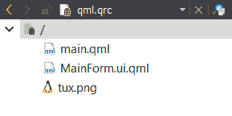

3.  接下来，打开`MainForm.ui.qml`。将图像小部件从“库”窗口拖到画布上。然后，将图像的来源设置为`tux.png`，将其`fillMode`设置为`PreserveAspectFit`。之后，将其宽度设置为`200`，高度设置为`220`。
4.  确保鼠标区域小部件和图像小部件都作为根项目的别名属性导出，方法是单击它们各自小部件名称旁边的小图标。
5.  之后，点击编辑器左侧边栏上的编辑按钮，切换到脚本编辑器。我们需要将鼠标区域小部件更改为多点触摸区域小部件，如以下代码所示:

```cpp
MultiPointTouchArea {
    id: touchArea
    anchors.fill: parent
    touchPoints: [
        TouchPoint { id: point1 },
        TouchPoint { id: point2 }
    ]
}
```

6.  我们还将`Image`小部件默认设置为自动放置在窗口中心，如下所示:

```cpp
Image {
    id: tux
    x: (window.width / 2) - (tux.width / 2)
    y: (window.height / 2) - (tux.height / 2)
    width: 200
    height: 220
    fillMode: Image.PreserveAspectFit
    source: "tux.png"
}
```

7.  最终的用户界面应该如下所示:

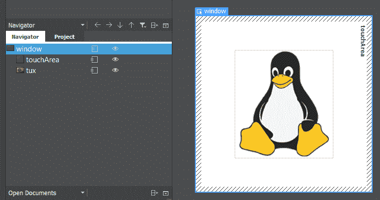

8.  完成后，让我们打开`main.qml`。首先，清除`MainForm`对象内除`anchors.fill: parent`以外的所有内容，如下代码所示:

```cpp
import QtQuick 2.9
import QtQuick.Window 2.3
Window {
    visible: true
    MainForm {
        anchors.fill: parent
    }
}
```

9.  之后，在`MainForm`对象中声明几个变量，用于重新缩放图像小部件。如果您想了解以下代码中使用的 property 关键字的更多信息，请查看本示例末尾的*还有更多……*部分:

```cpp
property int prevPointX: 0
property int prevPointY: 0
property int curPointX: 0
property int curPointY: 0
property int prevDistX: 0
property int prevDistY: 0
property int curDistX: 0
property int curDistY: 0
property int tuxWidth: tux.width
property int tuxHeight: tux.height
```

10.  使用下面的代码，我们将定义当我们的手指触摸多点区域小部件时会发生什么。在这种情况下，如果多个手指触摸多点触摸区域，我们将保存第一和第二触摸点的位置。我们还保存了图像小部件的宽度和高度，以便稍后我们可以使用这些变量来计算手指开始移动时图像的比例:

```cpp
touchArea.onPressed: {
    if (touchArea.touchPoints[1].pressed) {
        if (touchArea.touchPoints[1].x < touchArea.touchPoints[0].x)
            prevDistX = touchArea.touchPoints[1].x - touchArea.touchPoints[0].x
        else
            prevDistX = touchArea.touchPoints[0].x - touchArea.touchPoints[1].x
        if (touchArea.touchPoints[1].y < touchArea.touchPoints[0].y)
            prevDistY = touchArea.touchPoints[1].y - touchArea.touchPoints[0].y
        else
            prevDistY = touchArea.touchPoints[0].y - touchArea.touchPoints[1].y
        tuxWidth = tux.width
        tuxHeight = tux.height
    }
}
```

11.  下图显示了当两个手指在**触摸区域**边界内触摸屏幕时，触摸点被注册的示例。**触摸区域.触摸点[0]** 是第一个注册的触摸点，**触摸区域.触摸点[1]** 是第二个。然后，我们计算两个触摸点之间的 *X* 和 *Y* 距离，并将其保存为**前距离**和**前距离**，如下所示:

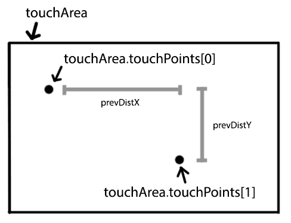

12.  之后，我们将使用以下代码定义当我们的手指保持与屏幕接触并且仍然在触摸区域的边界内移动时会发生什么。此时，我们将使用上一步中保存的变量来计算图像的比例。同时，如果我们检测到只发现了单次触摸，那么我们将移动图像，而不是改变其比例:

```cpp
touchArea.onUpdated: {
    if (!touchArea.touchPoints[1].pressed) {
        tux.x += touchArea.touchPoints[0].x - touchArea.touchPoints[0].previousX
        tux.y += touchArea.touchPoints[0].y - touchArea.touchPoints[0].previousY
    }
    else {
        if (touchArea.touchPoints[1].x < touchArea.touchPoints[0].x)
            curDistX = touchArea.touchPoints[1].x - touchArea.touchPoints[0].x
        else
            curDistX = touchArea.touchPoints[0].x - touchArea.touchPoints[1].x
        if (touchArea.touchPoints[1].y < touchArea.touchPoints[0].y)
            curDistY = touchArea.touchPoints[1].y - touchArea.touchPoints[0].y
        else
            curDistY = touchArea.touchPoints[0].y - touchArea.touchPoints[1].y
        tux.width = tuxWidth + prevDistX - curDistX
        tux.height = tuxHeight + prevDistY - curDistY
    }
}
```

13.  下图显示了移动触摸点的示例–**触摸区域.触摸点【0】**从点 **A** 移动到点 **B** ，而**触摸区域.触摸点【1】**从点 **C** 移动到点 **D** 。然后，我们可以通过查看先前的 **X** 、 **Y** 变量与当前变量之间的差异来确定触摸点移动了多少个单位:


14.  现在，您可以构建程序并将其导出到移动设备。您将无法在不支持多点触控的平台上测试此程序。一旦程序在移动设备(或支持多点触控的台式机/笔记本电脑)上运行，尝试两件事——仅将一个手指放在屏幕上并四处移动，将两个手指放在屏幕上并向相反方向移动。你应该看到的是，如果你只用一个手指，企鹅会被移动到另一个地方，如果你用两个手指，它会被放大或缩小，如下图截图所示:

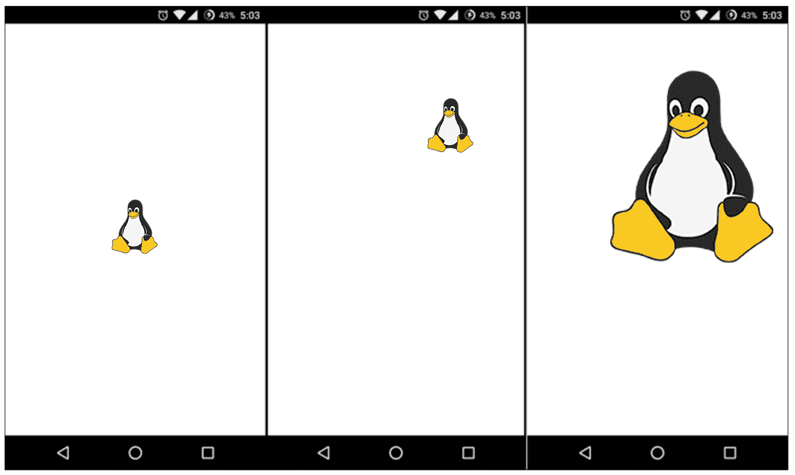

# 它是如何工作的…

当手指触摸设备屏幕时，多点触摸区域小部件触发**按下**事件，并记录内部阵列中每个触摸点的位置。我们可以通过告诉 Qt 您想要访问哪个触摸点来获得这些数据。第一次触摸会带有`0`的索引号，第二次触摸会是`1`，以此类推。然后，我们将这些数据保存到变量中，以便以后检索这些数据来计算企鹅图像的缩放比例。

当一个或多个手指在移动时保持与屏幕接触时，多点触摸区域将触发**未激活**事件。然后，我们将检查有多少次触摸——如果只找到一次触摸，我们将根据手指移动的程度来移动企鹅图像。如果有多个触摸，我们将比较两个触摸之间的距离，并将其与之前保存的变量进行比较，以确定我们应该重新缩放图像的大小。

该图显示，在屏幕上轻击手指将触发**按下**事件，而在屏幕上滑动手指将触发**按下**事件:

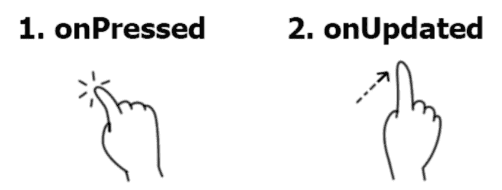

我们还必须检查第一次触摸是在第二次触摸的左侧还是右侧。这样，我们可以防止图像在手指移动的相反方向上缩放，从而产生不准确的结果。至于企鹅的移动，我们只需要得到当前触摸位置和前一个触摸位置之间的差异，将其添加到企鹅的坐标中，就完成了。单次触摸事件通常比多次触摸事件简单和直接得多。

# 还有更多…

在 Qt Quick 中，其所有组件都有内置属性，如`width`、`height`和`color`，默认情况下这些属性会附加到组件上。但是，Qt Quick 还允许您创建自己的自定义属性，并将它们附加到您在 QML 脚本中声明的组件。通过在类型(`int`、`float`等)关键字之前添加`property`关键字，可以在 QML 文档的对象声明中定义对象类型的自定义属性，例如:

```cpp
property int myValue;
```

您也可以通过在值前使用冒号(`:`)将自定义`property`绑定到一个值，如以下代码所示:

```cpp
property int myValue: 100;
```

To learn more about the property types supported by Qt Quick, check out this link:
[http://doc.qt.io/qt-5/qtqml-typesystem-basictypes.html](http://doc.qt.io/qt-5/qtqml-typesystem-basictypes.html)

# QML 的动画

Qt 允许我们在不编写大量代码的情况下轻松地激活用户界面组件。在这个例子中，我们将学习如何通过应用动画使我们的程序的用户界面更有趣。

# 怎么做…

让我们按照以下步骤学习如何将动画添加到您的 Qt Quick 应用程序中:

1.  再一次，我们将从头开始一切。因此，在 Qt Creator 中创建新的 Qt Quick 应用程序–清空项目并创建`MainForm.ui.qml`文件。
2.  打开`MainForm.ui.qml`并转到“库”窗口中的“导入”选项卡，将名为`QtQuick.Controls`的 Qt Quick 模块添加到您的项目中。
3.  之后，您将看到一个新的类别出现在 QML 类型选项卡中，称为 Qt Quick-Controls，其中包含许多可以放置在画布上的新小部件。
4.  接下来，将三个按钮部件拖到画布上，并将它们的高度设置为`45`。然后，转到“属性”窗口上的“布局”选项卡，为所有三个按钮小部件启用左锚和右锚。确保锚点的目标设置为“父级”，边距保持为`0`。这将使按钮根据主窗口的宽度水平调整大小。之后，将第一个按钮的 y 值设置为`0`，第二个设置为`45`，第三个设置为`90`。用户界面现在应该如下所示:


5.  现在，用编辑器打开`qml.qrc`，将`fan.png`添加到项目中，如下所示:

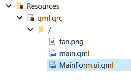

6.  然后，在画布上添加两个鼠标区域小部件。之后，在画布上拖动一个矩形小部件和一个图像小部件。将矩形和图像放在我们之前刚刚添加的鼠标区域中。
7.  将矩形的颜色设置为`#0000ff`，并将`fan.png`应用于图像小部件。您的用户界面现在应该如下所示:

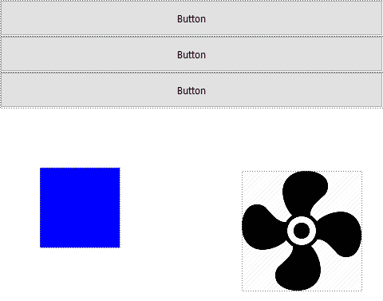

8.  之后，通过点击小部件名称右侧的图标，将`MainForm.ui.qml`中的所有小部件导出为根项目的别名属性，如下所示:


9.  接下来，我们将对用户界面应用动画和逻辑，但我们不会在`MainForm.ui.qml`中这样做。相反，我们将在`main.qml`中完成这一切。
10.  在`main.qml`中，去掉鼠标区域的默认代码，加上窗口的宽度和高度，这样我们就有更多的空间可以预览，如下所示:

```cpp
import QtQuick 2.5
import QtQuick.Window 2.2
Window {
    visible: true
    width: 480
    height: 550
    MainForm {
        anchors.fill: parent
    }
}
```

11.  之后，添加以下定义`MainForm`小部件中按钮行为的代码:

```cpp
button1 {
    Behavior on y { SpringAnimation { spring: 2; damping: 0.2 } }
    onClicked: {
        button1.y = button1.y + (45 * 3)
    }
}
button2 {
    Behavior on y { SpringAnimation { spring: 2; damping: 0.2 } }
    onClicked: {
        button2.y = button2.y + (45 * 3)
    }
}
```

12.  在下面的代码中，我们继续定义`button3`:

```cpp
button3 {
    Behavior on y { SpringAnimation { spring: 2; damping: 0.2 } }
    onClicked: {
        button3.y = button3.y + (45 * 3)
    }
}
```

13.  然后，按照风扇图像及其所连接的鼠标区域小部件的行为进行操作，如下所示:

```cpp
fan {
    RotationAnimation on rotation {
        id: anim01
        loops: Animation.Infinite
        from: 0
        to: -360
        duration: 1000
    }
}
```

14.  在下面的代码中，我们接着定义`mouseArea1`:

```cpp
mouseArea1 {
    onPressed: {
        if (anim01.paused)
            anim01.resume()
        else
            anim01.pause()
    }
}
```

15.  最后但同样重要的是，添加矩形的行为和它所连接的鼠标区域小部件，如下所示:

```cpp
rectangle2 {
    id: rect2
    state: "BLUE"
    states: [
        State {
            name: "BLUE"
            PropertyChanges {
                target: rect2
                color: "blue"
            }
        },
```

16.  在下面的代码中，我们继续添加`RED`状态:

```cpp
        State {
            name: "RED"
            PropertyChanges {
                target: rect2
                color: "red"
            }
        }
    ]
}
```

17.  然后，我们通过如下定义`mouseArea2`来完成代码:

```cpp
mouseArea2 {
    SequentialAnimation on x {
        loops: Animation.Infinite
        PropertyAnimation { to: 150; duration: 1500 }
        PropertyAnimation { to: 50; duration: 500 }
    }
    onClicked: {
        if (rect2.state == "BLUE")
            rect2.state = "RED"
        else
            rect2.state = "BLUE"
    }
}
```

18.  如果您现在编译并运行程序，您应该会看到窗口顶部有三个按钮，左下角有一个移动的矩形，右下角有一个旋转的风扇，如下图所示。如果你点击任何一个按钮，它们会稍微向下移动，产生一个漂亮、平滑的动画。如果点击矩形，它会从**蓝色**变成**红色**。同时，如果在动画制作过程中单击风扇图像，它将暂停动画制作，如果再次单击它，它将恢复动画制作:

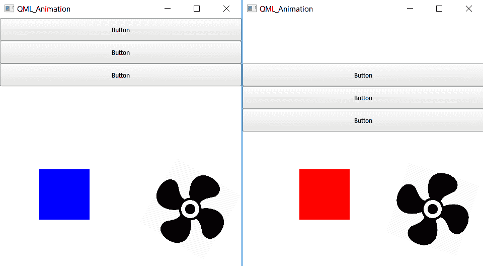

# 它是如何工作的…

Qt 的 C++版本支持的大多数动画元素，如过渡、顺序动画和并行动画，也可以在 Qt Quick 中获得。如果你熟悉 C++中的 Qt 动画框架，你应该能够很容易地掌握这一点。

在本例中，我们向所有三个按钮添加了一个弹簧动画元素，专门跟踪它们各自的 y 轴。如果 Qt 检测到 y 值发生了变化，小部件不会立即弹出到新的位置，而是会被插值，在画布上移动，并在到达目的地时执行一个模拟弹簧效果的小抖动动画。我们只需要写一行代码，剩下的留给 Qt。

至于扇形图像，我们给它添加了旋转动画元素，并将持续时间设置为`1000 milliseconds`，这意味着它将在一秒钟内完成一个完整的旋转。我们还将其设置为无限循环动画。当我们点击它所连接的鼠标区域部件时，我们只需调用`pause()`或`resume()`来启用或禁用动画。

接下来，对于矩形小部件，我们向其添加了两个状态，一个称为**蓝色**，一个称为**红色**，每个状态都带有一个**颜色**属性，该属性将在状态更改时应用于矩形。同时，我们在矩形所附着的鼠标区域小部件中添加了一个**顺序动画组**，然后在该组中添加了两个**属性动画**元素。还可以混合不同类型的组动画；Qt 可以很好地处理这个问题。

# 使用模型/视图显示信息

Qt 包括一个**模型/视图框架**，该框架将数据的组织和管理方式与数据呈现给用户的方式分开。在这一节中，我们将学习如何使用模型/视图，特别是通过使用列表视图来显示信息，同时应用我们自己的定制来使它看起来很光滑。

# 怎么做…

让我们从以下步骤开始:

1.  创建一个新的 Qt 快速应用程序——清空项目，用 Qt 创建器打开`qml.qrc`。向项目添加六个图像:`home.png`、`map.png`、`profile.png`、`search.png`、`settings.png`和`arrow.png`，如下所示:

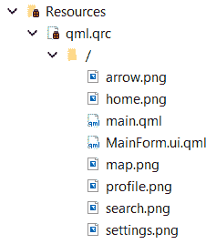

2.  之后，创建并打开`MainForm.ui.qml`，就像我们在前面所有示例中所做的那样。将“库”窗口中“季度快速视图”类别下的列表视图小部件拖到画布上。然后，通过单击布局窗口中间的按钮，将其锚点设置为填充父大小，如下图所示:


3.  接下来，切换到脚本编辑器，因为我们将如下定义列表视图:

```cpp
import QtQuick 2.9

Rectangle {
    id: rectangle1

    property alias listView1: listView1
    property double sizeMultiplier: width / 480
```

4.  我们将通过添加列表视图继续编写代码，如下所示:

```cpp
    ListView {
        id: listView1
        y: 0
        height: 160
        orientation: ListView.Vertical
        boundsBehavior: Flickable.StopAtBounds
        anchors.fill: parent
        delegate: Item {
            width: 80 * sizeMultiplier
            height: 55 * sizeMultiplier
```

5.  我们将继续向列表视图添加行，如下所示:

```cpp
            Row {
                id: row1
                Rectangle {
                    width: listView1.width
                    height: 55 * sizeMultiplier
                    gradient: Gradient {
                        GradientStop { position: 0.0; color: "#ffffff" }
                        GradientStop { position: 1.0; color: "#f0f0f0" }
                    }
                    opacity: 1.0
```

6.  然后我们添加一个鼠标区域和一个图像，如下面的代码片段所示:

```cpp
                    MouseArea {
                        id: mouseArea
                        anchors.fill: parent
                    }
                    Image {                        
                        anchors.verticalCenter: parent.verticalCenter                        
                        x: 15 * sizeMultiplier
                        width: 30 * sizeMultiplier
                        height: 30 * sizeMultiplier
                        source: icon
                    }
```

7.  然后，继续添加两个文本对象，如下所示:

```cpp
                    Text {
                        text: title
                        font.family: "Courier"
                        font.pixelSize: 17 * sizeMultiplier
                        x: 55 * sizeMultiplier
                        y: 10 * sizeMultiplier
                    }                    
                    Text {
                        text: subtitle
                        font.family: "Verdana"
                        font.pixelSize: 9 * sizeMultiplier
                        x: 55 * sizeMultiplier
                        y: 30 * sizeMultiplier
                    }
```

8.  之后，添加如下图像对象:

```cpp
                    Image {
                        anchors.verticalCenter: parent.verticalCenter
                        x: parent.width - 35 * sizeMultiplier
                        width: 30 * sizeMultiplier
                        height: 30 * sizeMultiplier
                        source: "arrow.png"
                    }
                }
            }
        }
```

9.  使用下面的代码，我们将定义列表模型:

```cpp
        model: ListModel {
            ListElement {
                title: "Home"
                subtitle: "Go back to dashboard"
                icon: "home.png"
            }

            ListElement {
                title: "Map"
                subtitle: "Help navigate to your destination"
                icon: "map.png"
            }
```

10.  我们将继续编写代码:

```cpp
            ListElement {
                title: "Profile"
                subtitle: "Customize your profile picture"
                icon: "profile.png"
            }

            ListElement {
                title: "Search"
                subtitle: "Search for nearby places"
                icon: "search.png"
            }
```

11.  我们现在将添加最终的列表元素，如以下代码所示:

```cpp
            ListElement {
                title: "Settings"
                subtitle: "Customize your app settings"
                icon: "settings.png"
            }
        }
    }
}
```

12.  之后，打开`main.qml`并用以下内容替换代码:

```cpp
import QtQuick 2.9
import QtQuick.Window 2.3
Window {
    visible: true
    width: 480
    height: 480
    MainForm {
        anchors.fill: parent
        MouseArea {
            onPressed: row1.opacity = 0.5
            onReleased: row1.opacity = 1.0
        }
    }
}
```

13.  构建并运行程序，现在您的程序应该如下所示:


# 它是如何工作的…

Qt Quick 允许我们轻松地定制列表视图中每一行的外观。委托定义了每一行的外观，模型是存储将在列表视图中显示的数据的地方。

在本例中，我们添加了一个每行都有渐变的背景，然后我们还在项目的每一侧添加了一个图标、一个标题、一个描述和一个鼠标区域小部件，使列表视图的每一行都可以点击。委托不是静态的，因为我们允许模型更改标题、描述和图标，使每一行看起来都是唯一的。

在`main.qml`中，我们定义了鼠标区域小部件的行为，当按下时，它将把自己的不透明度值减半，当释放时，它将返回到完全不透明。由于所有其他元素，如标题和图标，都是鼠标区域小部件的子元素，它们也将自动跟随其父小部件的行为，并变成半透明的。同样，我们最终解决了高分辨率和高 DPI 移动设备上的显示问题。这是一个非常简单的技巧——首先，我们定义了一个名为`sizeMultiplier`的变量。`sizeMultiplier`的值是窗口宽度除以一个预定义值的结果，比如说 480，这是我们用于电脑的当前窗口宽度。然后将`sizeMultiplier`乘以所有与大小和位置有关的小部件变量，包括字体大小。请注意，在这种情况下，您应该将`pixelSize`属性用于文本而不是`pointSize`，这样您将在乘以`sizeMultiplier`时获得正确的显示。下面的截图向您展示了有无`sizeMultiplier`时，该应用在移动设备上的外观:

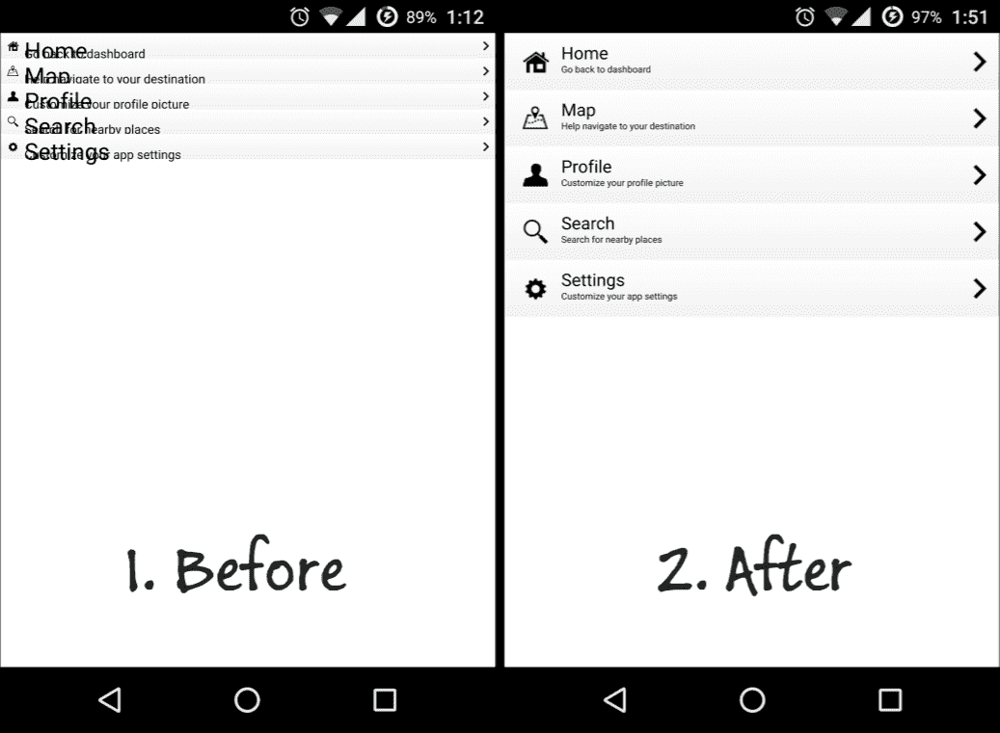

请注意，一旦您将所有内容乘以`sizeMultiplier`变量，您可能会在编辑器中得到一个混乱的用户界面。这是因为宽度变量在编辑器中可能会返回`0`。因此，通过将`0`乘以`480`，您可能会得到结果`0`，这使得整个用户界面看起来很有趣。然而，当运行实际程序时，它看起来会很好。如果想在编辑器上预览
用户界面，暂时将`sizeMultiplier`设置为`1`。

# 集成 QML 和 C++

Qt 支持用 QML 引擎桥接 C++类。这种组合允许开发人员利用 QML 的简单性和 C++的灵活性。您甚至可以从外部库中集成 Qt 不支持的功能，然后将结果数据传递给 Qt Quick 以显示在用户界面中。在这个例子中，我们将学习如何将我们的用户界面组件从 QML 导出到 C++框架，并在屏幕上显示它们之前操作它们的属性。

# 怎么做…

让我们完成以下步骤:

1.  再一次，我们将从头开始一切。因此，在 Qt Creator 中创建新的 Qt Quick 应用程序–清空项目并创建`MainForm.ui.qml`。然后，打开`MainForm.ui.qml`。
2.  我们可以保留鼠标区域和文本小部件，但是将文本小部件放在窗口的底部。将文本小部件的**文本**属性更改为**使用 C++更改此文本**，并将其**字体大小**设置为 **18** 。之后，转到布局选项卡，启用**垂直中心定位点**和**水平中心定位点**，以确保它始终位于窗口中间的某个位置，而不管您如何重新缩放窗口。

将**垂直中心锚**的**边距**设置为 **120** ，如下图所示:


3.  接下来，将矩形部件从**库**窗口拖到画布上，并将其颜色设置为`#ff0d0d`。将其**宽度**和**高度**设置为 **200** ，并启用垂直和水平中心锚。之后，将水平中心锚的**边距**设置为 **-14** 。您的用户界面现在应该如下所示:


4.  完成后，右键单击 Qt Creator 中的项目目录，然后选择添加新项...，如下图所示。然后，会弹出一个窗口，让你选择一个文件模板。选择 C++类，然后按选择。之后，它会要求您通过填写类的信息来定义 C++类。在这种情况下，在类名字段中插入`MyClass`，选择`QObject`作为基类。然后，确保选中“包含对象”选项，您现在可以单击“下一步”按钮，然后单击“完成”按钮。现在将创建两个文件— `myclass.h`和`myclass.cpp`，并将其添加到您的项目中:

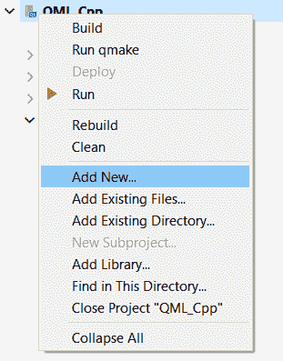

5.  现在，打开`myclass.h`，在类构造函数下添加一个变量和函数，如下代码所示:

```cpp
#ifndef MYCLASS_H
#define MYCLASS_H
#include <QObject>
class MyClass : public QObject
{
    Q_OBJECT
    public:
    explicit MyClass(QObject *parent = 0);
    // Object pointer
    QObject* myObject;
    // Must call Q_INVOKABLE so that this function can be used in QML
    Q_INVOKABLE void setMyObject(QObject* obj);
};
#endif // MYCLASS_H
```

6.  之后，打开`myclass.cpp`并定义`setMyObject()`功能如下:

```cpp
#include "myclass.h"
MyClass::MyClass(QObject *parent) : QObject(parent)
{
}
void MyClass::setMyObject(QObject* obj)
{
    // Set the object pointer
    myObject = obj;
}
```

7.  我们现在可以关闭`myclass.cpp`和打开`main.qml`。在文件的顶部，添加第三行，它导入了我们刚刚用 C++创建的自定义库:

```cpp
import QtQuick 2.9
import QtQuick.Window 2.3
import MyClassLib 1.0
```

8.  然后，在`Window`对象中定义`MyClass`，并在`MainForm`对象中调用其`setMyObject()`函数，如下代码所示:

```cpp
Window {
    visible: true
    width: 480
    height: 320
    MyClass {
 id: myclass
 }
    MainForm {
        anchors.fill: parent
        mouseArea.onClicked: {
            Qt.quit();
        }
        Component.onCompleted:
 myclass.setMyObject(messageText);
    }
}
```

9.  最后，打开`main.cpp`并向 QML 引擎注册定制类。我们还将使用 C++代码更改文本小部件和矩形的属性，如下所示:

```cpp
#include <QGuiApplication>
#include <QQmlApplicationEngine>
#include <QtQml>
#include <QQuickView>
#include <QQuickItem>
#include <QQuickView>
#include "myclass.h"
int main(int argc, char *argv[])
{
    // Register your class to QML
    qmlRegisterType<MyClass>("MyClassLib", 1, 0, "MyClass");
```

10.  然后，继续创建对象，就像下面代码中突出显示的部分一样:

```cpp
    QGuiApplication app(argc, argv);
    QQmlApplicationEngine engine;
    engine.load(QUrl(QStringLiteral("qrc:/main.qml")));

    QObject* root = engine.rootObjects().value(0);
 QObject* messageText = root->findChild<QObject*>("messageText");
 messageText->setProperty("text", QVariant("C++ is now in control!"));
 messageText->setProperty("color", QVariant("green"));
 QObject* square = root->findChild<QObject*>("square");
 square->setProperty("color", QVariant("blue")); 
    return app.exec();
}
```

11.  现在构建并运行程序，您应该会看到矩形和文本的颜色与您之前在 Qt Quick 中定义的完全不同，如下图所示。这是因为它们的属性被 C++代码改变了:


# 它是如何工作的…

QML 被设计成可以通过 C++代码轻松扩展。Qt QML 模块中的类使得 QML 对象能够从 C++中加载和操作。

只有从`QObject`基类继承的类才能与 QML 集成，因为它是 Qt 生态系统的一部分。一旦类在 QML 引擎中注册，我们就可以从 QML 引擎中获取根项目，并使用它来找到我们想要操作的对象。之后，使用`setProperty()`功能更改属于小部件的任何属性。

请注意，`Q_INVOKABLE`宏在您打算在 QML 调用的函数前面是必需的。没有它，Qt 将不会向 Qt Quick 公开该函数，并且您将无法调用它。**