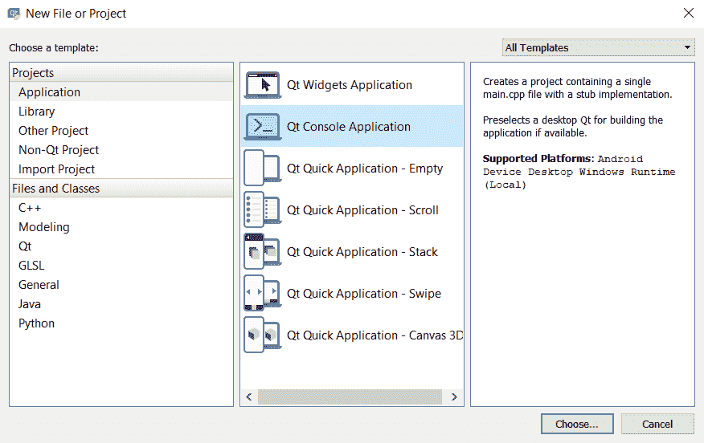
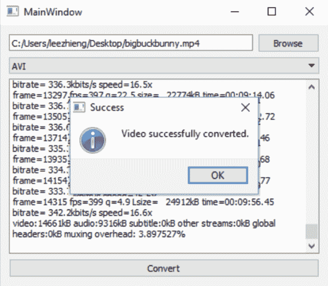
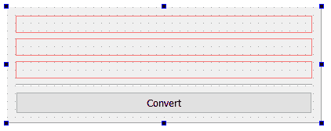
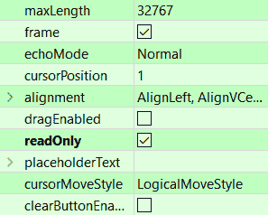
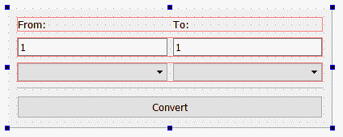

# 十、转换库

本章将涵盖以下食谱:

*   转换数据
*   转换图像
*   转换视频
*   兑换货币

# 介绍

保存在计算机环境中的数据以多种方式编码。有时，它可以直接用于某个目的，其他时候，它需要转换成另一种格式，以适应任务的上下文。将数据从一种格式转换为另一种格式的过程也因源格式和目标格式而异。

有时，该过程可能非常复杂，尤其是在处理特征丰富且敏感的数据时，例如图像或视频转换。即使是转换过程中的一个小错误也可能导致文件不可用。

# 技术要求

本章的技术要求包括 Qt 5.11.2 MinGW 32 位、Qt Creator 4.8.2 和 Windows 10。

本章使用的所有代码可从以下 GitHub 资源库下载，网址为[https://GitHub . com/PacktPublishing/Qt5-CPP-GUI-Programming-cook book-第二版/tree/master/Chapter10](https://github.com/PacktPublishing/Qt5-CPP-GUI-Programming-Cookbook-Second-Edition/tree/master/Chapter10) 。

查看以下视频，查看正在运行的代码:[http://bit.ly/2ToKfCC](http://bit.ly/2ToKfCC)

# 转换数据

Qt 提供了一组用于在不同类型的数据之间轻松转换的类和函数。这使得 Qt 不仅仅是一个 GUI 库；它是一个完整的软件开发平台。与 C++ 标准库提供的类似转换功能相比，我们将在下面的示例中使用的`QVariant`类使 Qt 更加灵活和强大。

# 怎么做…

让我们按照以下步骤学习如何在 Qt 中转换各种数据类型:

1.  打开 Qt 创建器，转到文件|新文件或项目，创建一个新的 Qt 控制台应用项目:



2.  打开`main.cpp`并添加以下标题:

```cpp
#include <QCoreApplication>
#include <QDebug>
#include <QtMath>
#include <QDateTime>
#include <QTextCodec>
#include <iostream>
```

3.  在`main()`函数中，添加以下代码将字符串转换为数字:

```cpp
int numberA = 2;
QString numberB = "5";
qDebug() << "1) " << "2 + 5 =" << numberA + numberB.toInt();
```

4.  将数字转换回字符串:

```cpp
float numberC = 10.25;
float numberD = 2;
QString result = QString::number(numberC * numberD);
qDebug() << "2) " << "10.25 * 2 =" << result;
```

5.  让我们看看如何使用`qFloor()`向下舍入一个值:

```cpp
float numberE = 10.3;
float numberF = qFloor(numberE);
qDebug() << "3) " << "Floor of 10.3 is" << numberF;
```

6.  使用`qCeil()`，我们能够将一个数舍入到不小于其初始值的最小整数值:

```cpp
float numberG = 10.3;
float numberH = qCeil(numberG);
qDebug() << "4) " << "Ceil of 10.3 is" << numberH;
```

7.  通过从以字符串格式写入的日期时间数据转换来创建日期时间变量:

```cpp
QString dateTimeAString = "2016-05-04 12:24:00";
QDateTime dateTimeA = QDateTime::fromString(dateTimeAString, "yyyy-MM-dd hh:mm:ss");
qDebug() << "5) " << dateTimeA;
```

8.  使用我们的自定义格式将日期时间变量转换回字符串:

```cpp
QDateTime dateTimeB = QDateTime::currentDateTime();
QString dateTimeBString = dateTimeB.toString("dd/MM/yy hh:mm");
qDebug() << "6) " << dateTimeBString;
```

9.  调用`QString::toUpper()`函数将字符串变量转换成所有大写字母:

```cpp
QString hello1 = "hello world!";
qDebug() << "7) " << hello1.toUpper();
```

10.  调用`QString::toLower()`将字符串完全转换为小写:

```cpp
QString hello2 = "HELLO WORLD!";
qDebug() << "8) " << hello2.toLower();
```

11.  Qt 提供的`QVariant`类是一种非常强大的数据类型，无需程序员付出任何努力就可以轻松转换为其他类型:

```cpp
QVariant aNumber = QVariant(3.14159);
double aResult = 12.5 * aNumber.toDouble();
qDebug() << "9) 12.5 * 3.14159 =" << aResult;
```

12.  这展示了一个单独的`QVariant`变量是如何被同时转换成多个数据类型的，而无需程序员付出任何努力:

```cpp
qDebug() << "10) ";
QVariant myData = QVariant(10);
qDebug() << myData;
myData = myData.toFloat() / 2.135;
qDebug() << myData;
myData = true;
qDebug() << myData;
myData = QDateTime::currentDateTime();
qDebug() << myData;
myData = "Good bye!";
qDebug() << myData;
```

13.  `main.cpp`中的完整源代码现在将如下所示:

```cpp
#include <QCoreApplication>
#include <QDebug>
#include <QtMath>
#include <QDateTime>
#include <QTextCodec>
#include <iostream>

int main(int argc, char *argv[]) {
    QCoreApplication a(argc, argv);
```

14.  之后，让我们添加代码，将字符串转换为数字，反之亦然:

```cpp
    // String to number
    int numberA = 2;
    QString numberB = "5";
    qDebug() << "1) " << "2 + 5 =" << numberA + numberB.toInt();

    // Number to string
    float numberC = 10.25;
    float numberD = 2;
    QString result = QString::number(numberC * numberD);
    qDebug() << "2) " << "10.25 * 2 =" << result;
```

15.  编写代码将浮点数分别转换为它们最近的后继整数或前一整数:

```cpp
    // Floor
    float numberE = 10.3;
    float numberF = qFloor(numberE);
    qDebug() << "3) " << "Floor of 10.3 is" << numberF;

    // Ceil
    float numberG = 10.3;
    float numberH = qCeil(numberG);
    qDebug() << "4) " << "Ceil of 10.3 is" << numberH;
```

16.  将字符串转换为日期时间格式，反之亦然:

```cpp
    // Date time from string
    QString dateTimeAString = "2016-05-04 12:24:00";
    QDateTime dateTimeA = QDateTime::fromString(dateTimeAString, "yyyy-MM-dd hh:mm:ss");
    qDebug() << "5) " << dateTimeA;

    // Date time to string
    QDateTime dateTimeB = QDateTime::currentDateTime();
    QString dateTimeBString = dateTimeB.toString("dd/MM/yy hh:mm");
    qDebug() << "6) " << dateTimeBString;
```

17.  继续添加代码以将字符串转换为大写或小写字符:

```cpp
    // String to all uppercase
    QString hello1 = "hello world!";
    qDebug() << "7) " << hello1.toUpper();

    // String to all lowercase
    QString hello2 = "HELLO WORLD!";
    qDebug() << "8) " << hello2.toLower();
```

18.  将`QVariant`数据类型转换为其他类型:

```cpp
    // QVariant to double
    QVariant aNumber = QVariant(3.14159);
    double aResult = 12.5 * aNumber.toDouble();
    qDebug() << "9) 12.5 * 3.14159 =" << aResult;

    // QVariant different types
    qDebug() << "10) ";
    QVariant myData = QVariant(10);
    qDebug() << myData;
    myData = myData.toFloat() / 2.135;
    qDebug() << myData;
    myData = true;
    qDebug() << myData;
```

19.  将`QVariant`数据类型转换为`QDateTime`和`QString`:

```cpp
    myData = QDateTime::currentDateTime();
    qDebug() << myData;
    myData = "Good bye!";
    qDebug() << myData;

    return a.exec();
}
```

20.  编译并运行项目，您应该会看到如下内容:


# 它是如何工作的...

Qt 提供的所有数据类型，如`QString`、`QDateTime`和`QVariant`，都包含一些函数，使得转换成其他类型变得简单明了。Qt 还提供了自己的对象转换功能，`qobject_cast()`，不依赖标准库。它还与 Qt 更兼容，并且可以很好地在 Qt 的小部件类型和数据类型之间进行转换。

Qt 还为您提供了`QtMath`类，它可以帮助您操作数字变量，例如将浮点数舍入或将角度从度数转换为弧度。`QVariant`是一个特殊的类，可以用来存储各种类型的数据，比如`int`、`float`、`char`、`string`等等。它可以通过检查变量中存储的值来自动确定数据类型。只需调用单个函数，如`toFloat()`、`toInt()`、`toBool()`、`toChar()`或`toString()`，也可以轻松地将数据转换为`QVariant`类支持的任何类型。

# 还有更多…

请注意，这些转换都需要计算能力。尽管现代计算机处理这些操作的速度非常快，但你应该注意不要一下子大量过量。如果要转换大量变量进行复杂计算，可能会显著降低计算机速度，因此请仅在必要时尝试转换变量。

# 转换图像

在本节中，我们将学习如何构建一个简单的图像转换器，将图像从一种格式转换为另一种格式。Qt 支持读写不同类型的图像格式，由于许可问题，这种支持以外部 DLL 文件的形式出现。但是，您不必担心这一点，因为只要您在项目中包含这些 DLL 文件，它就可以跨不同格式无缝工作。有些格式只支持读而不支持写，有些则两者都支持。

You can check out the full details at [http://doc.qt.io/qt-5/qtimageformats-index.html](http://doc.qt.io/qt-5/qtimageformats-index.html).

# 怎么做…

Qt 内置的图像库让图像转换变得非常简单:

1.  打开 Qt 创建器，创建一个新的 Qt 小部件应用项目。
2.  打开`mainwindow.ui`并在画布上添加一行编辑和按钮选择图像文件，一个组合框选择所需的文件格式，另一个按钮开始转换过程:


3.  双击组合框，将出现一个窗口，您可以在其中编辑组合框。我们将通过点击+按钮三次并将项目`PNG`、`JPEG`和`BMP`重命名来添加三个项目到组合框列表中:


4.  右键单击其中一个按钮并选择转到插槽…，然后单击确定按钮。插槽功能将自动添加到您的源文件中。对另一个按钮也重复此步骤:


5.  让我们转到源代码。打开`mainwindow.h`并添加如下标题:

```cpp
#include <QMainWindow>
#include <QFileDialog>
#include <QMessageBox>
#include <QDebug>
```

6.  打开`mainwindow.cpp`并定义当点击浏览按钮时会发生什么，这种情况下是打开文件对话框选择一个图像文件:

```cpp
void MainWindow::on_browseButton_clicked() {
    QString fileName = QFileDialog::getOpenFileName(this, "Open Image", "", "Image Files (*.png *.jpg *.bmp)");
    ui->filePath->setText(fileName);
}
```

7.  定义单击“转换”按钮时会发生什么:

```cpp
void MainWindow::on_convertButton_clicked() {
    QString fileName = ui->filePath->text();
    if (fileName != "") {
        QFileInfo fileInfo = QFile(fileName);
        QString newFileName = fileInfo.path() + "/" + fileInfo.completeBaseName();
        QImage image = QImage(ui->filePath->text());
        if (!image.isNull()) {
```

8.  检查正在使用的格式:

```cpp
            // 0 = PNG, 1 = JPG, 2 = BMP
            int format = ui->fileFormat->currentIndex();
            if (format == 0) {
                newFileName += ".png";
            }
            else if (format == 1) {
                newFileName += ".jpg";
            }
            else if (format == 2) {
                newFileName += ".bmp";
            }
```

9.  检查图像是否已转换:

```cpp
            qDebug() << newFileName << format;
            if (image.save(newFileName, 0, -1)) {
                QMessageBox::information(this, "Success", "Image successfully converted.");
            }
            else {
                QMessageBox::warning(this, "Failed", "Failed to convert image.");
            }
        }
```

10.  显示消息框:

```cpp
        else {
            QMessageBox::warning(this, "Failed", "Failed to open image file.");
        }
    }
    else {
        QMessageBox::warning(this, "Failed", "No file is selected.");
    }
}
```

11.  现在构建并运行程序，我们应该得到一个非常简单的图像转换器，如下所示:


# 它是如何工作的...

前面的例子使用了来自 Qt 的原生`QImage`类，该类包含可以访问像素数据并对其进行操作的函数。它还用于加载图像文件，并根据图像的格式通过不同的解压缩方法提取其数据。提取数据后，您可以对其进行任何操作，例如在屏幕上显示图像、操纵其颜色信息、调整图像大小或以其他格式压缩图像并将其保存为文件。

我们使用`QFileInfo`将文件名和扩展名分开，这样我们就可以用用户从组合框中选择的新格式修改扩展名。这样，我们可以将新转换的图像保存在与原始图像相同的文件夹中，并自动赋予它相同的文件名，除非是不同的格式。

只要你想把图像转换成 Qt 支持的格式，只需要调用`QImage::save()`。在内部，Qt 将为您找出剩下的部分，并将图像输出为所选的格式。在`QImage::save()`功能中，有一个参数设置图像质量，另一个参数设置格式。在这个例子中，我们只是将两者都设置为默认值，以最高质量保存图像，并让 Qt 通过检查输出文件名中声明的扩展名来确定格式。

# 还有更多…

您也可以使用 Qt 提供的`QPdfWriter`类将图像转换为 PDF。本质上，您可以将选定的图像绘制到新创建的 PDF 文档的布局中，并相应地设置其分辨率。

For more information about the `QPdfWriter` class, visit [http://doc.qt.io/qt-5/qpdfwriter.html](http://doc.qt.io/qt-5/qpdfwriter.html).

# 转换视频

在这个食谱中，我们将使用 Qt 和 FFmpeg 创建一个简单的视频转换器，这是一个领先的免费开源多媒体框架。虽然 Qt 支持通过其小部件播放视频文件，但目前不支持视频转换。不要害怕！通过 Qt 提供的`QProcess`类，让你的程序与另一个独立程序合作，你仍然可以达到同样的目的。

# 怎么做…

让我们按照以下步骤制作一个简单的视频转换器:

1.  从[http://ffmpeg.zeranoe.com/builds](http://ffmpeg.zeranoe.com/builds)下载 FFmpeg(静态包)，将内容解压到`C:/FFmpeg/`。
2.  打开 Qt 创建器，并通过转到文件|新文件或项目来创建新的 Qt 小部件应用项目。
3.  打开`mainwindow.ui`—我们将开始程序的用户界面。它的用户界面与前面的例子非常相似，只是我们在画布上添加了一个额外的文本编辑小部件，就在组合框下面:


4.  双击组合框，将出现一个窗口来编辑组合框。我们将通过单击+按钮三次向组合框列表中添加三个项目，并将项目`AVI`、`MP4`和`MOV`重命名为:


5.  右键单击其中一个按钮并选择转到插槽…，然后单击确定按钮。一个插槽功能将自动添加到您的源文件。对另一个按钮也重复此步骤。
6.  打开`mainwindow.h`并在顶部添加以下标题:

```cpp
#include <QMainWindow>
#include <QFileDialog>
#include <QProcess>
#include <QMessageBox>
#include <QScrollBar>
#include <QDebug>
```

7.  在`public`关键字下添加以下指针:

```cpp
public:
    explicit MainWindow(QWidget *parent = 0);
    ~MainWindow();
    QProcess* process;
    QString outputText;
    QString fileName;
    QString outputFileName;
```

8.  在 Qt 之前在*转换图像*配方中为我们创建的两个函数下增加三个额外的槽函数:

```cpp
private slots:
    void on_browseButton_clicked();
    void on_convertButton_clicked();
    void processStarted();
    void readyReadStandardOutput();
    void processFinished();
```

9.  打开`mainwindow.cpp`，将以下代码添加到类构造函数中:

```cpp
MainWindow::MainWindow(QWidget *parent) :
QMainWindow(parent), ui(new Ui::MainWindow) {
    ui->setupUi(this);
    process = new QProcess(this);
    connect(process, QProcess::started, this, MainWindow::processStarted);
    connect(process, QProcess::readyReadStandardOutput, this, MainWindow::readyReadStandardOutput);
    connect(process, QProcess::finished, this,
    MainWindow::processFinished);
}
```

10.  定义单击“浏览”按钮时会发生什么，这种情况下会打开文件对话框，允许我们选择视频文件:

```cpp
void MainWindow::on_browseButton_clicked() {
    QString fileName = QFileDialog::getOpenFileName(this, "Open Video", "", "Video Files (*.avi *.mp4 *.mov)");
    ui->filePath->setText(fileName);
}
```

11.  定义如果单击“转换”按钮会发生什么。这里，我们将文件名和参数传递给 FFmpeg，然后转换过程将由 FFmpeg 在外部处理:

```cpp
void MainWindow::on_convertButton_clicked() {
    QString ffmpeg = "C:/FFmpeg/bin/ffmpeg";
    QStringList arguments;
    fileName = ui->filePath->text();
    if (fileName != "") {
        QFileInfo fileInfo = QFile(fileName);
        outputFileName = fileInfo.path() + "/" + fileInfo.completeBaseName();
```

12.  检查文件的格式；具体来说，无论是`.avi`、`.mp4`，还是`.mov`:

```cpp
        if (QFile::exists(fileName)) {
            int format = ui->fileFormat->currentIndex();
            if (format == 0) {
                outputFileName += ".avi"; // AVI
            }
            else if (format == 1) {
                outputFileName += ".mp4"; // MP4
            }
            else if (format == 2) {
                outputFileName += ".mov"; // MOV
            }
```

13.  使用以下代码开始转换:

```cpp
            qDebug() << outputFileName << format;
            arguments << "-i" << fileName << outputFileName;
            qDebug() << arguments;
            process->setProcessChannelMode(QProcess::MergedChannels);
            process->start(ffmpeg, arguments);
        }
```

14.  显示消息框:

```cpp
        else {
            QMessageBox::warning(this, "Failed", "Failed to open video file.");
        }
    }
    else {
        QMessageBox::warning(this, "Failed", "No file is selected.");
    }
}
```

15.  告诉程序转换过程开始后该做什么:

```cpp
void MainWindow::processStarted() {
    qDebug() << "Process started.";
    ui->browseButton->setEnabled(false);
    ui->fileFormat->setEditable(false);
    ui->convertButton->setEnabled(false);
}
```

16.  写入每当 FFmpeg 向程序返回输出时在转换过程中调用的槽函数:

```cpp
void MainWindow::readyReadStandardOutput() {
    outputText += process->readAllStandardOutput();
    ui->outputDisplay->setText(outputText);
    ui->outputDisplay->verticalScrollBar()->setSliderPosition(ui->outputDisplay->verticalScrollBar()->maximum());
}
```

17.  定义整个转换过程完成后调用的 slot 函数:

```cpp
void MainWindow::processFinished() {
    qDebug() << "Process finished.";
    if (QFile::exists(outputFileName)) {
        QMessageBox::information(this, "Success", "Video successfully converted.");
    }
    else {
        QMessageBox::information(this, "Failed", "Failed to convert video.");
    }
    ui->browseButton->setEnabled(true);
    ui->fileFormat->setEditable(true);
    ui->convertButton->setEnabled(true);
}
```

18.  构建并运行项目，您应该会得到一个简单但可行的视频转换器:



# 它是如何工作的...

Qt 提供的`QProcess`类用于启动外部程序并与之通信。在这种情况下，我们启动了位于`C:/FFmpeg/bin/`的`ffmpeg.exe`，作为一个流程，并开始与之沟通。我们还向它发送了一组参数，告诉它启动时要做什么。我们在这个例子中使用的参数是相对基本的:我们只告诉 FFmpeg 源图像的路径和输出文件名。

For more information regarding the argument settings available in FFmpeg, check out: [https://www.ffmpeg.org/ffmpeg.html](https://www.ffmpeg.org/ffmpeg.html).

FFmpeg 不仅仅是转换视频文件。您也可以使用它来转换音频文件和图像。

For more information regarding all the formats supported by FFmpeg, check out: 
[https://www.ffmpeg.org/general.html#File-Formats](https://www.ffmpeg.org/general.html#File-Formats).

除此之外，您还可以通过运行位于`C:/FFmpeg/bin`的`ffplay.exe`来播放视频或音频文件，或者通过运行`ffprobe.exe`以人类可读的方式打印出视频或音频文件的信息。

Check out FFmpeg's full documentation at [https://www.ffmpeg.org/about.html](https://www.ffmpeg.org/about.html).

# 还有更多…

使用这种方法你可以做很多事情。你不局限于 Qt 提供的东西，你可以通过仔细选择一个能提供你需要的东西的第三方程序来打破这样的限制。一个这样的例子是通过利用市场上可用的仅命令行防病毒扫描仪来制作您自己的防病毒图形用户界面，例如 **Avira ScanCL** 、**熊猫防病毒命令行扫描仪**、 **SAV32CLI** 和 **ClamAV** 。您可以使用 Qt 构建自己的图形用户界面，并向防病毒过程发送命令来告诉它该做什么。

# 兑换货币

在本例中，我们将学习如何在名为 **Fixer.io** 的外部服务提供商的帮助下，使用 Qt 创建一个简单的货币转换器。

# 怎么做…

通过以下简单步骤，让自己成为货币兑换商:

1.  打开 Qt 创建器，从文件|新文件或项目中创建新的 Qt 小部件应用项目。
2.  打开项目文件(`.pro`)并将`network`模块添加到我们的项目中:

```cpp
QT += core gui network
```

3.  打开`mainwindow.ui`，从 UI 中移除菜单栏、工具栏和状态栏。
4.  在画布上添加三个水平布局、一条水平线和一个按钮。左键单击画布，然后单击画布顶部的垂直布局按钮继续。将按钮的标签设置为`Convert`。用户界面应该如下所示:



5.  在顶部布局中添加两个标签，将左边的文本设置为`From**:**`，然后将右边的设置为`To:`。向第二个布局添加两个线编辑小部件，并将它们的默认值都设置为`1`:


6.  选择右侧的行编辑，并启用属性窗格中的只读复选框:



7.  将光标属性设置为“禁止”，以便用户在小部件上鼠标悬停时知道它不可编辑:


8.  在底部的第三个布局中添加两个组合框。我们暂时将它们留空:



9.  右键单击转换按钮并选择转到插槽。将弹出一个窗口，要求您选择合适的信号。让我们保留默认的 clicked()信号作为选择，然后单击 OK。Qt Creator 将自动为`mainwindow.h`和`mainwindow.cpp`添加一个槽功能。
10.  打开`mainwindow.h`并确保以下标题被添加到源文件的顶部:

```cpp
#include <QMainWindow>
#include <QDoubleValidator>
#include <QNetworkAccessManager>
#include <QNetworkRequest>
#include <QNetworkReply>
#include <QJsonDocument>
#include <QJsonObject>
#include <QDebug>
#include <QMessageBox>
```

11.  增加另一个槽函数，叫做`finished()`:

```cpp
private slots:
    void on_convertButton_clicked();
    void finished(QNetworkReply* reply);
```

12.  在`private`标签下添加两个变量:

```cpp
private:
    Ui::MainWindow *ui;
    QNetworkAccessManager* manager;
    QString targetCurrency;
```

13.  打开`mainwindow.cpp`文件。在类构造函数的两个组合框中添加几个货币短代码。在左侧的行编辑小部件中设置一个验证器，这样它只能接受数字输入。初始化网络访问管理器，并将其`finished()`信号连接到我们的`finished()`插槽功能:

```cpp
MainWindow::MainWindow(QWidget *parent) :
QMainWindow(parent), ui(new Ui::MainWindow) {
    ui->setupUi(this);
    QStringList currencies;
    currencies.push_back("EUR");
    currencies.push_back("USD");
    currencies.push_back("CAD");
    currencies.push_back("MYR");
    currencies.push_back("GBP");
```

14.  我们继续前面的代码，将货币短格式插入组合框。然后，我们声明一个新的网络访问管理器，并将其**完成的**信号连接到我们的自定义插槽功能:

```cpp
    ui->currencyFrom->insertItems(0, currencies);
    ui->currencyTo->insertItems(0, currencies);
    QValidator *inputRange = new QDoubleValidator(this);
    ui->amountFrom->setValidator(inputRange);
    manager = new QNetworkAccessManager(this);
    connect(manager, &QNetworkAccessManager::finished, this, &MainWindow::finished);
}
```

15.  定义如果用户点击`Convert`按钮会发生什么:

```cpp
void MainWindow::on_convertButton_clicked() {
    if (ui->amountFrom->text() != "") {
        ui->convertButton->setEnabled(false);
        QString from = ui->currencyFrom->currentText();
        QString to = ui->currencyTo->currentText();
        targetCurrency = to;
        QString url = "http://data.fixer.io/api/latest?base=" + from + "&symbols=" + to + "&access_key=616e8b801a222f144a9460b5e6942ca4";
```

16.  通过调用`get()`启动请求:

```cpp
        QNetworkRequest request= QNetworkRequest(QUrl(url));
        manager->get(request);
    } else {
        QMessageBox::warning(this, "Error", "Please insert a value.");
    }
}
```

17.  定义当`finished()`信号被触发时会发生什么:

```cpp
void MainWindow::finished(QNetworkReply* reply) {
    QByteArray response = reply->readAll();
    qDebug() << response;
    QJsonDocument jsonResponse = QJsonDocument::fromJson(response);
    QJsonObject jsonObj = jsonResponse.object();
    QJsonObject jsonObj2 = jsonObj.value("rates").toObject();
    double rate = jsonObj2.value(targetCurrency).toDouble();
```

18.  继续从前面的代码编写代码，如下所示:

```cpp
    if (rate == 0)
        rate = 1;
    double amount = ui->amountFrom->text().toDouble();
    double result = amount * rate;
    ui->amountTo->setText(QString::number(result));
    ui->convertButton->setEnabled(true);
}
```

19.  编译并运行项目，您应该会得到一个简单的货币转换器，如下所示:


# 它是如何工作的...

类似于前面我们看到的使用外部程序来实现特定任务的例子，这次我们使用了一个外部服务提供商，它为我们提供了一个开放的**应用编程接口** ( **API** )，该接口对所有人都是免费的，并且易于使用。

这样，我们就不用考虑用来检索最新汇率的方法了。相反，服务提供商已经为我们完成了工作；我们只需要发送一个礼貌的请求就可以了。然后，我们等待他们服务器的响应，并根据我们的预期目的处理数据。

除了 fixer . io([http://fixer . io](http://fixer.io))之外，还有相当多不同的服务商可以选择。有些是免费的，但没有任何高级功能；有些给你提供高价。其中一些替代方案是**公开汇率**([https://openexchangerates.org](https://openexchangerates.org))**货币层****API**([https://currencylayer.com](https://currencylayer.com))**货币 API**([https://currency-api.appspot.com](https://currency-api.appspot.com))**XE 货币数据 API**([http://www.xe.com/xecurrencydata](http://www.xe.com/xecurrencydata))以及**JSON rates**([http://jsonrates.com](http://jsonrates.com))。

在前面的代码中，您应该已经注意到一个访问密钥被传递给了 Fixer.io API，这是我为本教程注册的一个免费访问密钥。如果您将它用于自己的项目，您应该在 Fixer.io 创建一个帐户

# 还有更多…

除了货币汇率之外，您还可以使用这种方法来执行更高级的任务，这些任务可能太复杂，自己无法完成，或者根本无法访问，除非您使用专家提供的服务，例如可编程的**短信服务** ( **短信**)和语音服务、网络分析和统计生成以及在线支付网关。这些服务大部分不是免费的，但是你甚至不需要设置服务器基础设施和后端系统，就可以在几分钟内轻松实现这些功能；毫无疑问，这是让您的产品正常运行的最便宜、最快的方法，没有太多麻烦。