# 十一、使用 SQL 驱动和 Qt 访问数据库

这一章将涵盖以下食谱:

*   建立数据库
*   连接到数据库
*   编写基本的 SQL 查询
*   用 Qt 创建登录屏幕
*   在模型视图上显示数据库中的信息
*   高级 SQL 查询

# 介绍

**结构化查询语言** ( **SQL** )是一种特殊的编程语言，用于管理关系数据库管理系统中保存的数据。SQL Server 是一个数据库系统，旨在使用多种 SQL 编程语言之一来管理其数据。

If you want to learn more about SQL, visit [http://www.w3schools.com/sql/sql_intro.asp](http://www.w3schools.com/sql/sql_intro.asp).

# 技术要求

本章的技术要求包括 Qt 5.11.2 MinGW 32 位，Qt Creator 4.8.2，Windows 10，以及带有 MySQL 的 XAMPP。

本章使用的所有代码可从以下 GitHub 链接下载:[https://GitHub . com/PacktPublishing/Qt5-CPP-GUI-Programming-cook book-第二版/树/主/第 11 章](https://github.com/PacktPublishing/Qt5-CPP-GUI-Programming-Cookbook-Second-Edition/tree/master/Chapter11)。

查看以下视频，查看正在运行的代码:[http://bit.ly/2TptLKn](http://bit.ly/2TptLKn)

# 建立数据库

Qt 以插件/附加组件的形式支持几种不同类型的 SQL 驱动。然而，将这些驱动集成到您的 Qt 项目中是非常容易的。我们将在下面的示例中学习如何做到这一点。

# 怎么做…

在深入研究 Qt 之前，让我们先设置一下我们的 SQL Server:

1.  安装并设置一个 MySQL 服务器。有很多方法可以安装它。一种方法是在[http://dev.mysql.com/downloads/mysql/](http://dev.mysql.com/downloads/mysql/)从官网下载 MySQL 并安装。之后，您还需要从[http://dev.mysql.com/downloads/workbench/](http://dev.mysql.com/downloads/workbench/)安装 MySQL 工作台来管理您的数据库。
2.  另一种方法是在一个统一的安装程序中安装 MySQL 和其他有用应用附带的第三方包，如 Apache 网络服务器或 phpMyAdmin。这类包的例子有在 https://sourceforge.net/projects/xampp/的 XAMPP 和在 T4 的 https://www.appservnetwork.com/en/download/的苹果服务器。
3.  在这个例子中，我们将安装 XAMPP。打开你的网络浏览器，从[https://sourceforge.net/projects/xampp/](https://sourceforge.net/projects/xampp/)下载 XAMPP 安装程序，安装在你的电脑上。

4.  打开 XAMPP 控制面板，您应该会看到如下内容:

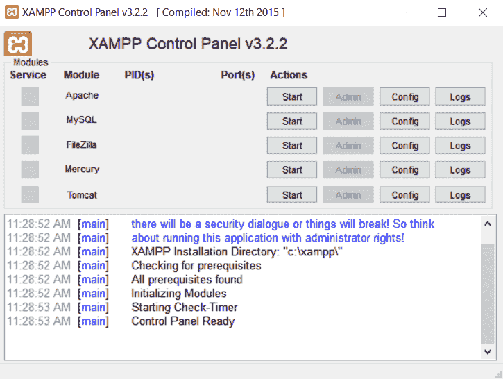

5.  我们需要 Apache 网络服务器和 MySQL 数据库服务器。单击控制面板上 Apache 和 MySQL 选项旁边的开始按钮。

6.  服务器启动后，打开您的网络浏览器，访问[http://localhost/phpmyadmin/](http://localhost/phpmyadmin/)。您将看到一个名为 phpMyAdmin 的 web 界面，如下所示:


phpMyAdmin 是一个基于网络的实用程序，可以帮助您管理 MySQL 数据库，很像 MySQL Workbench。在我看来，phpMyAdmin 要简单得多，更适合初学者，这就是为什么我建议用它来代替 MySQL Workbench。默认情况下，phpMyAdmin 使用默认用户帐户根自动登录 MySQL，该帐户根保存在其配置文件中。出于安全考虑，我们不想用它。所以，让我们为自己创建一个帐户。

7.  转到位于顶部的“用户”选项卡，进入该页面后，单击位于底部的“添加用户帐户”。在“登录信息”窗格的字段中键入所需的用户名和密码。现在选择“本地”作为主机名选项。在底部，您将看到与全局权限相关的选项，选中全部检查选项，然后单击开始:


8.  转到 XAMPP 控制面板，并为 Apache 和 MySQL 单击停止。点击 Apache 列的 Config 按钮，选择 phpMyAdmin ( `config.inc.php`)选项；将使用您选择的文本编辑器打开`config.inc.php`文件。
9.  在`config.inc.php`中搜索下一行，将`config`改为`cookie`:

```cpp
$cfg['Servers'][$i]['auth_type'] = 'config';
$cfg['Servers'][$i]['auth_type'] = 'cookie';
```

10.  单击开始按钮，再次启动 Apache 和 MySQL。这样，我们强制 phpMyAdmin 重新加载其配置并应用更改。从您的网络浏览器再次转到 phpMyAdmin，这一次，应该会出现一个登录屏幕:

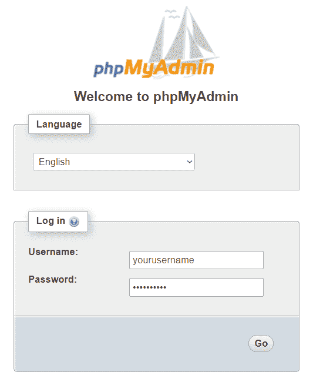

11.  登录 phpMyAdmin，然后点击侧边栏上的新建链接:


12.  键入所需的数据库名称，然后按“创建”按钮。创建后，数据库名称将出现在侧栏上。单击数据库名称，它将带您进入另一个页面，显示一条消息:在数据库中找不到表。在该消息下，您可以通过填写所需的表名和表的列数来创建第一个数据表:


13.  单击开始按钮，您将进入另一个页面，在那里您将设置要创建的新表格。在本例中，我们创建了一个由五列数据组成的`employee`表:id、姓名、年龄、性别和已婚:


14.  点击保存，现在你可以看到`employee`表格名称出现在侧栏上。我们已经成功安装了 MySQL，并建立了我们的第一个数据库和数据表。

15.  我们需要从 phpMyAdmin 向数据库中插入数据，以便我们能够在下一个示例中检索它。当您还在`employee`表格中时，点击插入标签。然后，您将进入另一页，将新数据插入`employee`表:


16.  让我们为我们的 Qt 项目设置 SQL 驱动。去你的 Qt 安装文件夹找`sqldrivers`文件夹就行了。比如我的位于`C:\Qt\5.5\mingw492_32\plugins\sqldrivers`。
17.  将整个`sqldrivers`文件夹复制到项目的构建目录中。您可以删除与正在运行的 SQL Server 无关的动态链接库文件。在我们的例子中，因为我们使用的是 MySQL 服务器，所以我们可以删除除`qsqlmysql.dll`和`qsqlmysqld.dll`之外的所有内容。结尾带有字母 d 的 DLL 文件仅用于调试版本，而另一个用于发布版本。将这些 DLL 文件放在它们各自的构建目录中，例如，用于调试构建的`builds/debug/sqldrivers/qsqlmysqld.dll`和用于发布构建的`builds/release/sqldrivers/qsqlmysql.dll`。
18.  上一步提到的 DLL 文件是使 Qt 能够与不同类型的 SQL 架构进行通信的驱动。您可能还需要 SQL 客户端库的 DLL 文件，以便驱动工作。在我们的例子中，我们需要`libmysql.dll`位于与我们的程序可执行文件相同的目录中。可以从 MySQL 的安装目录中获取，也可以从官网:[https://dev.mysql.com/downloads/connector/cpp/](https://dev.mysql.com/downloads/connector/cpp/)下载`Connector/C++ `包。

# 它是如何工作的…

Qt 为我们提供了 SQL 驱动，这样我们就可以轻松地连接到不同类型的 SQL Servers，而无需自己实现它们。

目前，Qt 正式支持 SQLite、MySQL、ODBC 和 PostgreSQL。作为支持的架构之一的分叉的 SQL 架构，例如 Mariadb(MySQL 的一个分叉)，可能仍然可以与 Qt 兼容，没有太多麻烦。如果您正在使用 Qt 不支持的架构，您仍然可以通过使用`QNetworkAccessManager`向后端脚本(如 PHP、ASP 和 JSP)发送 HTTP 请求来间接与您的 SQL 数据库交互，然后后端脚本可以与数据库通信。

如果你只需要一个简单的基于文件的数据库，不打算使用基于服务器的数据库，那么 SQLite 是一个不错的选择。

在*连接数据库*食谱中，我们将学习如何使用 Qt 的 SQL 模块连接到我们的 SQL 数据库。

# 连接到数据库

在本食谱中，我们将学习如何将我们的 Qt 5 应用连接到 SQL Server。

# 怎么做…

在 Qt 中连接到 SQL Server 非常简单:

1.  打开 Qt 创建器，创建一个新的 Qt 小部件应用项目。
2.  打开您的项目文件(`.pro`)并将`sql`模块添加到您的项目中，如下所示:

```cpp
QT += core gui sql
```

3.  打开`mainwindow.ui`并将七个标签小部件、一个组合框和一个复选框拖到画布上。将四个标签的文本属性设置为`Name:`、`Age:`、`Gender:`和`Married:`。然后，将其余部分的 objectName 属性设置为`name`、`age`、`gender`和`married`。没有必要为前面四个标签设置对象名称，因为它们仅用于显示目的:


4.  打开`mainwindow.h`并在`QMainWindow`标题下添加以下标题:

```cpp
#include <QMainWindow>
#include <QtSql>
#include <QSqlDatabase>
#include <QSqlQuery>
#include <QDebug>
```

5.  打开`mainwindow.cpp`，将以下代码插入类构造函数:

```cpp
MainWindow::MainWindow(QWidget *parent) :
QMainWindow(parent), ui(new Ui::MainWindow) {
    ui->setupUi(this);
    QSqlDatabase db = QSqlDatabase::addDatabase("QMYSQL");
    db.setHostName("127.0.0.1");
    db.setUserName("yourusername");
    db.setPassword("yourpassword");
    db.setDatabaseName("databasename");
```

6.  数据库连接打开后，启动 SQL 查询:

```cpp
    if (db.open()) {
        QSqlQuery query;
        if (query.exec("SELECT name, age, gender, married FROM employee")) {
            while (query.next()) {
                qDebug() << query.value(0) << query.value(1) << query.value(2) << query.value(3);
                ui->name->setText(query.value(0).toString());
                ui->age->setText(query.value(1).toString());
                ui->gender->setCurrentIndex(query.value(2).toInt());
                ui->married->setChecked(query.value(3).toBool());
            }
        }
```

7.  打印出任何错误文本:

```cpp
else {
            qDebug() << query.lastError().text();
        }
        db.close();
    }
    else {
        qDebug() << "Failed to connect to database.";
    }
}
```

8.  现在编译并运行您的项目，您应该会得到如下结果:


# 它是如何工作的…

前面的例子向您展示了如何使用从 SQL 模块派生的`QSqlDatabase`类连接到您的 SQL 数据库。如果不将模块添加到您的 Qt 项目中，您将无法访问任何与 SQL 相关的类。

我们必须通过在调用`addDatabase()`函数时提到它来告诉 Qt 我们正在运行哪个 SQL 架构。Qt 支持的选项有`QSQLITE`、`QMYSQL`、`QMYSQL3`、`QODBC`、`QODBC3`、`QPSQL`和`QPSQL7`。如果您遇到一条错误消息，上面写着 QSqlDatabase: QMYSQL 驱动未加载，您应该检查 DLL 文件是否放置在正确的目录中。

我们可以通过`QSqlQuery`类将我们的 SQL 语句发送到数据库，等待它返回结果，这些结果通常要么是您请求的数据，要么是由于语句无效而产生的错误消息。如果有来自数据库服务器的数据，将全部存储在`QSqlQuery`类中。您只需要在`QSqlQuery`类上做一个 while 循环来检查所有现有的记录，并通过调用`value()`函数来检索它们。

# 编写基本的 SQL 查询

在前面的例子中，我们编写了第一个 SQL 查询，它涉及`SELECT`语句。这次，我们将学习如何使用其他一些 SQL 语句，如`INSERT`、`UPDATE`、`DELETE`。

# 怎么做…

让我们创建一个简单的程序，按照以下步骤演示基本的 SQL 查询命令:

1.  我们可以使用以前的项目文件，但是有几件事我们需要改变。打开`mainwindow.ui`并用线编辑小部件替换姓名和年龄的标签。然后，在画布上添加三个按钮，分别称为`UPDATE`、`INSERT`和`DELETE`:

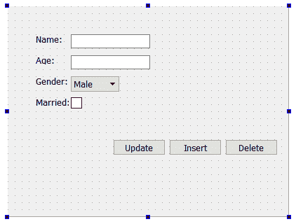

2.  打开`mainwindow.h`，在`private`继承下增加以下变量:

```cpp
private:
    Ui::MainWindow *ui;
    QSqlDatabase db;
    bool connected;
    int currentID;
```

3.  打开`mainwindow.cpp`转到类构造器。它仍然与前面的示例基本相同，只是我们将数据库连接状态存储在名为`connected`的`Boolean`变量中，并且我们还从数据库中获取数据的 ID 并将其存储到名为`currentID`的整数变量中:

```cpp
MainWindow::MainWindow(QWidget *parent) :
QMainWindow(parent), ui(new Ui::MainWindow) {
    ui->setupUi(this);
    db = QSqlDatabase::addDatabase("QMYSQL");
    db.setHostName("127.0.0.1");
    db.setUserName("yourusername");
    db.setPassword("yourpassword");
    db.setDatabaseName("databasename");
    connected = db.open();
```

4.  连接到数据库后，让我们进行查询:

```cpp
if (connected) {
        QSqlQuery query;
        if (query.exec("SELECT id, name, age, gender, married FROM employee")) {
            while (query.next()) {
                currentID = query.value(0).toInt();
                ui->name->setText(query.value(1).toString());
                ui->age->setText(query.value(2).toString());
                ui->gender->setCurrentIndex(query.value(3).toInt());
                ui->married->setChecked(query.value(4).toBool());
            }
        }
```

5.  打印出任何错误信息:

```cpp
   else {
            qDebug() << query.lastError().text();
        }
    }
    else {
        qDebug() << "Failed to connect to database.";
    }
}
```

6.  转到`mainwindow.ui`，右键单击我们在*步骤 1* 中添加到画布上的一个按钮。选择转到插槽…并单击确定。在另一个按钮上重复这些步骤，现在您应该会看到三个插槽功能被添加到您的`mainwindow.h`和`mainwindow.cpp`中:

```cpp
private slots:
    void on_updateButton_clicked();
    void on_insertButton_clicked();
    void on_deleteButton_clicked();
```

7.  打开`mainwindow.cpp`点击更新按钮，我们会声明程序会做什么:

```cpp
void MainWindow::on_updateButton_clicked() {
    if (connected) {
        if (currentID == 0) {
            qDebug() << "Nothing to update.";
        }
        else {
            QString id = QString::number(currentID);
            QString name = ui->name->text();
            QString age = ui->age->text();
            QString gender = QString::number(ui->gender->currentIndex());
            QString married = QString::number(ui->married->isChecked());
```

8.  进行更新查询，如下所示:

```cpp

            qDebug() << "UPDATE employee SET name = '" + name + "', age = '" + age + "', gender = " + gender + ", married = " + married + " WHERE id = " + id;
            QSqlQuery query;
            if (query.exec("UPDATE employee SET name = '" + name + "', age = '" + age + "', gender = " + gender + ", married = " + married + " WHERE id = " + id)) {
                qDebug() << "Update success.";
            }
```

9.  打印出最后一条错误消息(如果有):

```cpp
   else {
                qDebug() << query.lastError().text();
            }
        }
    } else {
        qDebug() << "Failed to connect to database.";
    }
}
```

10.  声明点击`INSERT`按钮会发生什么:

```cpp
void MainWindow::on_insertButton_clicked() {
    if (connected) {
        QString name = ui->name->text();
        QString age = ui->age->text();
        QString gender = QString::number(ui->gender->currentIndex());
        QString married = QString::number(ui->married->isChecked());
        qDebug() << "INSERT INTO employee (name, age, gender, married) VALUES ('" + name + "','" + age + "', " + gender + "," + married + ")";
```

11.  进行`INSERT`查询，如是:

```cpp
        QSqlQuery query;
        if (query.exec("INSERT INTO employee (name, age, gender, married) VALUES ('" + name + "','" + age + "', " + gender + "," + married + ")")) {
            currentID = query.lastInsertId().toInt();
            qDebug() << "Insert success.";
        } else {
            qDebug() << query.lastError().text();
        }
    } else {
        qDebug() << "Failed to connect to database.";
    }
}
```

12.  声明点击`Delete`按钮会发生什么:

```cpp
void MainWindow::on_deleteButton_clicked() {
    if (connected) {
        if (currentID == 0) {
            qDebug() << "Nothing to delete.";
        } else {
            QString id = QString::number(currentID);
            qDebug() << "DELETE FROM employee WHERE id = " + id;
            QSqlQuery query;
            if (query.exec("DELETE FROM employee WHERE id = " + id)) {
                currentID = 0;
                qDebug() << "Delete success.";
            } else {
                qDebug() << query.lastError().text();
            }
        }
    } else {
        qDebug() << "Failed to connect to database.";
    }
}
```

13.  在类析构函数处调用`QSqlDatabase::close()`在退出程序前正确终止 SQL 连接:

```cpp
MainWindow::~MainWindow() {
    db.close();
    delete ui;
}
```

14.  现在编译并运行程序，您应该能够从数据库中选择默认数据。然后，您可以选择更新它或从数据库中删除它。也可以通过点击`Insert`按钮将新数据插入数据库。您可以使用 phpMyAdmin 检查数据是否被正确修改:

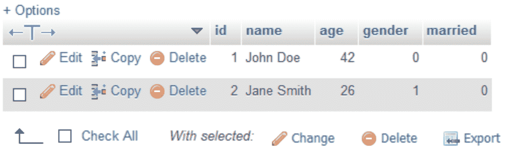

# 它是如何工作的…

在我们继续向数据库发送 SQL 查询之前，检查数据库是否连接是非常重要的。因此，我们将该状态保存在一个变量中，并使用它在发送任何查询之前进行检查。但是，对于长时间保持打开的复杂程序，不建议这样做，因为在此期间数据库可能会断开连接，固定变量可能不准确。既然如此，不如通过调用`QSqlDatabase::isOpen()`来查看实际状态。

`currentID`变量用于保存你从数据库中获取的当前数据的 ID。当您想要更新数据或从数据库中删除数据时，这个变量对于让数据库知道您试图更新或删除哪些数据至关重要。如果您正确设置了数据库表，MySQL 会将每一项数据视为一个唯一的条目，因此您可以确保在保存新数据时数据库中不会产生重复的标识。

在数据库中插入新数据后，我们调用`QSqlQuery::lastInsertId()`获取新数据的 ID，并将其保存为`currentID`变量，使其成为我们可以从数据库中更新或删除的当前数据。在 Qt 中使用之前，在 phpMyAdmin 上测试您的 SQL 查询是一个好习惯。您可以立即发现您的 SQL 语句是正确的还是不正确的，而不是等待您的项目被构建，尝试它，然后重建它。作为程序员，我们必须以最有效的方式工作。努力工作，聪明工作。

# 用 Qt 创建登录屏幕

在这个食谱中，我们将学习如何使用我们的知识，并使用 Qt 和 MySQL 创建一个功能登录屏幕。

# 怎么做…

按照以下步骤创建您的第一个功能登录屏幕:

1.  打开一个网页浏览器，转到 phpMyAdmin。我们将创建一个名为`user`的新数据表，如下所示:

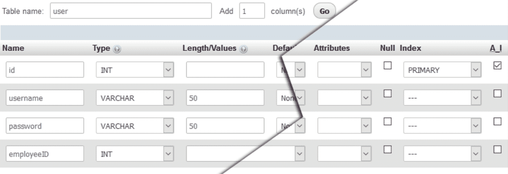

2.  让我们将第一项数据插入到新创建的表中，并将`employeeID`设置为现有员工的 ID。这样，我们创建的用户帐户将链接到其中一名员工的数据:


3.  打开 Qt 创建器，创建一个新的 Qt 小部件应用项目。我们将从`mainwindow.ui`开始。在画布上放置一个堆叠的小部件，并确保它包含两页。然后，在堆叠小部件中设置两个页面，如下所示:


4.  在堆叠小部件的第一页上，单击小部件顶部的编辑选项卡顺序图标，以便您可以调整程序中小部件的顺序:


5.  单击“编辑标签顺序”图标后，您会看到一些数字出现在画布中每个小部件的顶部。确保这些数字看起来和下面截图中的一样。否则，点击数字改变它们的顺序。我们只对堆叠小部件的第一页这样做；保持第二页原样是可以的:


6.  右键单击登录按钮并选择转到插槽。然后，确保选中了单击的()选项，并按“确定”。然后 Qt 会在你的项目源文件中为你创建一个槽函数。对“注销”按钮也重复此步骤。
7.  打开`mainwindow.h`并在`#include <QMainWindow>`行后添加以下标题:

```cpp
#include <QMainWindow>
#include <QtSql>
#include <QSqlDatabase>
#include <QSqlQuery>
#include <QMessageBox>
#include <QDebug>
```

8.  将以下变量添加到`mainwindow.h`:

```cpp
private:
    Ui::MainWindow *ui;
    QSqlDatabase db;
```

9.  打开`mainwindow.cpp`，将该代码放入类构造函数中:

```cpp
MainWindow::MainWindow(QWidget *parent) :
QMainWindow(parent),
ui(new Ui::MainWindow) {
    ui->setupUi(this);
    ui->stackedWidget->setCurrentIndex(0);
    db = QSqlDatabase::addDatabase("QMYSQL");
    db.setHostName("127.0.0.1");
    db.setUserName("yourusername");
    db.setPassword("yourpassword");
    db.setDatabaseName("databasename");
    if (!db.open()) {
        qDebug() << "Failed to connect to database.";
    }
}
```

10.  定义如果单击登录按钮会发生什么:

```cpp
void MainWindow::on_loginButton_clicked() {
    QString username = ui->username->text();
    QString password = ui->password->text();
    QSqlQuery query;
    if (query.exec("SELECT employeeID from user WHERE username = '" + username + "' AND password = '" + password + "'")) {
        if (query.size() > 0) {
            while (query.next()) {
                QString employeeID = query.value(0).toString();
                QSqlQuery query2;
```

11.  进行一个 SQL 查询:

```cpp
                if (query2.exec("SELECT name, age, gender, married FROM employee WHERE id = " + employeeID)) {
                    while (query2.next()) {
                        QString name = query2.value(0).toString();
                        QString age = query2.value(1).toString();
                        int gender = query2.value(2).toInt();
                        bool married = query2.value(3).toBool();
                        ui->name->setText(name);
                        ui->age->setText(age);
```

12.  我们继续前面的代码，在将堆叠的小部件切换到第二页之前，我们设置了`gender`和`married`文本:

```cpp
                        if (gender == 0)
                            ui->gender->setText("Male");
                        else
                            ui->gender->setText("Female");
                        if (married)
                            ui->married->setText("Yes");
                        else
                            ui->married->setText("No");
                        ui->stackedWidget->setCurrentIndex(1);
                    }
                }
            }
        }
```

13.  如果登录失败，打印错误消息:

```cpp
        else {
            QMessageBox::warning(this, "Login failed", "Invalid username or password.");
        }
    } else {
        qDebug() << query.lastError().text();
    }
}
```

14.  定义如果单击“注销”按钮会发生什么:

```cpp
void MainWindow::on_logoutButton_clicked() {
    ui->stackedWidget->setCurrentIndex(0);
}
```

15.  主窗口关闭时关闭数据库:

```cpp
MainWindow::~MainWindow() {
    db.close();
    delete ui;
}
```

16.  编译并运行该程序，您应该能够使用虚拟帐户登录。登录后，您应该能够看到链接到用户帐户的虚拟员工信息。您也可以通过单击“注销”按钮来注销:

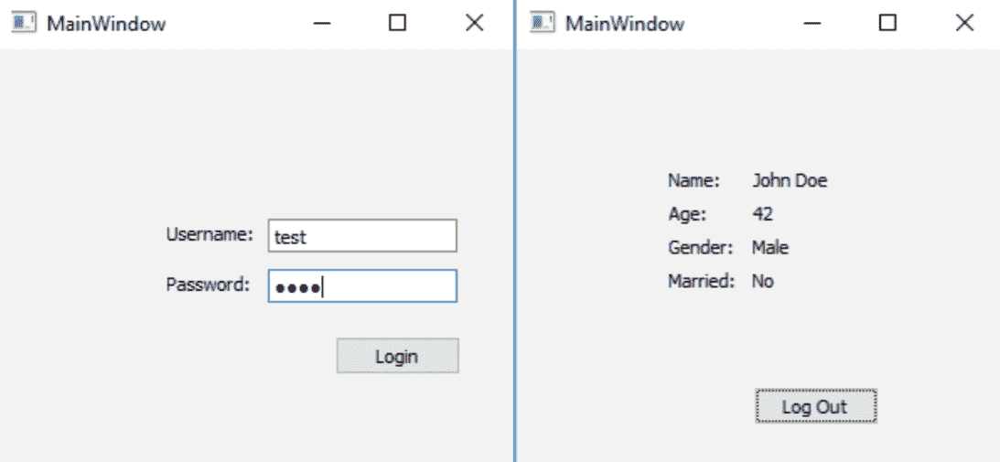

# 它是如何工作的…

在本例中，我们从`user`表中选择与我们插入文本字段的用户名和密码相匹配的数据。如果没有发现任何东西，这意味着我们提供了无效的用户名或密码。否则，从用户帐户中获取`employeeID`数据，并执行另一个 SQL 查询，从与`employeeID`变量匹配的`employee`表中查找信息。然后，根据程序的 UI 显示数据。

我们必须在编辑选项卡顺序模式中设置小部件顺序，这样当程序启动时，第一个关注的小部件是用户名行编辑小部件。如果用户按下键盘上的 *Tab* 键，焦点应该切换到第二个小部件，即密码行编辑。不正确的小部件订单会破坏用户体验并赶走任何潜在用户。确保密码行编辑的回声模式选项设置为`Password`。出于安全目的，该设置将隐藏插入行编辑中的实际密码，并用点符号替换它。

# 在模型视图上显示数据库中的信息

在本食谱中，我们将学习如何在程序的模型视图上显示从我们的 SQL 数据库获得的多组数据。

# 怎么做…

按照以下步骤在模型视图小部件上显示数据库中的信息:

1.  我们将使用名为`employee`的数据库表，我们在前面的示例中使用了该表，*使用 Qt* 创建登录屏幕。这一次，我们需要`employee`表中更多的数据。打开你的网络浏览器，登录你的 phpMyAdmin 控制面板。

为更多的员工添加数据，以便我们可以在以后的程序中显示这些数据:


2.  打开 Qt 创建器，创建一个新的 Qt 小部件应用项目，然后将 SQL 模块添加到您的项目中。
3.  打开`mainwindow.ui`并在小部件框窗格下从项目小部件(基于项目)添加一个表格小部件(不是表格视图)。选择画布上的主窗口，然后单击“垂直布局”或“水平布局”按钮，使表格小部件保持主窗口的大小，即使在调整其大小时也是如此:

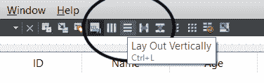

4.  双击表格部件，然后会出现一个窗口。在“列”选项卡下，通过单击左上角的+按钮添加五个项目。说出项目`ID`、`Name`、`Age`、`Gender`和`Married`的名称。完成后，单击确定:

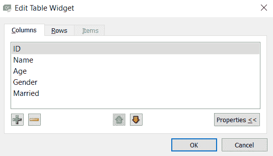

5.  右键单击表格小部件，并在弹出菜单中选择转到插槽。一直向下滚动，在弹出窗口中选择项目已更改(QTableWidgetItem*)选项，然后按确定。将在两个源文件中创建一个槽函数。
6.  打开`mainwindow.h`并将这些私有变量添加到`MainWindow`类中:

```cpp
private:
    Ui::MainWindow *ui;
    bool hasInit;
    QSqlDatabase db;
```

7.  将以下类标题添加到`mainwindow.h`:

```cpp
#include <QtSql>
#include <QSqlDatabase>
#include <QSqlQuery>
#include <QMessageBox>
#include <QDebug>
#include <QTableWidgetItem>
```

8.  打开`mainwindow.cpp`–我们将在那里编写大量代码。我们需要声明当程序启动时会发生什么。将以下代码添加到`MainWindow`类的构造函数中:

```cpp
MainWindow::MainWindow(QWidget *parent) :
QMainWindow(parent),
ui(new Ui::MainWindow) {
    hasInit = false;
    ui->setupUi(this);
    db = QSqlDatabase::addDatabase("QMYSQL");
    db.setHostName("127.0.0.1");
    db.setUserName("yourusername");
    db.setPassword("yourpassword");
    db.setDatabaseName("databasename");
    ui->tableWidget->setColumnHidden(0, true);
```

9.  SQL 查询代码如下所示:

```cpp
    if (db.open()) {
        QSqlQuery query;
        if (query.exec("SELECT id, name, age, gender, married FROM employee")) {
            while (query.next()) {
                qDebug() << query.value(0) << query.value(1) << query.value(2) << query.value(3) << query.value(4);
                QString id = query.value(0).toString();
                QString name = query.value(1).toString();
                QString age = query.value(2).toString();
                int gender = query.value(3).toInt();
                bool married = query.value(4).toBool();
```

10.  创建几个`QTableWidgetItem`对象:

```cpp
                ui->tableWidget->setRowCount(ui->tableWidget->rowCount() + 1);
                QTableWidgetItem* idItem = new QTableWidgetItem(id);
                QTableWidgetItem* nameItem = new QTableWidgetItem(name);
                QTableWidgetItem* ageItem = new QTableWidgetItem(age);
                QTableWidgetItem* genderItem = new QTableWidgetItem();
                if (gender == 0)
                    genderItem->setData(0, "Male");
                else
                    genderItem->setData(0, "Female");
                QTableWidgetItem* marriedItem = new QTableWidgetItem();
                if (married)
                    marriedItem->setData(0, "Yes");
                else
                    marriedItem->setData(0, "No");
```

11.  将这些对象移动到表格小部件:

```cpp
                ui->tableWidget->setItem(ui->tableWidget->rowCount() - 1, 0, idItem);
                ui->tableWidget->setItem(ui->tableWidget->rowCount() - 1, 1, nameItem);
                ui->tableWidget->setItem(ui->tableWidget->rowCount() - 1, 2, ageItem);
                ui->tableWidget->setItem(ui->tableWidget->rowCount() - 1, 3, genderItem);
                ui->tableWidget->setItem(ui->tableWidget->rowCount() - 1, 4, marriedItem);
            }
            hasInit = true;
        } else {
            qDebug() << query.lastError().text();
        }
    } else {
        qDebug() << "Failed to connect to database.";
    }
}
```

12.  声明表格小部件的一个项目被编辑后会发生什么。将以下代码添加到`on_tableWidget_itemChanged()`槽功能中:

```cpp
void MainWindow::on_tableWidget_itemChanged(QTableWidgetItem *item) {
    if (hasInit) {
        QString id = ui->tableWidget->item(item->row(), 0)->data(0).toString();
        QString name = ui->tableWidget->item(item->row(), 1)->data(0).toString();
        QString age = QString::number(ui->tableWidget->item(item->row(), 2)->data(0).toInt());
        ui->tableWidget->item(item->row(), 2)->setData(0, age);
        QString gender;
        if (ui->tableWidget->item(item->row(), 3)->data(0).toString() == "Male") {
            gender = "0";
        } else {
            ui->tableWidget->item(item->row(), 3)->setData(0, "Female");
            gender = "1";
        }
        QString married;
        if (ui->tableWidget->item(item->row(), 4)->data(0).toString() == "No") {
            married = "0";
        } else {
            ui->tableWidget->item(item->row(), 4)->setData(0, "Yes");
            married = "1";
        }
        qDebug() << id << name << age << gender << married;
        QSqlQuery query;
        if (query.exec("UPDATE employee SET name = '" + name + "', age = '" + age + "', gender = '" + gender + "', married = '" + married + "' WHERE id = " + id)) {
            QMessageBox::information(this, "Update Success", "Data updated to database.");
        } else {
            qDebug() << query.lastError().text();
        }
     }
}
```

13.  在类析构函数处关闭数据库:

```cpp
MainWindow::~MainWindow() {
    db.close();
    delete ui;
}
```

14.  现在编译并运行该示例，您应该会得到如下内容:

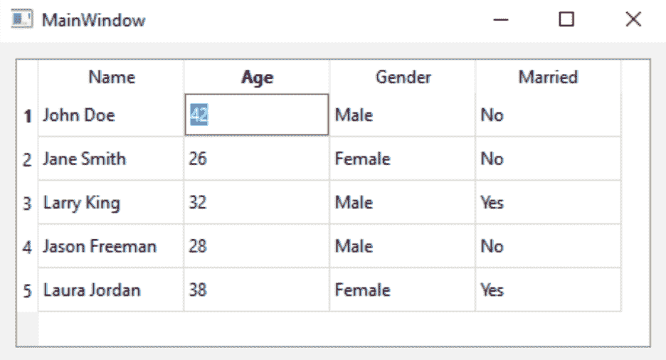

# 它是如何工作的…

表格小部件与您在电子表格应用(如微软 Excel 和 OpenOffice Calc)中看到的类似。与其他类型的模型查看器(如列表视图或树视图)相比，表视图(或表小部件)是一个二维模型查看器，它以行和列的形式显示数据。

Qt 中表视图和表小部件的主要区别在于表小部件构建在表视图类之上，这意味着表小部件更容易使用，更适合初学者。但是，表小部件的灵活性较低，并且比表视图的可伸缩性差，如果您想要自定义表，这不是最佳选择。

从 MySQL 中检索数据后，我们为每个数据项创建了一个`QTableWidgetItem`项，并设置应该将哪一列和哪一行添加到表小部件中。在向表格小部件添加项目之前，我们必须通过调用`QTableWidget::setRowCount()`来增加表格的行数。我们也可以通过简单地调用`QTableWidget::rowCount()`来获得表格小部件的当前行数。

左边的第一列在视图中是隐藏的，因为我们只使用它来保存数据的标识，以便当其行中的一个数据项发生变化时，我们可以使用它来更新数据库。当其中一个单元格中的数据发生变化时，将调用`on_tableWidget_itemChanged()`槽函数。它不仅会在您编辑单元格中的数据时被调用，还会在数据从数据库中检索后首次添加到表中时被调用。为了确保该函数仅在我们编辑数据时触发，我们使用了一个名为`hasInit`的布尔变量来检查我们是否完成了初始化过程(向表中添加第一批数据)。如果`hasInit`为假，忽略函数调用。

为了防止用户输入完全不相关的数据类型，例如在只包含数字的数据单元格中插入字母，我们会手动检查数据是否与我们在编辑时预期的接近。如果它不接近任何被认为有效的值，将其恢复为默认值。当然，这是一个简单的黑客攻击，它可以完成任务，但不是最专业的方法。或者，您可以尝试创建一个继承`QItemDelegate`类的新类，并定义模型视图的行为方式。然后，调用`QTableWidget::setItemDelegate()`将该类应用于您的表小部件。

# 高级 SQL 查询

按照这个食谱，你将学会如何使用高级的 SQL 语句，如`INNER JOIN`、`COUNT`、`LIKE`和`DISTINCT`。

# 怎么做…

除了在 SQL 数据库上执行简单的查询，您还可以做很多事情。让我们按照以下步骤学习如何:

1.  我们需要在数据库中添加一些表，然后才能进入编程部分。打开你的网络浏览器，访问 phpMyAdmin。我们需要几个表来运行这个例子:

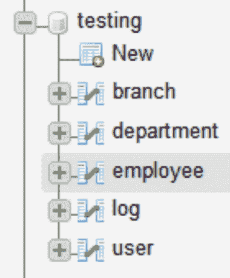

2.  我将向您展示这个项目所需的每个表的结构，以及插入表中进行测试的虚拟数据。第一个表叫做`branch`，用来存储虚拟公司不同分支机构的 id 和名称:

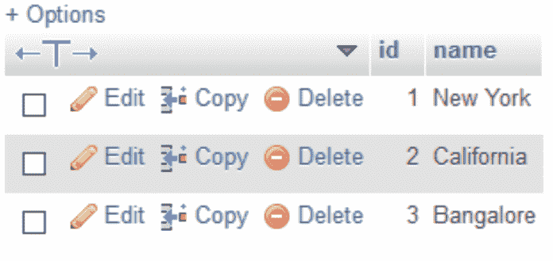

3.  其次，我们有`department`表，它存储了虚拟公司不同部门的 id 和名称，也通过分支 id 链接到`branch`数据:


4.  我们还有一个`employee`表，它存储了虚拟公司中所有员工的信息。该表类似于我们在前面示例中使用的表，除了它有两个额外的列，`birthday`和`departmentID`:

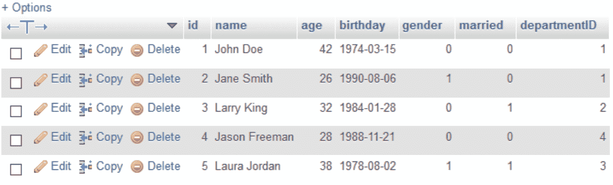

5.  我们还有一个名为`log`的表，其中包含每个员工登录时间的伪记录。`loginTime`列可以是`timestamp`或`date-time`变量类型:

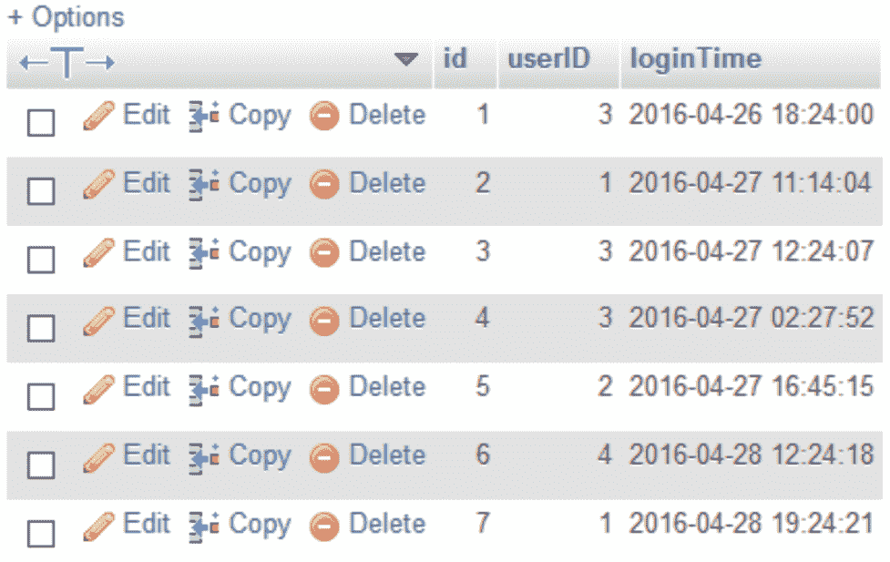

6.  我们有`user`表，我们也在前面的例子中使用过:

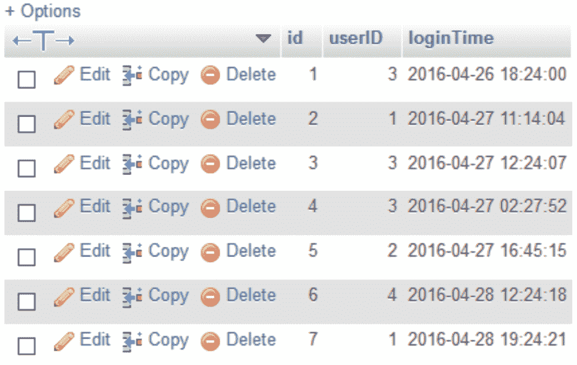

7.  打开 Qt 创建器。这一次，我们没有选择 Qt 小部件应用，而是创建了一个 Qt 控制台应用:

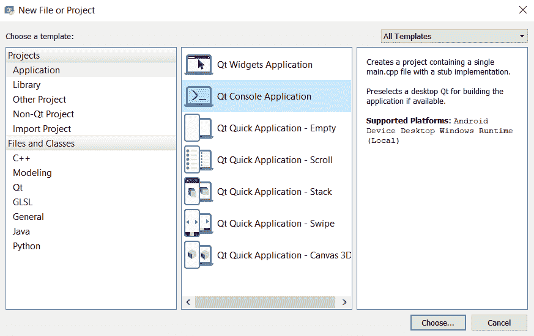

8.  打开您的项目文件(`.pro`)并将`sql`模块添加到您的项目中:

```cpp
QT += core sql
QT -= gui
```

9.  打开`main.cpp`，在源文件顶部添加以下头文件:

```cpp
#include <QSqlDatabase>
#include <QSqlQuery>
#include <QSqlError>
#include <QDate>
#include <QDebug>
```

10.  添加以下功能以显示 30 岁以上的员工:

```cpp
void filterAge() {
    qDebug() << "== Employees above 30 year old =============";
    QSqlQuery query;
    if (query.exec("SELECT name, age FROM employee WHERE age > 30")) {
        while (query.next()) {
            qDebug() << query.value(0).toString() << query.value(1).toString();
        }
    } else {
        qDebug() << query.lastError().text();
    }
    qDebug() << "\n";
}
```

11.  添加以下功能来显示每个员工的部门和分支机构信息:

```cpp
void getDepartmentAndBranch() {
    qDebug() << "== Get employees' department and branch =============";
    QSqlQuery query;
    if (query.exec("SELECT myEmployee.name, department.name, branch.name FROM (SELECT name, departmentID FROM employee) AS myEmployee INNER JOIN department ON department.id = myEmployee.departmentID INNER JOIN branch ON branch.id = department.branchID")) {
        while (query.next()) {
            qDebug() << query.value(0).toString() << query.value(1).toString() << query.value(2).toString();
        }
    } else {
        qDebug() << query.lastError().text();
    }
    qDebug() << "\n";
}
```

12.  添加以下功能，显示在纽约分公司工作且年龄在 30 岁以下的员工:

```cpp
void filterBranchAndAge() {
    qDebug() << "== Employees from New York and age below 30 =============";
    QSqlQuery query;
    if (query.exec("SELECT myEmployee.name, myEmployee.age, department.name, branch.name FROM (SELECT name, age, departmentID FROM employee) AS myEmployee INNER JOIN department ON department.id = myEmployee.departmentID INNER JOIN branch ON branch.id = department.branchID WHERE branch.name = 'New York' AND age < 30")) {
        while (query.next()) {
            qDebug() << query.value(0).toString() << query.value(1).toString() << query.value(2).toString() << query.value(3).toString();
        }
    } else {
        qDebug() << query.lastError().text();
    }
    qDebug() << "\n";
}
```

13.  添加以下函数，计算虚拟公司中女性员工的总数:

```cpp
void countFemale() {
    qDebug() << "== Count female employees =============";
    QSqlQuery query;
    if (query.exec("SELECT COUNT(gender) FROM employee WHERE gender = 1")) {
        while (query.next()) {
            qDebug() << query.value(0).toString();
        }
    } else {
        qDebug() << query.lastError().text();
    }
    qDebug() << "\n";
}
```

14.  增加以下功能，过滤员工列表，只显示姓名以`Ja`开头的人员:

```cpp
void filterName() {
    qDebug() << "== Employees name start with 'Ja' =============";
    QSqlQuery query;
    if (query.exec("SELECT name FROM employee WHERE name LIKE '%Ja%'")) {
        while (query.next()) {
            qDebug() << query.value(0).toString();
        }
    } else {
        qDebug() << query.lastError().text();
    }
    qDebug() << "\n";
}
```

15.  增加以下功能，显示`August`生日的员工:

```cpp
void filterBirthday() {
    qDebug() << "== Employees birthday in August =============";
    QSqlQuery query;
    if (query.exec("SELECT name, birthday FROM employee WHERE MONTH(birthday) = 8")) {
        while (query.next()) {
            qDebug() << query.value(0).toString() << query.value(1).toDate().toString("d-MMMM-yyyy");
        }
    } else {
        qDebug() << query.lastError().text();
    }
    qDebug() << "\n";
}
```

16.  增加以下功能，检查谁在`27 April 2019`登录了虚拟系统，并在终端显示其姓名:

```cpp
void checkLog() {
    qDebug() << "== Employees who logged in on 27 April 2019 =============";
    QSqlQuery query;
    if (query.exec("SELECT DISTINCT myEmployee.name, FROM (SELECT id, name FROM employee) AS myEmployee INNER JOIN user ON user.employeeID = myEmployee.id INNER JOIN log ON log.userID = user.id WHERE DATE(log.loginTime) = '2019-04-27'")) {
        while (query.next()) {
            qDebug() << query.value(0).toString();
        }
    } else {
        qDebug() << query.lastError().text();
    }
    qDebug() << "\n";
}
```

17.  在`main()`函数中，将程序连接到 MySQL 数据库，并调用我们在前面步骤中定义的所有函数。关闭数据库连接，我们就完成了:

```cpp
int main(int argc, char *argv[]) {
    QCoreApplication a(argc, argv);
    QSqlDatabase db = QSqlDatabase::addDatabase("QMYSQL");
    db.setHostName("127.0.0.1");
    db.setUserName("reonyx");
    db.setPassword("reonyx");
    db.setDatabaseName("testing");
    if (db.open()) {
        filterAge();
        getDepartmentAndBranch();
        filterBranchAndAge();
        countFemale();
        filterName();
        filterBirthday();
        checkLog();
        db.close();
    } else {
        qDebug() << "Failed to connect to database.";
    }
    return a.exec();
}
```

18.  编译并运行项目，您应该会看到一个显示筛选结果的终端窗口:


# 它是如何工作的…

控制台应用没有图形用户界面，只在终端窗口中显示文本。这通常用于后端系统，因为与小部件应用相比，它使用更少的资源。我们在这个例子中使用了它，因为它显示结果更快，不需要在程序中放置任何小部件，在这种情况下我们不需要。

我们将 SQL 查询分成不同的函数，这样更容易维护代码，也不会变得太乱。请注意，在 C++ 中，函数必须位于`main()`函数之前，否则它们将无法被`main()`调用。

# 还有更多…

上例中使用的`INNER JOIN`语句将两个表连接在一起，并从两个表中选择所有行，只要两个表中的列之间匹配。在 MySQL(以及一些其他类型的 SQL 架构)中，还有很多其他类型的`JOIN`语句可以使用，比如`LEFT JOIN`、`RIGHT JOIN`和`FULL OUTER JOIN`。

下图显示了不同类型的`**JOIN**`语句及其效果:


以下要点解释了`LIKE`和`DISTINCT`语句，我们在本食谱的示例代码中使用了这些语句:

*   `LIKE`语句通常用于在数据库中搜索没有完整单词的字符串变量。请注意，有两个`%`符号，位于`search`关键字的前后。
*   上例中使用的`DISTINCT`语句过滤掉具有完全相同变量的结果。比如没有`DISTINCT`语句，你会看到终端出现两个版本的拉里·金，因为有他在同一天登录系统的两条记录。通过添加`DISTINCT`语句，MySQL 将删除其中一个结果，并确保每个结果都是唯一的。
*   你可能想知道`d-MMMM-yyyy`代表什么，为什么我们在前面的例子中使用它。这实际上是一个提供给 Qt 中`QDateTime`类的表达式，用于使用给定的格式显示日期时间结果。在这种情况下，它会将我们从 MySQL 获得的日期时间数据(2019-08-06)更改为我们指定的格式，结果是 2019 年 8 月 6 日。

有关更多信息，请查看 Qt 在[http://doc.qt.io/qt-5/qdatetime.html#toString](http://doc.qt.io/qt-5/qdatetime.html#toString)的文档，其中包含可用于确定日期和时间字符串格式的表达式的完整列表。